Channel Termination Tutorial
============================================

**Overview**

This tutorial sets up a channel termination on the floodplain to allow the water to flow from the end or terminus of a channel to the floodplain.

**Required Data**

.. list-table::
   :widths: 33 33 33
   :header-rows: 0

   * - **File**
     - **Content**
     - **Location**

   * - Bridge Tutorial 10_76.gpkg
     - FLO-2D GeoPackage
     - \\QGIS Lesson 1

   * - Bridge Tutorial 10_76.qgz
     - QGIS file
     - \\Bridge Tutorial

Project Location C:\\Users\\Public\\Documents\\FLO-2D PRO Documentation\\Example Projects\\QGIS Tutorials\\Bridge Tutorial

Step 1: Open project
______________________________________________

1. Search the start menu and run the “QGIS Desktop” program.

.. image:: ../img/Workshop/Worksh002.png

2. Drag the Bridge Tutorial 10_76.qgz onto the map.  Click OK to load the model.

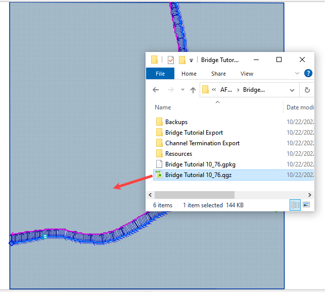

Step 2: Channel Reset
__________________________

1. Click the Schematize channel button on the cross section editor.

2. Click Yes to overwrite the channel.

3. Click Close to close the next window.

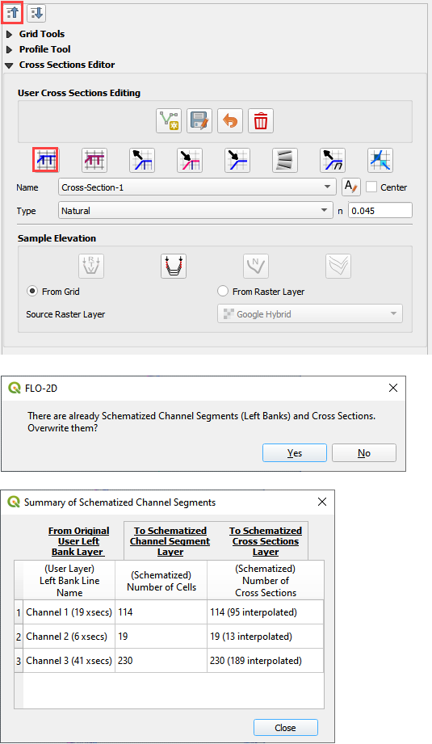

Step 3: Downstream Terminus
_____________________________

1. Move the map to the downstream end of the channel.

2. Switch to the Cross Sections Editor.

3. Click the Schematize Channel Button.

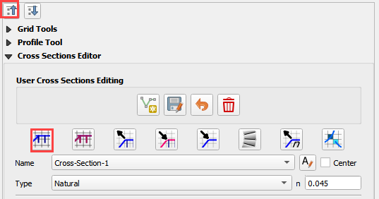

4. Turn on the Google layer and Select the last Cross Section.

5. Use the Cross Section Editor to delete cross section 66 and 65.

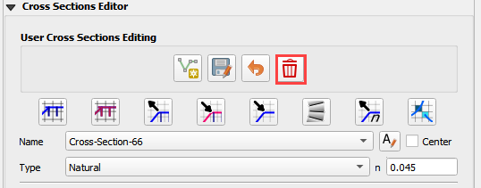

6. Move Cross Section 64 downstream to the drop structure. Use the Edit Cross Sections Layer and the Vertex Tool.

7. Trim the Left and Right Bank Lines to the last cross section. It should match the following image.

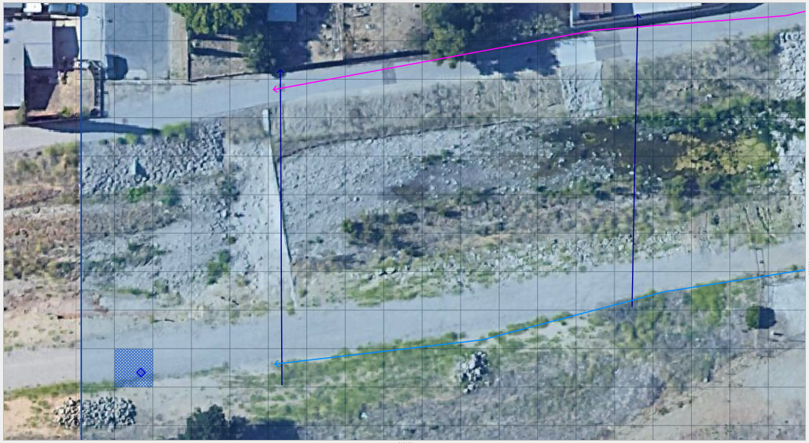

8. Click the Schematize Channel button again. The adjusted channel should match the following image.

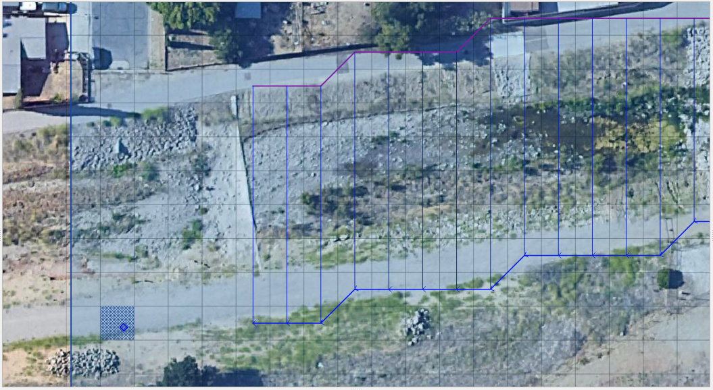

Step 4: Correct the boundary
________________________________

1. Switch to the boundary condition editor.

2. Click the Outflow radio button.

3. Delete the Outflow 2.

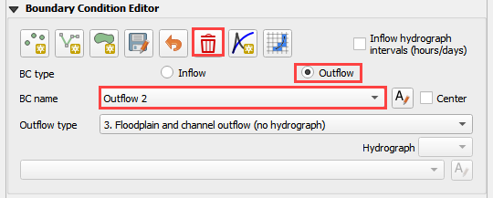

4. Click the BC Polyline button, make a polyline across the channel on the boundary.

5. Set the type to outflow and click close.

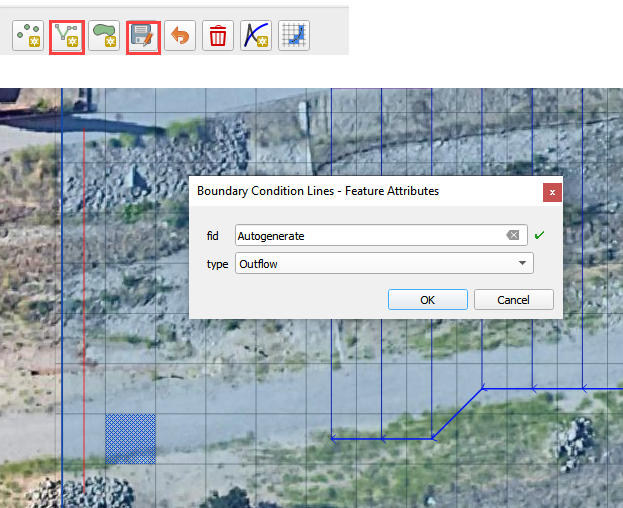

6. Click the save button, set the outflow type to 1 and click the schematize button.

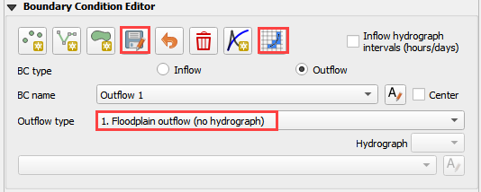

7. The new boundary should match the following image.

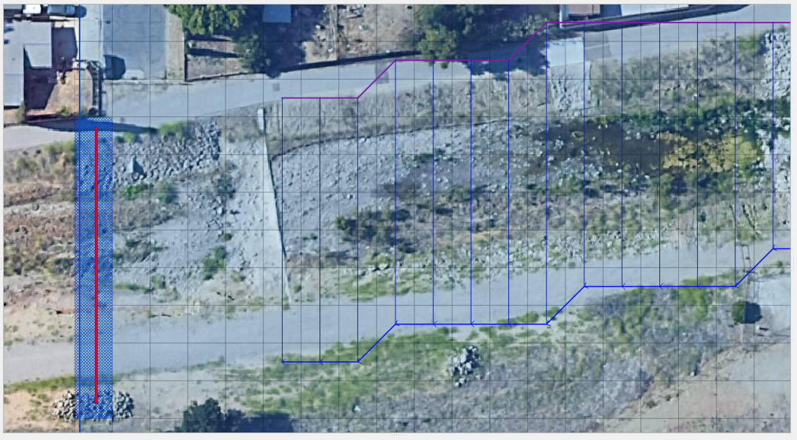

Step 5: Review elevation
___________________________

.. note:: The elevation downstream of the channel terminus should lower than that of the channel invert.
          This allows the water to exchange between the 1-D channel and the 2-D grid elements.

1. Turn on grid labels for elevation field. 

2. Double click the Grid layer.

3. Click Labels. Set the single label to elevation.

4. Set the Rendering to 1:2000 and 1:200.

.. image:: ../img/AdvChan/chtrm018.png

5. If there are too many decimals, go back to the label tool and set the Number format to 1 or 2 decimal places.

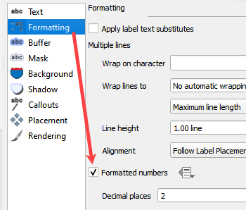

6. Switch to the cross section editor and select Cross Section 64.

7. Compare the elevation of the channel invert to the grid elevation downstream of the channel terminus.
   Can the water leave the channel with no blockage?  If yes, move on.  If no, move terminus or adjust the grid elevation.

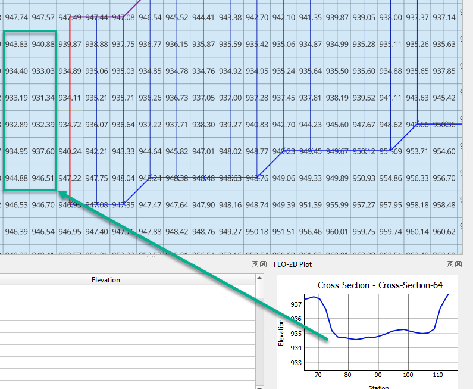

Step 6: Interpolate Channel
_____________________________

.. Note:: KOBrien...The interpolator didn't work for me so I renamed all of the cross sections to xsec-"id" using the table editor.
          The command is simple:  contcat('xsec1-', "fid") and update all.

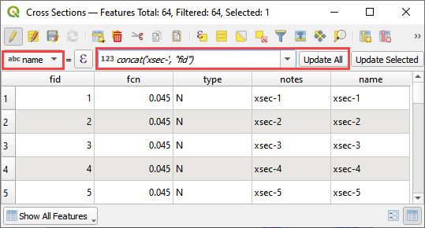

1. Save and close the editor on all channel layers.

2. Click the Schematize channel button just to be safe.

3. Click the Interpolate channel button.

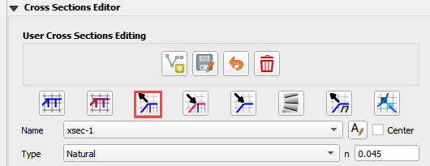

4. Save the data to the Channel Termination Export folder. Close the message.

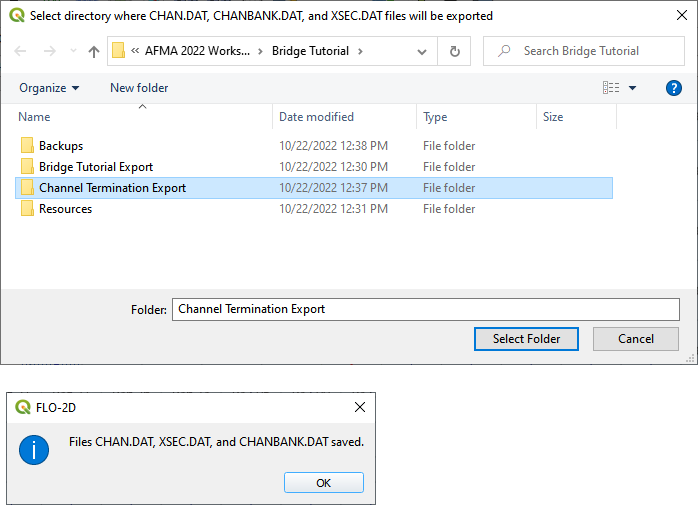

5. Click Interpolate.

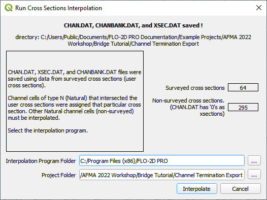

6. Import the data.

.. Note:: If a yellow warning comes up, the data didn't save interpolate correctly. See the note above.

Step 7: Upstream Terminus
____________________________

.. note:: This upstream channel can exchange flow with the nodes next to its opening.  This procedure will prevent that flow exchange.

1. Uncheck the Channels group and Zoom to the upstream end of the main channel.

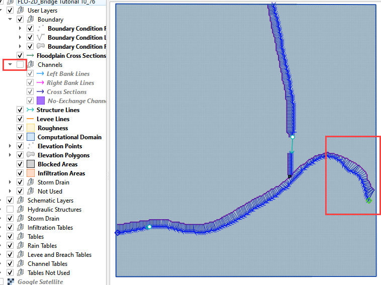

2. Move the inlet one node downstream. Click the Boundary Condition Editor.

3. Click the Add BC Node button.

4. Switch the editor to Vertex Editor.

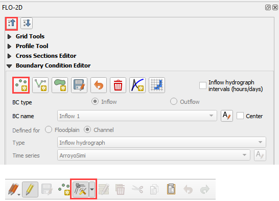

5. Click the green dot to pick up the inflow node.

6. Move the cursor downstream one channel element.

7. Click again to drop it.

8. Click Save and Schematize on the BC editor. Close all messages that appear.  They should not be errors.

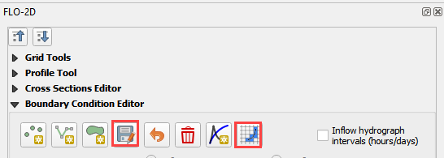

9. It should look like the following image.

.. image:: ../img/AdvChan/chtrm006.png

Step 8: Channel No Exchange
______________________________

1. Find the No Exchange layer in the Channel User Layer Group. Click it and activate the editor pencil.

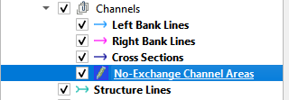

2. Select the Add polygon button and draw a polygon over the first upstream channel left bank element.

3. It should look like the following image.

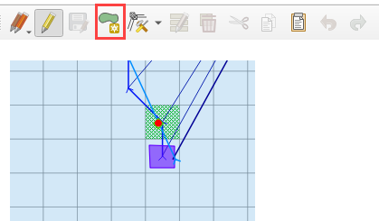

4. The schematize button deletes this layer. For now, rebuild the other two no exchange areas inbetween the bridge
    inlet node and outlet node.

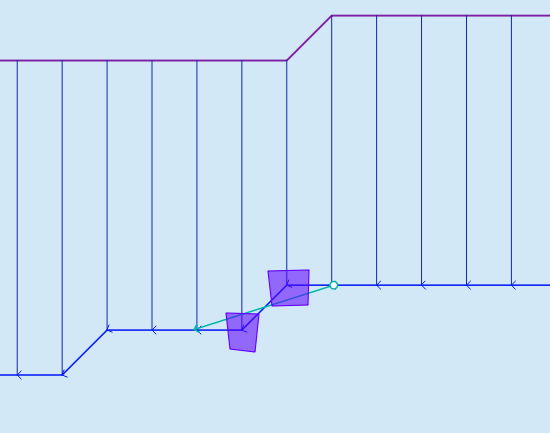

5. Switch to Grid Tools and click the sample no exchange button.

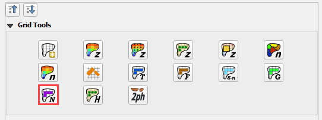

Step 10: Review the confluence elevation
_________________________________________

1. Select cross section #25 and #44 to review the invert elevations.

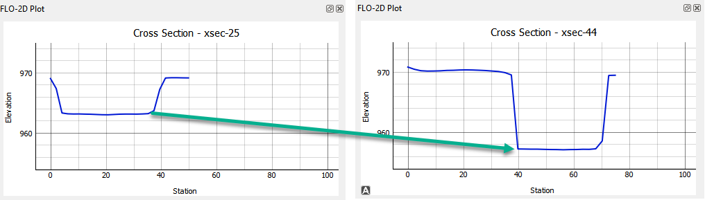

2. The data seems incorrect but the Google Earth image shows the tributary channel is perched.

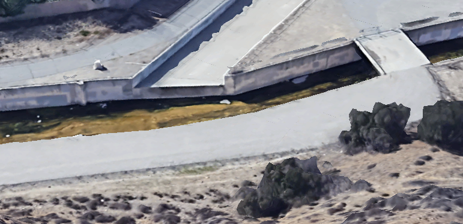

3. No cross section edits are needed.  It is ok to proceed with the channel confluence.

Step 9: Channel Confluence
____________________________

1. Zoom to the confluence area.

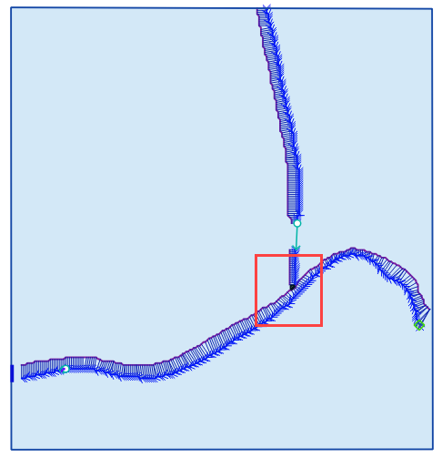

2. Click the confluence button.

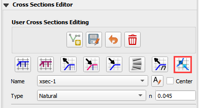

3. Select the 3rd option in the dropdown menu.  Click Save.
   Ignore the error message.

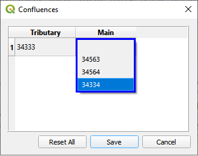

4. The final result should look like this.

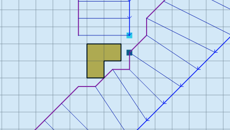

.. important:: One final note for this process.  The schematize button wipes out confluences and no exchange polygons at
               this time.  This repair order is underway to fix this for future versions.

Step 10: Export and run
________________________

1. Export the rest of the project to the Channel Termination Export folder.

2. Open the folder in Explorer and run the model.

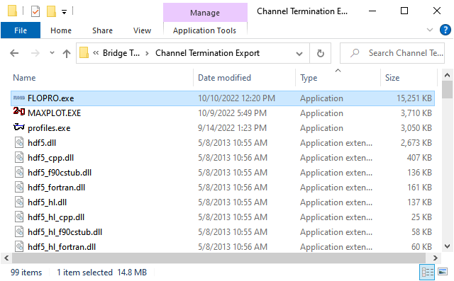

