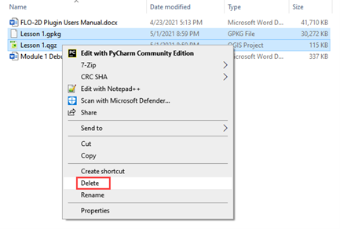
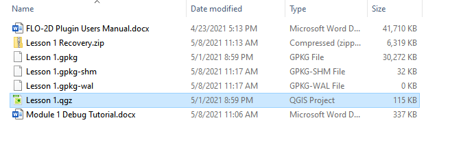
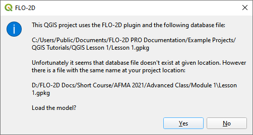
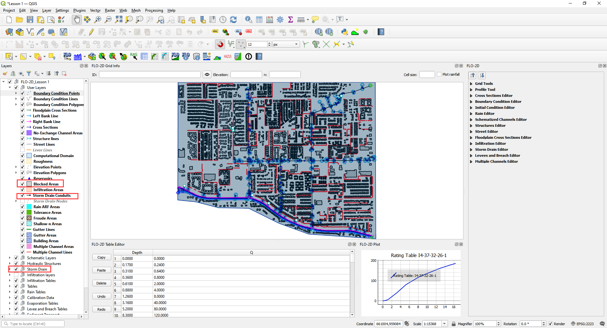
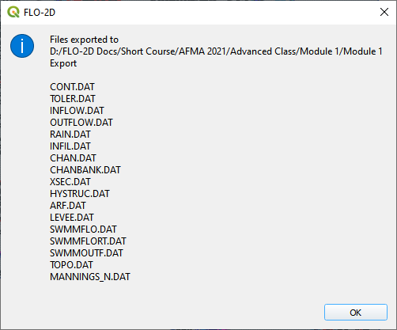

Module 1, Project Recovery and Debug
====================================

**Overview**

This module will show you how to build a recovery point and debug a FLO-2D Data Set.

Required Data
-------------

The required data is in Module 1.

============= ==================
**File**      **Content**
============= ==================
Lesson 1.qgz  Module 1 qgis file
Lesson 1.gpkg Module 1 geopakage
\*.tif        Elevation file
============= ==================

Step 1: Create a recovery file
------------------------------

1. Select the **Lesson 1.gpkg** and **Lesson 1.qgz** files and zip them.
   This will create a recovery file.

.. image:: ../img/Advanced-Workshop/Module002.png

2. Name the zipped file.
   It is good to choose a name that identifies project progress.
   For Example: **Lesson 1 n-value OK.zip**.

Step 2: Recover a project
-------------------------

1. This step is used when project data is corrupt.
   If a project is not exporting data correctly or a mistake is made, use this recovery method.

2. Select **Lesson 1.gpkg** and **Lesson 1.qgz** and delete them both.

3. Extract the recovery files.

4. Change the name of the path so the file can be extracted directly to the Module 1 folder.

.. image:: ../img/Advanced-Workshop/Module005.png

Step 3: Open the project
------------------------

1. Open QGIS and drag Lesson 1.qgz onto the canvas the file in QGIS and Load the Project into the FLO-2D Plugin.

2. Remove unavailable layers if necessary.
   Autofind and browse works well to resolve paths.
   \**This step depends on where the data is located and may not show up for all users.*\*

3. Click Yes to load the plugin.
   In this case the project path changed but FLO-2D helps find it.

This is the complete project, but some layers are turned off.

4. Turn on the following layers:

   - Storm Drain

   - Blocked Areas

   - Storm drain conduits

Step 4: Export the FLO-2D data
------------------------------

1. Click the Export Button

.. image:: ../img/Advanced-Workshop/Module010.png

.. image:: ../img/Advanced-Workshop/Module011.png

**Important note:**  If the image above doesn’t look like the window on your screen, you may be accessing the “Lesson 1.gpkg” in the Self-Help training packages.   Delete the old file and return to Step 3.
"C:\Users\Public\Documents\FLO-2D PRO Documentation\Example Projects\QGIS Tutorials\QGIS Lesson 1\Lesson 1.gpkg".

2. Click OK and navigate to the export folder.
   Select the folder and export.

.. image:: ../img/Advanced-Workshop/Module012.png

3. Close the message.

4. Go to the Storm Drain Widget and Export the swmm.inp file.

5. Collapse all widgets.

6. Open Storm Drain widget.

7. Click Export SWMM.INP… button

8. Name the file swmm.inp and click Save.

.. image:: ../img/Advanced-Workshop/Module015.png

9. Click OK to close both windows.

.. image:: ../img/Advanced-Workshop/Module016.png

Step 5: Run the debug engine
----------------------------

1. Click the Run FLO-2D button.

2. Correct the FLO-2D path click the Debug Run button.

.. image:: ../img/Advanced-Workshop/Module018.png

3. Click OK.

.. image:: ../img/Advanced-Workshop/Module019.png

4. The debug run is complete when FLO-2D windows close.

5. Click Cancel to close the Run FLO-2D form.

.. image:: ../img/Advanced-Workshop/Module021.png

Step 6: Debug the project in QGIS
---------------------------------

1. Click the debug button.

.. image:: ../img/Advanced-Workshop/Module022.png

2. Select Debug and click OK.

3. Navigate to the project folder.

4. Select the debug file and click Open.

.. image:: ../img/Advanced-Workshop/Module024.png

5. Click Yes to load the extra debug files.

6. Test the filtering and navigation tools on this form.

7. If you break it, simply reload by going back to the start of step 6.

8. If you click on one of the *Element* cells, the map will move to that cell.

9. If you click on a *Row*, it will not move to the cell.

10. Close the form when you are sated.

Step 7: Load the conflict table
-------------------------------

1. Click the debug button.

.. image:: ../img/Advanced-Workshop/Module022.png

2. Select Current project and click OK.

.. image:: ../img/Advanced-Workshop/Module027.png

3. Select Storm Drain Inlets to see how the form filters the data.

4. Click the close button when you are content.

Step 8: Load the levee table
----------------------------

1. Click the debug button.

.. image:: ../img/Advanced-Workshop/Module022.png

2. Select Levee crests and click OK.

3. Click Close to close the form. This one is not so useful.

.. image:: ../img/Advanced-Workshop/Module029.png

4. Right click the Levee Crests layer and click Open Attribute table.

5. The standard QGIS table has excellent filtering and zoom to features.

6. Close the form when you are assuaged.

.. image:: ../img/Advanced-Workshop/Module030.png