**FLO-2D\ ©**

**PRO VERSION**

**Two-Dimensional**

**Flood Routing Model**

**Workshop Lessons FLO-2D Plugin for QGIS 2021**

Table of Contents
=================

`Table of Contents i <#table-of-contents>`__

`Module 1, Project Recovery and Debug 5 <#module-1-project-recovery-and-debug>`__

`Required Data 5 <#required-data>`__

`Step 1: Create a recovery file 6 <#step-1-create-a-recovery-file>`__

`Step 2: Recover a project 6 <#step-2-recover-a-project>`__

`Step 3: Open the project 8 <#step-3-open-the-project>`__

`Step 4: Export the FLO-2D data 10 <#step-4-export-the-flo-2d-data>`__

`Step 5: Run the debug engine 14 <#step-5-run-the-debug-engine>`__

`Step 6: Debug the project in QGIS 15 <#step-6-debug-the-project-in-qgis>`__

`Step 7: Load the conflict table 17 <#step-7-load-the-conflict-table>`__

`Step 8: Load the levee table 18 <#step-8-load-the-levee-table>`__

`Module 2 Part I – Hydraulic Structures 20 <#module-2-part-i-hydraulic-structures>`__

`Required Data 20 <#required-data-1>`__

`Step 1: Setup the project 21 <#step-1-setup-the-project>`__

`Step 2: Import data 22 <#step-2-import-data>`__

`Step 3: Format the data layers 23 <#step-3-format-the-data-layers>`__

`Step 4: Build the structures into the User Layers.
26 <#step-4-build-the-structures-into-the-user-layers.>`__

`Step 5: Assign the structure attributes 27 <#step-5-assign-the-structure-attributes>`__

`Step 6: Assign the rating tables 28 <#step-6-assign-the-rating-tables>`__

`Step 7: Schematize the data 30 <#step-7-schematize-the-data>`__

`Step 8: Save, export, and run 31 <#step-8-save-export-and-run>`__

`Module 2 Part II – Advanced Hydraulic Structures 33 <#module-2-part-ii-advanced-hydraulic-structures>`__

`Required Data 33 <#required-data-2>`__

`Step 1: Setup the project 34 <#step-1-setup-the-project-1>`__

`Step 2: Simplify the map 35 <#step-2-simplify-the-map>`__

`Step 3: Build a new structure 36 <#step-3-build-a-new-structure>`__

`Step 4: Measure the culvert length 38 <#step-4-measure-the-culvert-length>`__

`Step 5: Complete the structure data and schematize.
39 <#step-5-complete-the-structure-data-and-schematize.>`__

`Step 6: Correct invert elevation 40 <#step-6-correct-invert-elevation>`__

`Step 7: Save, export, and run.
43 <#step-7-save-export-and-run.>`__

`Module 2 Part III – Bridge Hydraulic Structure 48 <#module-2-part-iii-bridge-hydraulic-structure>`__

`Required Data 48 <#required-data-3>`__

`Step 1: Load the project 49 <#step-1-load-the-project>`__

`Step 2: Define the bridge variables and coefficients 50 <#step-2-define-the-bridge-variables-and-coefficients>`__

`Plan view parameters 50 <#plan-view-parameters>`__

`Profile parameters 51 <#profile-parameters>`__

`Bridge opening ratio 52 <#bridge-opening-ratio>`__

`Bridge tables 53 <#bridge-tables>`__

`Bridge variables dialog 55 <#bridge-variables-dialog>`__

`Step 3: Build the cross section data 57 <#step-3-build-the-cross-section-data>`__

`Step 4: Save, export and run.
59 <#step-4-save-export-and-run.>`__

`Module 3 – Prescribed Dam Breach 61 <#module-3-prescribed-dam-breach>`__

`Required Data 61 <#required-data-4>`__

`Step 1: Load the project 62 <#step-1-load-the-project-1>`__

`Step 2.
Load the aerial and hydrography 63 <#step-2.-load-the-aerial-and-hydrography>`__

`Step 3.
Review hydrology 65 <#step-3.-review-hydrology>`__

`Step 4.
Set up the reservoir 68 <#step-4.-set-up-the-reservoir>`__

`Step 5.
Create the levee 69 <#step-5.-create-the-levee>`__

`Step 6.
Define the breach 71 <#step-6.-define-the-breach>`__

`Step 7.
Remove the dam elevation (method 1) 74 <#step-7.-remove-the-dam-elevation-method-1>`__

`Step 8.
Remove the dam elevation thin slice (method 2) 75 <#step-8.-remove-the-dam-elevation-thin-slice-method-2>`__

`Step 9.
Export and run the model 77 <#step-9.-export-and-run-the-model>`__

`Step 10.
Add a culvert 81 <#step-10.-add-a-culvert>`__

`Step 11.
Downstream Boundary 85 <#step-11.-downstream-boundary>`__

`Step 12.
Common mistakes demo 87 <#step-12.-common-mistakes-demo>`__

`Bad reservoir or leaky levee component 87 <#bad-reservoir-or-leaky-levee-component>`__

`Dam elevation not removed 88 <#dam-elevation-not-removed>`__

`Module 5 Part I – Create a Watershed Model 90 <#module-5-part-i-create-a-watershed-model>`__

`Required Data 90 <#required-data-5>`__

`Step 1: Load the project 91 <#step-1-load-the-project-2>`__

`Step 2.
Load the hydrography map 92 <#step-2.-load-the-hydrography-map>`__

`Step 3.
Review the watershed.
94 <#step-3.-review-the-watershed.>`__

`Step 4.
Create the grid.
95 <#step-4.-create-the-grid.>`__

`Step 5.
Interpolate Elevation.
96 <#step-5.-interpolate-elevation.>`__

`Step 6.
Calculate Roughness 97 <#step-6.-calculate-roughness>`__

`Step 7.
Save and create a recovery point.
97 <#step-7.-save-and-create-a-recovery-point.>`__

`Step 8.
Determine the total rainfall 98 <#step-8.-determine-the-total-rainfall>`__

`Step 9.
Sample the rainfall raster 103 <#step-9.-sample-the-rainfall-raster>`__

`Step 10.
Set up the rainfall 104 <#step-10.-set-up-the-rainfall>`__

`Step 11.
Calculate infiltration 106 <#step-11.-calculate-infiltration>`__

`Step 12.
Alternate infiltration method 2 108 <#step-12.-alternate-infiltration-method-2>`__

`Step 13.
Export infiltration data.
110 <#step-13.-export-infiltration-data.>`__

`Step 14.
Recalculate the elevation.
112 <#step-14.-recalculate-the-elevation.>`__

`Step 15.
Export INFIL.DAT 112 <#step-15.-export-infil.dat>`__

`Step 16.
Format the CN data 114 <#step-16.-format-the-cn-data>`__

`Step 17.
Reload the infiltration data.
114 <#step-17.-reload-the-infiltration-data.>`__

`Step 18.
Save, export, and run 117 <#step-18.-save-export-and-run>`__

`Step 19.
Map the velocity vectors and import them into QGIS 118 <#step-19.-map-the-velocity-vectors-and-import-them-into-qgis>`__

`Step 20.
Create a floodplain cross section.
122 <#step-20.-create-a-floodplain-cross-section.>`__

`Step 21.
Save, export, and run again 123 <#step-21.-save-export-and-run-again>`__

`Module 5 Part II – Watershed Mudflow Model 125 <#module-5-part-ii-watershed-mudflow-model>`__

`Required Data 125 <#required-data-6>`__

`Step 1: Load the project 126 <#step-1-load-the-project-3>`__

`Step 2.
Create inflow hydrograph 128 <#step-2.-create-inflow-hydrograph>`__

`Step 3.
Assign the hydrograph to a BC node.
130 <#step-3.-assign-the-hydrograph-to-a-bc-node.>`__

`Step 4.
Set a global bulking factor.
131 <#step-4.-set-a-global-bulking-factor.>`__

`Step 5.
Export and run the model 132 <#step-5.-export-and-run-the-model>`__

`Step 6.
Set up the mudflow.
133 <#step-6.-set-up-the-mudflow.>`__

`Step 5.
Export and run the Mudflow model 136 <#step-5.-export-and-run-the-mudflow-model>`__

`Module 6 – Erosion Dam Breach 139 <#module-6-erosion-dam-breach>`__

`Required Data 139 <#required-data-7>`__

`Step 1: Load the project 140 <#step-1-load-the-project-4>`__

`Step 2: Initial conditions reservoir 141 <#step-2-initial-conditions-reservoir>`__

`Step 3: Review dam geometry 143 <#step-3-review-dam-geometry>`__

`Step 4.
Review dam material 144 <#step-4.-review-dam-material>`__

`Step 5.
Review general breach parameters 145 <#step-5.-review-general-breach-parameters>`__

`Step 6.
Create the breach point 145 <#step-6.-create-the-breach-point>`__

`Step 7.
Export and run the model 149 <#step-7.-export-and-run-the-model>`__

`Step 8.
Review the data 151 <#step-8.-review-the-data>`__

`Module 7 – Tailings Dam Tool 152 <#module-7-tailings-dam-tool>`__

`Required Data 152 <#required-data-8>`__

`Step 1: Load the project 153 <#step-1-load-the-project-5>`__

`Step 2.
Find inflow node 154 <#step-2.-find-inflow-node>`__

`Step 3.
Run the Tailings Dam Tool 154 <#step-3.-run-the-tailings-dam-tool>`__

`Step 4.
Dam geometry 155 <#step-4.-dam-geometry>`__

`Step 5.
Volume 156 <#step-5.-volume>`__

`Step 6.
Geotech data 157 <#step-6.-geotech-data>`__

`Step 7.
Foundation geotechnical data from TUV report 157 <#step-7.-foundation-geotechnical-data-from-tuv-report>`__

`Step 8.
Saturated tailings depth 158 <#step-8.-saturated-tailings-depth>`__

`Step 9.
Tailings dam tool 159 <#step-9.-tailings-dam-tool>`__

`Step 7.
Export and run the model 163 <#step-7.-export-and-run-the-model-1>`__

`Module 8 – Storm Drain Shapefile Development 166 <#module-8-storm-drain-shapefile-development>`__

`Required Data 166 <#required-data-9>`__

`Step 1: Load the project 167 <#step-1-load-the-project-6>`__

`Step 2: Import shapefiles for storm drain features 168 <#step-2-import-shapefiles-for-storm-drain-features>`__

`Step 3.
Add missing columns to shapefiles 172 <#step-3.-add-missing-columns-to-shapefiles>`__

`Module 9 – Storm Drain Schematize 173 <#module-9-storm-drain-schematize>`__

`Required Data 173 <#required-data-10>`__

`Step 1: Select components from shapefile layer 174 <#step-1-select-components-from-shapefile-layer>`__

`Step 2: Calculate the conduit node connections 177 <#step-2-calculate-the-conduit-node-connections>`__

`Step 3: Import Rating Tables 178 <#step-3-import-rating-tables>`__

`Step 4: Schematize storm drain components 179 <#step-4-schematize-storm-drain-components>`__

`Step 5: Export SWMM.INP file 180 <#step-5-export-swmm.inp-file>`__

`Step 6: Export the project 182 <#step-6-export-the-project>`__

`Step 7: Run the simulation 184 <#step-7-run-the-simulation>`__

Module 1, Project Recovery and Debug
====================================

**Overview**

This module will show you how to build a recovery point and debug a FLO-2D Data Set.

Required Data
=============

The required data is in Module 1.

============= ==================
**File**      **Content**
============= ==================
Lesson 1.qgz  Module 1 qgis file
Lesson 1.gpkg Module 1 geopakage
\*.tif        Elevation file
============= ==================

Step 1: Create a recovery file
------------------------------

1. Select the **Lesson 1.gpkg** and **Lesson 1.qgz** files and zip them.
   This will create a recovery file.

.. image:: ../img/Advanced-Workshop/Module002.png

2. Name the zipped file.
   It is good to choose a name that identifies project progress.
   For Example: **Lesson 1 n-value OK.zip**.

Step 2: Recover a project
-------------------------

1. This step is used when project data is corrupt.
   If a project is not exporting data correctly or a mistake is made, use this recovery method.

2. Select **Lesson 1.gpkg** and **Lesson 1.qgz** and delete them both.

.. image:: ../img/Advanced-Workshop/Module003.png

3. Extract the recovery files.

.. image:: ../img/Advanced-Workshop/Module004.27403in

4. Change the name of the path so the file can be extracted directly to the Module 1 folder.

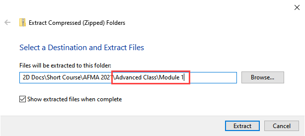

Step 3: Open the project
------------------------

1. Open QGIS and drag Lesson 1.qgz onto the canvas the file in QGIS and Load the Project into the FLO-2D Plugin.

.. image:: ../img/Advanced-Workshop/Module006.png

2. Remove unavailable layers if necessary.
   Autofind and browse works well to resolve paths.
   \**This step depends on where the data is located and may not show up for all users.*\*

.. image:: ../img/Advanced-Workshop/Module007.png

3. Click Yes to load the plugin.
   In this case the project path changed but FLO-2D helps find it.

.. image:: ../img/Advanced-Workshop/Module008.png

This is the complete project, but some layers are turned off.

4. Turn on the following layers:

   - Storm Drain

   - Blocked Areas

   - Storm drain conduits

.. image:: ../img/Advanced-Workshop/Module009.png

Step 4: Export the FLO-2D data
------------------------------

1. Click the Export Button

.. image:: ../img/Advanced-Workshop/Module011.png

2. Click OK and navigate to the export folder.
   Select the folder and export.

.. image:: ../img/Advanced-Workshop/Module012.png

3. Close the message.

.. image:: ../img/Advanced-Workshop/Module013.png

4. Go to the Storm Drain Widget and Export the swmm.inp file.

5. Collapse all widgets.

6. Open Storm Drain widget.

7. Click Export SWMM.INP… button

.. image:: ../img/Advanced-Workshop/Module014.97101in

8. Name the file swmm.inp and click Save.

.. image:: ../img/Advanced-Workshop/Module015.png

9. Click OK to close both windows.

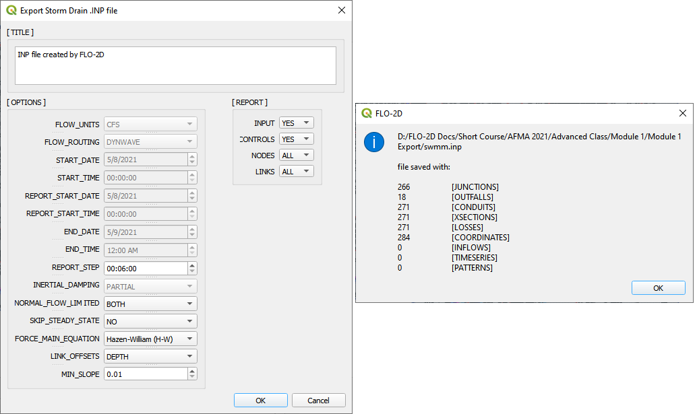

Step 5: Run the debug engine
----------------------------

1. Click the Run FLO-2D button.

.. image:: ../img/Advanced-Workshop/Module017.png

10.
Correct the FLO-2D path click the Debug Run button.

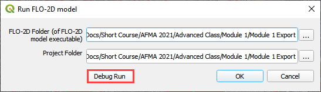

11.
Click OK.

.. image:: ../img/Advanced-Workshop/Module019.png

12.
The debug run is complete when FLO-2D windows close.

.. image:: ../img/Advanced-Workshop/Module020.png

13.
Click Cancel to close the Run FLO-2D form.

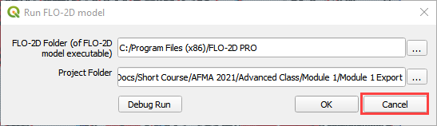

Step 6: Debug the project in QGIS
---------------------------------

1. Click the debug button.

14.
Select Debug and click OK.

.. image:: ../img/Advanced-Workshop/Module023.png

15.
Navigate to the project folder.

16.
Select the debug file and click Open.

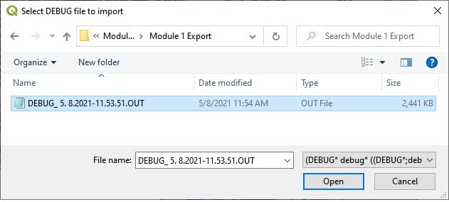

17.
Click Yes to load the extra debug files.

.. image:: ../img/Advanced-Workshop/Module025.png

18.
Test the filtering and navigation tools on this form.

19.
If you break it, simply reload by going back to the start of step 6.

20.
If you click on one of the *Element* cells, the map will move to that cell.

21.
If you click on a *Row*, it will not move to the cell.

22.
Close the form when you are sated.

.. image:: ../img/Advanced-Workshop/Module026.28681in

Step 7: Load the conflict table
-------------------------------

1. Click the debug button.

2.
Select Current project and click OK.

.. image:: ../img/Advanced-Workshop/Module027.png

3.
Select Storm Drain Inlets to see how the form filters the data.

4.
Click the close button when you are content.

.. image:: ../img/Advanced-Workshop/Module028.png

Step 8: Load the levee table
----------------------------

1. Click the debug button.

2.
Select Levee crests and click OK.

.. image:: ../img/Advanced-Workshop/Module027.png

3.
Click Close to close the form.
This one is not so useful.

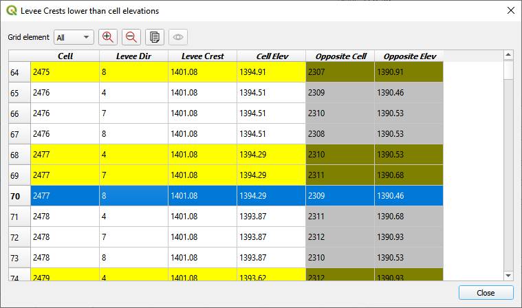

4.
Right click the Levee Crests layer and click Open Attribute table.

5.
The standard QGIS table has excellent filtering and zoom to features.

6.
Close the form when you are assuaged.

.. image:: ../img/Advanced-Workshop/Module030.png

Module 2 Part I – Hydraulic Structures
======================================

Advanced class attendees.
Skip this lesson.
It is here for you to peruse.

**Overview**

This tutorial outlines the process of creating hydraulic structures with rating tables and generalized culvert equations.
This lesson needs a channel so please use the data from QGIS Lesson 2, 3, or 4 to run through this tutorial.
Finish Lesson 2 before performing the following steps.

.. _required-data-1:

Required Data
-------------

The required data is in Module 1 and 2.

.. _`file`:

file:

**Content**

.. _`\.shp`:

\.shp:

Hydraulic Structures

\\Example Projects\QGIS Tutorials\QGIS Lesson 6 PRO

.. _`\.txt`:

\.txt:

Culvert Tables

Check these folders to ensure the data is available before starting the lesson.

Step 1: Setup the project
-------------------------

1. Start with the project from Lesson 2, 3, or 4 Complete.

2. If necessary, load it into QGIS.

3. Open QGIS and drag the lesson 1.qgz file into the project.

4. Save the project.

.. image:: ../img/Advanced-Workshop/Module031.png

Step 2: Import data
-------------------

Start by cleaning up the map space so the next layer will be easy to see.

1. Uncheck the User Left bank, Right Bank Cross section layers;

2. Uncheck the Blocked Areas;

3. Uncheck the Storm Drain User Layers;

4. Click the User Boundary Conditions Layer;

5. Drag the Hydraulic Structures onto the map space.

.. image:: ../img/Advanced-Workshop/Module032.png

Step 3: Format the data layers
------------------------------

1. Open the Attributes Table on the Hydraulic Structures Layer.

.. image:: ../img/Advanced-Workshop/Module033.png

2. Select structure 130, and 131 and click Zoom map to selected rows button.
   This will zoom your map to these two structures.

.. image:: ../img/Advanced-Workshop/Module034.png

3. Label the Hydraulic Structures Layer.

4. Double click the Hydraulic Structures layer

5. Set the Labels like the following image.

6. This allows you to see which culvert you are working on.

.. image:: ../img/Advanced-Workshop/Module035.png

7. Change the layer Symbology

8. Change the selector to Symbology

9. Set the Symbol Layer Type to Arrow

10. Uncheck Curved Arrows

11. This will show you the flow direction of each structure.

.. image:: ../img/Advanced-Workshop/Module036.png

Step 4: Build the structures into the User Layers.
--------------------------------------------------

1. Use the Structure Editor to add all of the new structures.

2. Digitize all of the structures.

3. Click the Save icon to confirm that you are finished with the digitizing tool.

.. image:: ../img/Advanced-Workshop/Module037.png

**Digitizing process:**

4. Left click the inlet node (upstream node)

5. Left click the outlet node (downstream node)

6. Right Click to finish the polyine.
   Click OK to finish the feature.

.. image:: ../img/Advanced-Workshop/Module038.png

Step 5: Assign the structure attributes
---------------------------------------

.. image:: ../img/Advanced-Workshop/Module039.png

1. Click Save in the Structures Widget to load the data into the dialog box.

**Complete the Structure Fields**

2. Load the Hydraulic Structures Attribute table.
   The attributes will help fill out each structure table.

3. Check the center button.

4. Select the first structure.

5. Rename the Structure with the “A” button.

6. Fill the Type and Rating fields

7. Move to the next structure and repeat the process.

.. image:: ../img/Advanced-Workshop/Module040.png

.. image:: ../img/Advanced-Workshop/Module041.png

8. Schematize the structure data.

Step 6: Assign the rating tables
--------------------------------

1. Click the Import Rating Tables button

.. image:: ../img/Advanced-Workshop/Module042.png

7. Select the rating tables from the project folder.

8. Click open.

.. image:: ../img/Advanced-Workshop/Module043.png

9. The data has been imported.
   If you can’t see it, switch to a different structure.

.. image:: ../img/Advanced-Workshop/Module044.png

Step 7: Schematize the data
---------------------------

.. image:: ../img/Advanced-Workshop/Module041.png

1. Schematize the structure data and click **Yes** to replace the data.

.. image:: ../img/Advanced-Workshop/Module045.png

Step 8: Save, export, and run
-----------------------------

1. This is a good point to save project.
   Refer to Step 9 in Lesson 1.

.. image:: ../img/Advanced-Workshop/Module046.png

2.
Export the data files to the Project Folder in QGIS Lesson 6 Export.

.. image:: ../img/Advanced-Workshop/Module047.png

3.
All GDS data files will be created in the selected project folder.

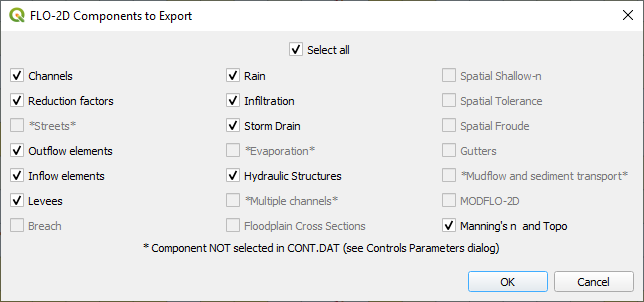

.. image:: ../img/Advanced-Workshop/Module049.png

4.
The swmm.inp file was not exported.
Copy it from Lesson 3 Export folder or export it again using the Storm Drain Editor.

.. image:: ../img/Advanced-Workshop/Module050.png

5.
Click the *Run FLO-2D* Icon.

.. image:: ../img/Advanced-Workshop/Module051.png

6.
Set the Project path and the FLO-2D Engine Path and click *OK* to start the simulation.

.. image:: ../img/Advanced-Workshop/Module052.png

Module 2 Part II – Advanced Hydraulic Structures
================================================

**Overview**

In part 2, the data from the previous lesson is extended with a new generalized culvert equation.

.. _required-data-2:

Required Data
=============

The required data is in Module 1 and 2

======== ===========================
**File** **Content**
======== ===========================
\*.qgz   Project files from Module 1
\*.gpkg  Geopackage from Module 1
\*.tif   Elevation file
======== ===========================

.. _step-1-setup-the-project-1:

Step 1: Setup the project
-------------------------

1. Start with the project from Module 1 Lesson 1.qgz.
   This is the completed project from the previous class.
   FLO-2D Self-Help.

2. Open QGIS and drag the lesson 1.qgz file into the project.

3. Save the project.

.. image:: ../img/Advanced-Workshop/Module031.png

Step 2: Simplify the map
------------------------

1. Turn off unnecessary layers

   - Blocked Areas

   - Storm drain conduits

   - Storm drain nodes

   - Storm Drain group

   - Levee Lines

.. image:: ../img/Advanced-Workshop/Module053.png

Step 3: Build a new structure
-----------------------------

1. Zoom to the northwest basin as shown by the yellow box.

2. Find the culvert in the green box.

.. image:: ../img/Advanced-Workshop/Module054.png

3. Open the Structures widget.

4. Click the Digitize polyline tools.

.. image:: ../img/Advanced-Workshop/Module055.png

5. Click the east side of the structure and then click the west side of the structure.

6.
Right click to close the polyline and click OK to close the dialog.

.. image:: ../img/Advanced-Workshop/Module056.png

Step 4: Measure the culvert length
----------------------------------

1. Click the measure tool.

.. image:: ../img/Advanced-Workshop/Module057.png

2. Measure the length of the culvert from the upstream headwall to the downstream headwall.

.. image:: ../img/Advanced-Workshop/Module058.png

3. Click the Save button and enter the data into culvert.

.. image:: ../img/Advanced-Workshop/Module059.png

Step 5: Complete the structure data and schematize.
---------------------------------------------------

1. Fill the remaining data in the FLO-2D Table Editor.
   Use the Data Input Manual to learn the parameters.

.. image:: ../img/Advanced-Workshop/Module060.png

2. Typec = 1 box

.. image:: ../img/Advanced-Workshop/Module061.png

3. Typeen = 1

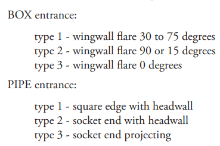

4. Culvertn = 0.020

5. KE = 0.50

6. Cubase = 8ft

7. Finish the structure by clicking the schematize button.

.. image:: ../img/Advanced-Workshop/Module063.png

Step 6: Correct invert elevation
--------------------------------

1. Select the Google Satellite layer.

2. Drag the elevation file onto the map.

3. The Elevation.tif file is in Module 2 or QGIS Lesson 1.

.. image:: ../img/Advanced-Workshop/Module064.png

4. Use the ID tool to find the invert elevation of the upstream side of the culvert.

.. image:: ../img/Advanced-Workshop/Module065.png

5. The elevation of the culvert is 1990.29 ft.

6. Create a feature in the Elevation Polygon layer and assign the corrected elevation to that feature.

   - Select the elevation polygon layer.

   - Click edit pencil and the Add Polygon Feature button.

.. image:: ../img/Advanced-Workshop/Module066.png

- Add a polygon to the grid that needs adjustment.

- Right click to close the polygon and fill the form.

- It is only necessary to cover the centroid with this polygon.

- Click OK to close the form.

.. image:: ../img/Advanced-Workshop/Module067.png

7. Collapse the FLO-2D Widgets.

8. Open the Grid widget.

9. Click the Correction Tool

.. image:: ../img/Advanced-Workshop/Module068.png

10.
Click yes to save the changes.

.. image:: ../img/Advanced-Workshop/Module069.png

11.
Select the User Layer Mode.

12.
Click the Elevation Polygon Attributes check box.

13.
Click OK to perform the calculation and OK once it is finished.

14.
The cell elevation is now adjusted to the correct culvert invert.

.. image:: ../img/Advanced-Workshop/Module070.png

Step 7: Save, export, and run.
------------------------------

1. This is a good point to save project.

.. image:: ../img/Advanced-Workshop/Module046.png

2. Export the data files to the Advanced Class Folder Module 2 Export.

.. image:: ../img/Advanced-Workshop/Module047.png

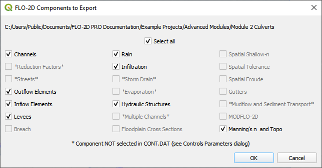

.. image:: ../img/Advanced-Workshop/Module072.png

.. image:: ../img/Advanced-Workshop/Module073.png

3. Go to the Storm Drain Widget and Export the swmm.inp file.

4.
Collapse all widgets.

5.
Open Storm Drain widget.

6.
Click Export SWMM.INP… button

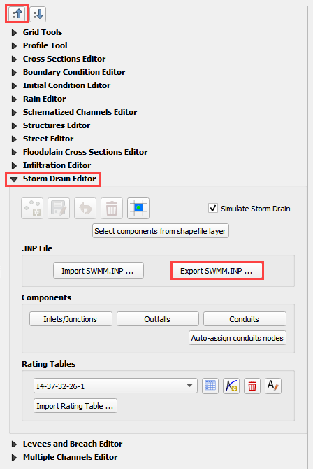

7.
Find the Module 2 Export.

8.
Name the file swmm.inp and click Save.

.. image:: ../img/Advanced-Workshop/Module075.png

9.
Click OK to close both windows.

.. image:: ../img/Advanced-Workshop/Module076.png

10. Click the Run FLO-2D Icon.

.. image:: ../img/Advanced-Workshop/Module051.png

11. Correct the Paths and click OK to start the simulation.

.. image:: ../img/Advanced-Workshop/Module077.png

Module 2 Part III – Bridge Hydraulic Structure
==============================================

**Overview**

In this tutorial, the bridge variables are added to a hydraulic structure.

.. _required-data-3:

Required Data
-------------

The required data is in Module 2 Bridge Tutorial.
This is a new project.
Please save and close the previous QGIS.

======== ======================================
**File** **Content**
======== ======================================
\*.qgz   QGIS data files
\*.gpkg  FLO-2D Geopackage
\*.tif   Bridge asbuilt files
\*.DAT   Bridge coefficients and cross sections
======== ======================================

Citation List for this Tutorial:

Hamill, L., 1999.
Bridge Hydraulics, E & FN Spon, NY.

Step 1: Load the project
------------------------

1. Start with the project from Module 2 Bridge Tutorial

2. If necessary, load it into QGIS.
   Open QGIS and drag the Bridge Tutorial.qgz file into the project.

3. Save the project.

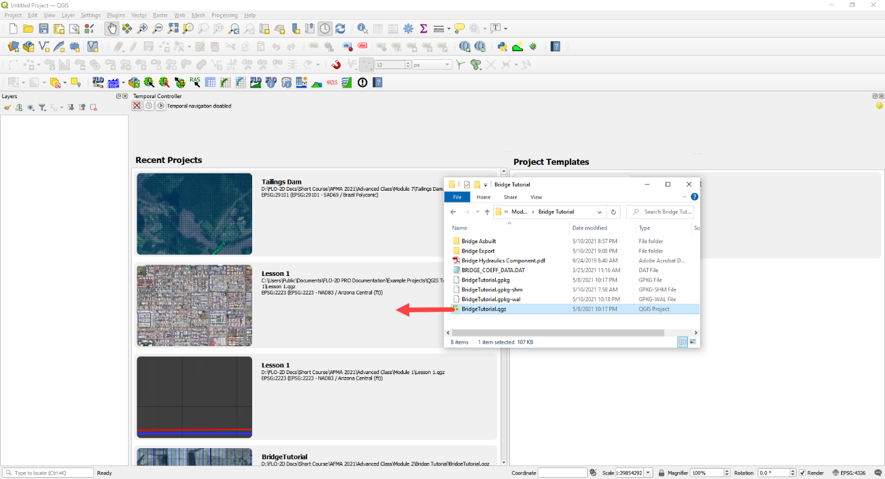

Step 2: Define the bridge variables and coefficients
----------------------------------------------------

Bridge variables and coefficients are defined by the USGS method for calculating discharge through a bridge.
Hamill defines this approach in his book on bridge hydraulics (1999).
O’Brien describes how to apply these variables to FLO-2D in a white paper called Bridge Hydraulics Component (2019).
This tutorial will show how to estimate or calculate the required variables for a real project setup.

This bridge in Simi Valley, CA crosses Arroyo Simi at Tapo St.
It appears to have vertical embankments and abutments.

Plan view parameters
--------------------

.. image:: ../img/Advanced-Workshop/Module079.png

b = 66 ft measured from QGIS map

L = 70 ft measured from QGIS map

w = 5 ft measured from QGIS map

L\ :sub:`1-2` = 177 ft measured from QGIS map

Profile parameters
------------------

.. image:: ../img/Advanced-Workshop/Module080.png

Z = 9.23 ft

Abutment left elevation = 941 ft

Abutment right elevation = 937.74

Average low chord = 937.4 ft

Average bridge deck elevation = 953.4 ft

Deck weir length = 114 ft

Bridge opening ratio
--------------------

1. Calculate M = q/Q = 0.83 = Discharge through bridge opening/pre-structure discharge)

q = 8600 cfs at normal depth = 8.06

Q = 10325 cfs at normal depth 8.06

.. image:: ../img/Advanced-Workshop/Module081.png

.. image:: ../img/Advanced-Workshop/Module082.png

Bridge tables
-------------

This bridge is a Type I: Vertical embankments and abutments.

M =0.83 = q/Q = (8600/10325 calculated from sdsu open channel calc)

C’ = 0.94 derived from table a (L/b = 70/66 = 1.06, M = 0.83)

k\ :sub:`F` = 1.10 derived from table b (F calculated with open channel calc = 1.0)

k\ :sub:`w` = 1.05 derived from table e (w/b = 5/66 = 0.076)

k\ :sub:`ɸ` = 1.00 derived from table g (angle = 10°)

Z = 9.23 ft (bridge low chord to channel bed)

Yu = 8.061 ft (normal depth upstream at 100yr discharge.)

No submergence at 100 yr discharge.

.. image:: ../img/Advanced-Workshop/Module083.jpg

Type 1 Bridge Opening (from Hamill, 1999; p.
111, Figure 4.3)

.. image:: ../img/Advanced-Workshop/Module084.jpg

Type 1 Bridge Opening cont.
(from Hamill, 1999; p.
112, Figure 4.3)

Bridge variables dialog
-----------------------

1. Fill the table from the preceding instructions.

2. Click ok to close this form.

.. image:: ../img/Advanced-Workshop/Module085.png

3. Click the Schematize button on the Structure editor.

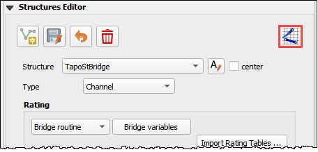

Step 3: Build the cross section data
------------------------------------

.. image:: ../img/Advanced-Workshop/Module087.png

1. [CHART]The cross section data for L\ :sub:`1-2` is taken from the cross section table of Cross-Section-60 and the Bridge cross section estimated based
   on the geometry of the bridge.

====== ====== ======
X      6657
====== ====== ======
0.00   957.08 954.11
4.00   957.15 953.48
10.01  957.16 952.04
20.02  954.13 949.50
22.02  953.38 944.24
28.03  950.24 942.80
32.04  948.06 940.84
38.04  945.23 938.81
42.05  943.70 937.43
46.05  942.41 937.30
50.06  942.23 937.31
62.07  941.52 937.26
70.08  941.74 937.31
78.09  944.95 937.26
84.09  948.11 937.23
86.10  948.47 937.34
88.10  949.16 937.69
94.11  951.27 939.68
102.12 955.43 942.52
110.12 956.13 945.75
112.13 955.87 945.87
118.13 955.86 948.39
120.14 955.90 954.00
====== ====== ======

2. Create a text file called BRIDGE_XSEC.DAT.

3. Copy the table above into the text file.

4. Replace the tabs with spaces using this method:

   - Select a tab.

   - Ctrl-H or Edit Replace

   - Add a few spaces into the Replace with field.

   - Click Replace All.

   - Save the file.

5. This file would normally be copied to the export folder but there is already one in there.
   This is just to show the procedure.

.. image:: ../img/Advanced-Workshop/Module088.png

Step 4: Save, export and run.
-----------------------------

1. This is a good point to save project.

.. image:: ../img/Advanced-Workshop/Module046.png

2. Export the data files to the Project Folder in Module 2\Bridge Tutorial\Bridge Tutorial Export.

.. image:: ../img/Advanced-Workshop/Module089.png

.. image:: ../img/Advanced-Workshop/Module090.png

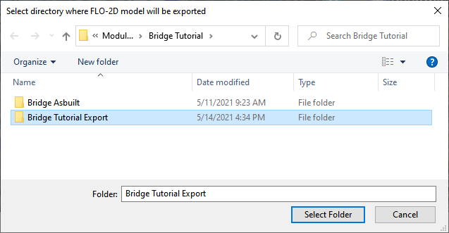

.. image:: ../img/Advanced-Workshop/Module092.png

3. Click the Run FLO-2D Icon.

.. image:: ../img/Advanced-Workshop/Module051.png

4. Correct the paths and click OK to start the simulation.

.. image:: ../img/Advanced-Workshop/Module093.png

Module 3 – Prescribed Dam Breach
================================

**Overview**

In this tutorial, a simple dam breach with failure is created.
In this example, the reservoir is dry and so no bathymetry or stage volume is required.

.. _required-data-4:

Required Data
-------------

The required data is in Module 3.

======== =================
**File** **Content**
======== =================
\*.qgz   QGIS data files
\*.gpkg  FLO-2D Geopackage
\*.tif   Elevation file
\*.xml   Hydrography file
\*.pdf   Hydrology manual
======== =================

Citation List for this Tutorial:

Tomlinson, E.M., W.D.
Kappel, G.
Muhlestein, D.
Hulstrand, and T.
Parzybok, 2013.
Probable Maximum Precipitation Study for Arizona, Arizona Department of Water Resources, Phoenix, Arizona.

.. _step-1-load-the-project-1:

Step 1: Load the project
------------------------

1. Start with the project from Module 3 Prescribed Breach

2. Open QGIS and drag the Prescribed Breach.qgz file into the project.

3. Save the project.

.. image:: ../img/Advanced-Workshop/Module094.png

4. Click Yes to load the model.

.. image:: ../img/Advanced-Workshop/Module095.png

Step 2. Load the aerial and hydrography
---------------------------------------

1. Click the Quick Map Services button and add a Google Map

2. Click the Data Source Manager button and add a WMS/WMTS dataset.

.. image:: ../img/Advanced-Workshop/Module097.png

3. Select the Hydrograph

4. Click Connect

5. Highlight all layers

6. Click Add and Close this form

.. image:: ../img/Advanced-Workshop/Module098.png

7. If the layer comes in white, set the transparency to 50% Global Opacity.

.. image:: ../img/Advanced-Workshop/Module099.png

Step 3. Review hydrology
------------------------

Dam breach models will typically utilize the Probable Maximum Precipitation (PMP).
The data for these studies are typically created at the state or county level.
The Arizona Department of Water Resources has a document that will help determine uniform and spatial rainfall data for dam breach studies (Tomlinson
et al., 2013).
The PMP can be determined spatially using the PMP Evaluation Tool made for ArcGIS.

For the sake of simplicity, a value of 10.55 inches was sampled from Table 10.1 for a 6 hour local storm for a 1 mi2 basin in zone 2 near the Phoenix
area.

.. image:: ../img/Advanced-Workshop/Module100.png

(Source: Figure 10.7 and table 10.1 pg.
111 PMP Study for Arizona)

This value is used in the Uniform Rainfall editor along with the Maricopa 6-Hr P1 rainfall distribution curve.
This hydrology model is used to fill the reservoir or even get a high-water level for the dam.

.. image:: ../img/Advanced-Workshop/Module101.png

Infiltration can also be applied to the watershed.
In this example, a simplified set of polygons are used to define Green-Ampt Infiltration.
Once these polygons are created, the Schematize Infiltration button will apply them to the grid.
Instead of the complex infiltration calculation parameters, the direct infiltration parameters are applied.
See the Global and Spatial variables below.

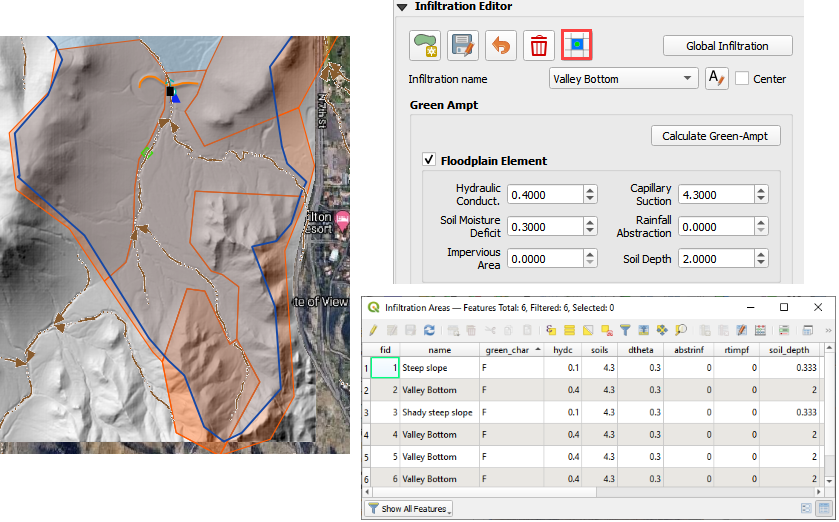

Step 4. Set up the reservoir
----------------------------

1. Collapse the widgets.

2. Open the Initial Condition Editor widget.

.. image:: ../img/Advanced-Workshop/Module103.png

3. Click the create a reservoir button and click anywhere upstream of the dam.

.. image:: ../img/Advanced-Workshop/Module104.png

4. Click the Save button and Schematize button to complete the Reservoir.

5. This will fill the reservoir when FLO-2D starts to run.

6. FLO-2D fills any contiguous cell to the prescribed water surface elevation.

.. image:: ../img/Advanced-Workshop/Module105.png

Step 5. Create the levee
------------------------

1. The levee line is already in the correct location and User Layer.

2. Click the Create Levees button.

.. image:: ../img/Advanced-Workshop/Module106.jpg

3. Check only User levee lines and click Create Schematic Layers from User Layers button.

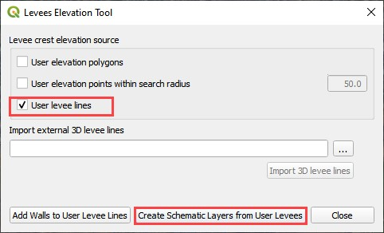

4. The following message states how many levees were created and how many levees have failure data.
   Click OK.

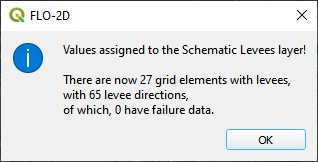

5. Zoom in to the dam in the red rectangle below.

.. image:: ../img/Advanced-Workshop/Module109.jpg

Step 6. Define the breach
-------------------------

1. Click the collapse widgets button.

2. Click the Levees and Breach Editor widget.

3. Select the Prescribed Failure.

.. image:: ../img/Advanced-Workshop/Module110.png

4. Click the Grid Info Tool Button

.. image:: ../img/Advanced-Workshop/Module111.png

5. Click the cell marked in red below.
   This will become the location of the breach.

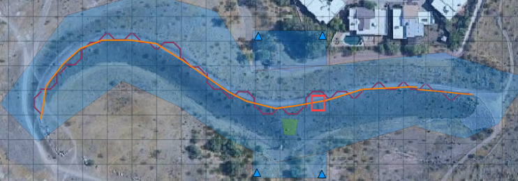

6. Click the Levee Grid Elements button.

7. Type cell number into the Grid Element field and click the little eye.

.. image:: ../img/Advanced-Workshop/Module113.png

8.  Click inside the elevation field of the North direction.
   That will turn it a different color and select it as the “fail direction”.
   See the Pink field under the word North.

9.  Click the levee failure check box.

10.
Set the fail data and click Apply Change and Close.

.. image:: ../img/Advanced-Workshop/Module114.png

Step 7. Remove the dam elevation (method 1)
-------------------------------------------

1. Do you want to remove the entire structure? Complete Step 6.

2. Do you want to remove a thin slice? GoTo Step 7 (method 2)

3. Highlight the Elevation Polygon Layer

4. Click the Select button

5. Click the large blue polygon.

.. image:: ../img/Advanced-Workshop/Module115.png

6. Click the Correct Grid Elevation button

.. image:: ../img/Advanced-Workshop/Module116.png

7. Choose the Tin(based on elevation polygon boundary) and Use only selected polygons check boxes and click OK.

.. image:: ../img/Advanced-Workshop/Module117.png

Step 8. Remove the dam elevation thin slice (method 2)
------------------------------------------------------

1. Click the Elevation Polygon Layer

2. Click the Select button

3. Click the small blue polygon.

.. image:: ../img/Advanced-Workshop/Module118.jpeg

4. Click the Correct Grid Elevation button

.. image:: ../img/Advanced-Workshop/Module116.png

5. Choose the Tin(based on elevation points and polygons) and Use only selected polygons check boxes and click OK.

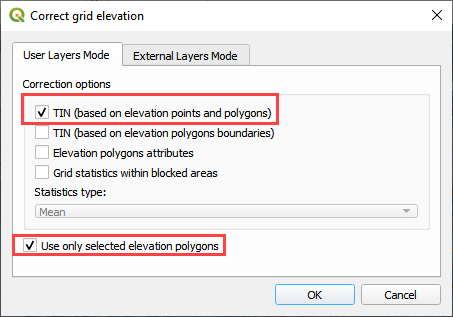

6. Want to learn more about the Elevation Correction tool? Goto the Plugin User Manual version 2021.

Step 9. Export and run the model
--------------------------------

1. Click the Control Variable editor.

.. image:: ../img/Advanced-Workshop/Module120.png

2. Set the control parameters and turn on the levee switch.

.. image:: ../img/Advanced-Workshop/Module121.png

3. Set the Numerical Stability Parameters.
   Click Save to close.

.. image:: ../img/Advanced-Workshop/Module122.png

4. Export the FLO-2D Data files.
   Click OK.

.. image:: ../img/Advanced-Workshop/Module123.png

.. image:: ../img/Advanced-Workshop/Module124.png

5. Select the Module 3 Export folder.

.. image:: ../img/Advanced-Workshop/Module125.png

6. The data is ready to run.

.. image:: ../img/Advanced-Workshop/Module126.png

7. Correct the paths and click OK to start the simulation.

.. image:: ../img/Advanced-Workshop/Module127.png

The breach ends up in the northeast corner of the study area.

.. image:: ../img/Advanced-Workshop/Module128.png

A review of the map shows that there is potential for the water to cross the highway and flow to the southwest.

Step 10. Add a culvert
----------------------

1. This dam is used for flood and sediment control.
   It has a perforated riser inlet to allow solids to settle and clear water to flow through the culvert.

2. A site visit would answer any question about this structure, but some simple assumptions will work fine for the purpose of understanding how FLO-2D
   setup will use the data.

.. image:: ../img/Advanced-Workshop/Module129.png

3. In this case a head reference elevation can be used so that the water must achieve a specific elevaton before the culvert will allow discharge.

4. Using the ID tool on the elevation raster shows that the ground elevation is 1373.22 ft.

.. image:: ../img/Advanced-Workshop/Module130.png

5. Estimating that the feature is around waist high means we can use a head reference elevation of 1376 ft for this inlet.

6. Collapse the widgets and click the structure editor.

7. Click Add a structure line and digitize a structure from the upstream side of the dam to the downstream side.
   Click Save to load the data into the table.

.. image:: ../img/Advanced-Workshop/Module131.png

8. Finish the data in the Widget.

.. image:: ../img/Advanced-Workshop/Module132.png

9.  Go back to Step 9 and `export and run <#step-9.-export-and-run-the-model>`__ the model again.

10.
Copy the Orifice data from the Excel File.

.. image:: ../img/Advanced-Workshop/Module133.png

11.
Select the first cell of the data table in QGIS and click the Paste Button.

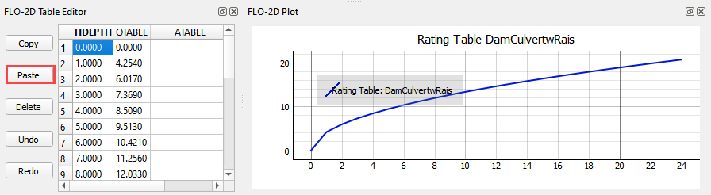

12.
Click the Schematize Button.

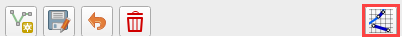

13.
Turn on the Hydraulic Structures switch.

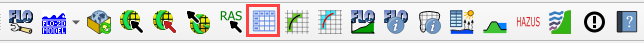

.. image:: ../img/Advanced-Workshop/Module137.png

Step 11. Downstream Boundary
----------------------------

1. Collapse the widgets and click the Boundary Condition Widget.

2. Click the create polygon button and digitize a polygon around the downstream boundary.

3. Click the Widget save button.

4. Set the Outflow side of the widget to Outflow.

5. Set the outflow type to 1.

6. Click the Schematize button.

.. image:: ../img/Advanced-Workshop/Module138.png

.. image:: ../img/Advanced-Workshop/Module139.png

Step 12. Common mistakes demo
-----------------------------

This section will demonstrate some common mistakes that users make when building breach models:

-  The reservoir node is water surface is too high or on the wrong side of the levee.

-  Levee components are not tied into the edge of the dam correctly.

-  Crest elevation is not defined correctly.

-  There is a hole in the levee where a direction was not assigned correctly.

-  The breach node is on the wrong side of the levee.

Bad reservoir or leaky levee component
--------------------------------------

1. Collapse the widgets and click the Initial Condition Editor.

2. Change the reservoir elevation to 1402.00 and click the Schematize button.
   This is 2ft higher than the dam.

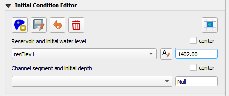

3. Repeat **Step 8** starting at Number 4.

4. This is the result.
   The reservoir was too high so it filled the whole project.

5. Don’t forget to set the elevation back before exiting from QGIS.

.. image:: ../img/Advanced-Workshop/Module141.png

Dam elevation not removed
-------------------------

1. Collapse the widgets and click the Grid Tools.

2. Click the Sample Raster button.

3. Fill the form and click OK.
   The elevation file should be in Module 3.

.. image:: ../img/Advanced-Workshop/Module142.png

4. This procedure reset the elevation correction that was applied in Step 6 or 7.

5. Export and run the model by repeating **Step 8**.

6. Error message appears to alert that the breach elevation is lower than the dam elevation.
   This is an indication that something is wrong.

.. image:: ../img/Advanced-Workshop/Module143.png

7. There is another more subtle indication that the dam elevation was not removed.
   In this case, the dam has not failed because the *dam elevation was not removed*.

.. image:: ../img/Advanced-Workshop/Module144.png

Module 5 Part I – Create a Watershed Model
==========================================
JASMINE DO THIS ^^^!!!!

Advanced class attendees.
Skip this lesson.
It is here for you to peruse.

**Overview**

In this tutorial, create a watershed model to estimate the runoff.
Part 1 will set up the watershed rainfall runoff model.
Part II will apply mudflow parameters to the watershed hydrograph.

.. _required-data-5:

Required Data
=============

The required data is in Module 5 Watershed Mudflow Tutorial.
This is a new project.
Please save and close the previous QGIS.

======== ====================== ==========
**File** **Content**
======== ====================== ==========
\*.qgz   QGIS data files
\*.gpkg  FLO-2D Geopackage
\*.tif   Elevation data
\*.shp   LandSoil shapefile     Hydrology
\*.tif   CN and rainfall raster Hydrology
\*.asc   NOAA rainfall data     Hydrology
\*.shp   AOI                    Shapefiles
======== ====================== ==========

.. _step-1-load-the-project-2:

Step 1: Load the project
------------------------

1. Start with the project from Module 5 Part I Watershed Hydrology.

2. If necessary, load it into QGIS.
   Open QGIS and drag the Watershed Module 5.qgz file into the project.

3. Save the project.

4. Click yes to load the model.

.. image:: ../img/Advanced-Workshop/Module146.png

Step 2. Load the hydrography map
--------------------------------

1. Click the Open Data Source Manager button.

.. image:: ../img/Advanced-Workshop/Module147.png

2. Select the WMS/WMTS tab.

3. Choose Hydrography layer.

4. Connect the data.

5. Select the desired map layers.

6. Click Add.

.. image:: ../img/Advanced-Workshop/Module148.png

7.  Change the transparency.
   Double click the layer.

8.  Select the Transparency tab.

9.  Set the opacity to 50%

10.
Click OK.

.. image:: ../img/Advanced-Workshop/Module149.png

Step 3. Review the watershed.
-----------------------------

1. Scan the AOI and hydrography map to see if the feature is collecting all the water from the watershed above the point of concentration where the
   mudflow is most likely to occur.

2. This is typically at the apex of the fan.

3. The AOI shapefile needs an integer cell_size field.
   In this case, the cell size is 100ft.

.. image:: ../img/Advanced-Workshop/Module150.png

Step 4. Create the grid.
------------------------

1. Click the create grid button.

2. Select Use External Layer.

3. Set the layer to AOI.

4. Set the Cell size field to cell_size.

5. Click OK to start the calculation and OK to close the message form.

.. image:: ../img/Advanced-Workshop/Module151.png

Step 5. Interpolate Elevation.
------------------------------

1. Click the Interpolate from Raster button.

2. Fill the form and click OK.

3. Click OK to close the message form.

.. image:: ../img/Advanced-Workshop/Module152.png

Step 6. Calculate Roughness
---------------------------

1. Click the Calculate roughness button.

2. Fill the form and click OK.

3. Click OK to close the message form.

.. image:: ../img/Advanced-Workshop/Module153.png

Step 7. Save and create a recovery point.
-----------------------------------------

1. Save QGIS.

2. Close QGIS.

3. Zip the \*.qgz and \*.gpkg together.

4. Rename the zipped file **Part I Watershed Hydrology Elev and Man OK.zip**

5. Reload the project.

Step 8. Determine the total rainfall
------------------------------------

1. In an internet browser, go here: https://hdsc.nws.noaa.gov/hdsc/pfds/

2. Click on California.

3. Scroll down to the table data and change the Tab to Supplementary Information.

4. Change PF in GIS Format to 10yr, 3-hr and click submit.

.. image:: ../img/Advanced-Workshop/Module155.png

5. Extract the new data into the project/Hydrology folder.

.. image:: ../img/Advanced-Workshop/Module156.png

6. Click the User Layers Group.

7. Drag the sw10yr03ha.asc file onto the map.

8. These pixels are rainfall in inches \* 1000.

9. Right click the layer and Export the data.

.. image:: ../img/Advanced-Workshop/Module158.png

10.
Save the data to the Hydrology folder.

11.
Set the coordinate system to EPSG 2229.

12.
Reduce the size of the raster with the Map Canvas Extent button.

13.
Add the saved file to the map.

14.
Click OK.

.. image:: ../img/Advanced-Workshop/Module159.png

Step 9. Sample the rainfall raster
----------------------------------

1. Remove the original raster from the layers list.

2. Move the raster to the bottom of the map.

3. Use the ID tool to find the peak rainfall.

.. image:: ../img/Advanced-Workshop/Module160.png

4. In this case, the lightest color is the highest rainfall.

5. 2.98 inches.

.. image:: ../img/Advanced-Workshop/Module161.png

Step 10. Set up the rainfall
----------------------------

1. Collapse the FLO-2D widgets and click Rain Editor.

2. Enter the total rainfall.

3. Select or create a rainfall distribution.

   - C:\Users\Public\Documents\FLO-2D PRO Documentation\Rainfall Distributions

4. Check the Spatial Variation (Depth Area Reduction)

5. Interpolate the rainfall depth reduction factor.

6. Click the AR button.

7. Fill the form.

8. Click OK to calculate the rainARF and OK to close the message.

.. image:: ../img/Advanced-Workshop/Module163.png

Step 11. Calculate infiltration
-------------------------------

1. Click the collapse FLO-2D Widgets button and click the Infiltration Editor Widget.

2. Click the Global Infiltration button and fill the form.

3. Click OK to close the form.

.. image:: ../img/Advanced-Workshop/Module164.png

4. Click the Calculate SCS CN button

5. Fill the form and click OK to calculate and OK to close the message.

.. image:: ../img/Advanced-Workshop/Module165.png

A scan of the Curve Number field indicates that the infiltration calculation was not correct.

.. image:: ../img/Advanced-Workshop/Module166.png

Normally, the Curve Number calculator is used to calculate the SCS Curve Number for each cell.
The LandSoil shapefile that was provided for this project has good data but bad geometry.
It is so bad that the QGIS Fix Geometry tools cannot fix it.
This happens with complex shapefiles.
For example, there are hundreds of duplicated features.
The following ID click shows that there are 4 duplicate features in this specific spot.
Two alternate methods can be applied to calculate the infiltration.
Once either method is applied, the data is easily converted to the INFIL.DAT file.

1. Point sample the layer using the n value calculator.
   No averaging applied.

2. Convert the data to a raster and interpolate it.
   Weighted average applied.

.. image:: ../img/Advanced-Workshop/Module167.png

Step 12. Alternate infiltration method 2
----------------------------------------

1. Convert the data to Raster.

2. Open the Processing Toolbox and search Rasterize.

3. Click the Rasterize (vector to raster)

4. Set the Input layer to LandSoil

5. Set the Field to CN

6. Output size = Georeferenced Units

7. Resolution = 25ft

8. Output Extent = AOI Layer

9. Click Run

10.
Collapse the FLO-2D widgets and click the Grid Tools widget.

11.
Click the Interpolate from Raster button.

12.
Fill the Elevation Sampling form and click OK to calculate and OK to close the message.

Step 13. Export infiltration data.
----------------------------------

1. Find the Grid Layer.

2. Right click it and click Export / Save Features As.

.. image:: ../img/Advanced-Workshop/Module171.png

3. Set the format to CSV.

4. Save the file to Hydrology\CurveNumberGrid.csv.

5. The coordinates are EPSG 2229.

6. The only necessary fields are fid and elevation.

7. Click OK to create the data.

Step 14. Recalculate the elevation.
-----------------------------------

1. Repeat Step 5 (Interpolate Elevation) and return here.

Step 15. Export INFIL.DAT
-------------------------

1. Click the Control Variables button.

.. image:: ../img/Advanced-Workshop/Module173.png

2. Turn on the Infiltration switch, fill the form and click Save.

.. image:: ../img/Advanced-Workshop/Module174.png

3. Click the Export button.

4. Save the data to the Hydrology folder.

.. image:: ../img/Advanced-Workshop/Module176.png

Step 16. Format the CN data
---------------------------

1. Open both files side by side in NotePad++ or Excel

2. Set up the new CN data in the proper format.

3. Number of spaces between data is not important.

4. Block mode in Notepad is Alt-Click and then Shift-Alt-Click the end of the file.

.. image:: ../img/Advanced-Workshop/Module177.png

5. The final step is to replace the data on the left with the data on the right.

6. Save and close INFIL.DAT.

Step 17. Reload the infiltration data.
--------------------------------------

1. Click the import individual data into Schema layer button.

.. image:: ../img/Advanced-Workshop/Module178.png

2. Choose the cont.dat file and click Open.

.. image:: ../img/Advanced-Workshop/Module179.png

3. Make sure the only option is Infiltration and click OK and click OK to close the message.

4. The curve number values are now correct.

Step 18. Save, export, and run
------------------------------

1. This is a good point to save project.

.. image:: ../img/Advanced-Workshop/Module046.png

2. Export the data files to the Project Folder in Advanced Class Folder

3. Part I Watershed Hydrology\Watershed Export.

.. image:: ../img/Advanced-Workshop/Module089.png

.. image:: ../img/Advanced-Workshop/Module182.png

4. Click the Run FLO-2D Icon.

.. image:: ../img/Advanced-Workshop/Module051.png

5. Set the Project path and the FLO-2D Engine Path and click OK to start the simulation.

Step 19. Map the velocity vectors and import them into QGIS
-----------------------------------------------------------

1. The first run is used to identify an area of concentrated flow and build a Floodplain Hydrograph.

2. Close the run.

.. image:: ../img/Advanced-Workshop/Module184.png

3. Run Mapper.

.. image:: ../img/Advanced-Workshop/Module185.png

4. Set the paths and click OK.

.. image:: ../img/Advanced-Workshop/Module186.png

5. Load the data into Mapper.
   Click File/Read FLO-2D results.

6. Find the FLPLAIN.DAT and click Open.

7. Plot the Velocity Vector Map.
   Scale factor = 1.

8. Close Mapper.

9. Drag the Velocity Vector shapefile onto the map.

.. image:: ../img/Advanced-Workshop/Module189.png

Step 20. Create a floodplain cross section.
-------------------------------------------

1. Zoom in to the apex of the alluvial fan.

.. image:: ../img/Advanced-Workshop/Module190.png

2. Click the Digitize Floodplain Cross Section button.

3. Draw the cross section across the canyon.

4. click OK button to complete the feature.

5. Click the Save button to load the Widget.

6. Set the Flow direction.

7. Click Schematize.

.. image:: ../img/Advanced-Workshop/Module191.png

Step 21. Save, export, and run again
------------------------------------

1. This is a good point to save project.

.. image:: ../img/Advanced-Workshop/Module046.png

2. Export the data files to the Project Folder in Advanced Class Folder

3. Part I Watershed Hydrology\Watershed Export.

.. image:: ../img/Advanced-Workshop/Module089.png
   :height: 0.35139in

.. image:: ../img/Advanced-Workshop/Module192.png

4. Click the Run FLO-2D Icon.

.. image:: ../img/Advanced-Workshop/Module051.png

5. Correct the paths and click OK to start the simulation.

Module 5 Part II – Watershed Mudflow Model
==========================================

**Overview**

In this tutorial, create a watershed model to estimate the runoff for a mudflow condition.
Part I will set up the watershed rainfall runoff model.
Part II will apply mudflow parameters to the watershed hydrograph.

.. _required-data-6:

Required Data
=============

The required data is in Module 5 Part II Mudflow folder.
This is a new project.
Please save and close the previous QGIS.

======== =========================================
**File** **Content**
======== =========================================
\*.qgz   QGIS data files
\*.gpkg  FLO-2D Geopackage
\*.xlsx  Cv Calculator
\*.DAT   Mudflow parameters
\*.pdf   Mudflow guidelines and USGS sample report
\*.shp   Mudflow volume polygon
======== =========================================

Citation List for this Tutorial:

O’Bri

en, J.S., (2020).
Simulating Mudflow Guidelines.
FLO-2D Software, Inc., Nutrioso, Arizona.

.. _step-1-load-the-project-3:

Step 1: Load the project
------------------------

1. Start with the project from Module 5 Part II.
   This is the completed watershed project.

2. If necessary, load it into QGIS.
   Open QGIS and drag the Watershed Module 5.qgz file into the project.

.. image:: ../img/Advanced-Workshop/Module193.png

3. Click Yes to load the model.
   If you don’t see this window, you might need to delete the \*.gpkg in Module 5 Part I and try again.
   The data needs to come from Part II.

.. image:: ../img/Advanced-Workshop/Module194.png

\**\*

**Important note:** If the project doesn’t look like the following image, you might be using the watershed model.

1. Close QGIS

2. Delete the \*.qgz and \*.gpkg in Part I and Part II folder.

3. Extract the Module 5 Mudflow Part II Recovery.zip

4. Reload the project.

\**\*

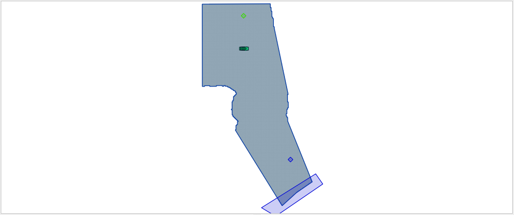

Step 2. Create inflow hydrograph
--------------------------------

1. Open the HYDROG Program.

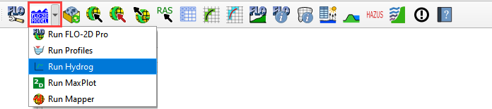

2. Find the Watershed Export Project and click ok.

.. image:: ../img/Advanced-Workshop/Module197.png

3. Click the Plot Cross Section hydrographs button.

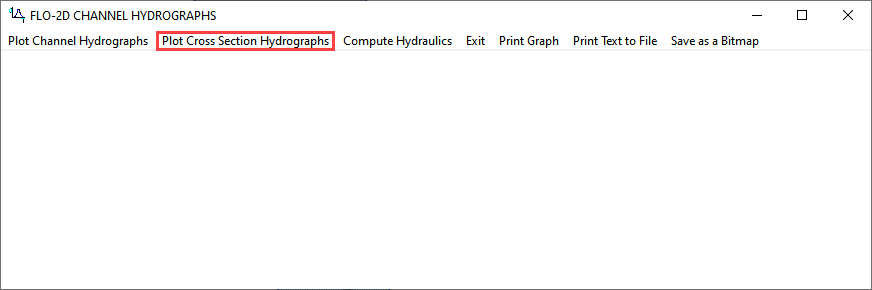

4. Select cross section 1 and click OK.

.. image:: ../img/Advanced-Workshop/Module199.png

5. Click the Return to Menu button.

.. image:: ../img/Advanced-Workshop/Module200.png

6. Click the Print Text to File button.
   This creates a file named “1”.
   Click ok to close the message.
   **Close HYDROG**

.. image:: ../img/Advanced-Workshop/Module201.png

7. Load the file named “1” into NotePad++ or Excel.

8. Trim data so that it has 2 tab-delimited columns.

9. Ctrl-A will select all.
   Ctrl-C will copy.

.. image:: ../img/Advanced-Workshop/Module202.png

Step 3. Assign the hydrograph to a BC node.
-------------------------------------------

1. In QGIS, collapse the FLO-2D Widgets and click the Boundary Condition Editor widget.

2. If the Table Editor is blank, click Add Time Series button.

3. Name the Time Series 10yr 3hr NoMud.

.. image:: ../img/Advanced-Workshop/Module203.png

4. Add the hydrograph from the clipboard into the Table widget.

5. Click the first cell and click Paste.

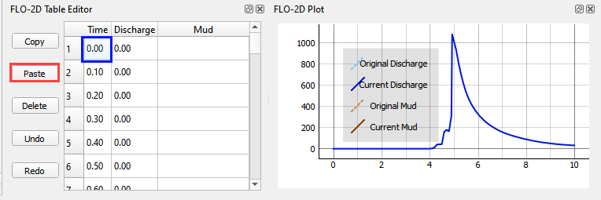

6. Go back to the widget and click the Schematize button.

.. image:: ../img/Advanced-Workshop/Module205.png

Step 4. Set a global bulking factor.
------------------------------------

1. Click the Control Variables table.

2. Add a Bulking Concentration, set Mud switch to None, and click Save.

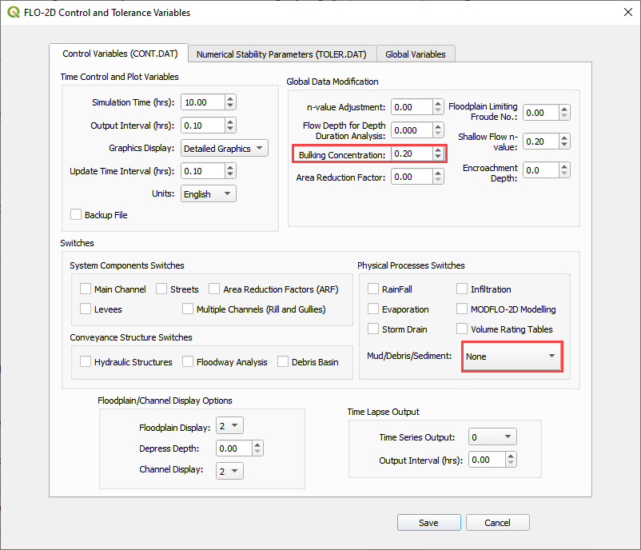

Step 5. Export and run the model
--------------------------------

1. Export the FLO-2D Data files.
   Click OK.

.. image:: ../img/Advanced-Workshop/Module123.png

.. image:: ../img/Advanced-Workshop/Module208.png

2. Select the Module 5\Part II Mudflow\Mudflow Export folder.

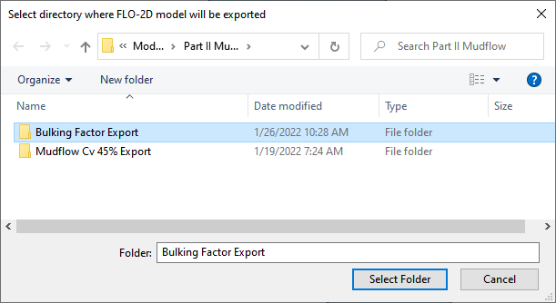

3. The data is ready to run.

.. image:: ../img/Advanced-Workshop/Module210.png

4. Set the Paths and Run the model.

.. image:: ../img/Advanced-Workshop/Module211.png

Step 6. Set up the mudflow.
---------------------------

1. Open the Cv Calculator.xlsx file.

.. image:: ../img/Advanced-Workshop/Module212.png

2. Copy the first 3 columns into the clipboard.

.. image:: ../img/Advanced-Workshop/Module213.png

3. Click the Boundary Condition Editor.

4. Click Add a Time series button.

5. Name the new time series.

.. image:: ../img/Advanced-Workshop/Module214.png

6. Paste the data from Excel into the Table Editor widget.

.. image:: ../img/Advanced-Workshop/Module215.png

7. Go back to the BC widget and click the Schematize button.

.. image:: ../img/Advanced-Workshop/Module205.png

8. The SED.DAT file is also required but QGIS cannot make it right now.
   it is not a difficult file to create.
   The GDS or any Text Editor can make it.

.. image:: ../img/Advanced-Workshop/Module216.png

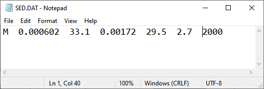

See Simulating Mudflow Guidelines to get instructions for the soil viscosity and yield stress parameters.
These parameters are generally retrieved from laboratory studies but if no study is available, a conservative dataset of Glenwood 4 can be applied.

Step 5. Export and run the *Mudflow* model
------------------------------------------

1. Click the Control Variables table.

2. Set the Bulking Concentration to 0.00, set Mud switch to Mud/Debris, and click Save.

.. image:: ../img/Advanced-Workshop/Module218.png

3. Export the FLO-2D Data files.
   Click OK.

.. image:: ../img/Advanced-Workshop/Module123.png

.. image:: ../img/Advanced-Workshop/Module208.png

4. Select the Module 5\Part II Mudflow\Cv0.55 folder.

.. image:: ../img/Advanced-Workshop/Module219.png

5. The data is ready to run.

.. image:: ../img/Advanced-Workshop/Module220.png

6. Correct the paths and click OK to start the simulation.

.. image:: ../img/Advanced-Workshop/Module221.png

Module 6 – Erosion Dam Breach
=============================

**Overview**

In this tutorial, an erosion dam breach with failure is created.
In this instance, the reservoir is filled but the pre-reservoir elevation is known.

.. _required-data-7:

Required Data
=============

The required data is in Module 6.

======== =================
**File** **Content**
======== =================
\*.qgz   QGIS data files
\*.gpkg  FLO-2D Geopackage
\*.tif   Grid elevation
======== =================

.. _step-1-load-the-project-4:

Step 1: Load the project
------------------------

1. We are finished with the previous project.
   Save and close it.

2. Start with the project from Module 6.

3. If necessary, load it into QGIS.
   Open QGIS and drag the Erosion Breach Module 6.qgz file into the project.

4. Save the project.

.. image:: ../img/Advanced-Workshop/Module222.png

5. Click Yes to load the model.

Step 2: Initial conditions reservoir
------------------------------------

1. An initial condition is set to fill the reservoir when FLO-2D PRO.exe initiates the simulation.

2. Set up this condition in QGIS.

3. Click the collapse widgets button.

4. Open the Initial Condition Editor widget.

5. Click the add reservoir button.

6. Place a reservoir node anywhere within the reservoir area and fill the form.
   Click ok to close the data.

.. image:: ../img/Advanced-Workshop/Module225.png

7. Click the Save button and the Schematize button on the widget.

8. This data is saved to the INFLOW.DAT file when the model is exported.

.. image:: ../img/Advanced-Workshop/Module226.png

Step 3: Review dam geometry
---------------------------

Crest width = 32 ft

Crest length = 7900 ft

Shell slope US and DS = 2

Core slope = 0.5

.. image:: ../img/Advanced-Workshop/Module227.png

.. image:: ../img/Advanced-Workshop/Module228.png

Step 4. Review dam material
---------------------------

Each variable is discussed in the Data Input Manual BREACH.DAT tab.
This data may be available from the original dam construction manual or from periodical safety reports.
Check with the dam owner, or dam safety agency for data.

==== =========== ==========================================
0.1  d50c        d50 core (mm)
==== =========== ==========================================
0.35 porc        porosity core ()
120  uwc         unit weight core (lb/ft\ :sup:`3`)
0.15 cnc         roughness n core
33   afrc        angle of internal friction core(degrees)
750  cohc        cohesive strength core (lb/ft\ :sup:`3`)
50   unfcc       sediment gradient ratio
50   d50s        d50 shell (mm)
0.4  pors        porosity shell ()
100  uws         unit weight shell (lb/ft\ :sup:`3`)
0.2  cns         roughness n shell
32   afrs        angle of internal friction shell (degrees)
250  cohs        cohesive strength shell (lb/ft\ :sup:`3`)
10   unfcs       sediment gradient ratio
0    grasslength grass length downstream face (in)
0    grasscond   grass condition downstream face (0 or 1)
0    grassvmaxp  maximum permissible velocity (fps)
300  d50df       d50 downstream face (mm)
2    unfcdf      sediment gradient downstream face
==== =========== ==========================================

Step 5. Review general breach parameters
----------------------------------------

Each variable is discussed in the Data Input Manual BREACH.DAT tab.

.. _`2500`:

2500:

brbotwidmax

Maximum width to constrict the bottom of the breach.

.. _`7900`:

7900:

brtopwidmax

Maximum width to constrict the top of the breach.

.. _`1755`:

1755:

brbottomel

start of breach elevation.
Sensitive to instability.
If unstable, set to 1 to 3 ft below the crest elevation.

.. _`3.05`:

3.05:

weircoef

weir coefficient

.. _`1.5`:

1.5:

bratio

Initial breach width to depth ratio.

.. _`0`:

0:

breachtime

Time the water surface elevation must last before the breach initiates.

Step 6. Create the breach point
-------------------------------

1. Identify a good breach location.
   You can choose any location you desire.

.. image:: ../img/Advanced-Workshop/Module229.png

.. image:: ../img/Advanced-Workshop/Module289.png

2. Select a breach location. This location can represent a
   weak point on a dam.

   - Spillways

   - Stilling basins

   - Sag, deformation, or erosion

   - Boreholes

   - Ends points

3. Location is *not always* important.
   For large reservoirs flooding is a function of the volume not breach parameters.

4. It is important to start the breach from the correct side of the levee feature.

5. Put the breach point on the water side of the levee.

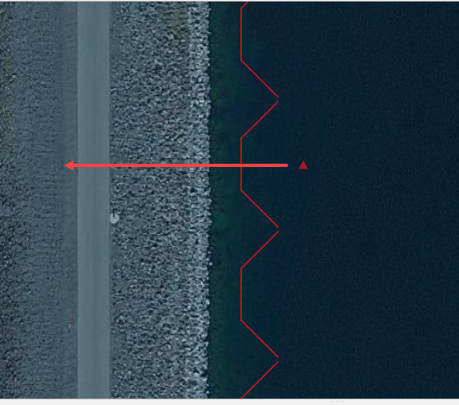

6.  Click collapse FLO-2D widgets button.

7.  Click the Levees and Breach Editor widget.

8.  Click the create a breach point button.

9.  |Module290|\ Click the map where the breach should go and fill the table.

10.
You can choose a good location based on engineering judgment.

11.
The data is listed in step 3, 4 and 5.

12.
Click OK to close the table.

13.
If you mess up, Click Revert Breach Edits button and try again.

14.
Go to the next page.

15.
Complete the breach data in the widget.

Step 7. Export and run the model
--------------------------------

1. Export the FLO-2D Data files.
   Click OK.

.. image:: ../img/Advanced-Workshop/Module123.png

2. Select the Module 6 Export folder.

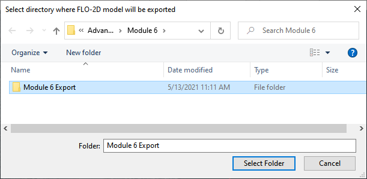

3. The data is ready to run.

.. image:: ../img/Advanced-Workshop/Module235.png

4. Correct the paths and click OK to start the simulation.

Step 8. Review the data
-----------------------

1. These are the 3 data files that were created.

2. Levee.dat needed a Breach switch in Line 1.

3. Inflow.dat has a “dummy” inflow node.
   This allows graphics mode to function.

4. Inflow.dat has the reservoir elevation.
   When run initiates, FLO-2D will fill the reservoir.

5. Breach.dat stores the breach variables.

.. image:: ../img/Advanced-Workshop/Module237.png

Module 7 – Tailings Dam Tool
============================

**Overview**

In this tutorial, use QGIS and the tailings dam tool to create a tailings dam failure.

.. _required-data-8:

Required Data
=============

The required data is in Module 7.

======== =================
**File** **Content**
======== =================
\*.qgz   QGIS data files
\*.gpkg  FLO-2D Geopackage
\*.xml   Tailings dam data
\*.exe   Tailings dam tool
======== =================

Citation List for this Tutorial:

Robertson, P.
K., de Melo, L., Williams, D.
J., & Wilson, G.
W.
(2019).
Report of the Expert Panel on the Technical Causes of the Failure of Feijão Dam I.
Pg.
1–71.
http://www.b1technicalinvestigation.com/report.html

TUV SUD Bureau, Periodic Review Dam Mine Safety Stream Bean - Dam I Technical Report.
SP-RC-117/17 Rev.
4.
Pg.
1–265.
published on May 17, 2017, Ordinance DNPM No.
70,389 / 2017.
https://worldminetailingsfailures.org/wp-content/uploads/2019/03/TUV_SUD_2017_Periodic_Safety_Review.en_.pdf

.. _step-1-load-the-project-5:

Step 1: Load the project
------------------------

1. Start with the project from Module 7.

2. If necessary, load it into QGIS.
   Open QGIS and drag the Tailings Dam Module 7.qgz file into the project.

3. Save the project.

.. image:: ../img/Advanced-Workshop/Module238.png

4. Click Yes to load the model.

.. image:: ../img/Advanced-Workshop/Module239.png

Step 2. Find inflow node
------------------------

1. Zoom in on the inflow node.

2. Open the Boundary Condition Editor

3. Check the Center check box.

4. Click the Tailings Dam Loc

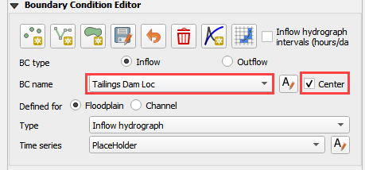

5. Zoom in with the mouse wheel.
   This is the inflow node location where the breach starts.

Step 3. Run the Tailings Dam Tool
---------------------------------

1. Click the run Tailings Dam Tool button.

.. image:: ../img/Advanced-Workshop/Module242.png

2. Set both file locations to the Module 7 folder.

.. image:: ../img/Advanced-Workshop/Module243.png

Step 4. Dam geometry
--------------------

Dam Height = 70 m

Downstream Slope = 1.5:1

Figure 1.
Dam Profile.
Source: Feijao Dam 1 Expert Panel Appendices (2019).

Freeboard = 5m

.. image:: ../img/Advanced-Workshop/Module245.png

Figure 2.
Dam Geometry at crest.
Source: Periodic Safety Review Vale TUV SUD (2017).

Step 5. Volume
--------------

Volume Solids: 7.53X10^6 m\ :sup:`3`

Actual Volume: 8X10^6 m\ :sup:`3`

Volume to the crest 8.80X10^6 m\ :sup:`3`

Figure 3.
Volume Curve 6.22.
Source: Periodic Safety Review Vale TUV SUD (2017).

Step 6. Geotech data
--------------------

Dam compacted Unit Weight = 19 KN/m\ :sup:`3` = 9279.43 kg/m\ :sup:`3`

Dam Cohesion = 10 KPa = 1,019.72 kg/m\ :sup:`2`

Angle of friction = 30 degrees

.. image:: ../img/Advanced-Workshop/Module247.png

Figure 4.
Adopted Geotechnical Parameters.
Source: Periodic Safety Review Vale TUV SUD (2017).

Step 7. Foundation geotechnical data from TUV report
----------------------------------------------------

NSPT silty clay between 5 and 11 strokes

NSPT saprolite horizon between 15 and 40 strokes

Unit weight = 20 KN/m\ :sup:`3` = 2039.44 kg/m\ :sup:`3`

:sup:` `

Step 8. Saturated tailings depth
--------------------------------

Dam elevation = 942

Water depth = 20 m (max) 5 m (min)

Freeboard 5 m

.. image:: ../img/Advanced-Workshop/Module248.png

Figure 5.
Overlay of the Interpreted Water Surface and the Cross Section 3-3 Profile.
Source: Periodic Safety Review Vale TUV SUD (2017).

Step 9. Tailings dam tool
-------------------------

1. Fill the data from the previous pages.

.. image:: ../img/Advanced-Workshop/Module249.png

2. Set the reservoir level to medium.

3. Click the Create INFLOW.DAT button.

4. Set the volume to Vrmax.

5. Change the event time to 0.25 hours.
   The report states that in 10 min 75% of the reservoir was drained.

6. Set the max concentration to 0.50 or 0.60.
   Test sensitivity.

7. The inflow node is 7872.

8. Click the blue graph.

9. Change the tab to Sediment Concentration by Volume.

.. image:: ../img/Advanced-Workshop/Module251.png

10.
Set the graph to the blue box and Save the INFLOW.DAT file.

11.
**Save the file to Module 7 Export.**

.. _step-7.-export-and-run-the-model-1:

Step 7. Export and run the model
--------------------------------

1. Export the FLO-2D Data files.
   Click OK.

.. image:: ../img/Advanced-Workshop/Module123.png

.. image:: ../img/Advanced-Workshop/Module253.png

2. Select the Module 7 Export folder.

.. image:: ../img/Advanced-Workshop/Module254.png

3. The data is ready to run.

4. Correct the paths and click OK to start the simulation.

.. image:: ../img/Advanced-Workshop/Module256.png

5. Results imported from Mapper.

.. image:: ../img/Advanced-Workshop/Module257.png

Module 8 – Storm Drain Shapefile Development
============================================

**Overview**

This lesson will outline how to construct a storm drain network that is ready for FLO-2D Plugin to process.

.. _required-data-9:

Required Data
=============

The required data is in Module 8.

================== ==========================
**File**           **Content**
================== ==========================
Point shapefile    Inlets/Junctions
Polyline shapefile Conduit
Point shapefile    Outfalls
\*.qgz             QGIS project from Module 8
\*.gpkg            Geopackage file
================== ==========================

.. _step-1-load-the-project-6:

Step 1: Load the project
------------------------

1. Start with the project from Module 8.

2. If necessary, load it into QGIS.
   Open QGIS and drag the Lesson 1.qgz file into the project.

3. Save the project.

.. image:: ../img/Advanced-Workshop/Module258.png

4. Click Yes to load the model.

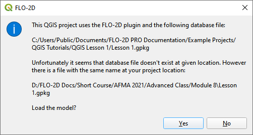

Step 2: Import shapefiles for storm drain features
--------------------------------------------------

1. Select the Layer Boundary Condition Points

2. Drag the 3 Shapefiles from Module 8 and drop the files in the map space.

3. \*The shapefiles should be located inside the User Layer group.

4. Clean up your screen a little if you want.

5. Uncheck Schema layers

6. Uncheck the Google Image

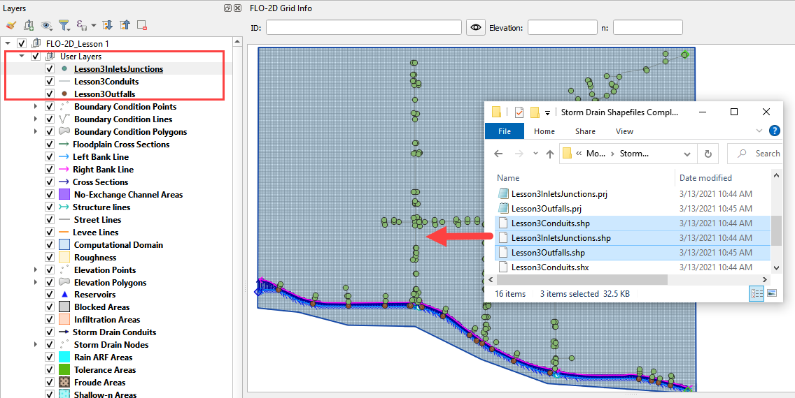

7. The shapefiles can be described as follow:

-  **Lesson3Outfalls.shp** is a point shapefile that contains the outfalls.

-  **Lesson3Conduits.shp** is a line shapefile that contains the pipes.

-  **Lesson3InletsJunctions.shp** is a point shapefile that contains the Inlets and Junctions.
  Inlets collect flow from the surface and their name should start with “I”, this is a requirement for all inlets from type 1 to 5, including manholes.

8. Check the Attribute Tables for the layers conduits, inlets/junctions, and outfalls.
   To do this right click each layer and then Click Attributes Table.

.. image:: ../img/Advanced-Workshop/Module261.png

.. image:: ../img/Advanced-Workshop/Module262.png

The following data must be available in the shapefile to create the **SWMM.INP** files and the associated storm drain data files: **SWMMFLO.DAT**,
**SWMMOUTF.DAT** and **SWMMFLORT.DAT**.

.. _`conduits`:

conduits:

Name

String

Upstream Inlet/Junction

String\* this can be dummy data.
It is auto assigned by the plugin.

Downstream Inlet/Junction

String\* this can be dummy data.
It is auto assigned by the plugin.

Inlet/Outlet Offset (not required)

Real precision 3

Shape

String

Number of Barrels

Integer

Max Depth (Diameter for circular)  (ft or m)

Real precision 3

Geom 2 (Width for rectangle) (ft or m)

Real precision 3

Geom 3 (ft or m)

Real precision 3

Geom 4 (ft or m)

Real precision 3

Length (ft or m)

Real precision 3

conduit roughness n

Real precision 4

Initial Flow (Not required) (cfs or cms)

Real precision 3

Maximum Flow (Not required)  (cfs or cms)

Real precision 3

Entry Loss Coef (Not required)

Real precision 3

Exit Loss Coef (Not required)

Real precision 3

Average Loss Coef (Not required)

Real precision 3

Flap Gate

Integer

.. list-table::
   :widths: 33 33 33
   :header-rows: 0

   * - **INLETS/JUNCTIONS**
     - Name
     - String

   * -
     - Type
     - Integer

   * -
     - Invert Elevation (ft or m)
     - Real precision 3

   * -
     - Maximum Depth (ft or m)
     - Real precision 3

   * -
     - Initial Depth (Not required) (ft or m)
     - Real precision 3

   * -
     - Surcharge Depth (Not required) (ft or m)
     - Real precision 3

   * -
     - Length/Perimeter (ft or m)
     - Real precision 3

   * -
     - Width/Area (see manual for units)
     - Real precision 3

   * -
     - Height/Sag/Surcharge Depth (ft or m)
     - Real precision 3

   * -
     - Weir Coefficient
     - Real precision 3

   * -
     - Feature (Not required)
     - Integer

   * -
     - Curb Height (Not required)
     - Real precision 3

   * -
     - Clogging Factor (Not required)
     - Real precision 3

   * -
     - Time for Clogging (Not required)
     - Real precision 3

   * - **OUTFALLS**
     - Name
     - String

   * -
     - Invert Elevation (ft or m)
     - Real precision 3

   * -
     - Flap Gate
     - Integer or String 0/1 or yes/no

   * -
     - Allow Discharge Switch
     - Integer

   * -
     - Outfall Type
     - Integer

   * -
     - Water Depth (Not required) (ft or m)
     - Real precision 3

   * -
     - Tide Curve (Not required)
     - String

   * -
     - Time Series (Not required)
     - String

Step 3. Add missing columns to shapefiles
-----------------------------------------

1. Open the attributes for any storm drain shapefile.

2. Click the Edit pencil and the Add Field button.

.. image:: ../img/Advanced-Workshop/Module263.png

3. Using the tables in **Step 2**, add a field or two to the shapefiles.

4. In this example a new field called Geom 2 is a real or float and has 7 length and 3 precision.

5. See how the length and precision works.
   I cannot add more than 4 number places or 3 decimal places.

6. Length is the total length (not including “.”) of the number and precision is the number of decimals.

.. image:: ../img/Advanced-Workshop/Module264.png

7. This is the end of the lesson.
   Keep adding fields until the class continues.
   It’s OK to leave them blank because they won’t be used in the next module.

Module 9 – Storm Drain Schematize
=================================

**Overview**

This lesson will outline how to construct a storm drain network that is ready for FLO-2D Plugin to process.

.. _required-data-10:

Required Data
=============

The required data is in Module 8 and Module 9

================== =================
**File**           **Content**
================== =================
Point shapefile    Inlets/Junctions
Polyline shapefile Conduit
Point shapefile    Outfalls
\*.qgz             Project file
\*.gpkg            Geopackage file
\*.txt             Rating table file
================== =================

Step 1: Select components from shapefile layer
----------------------------------------------

1. Display the Storm Drain Editor widget and click the Select components from shapefile layer button.

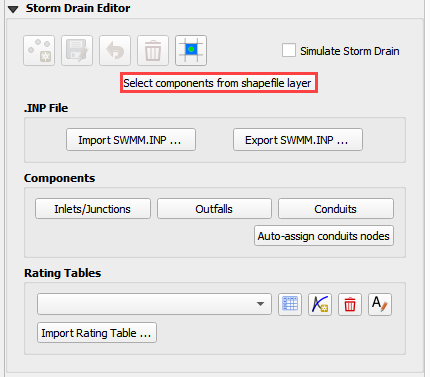

2. Use the Editor to assign the Inlets/Junctions parameters from the shapefile to the attribute table.

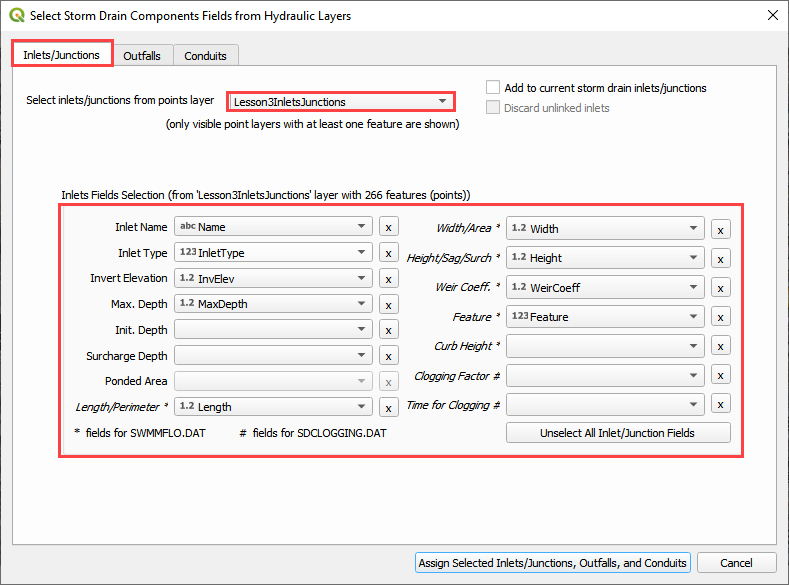

.. image:: ../img/Advanced-Workshop/Module267.png

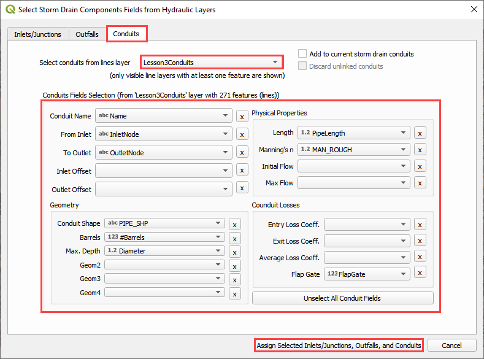

3. Once all features are assigned, click on Assign Selected Inlets/Junctions, Outfalls and Conduits to create the data structures of the Storm Drain
   Components.

4. The following message will be displayed.
   Click OK.

.. image:: ../img/Advanced-Workshop/Module269.png

Step 2: Calculate the conduit node connections
----------------------------------------------

1. Display the Storm Drain Editor widget and click on *Inlets/Junctions.*

2. Click the Simulate Storm Drain check box.

3. Click the Auto-assign conduits nodes button.
   This step will fill the upstream and downstream node connections between conduits.
   In order for this step to be successful, the conduits must be oriented from upstream to downstream.
   See the arrows on the conduits.

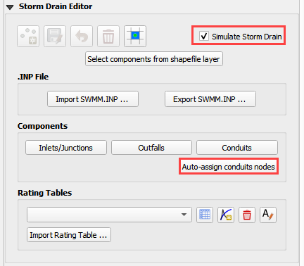

Step 3: Import Rating Tables
----------------------------

1. Click the Import Rating Table Button

.. image:: ../img/Advanced-Workshop/Module271.png

2. Navigate to the I4 table with this path.
   Select the file and click Open.
   It should be in Module 8 Shapefile Folder.

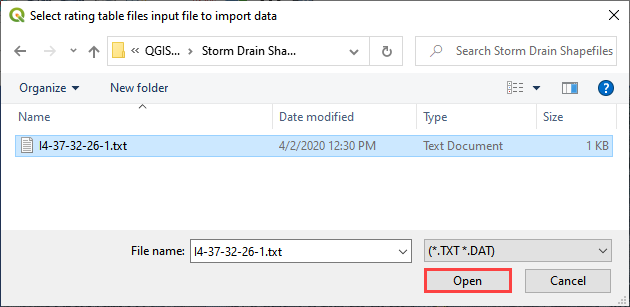

3. The table was imported and assigned to the correct inlet node.

.. image:: ../img/Advanced-Workshop/Module273.png

Step 4: Schematize storm drain components
-----------------------------------------

1. Click on Schematize Storm Drain Components in the Storm Drain Editor widget.

.. image:: ../img/Advanced-Workshop/Module274.png

2. Once the storm drain components are schematized, the following dialog will appear.
   Click OK to close.

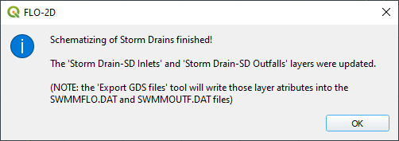

3. The storm drain schematized data layers have been completed and the atribute tables can be reviewed in the Storm Drain layers: Inlets and Outfalls.

4. The storm drain components are now part of the shematized layers in the project.

.. image:: ../img/Advanced-Workshop/Module276.png

Step 5: Export SWMM.INP file
----------------------------

1. Check the *Simulate Storm Drain* check box.

2. Click on *Export SWMM.INP* button in the **Storm Drain Editor** widget.

.. image:: ../img/Advanced-Workshop/Module277.png

3. Browse to the Project Folder and Save the **SWMM.INP** file.
   The \*.INP file should be named as ‘SWMM.INP’, no other names will be read by FLO-2D model.
   Click *Save*.

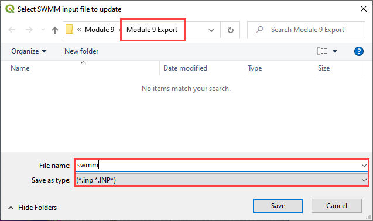

4. The *Storm Drain Control Dialog* is displayed.

5. The control parameters can be entered.

6. The time, date, flow units and other data are hardwired from the FLO-2D surface Control Dialog.

7. All gray out data in the control dialog is hardwired.

8. The data is default for FLO-2D.
   The report_step can be set to any desired value.

.. image:: ../img/Advanced-Workshop/Module279.png

9. A dialog displays stating the features that were written to the \*.INP file.
   Click *OK*.

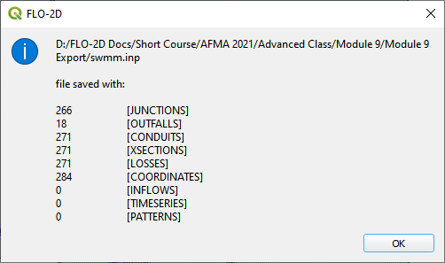

Step 6: Export the project
--------------------------

1. The files that connect inlets and outfalls with the FLO-2D surface layer are created when the GDS Data Files are exported.

.. image:: ../img/Advanced-Workshop/Module281.png

2. Click the *Set* *Control Variable* icon and enter the data in the FLO-2D Toolbar.
   The following dialog will be displayed, make sure the *Storm Drain* component switch is selected.
   Click *Save*.

.. image:: ../img/Advanced-Workshop/Module282.png

3. This is a good point to save project.

.. image:: ../img/Advanced-Workshop/Module046.png

4. Export the data files to the Project Folder in Module 9 Export Folder.

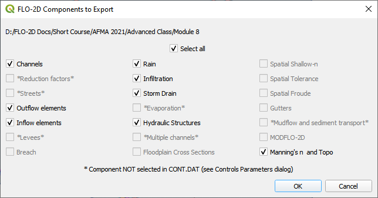

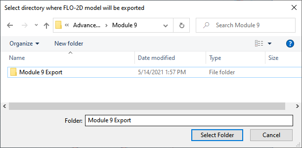

5. All GDS Data files will be created in the selected project folder, including **SWMMFLO.DAT, SWMMFLORT.DAT,** and **SWMMOUTF.DAT** files.

6. The following dialog will be displayed, associated storm drain data files are created when the storm drain switch has been turned ON.

.. image:: ../img/Advanced-Workshop/Module286.png

Step 7: Run the simulation
--------------------------

1. Click the *Run FLO-2D* Icon.

.. image:: ../img/Advanced-Workshop/Module287.png

2. Correct the paths and click OK to start the simulation.

.. image:: ../img/Advanced-Workshop/Module288.png

3. While the Storm Drain model is running, review FLO-2D Storm Drain Manual Chapter 6 for more details about reviewing results.
   It is found here:

C:\Users\Public\Documents\FLO-2D PRO Documentation\flo_help\Manuals\FLO-2D Storm Drain Manual Build 19.pdf

.. |Module289| image:: ../img/Advanced-Workshop/Module289.png

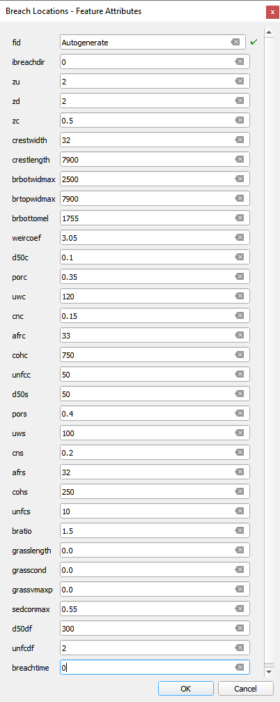
