Module 2 Part I – Hydraulic Structures
======================================

Advanced class attendees.
Skip this lesson.
It is here for you to peruse.

**Overview**

This tutorial outlines the process of creating hydraulic structures with rating tables and generalized culvert equations.
This lesson needs a channel so please use the data from QGIS Lesson 2, 3, or 4 to run through this tutorial.
Finish Lesson 2 before performing the following steps.

.. _required-data-1:

Required Data
-------------

The required data is in Module 1 and 2.

.. _`file`:

file:

**Content**

.. _`\.shp`:

\.shp:

Hydraulic Structures

\\Example Projects\QGIS Tutorials\QGIS Lesson 6 PRO

.. _`\.txt`:

\.txt:

Culvert Tables

Check these folders to ensure the data is available before starting the lesson.

Step 1: Setup the project
-------------------------

1. Start with the project from Lesson 2, 3, or 4 Complete.

2. If necessary, load it into QGIS.

3. Open QGIS and drag the lesson 1.qgz file into the project.

4. Save the project.

.. image:: ../img/Advanced-Workshop/Module031.png

Step 2: Import data
-------------------

Start by cleaning up the map space so the next layer will be easy to see.

1. Uncheck the User Left bank, Right Bank Cross section layers;

2. Uncheck the Blocked Areas;

3. Uncheck the Storm Drain User Layers;

4. Click the User Boundary Conditions Layer;

5. Drag the Hydraulic Structures onto the map space.

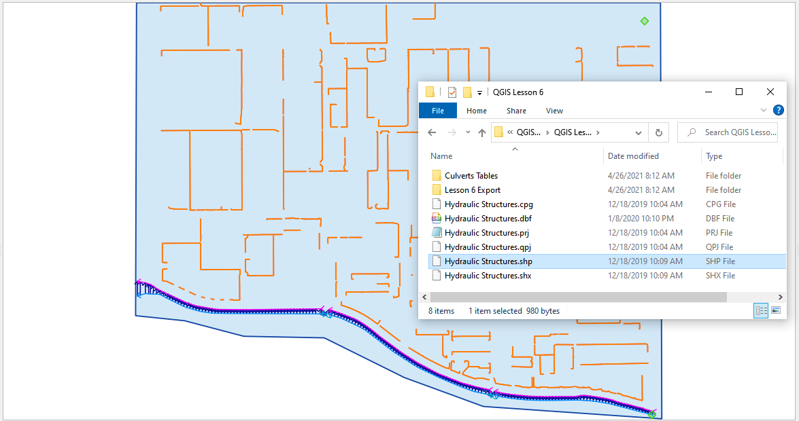

Step 3: Format the data layers
------------------------------

1. Open the Attributes Table on the Hydraulic Structures Layer.

2. Select structure 130, and 131 and click Zoom map to selected rows button.
   This will zoom your map to these two structures.

.. image:: ../img/Advanced-Workshop/Module034.png

3. Label the Hydraulic Structures Layer.

4. Double click the Hydraulic Structures layer

5. Set the Labels like the following image.

6. This allows you to see which culvert you are working on.

.. image:: ../img/Advanced-Workshop/Module035.png

7. Change the layer Symbology

8. Change the selector to Symbology

9. Set the Symbol Layer Type to Arrow

10. Uncheck Curved Arrows

11. This will show you the flow direction of each structure.

.. image:: ../img/Advanced-Workshop/Module036.png

Step 4: Build the structures into the User Layers.
--------------------------------------------------

1. Use the Structure Editor to add all of the new structures.

2. Digitize all of the structures.

3. Click the Save icon to confirm that you are finished with the digitizing tool.

.. image:: ../img/Advanced-Workshop/Module037.png

**Digitizing process:**

4. Left click the inlet node (upstream node)

5. Left click the outlet node (downstream node)

6. Right Click to finish the polyine.
   Click OK to finish the feature.

.. image:: ../img/Advanced-Workshop/Module038.png

Step 5: Assign the structure attributes
---------------------------------------

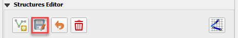

1. Click Save in the Structures Widget to load the data into the dialog box.

**Complete the Structure Fields**

2. Load the Hydraulic Structures Attribute table.
   The attributes will help fill out each structure table.

3. Check the center button.

4. Select the first structure.

5. Rename the Structure with the “A” button.

6. Fill the Type and Rating fields

7. Move to the next structure and repeat the process.

.. image:: ../img/Advanced-Workshop/Module040.png

.. image:: ../img/Advanced-Workshop/Module041.png

8. Schematize the structure data.

Step 6: Assign the rating tables
--------------------------------

1. Click the Import Rating Tables button

.. image:: ../img/Advanced-Workshop/Module042.png

7. Select the rating tables from the project folder.

8. Click open.

.. image:: ../img/Advanced-Workshop/Module043.png

9. The data has been imported.
   If you can’t see it, switch to a different structure.

.. image:: ../img/Advanced-Workshop/Module044.png

Step 7: Schematize the data
---------------------------

.. image:: ../img/Advanced-Workshop/Module041.png

1. Schematize the structure data and click **Yes** to replace the data.

.. image:: ../img/Advanced-Workshop/Module045.png

Step 8: Save, export, and run
-----------------------------

1. This is a good point to save project.
   Refer to Step 9 in Lesson 1.

.. image:: ../img/Advanced-Workshop/Module046.png

2. Export the data files to the Project Folder in QGIS Lesson 6 Export.

3. All GDS data files will be created in the selected project folder.

.. image:: ../img/Advanced-Workshop/Module048.png

.. image:: ../img/Advanced-Workshop/Module049.png

4. The swmm.inp file was not exported. Copy it from Lesson 3 Export folder or export it again using the Storm Drain Editor.

.. image:: ../img/Advanced-Workshop/Module050.png

5. Click the *Run FLO-2D* Icon.

.. image:: ../img/Advanced-Workshop/Module051.png

6. Set the Project path and the FLO-2D Engine Path and click *OK* to start the simulation.

.. image:: ../img/Advanced-Workshop/Module052.png

Module 2 Part II – Advanced Hydraulic Structures
================================================

**Overview**

In part 2, the data from the previous lesson is extended with a new generalized culvert equation.

.. _required-data-2:

Required Data
=============

The required data is in Module 1 and 2

======== ===========================
**File** **Content**
======== ===========================
\*.qgz   Project files from Module 1
\*.gpkg  Geopackage from Module 1
\*.tif   Elevation file
======== ===========================

.. _step-1-setup-the-project-1:

Step 1: Setup the project
-------------------------

1. Start with the project from Module 1 Lesson 1.qgz.
   This is the completed project from the previous class.
   FLO-2D Self-Help.

2. Open QGIS and drag the lesson 1.qgz file into the project.

3. Save the project.

.. image:: ../img/Advanced-Workshop/Module031.png

Step 2: Simplify the map
------------------------

1. Turn off unnecessary layers

   - Blocked Areas

   - Storm drain conduits

   - Storm drain nodes

   - Storm Drain group

   - Levee Lines

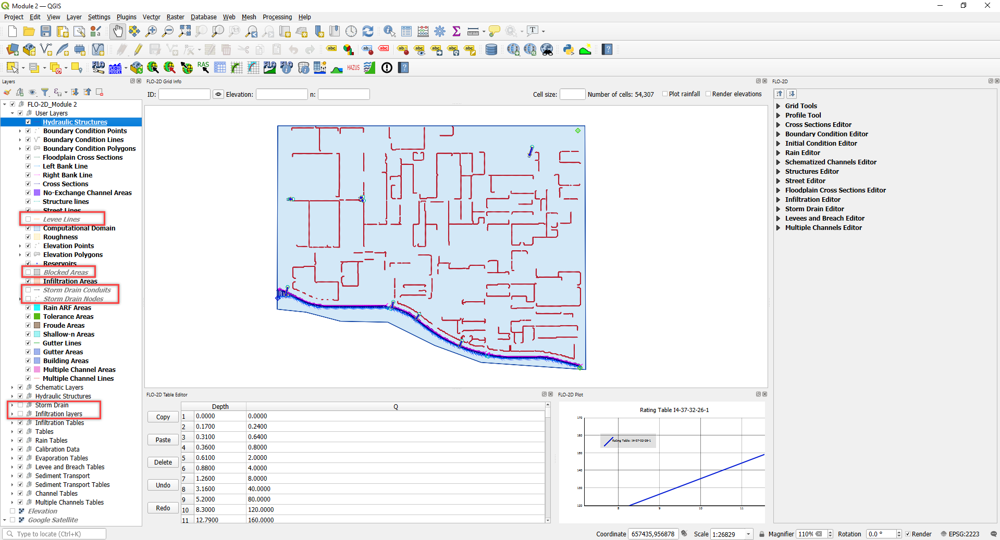

Step 3: Build a new structure
-----------------------------

1. Zoom to the northwest basin as shown by the yellow box.

2. Find the culvert in the green box.

.. image:: ../img/Advanced-Workshop/Module054.png

3. Open the Structures widget.

4. Click the Digitize polyline tools.

.. image:: ../img/Advanced-Workshop/Module055.png

5. Click the east side of the structure and then click the west side of the structure.

6. Right click to close the polyline and click OK to close the dialog.

.. image:: ../img/Advanced-Workshop/Module056.png

Step 4: Measure the culvert length
----------------------------------

1. Click the measure tool.

.. image:: ../img/Advanced-Workshop/Module057.png

2. Measure the length of the culvert from the upstream headwall to the downstream headwall.

.. image:: ../img/Advanced-Workshop/Module058.png

3. Click the Save button and enter the data into culvert.

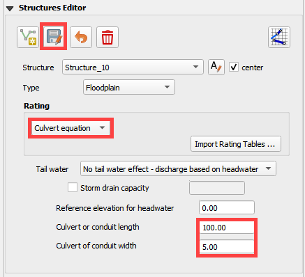

Step 5: Complete the structure data and schematize.
---------------------------------------------------

1. Fill the remaining data in the FLO-2D Table Editor.
   Use the Data Input Manual to learn the parameters.

.. image:: ../img/Advanced-Workshop/Module060.png

2. Typec = 1 box

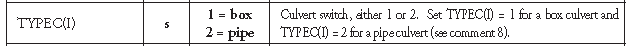

3. Typeen = 1

.. image:: ../img/Advanced-Workshop/Module062.png

4. Culvertn = 0.020

5. KE = 0.50

6. Cubase = 8ft

7. Finish the structure by clicking the schematize button.

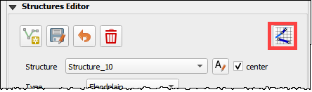

Step 6: Correct invert elevation
--------------------------------

1. Select the Google Satellite layer.

2. Drag the elevation file onto the map.

3. The Elevation.tif file is in Module 2 or QGIS Lesson 1.

.. image:: ../img/Advanced-Workshop/Module064.png

4. Use the ID tool to find the invert elevation of the upstream side of the culvert.

.. image:: ../img/Advanced-Workshop/Module065.png

5. The elevation of the culvert is 1990.29 ft.

6. Create a feature in the Elevation Polygon layer and assign the corrected elevation to that feature.

   - Select the elevation polygon layer.

   - Click edit pencil and the Add Polygon Feature button.

.. image:: ../img/Advanced-Workshop/Module066.png

- Add a polygon to the grid that needs adjustment.

- Right click to close the polygon and fill the form.

- It is only necessary to cover the centroid with this polygon.

- Click OK to close the form.

.. image:: ../img/Advanced-Workshop/Module067.png

7. Collapse the FLO-2D Widgets.

8. Open the Grid widget.

9. Click the Correction Tool

.. image:: ../img/Advanced-Workshop/Module068.png

10. Click yes to save the changes.

.. image:: ../img/Advanced-Workshop/Module069.png

11. Select the User Layer Mode.

12. Click the Elevation Polygon Attributes check box.

13. Click OK to perform the calculation and OK once it is finished.

14. The cell elevation is now adjusted to the correct culvert invert.

.. image:: ../img/Advanced-Workshop/Module070.png

Step 7: Save, export, and run.
------------------------------

1. This is a good point to save project.

.. image:: ../img/Advanced-Workshop/Module046.png

2. Export the data files to the Advanced Class Folder Module 2 Export.

.. image:: ../img/Advanced-Workshop/Module071.png

.. image:: ../img/Advanced-Workshop/Module072.png

.. image:: ../img/Advanced-Workshop/Module073.png

3. Go to the Storm Drain Widget and Export the swmm.inp file.

4. Collapse all widgets.

5. Open Storm Drain widget.

6. Click Export SWMM.INP… button

.. image:: ../img/Advanced-Workshop/Module074.png

7. Find the Module 2 Export.

8. Name the file swmm.inp and click Save.

.. image:: ../img/Advanced-Workshop/Module075.png

9. Click OK to close both windows.

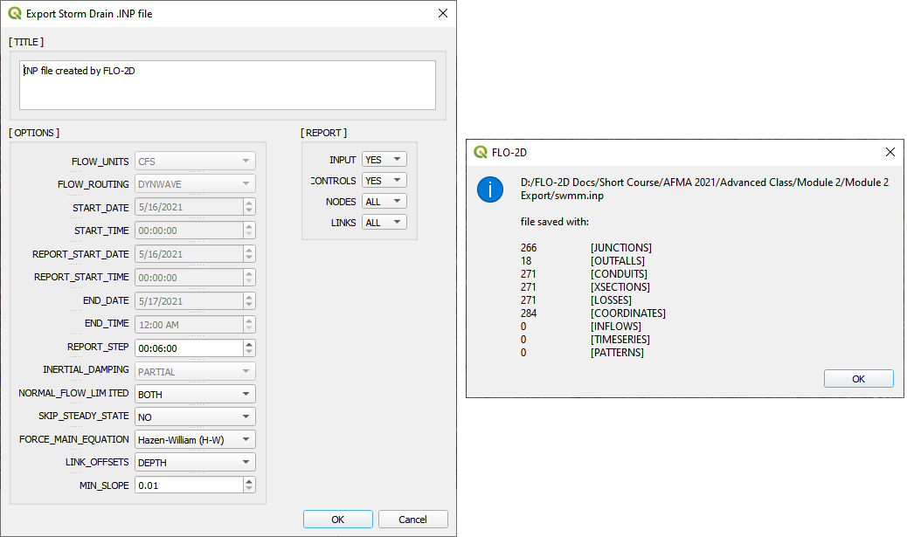

10. Click the Run FLO-2D Icon.

.. image:: ../img/Advanced-Workshop/Module051.png

11. Correct the Paths and click OK to start the simulation.

.. image:: ../img/Advanced-Workshop/Module077.png

Module 2 Part III – Bridge Hydraulic Structure
==============================================

**Overview**

In this tutorial, the bridge variables are added to a hydraulic structure.

.. _required-data-3:

Required Data
-------------

The required data is in Module 2 Bridge Tutorial.
This is a new project.
Please save and close the previous QGIS.

======== ======================================
**File** **Content**
======== ======================================
\*.qgz   QGIS data files
\*.gpkg  FLO-2D Geopackage
\*.tif   Bridge asbuilt files
\*.DAT   Bridge coefficients and cross sections
======== ======================================

Citation List for this Tutorial:

Hamill, L., 1999.
Bridge Hydraulics, E & FN Spon, NY.

Step 1: Load the project
------------------------

1. Start with the project from Module 2 Bridge Tutorial

2. If necessary, load it into QGIS.
   Open QGIS and drag the Bridge Tutorial.qgz file into the project.

3. Save the project.

.. image:: ../img/Advanced-Workshop/Module078.png

Step 2: Define the bridge variables and coefficients
----------------------------------------------------

Bridge variables and coefficients are defined by the USGS method for calculating discharge through a bridge.
Hamill defines this approach in his book on bridge hydraulics (1999).
O’Brien describes how to apply these variables to FLO-2D in a white paper called Bridge Hydraulics Component (2019).
This tutorial will show how to estimate or calculate the required variables for a real project setup.

This bridge in Simi Valley, CA crosses Arroyo Simi at Tapo St.
It appears to have vertical embankments and abutments.

Plan view parameters
--------------------

.. image:: ../img/Advanced-Workshop/Module079.png

b = 66 ft measured from QGIS map

L = 70 ft measured from QGIS map

w = 5 ft measured from QGIS map

L\ :sub:`1-2` = 177 ft measured from QGIS map

Profile parameters
------------------

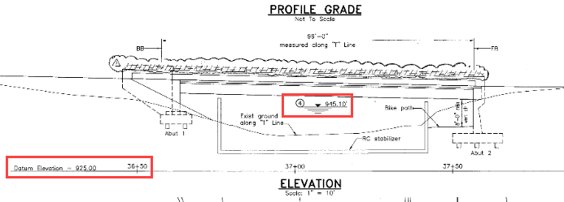

Z = 9.23 ft

Abutment left elevation = 941 ft

Abutment right elevation = 937.74

Average low chord = 937.4 ft

Average bridge deck elevation = 953.4 ft

Deck weir length = 114 ft

Bridge opening ratio
--------------------

1. Calculate M = q/Q = 0.83 = Discharge through bridge opening/pre-structure discharge)

q = 8600 cfs at normal depth = 8.06

Q = 10325 cfs at normal depth 8.06

.. image:: ../img/Advanced-Workshop/Module081.png

.. image:: ../img/Advanced-Workshop/Module082.png

Bridge tables
-------------

This bridge is a Type I: Vertical embankments and abutments.

M =0.83 = q/Q = (8600/10325 calculated from sdsu open channel calc)

C’ = 0.94 derived from table a (L/b = 70/66 = 1.06, M = 0.83)

k\ :sub:`F` = 1.10 derived from table b (F calculated with open channel calc = 1.0)

k\ :sub:`w` = 1.05 derived from table e (w/b = 5/66 = 0.076)

k\ :sub:`ɸ` = 1.00 derived from table g (angle = 10°)

Z = 9.23 ft (bridge low chord to channel bed)

Yu = 8.061 ft (normal depth upstream at 100yr discharge.)

No submergence at 100 yr discharge.

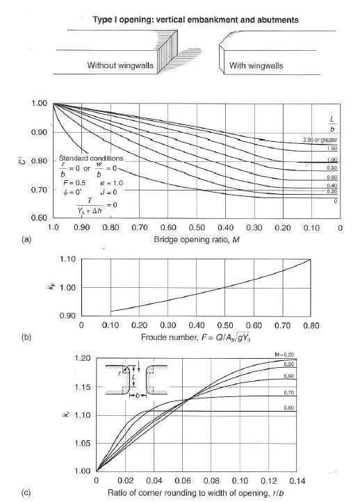

Type 1 Bridge Opening (from Hamill, 1999; p.
111, Figure 4.3)

.. image:: ../img/Advanced-Workshop/Module084.jpg

Type 1 Bridge Opening cont.
(from Hamill, 1999; p.
112, Figure 4.3)

Bridge variables dialog
-----------------------

1. Fill the table from the preceding instructions.

2. Click ok to close this form.

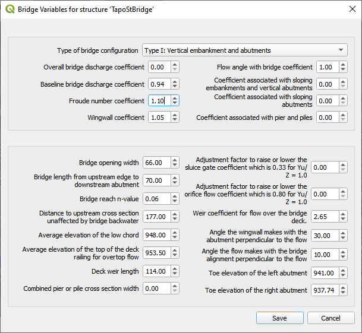

3. Click the Schematize button on the Structure editor.

.. image:: ../img/Advanced-Workshop/Module086.png

Step 3: Build the cross section data
------------------------------------

.. image:: ../img/Advanced-Workshop/Module087.png

1. [CHART]The cross section data for L\ :sub:`1-2` is taken from the cross section table of Cross-Section-60 and the Bridge cross section estimated based
   on the geometry of the bridge.

====== ====== ======
X      6657
====== ====== ======
0.00   957.08 954.11
4.00   957.15 953.48
10.01  957.16 952.04
20.02  954.13 949.50
22.02  953.38 944.24
28.03  950.24 942.80
32.04  948.06 940.84
38.04  945.23 938.81
42.05  943.70 937.43
46.05  942.41 937.30
50.06  942.23 937.31
62.07  941.52 937.26
70.08  941.74 937.31
78.09  944.95 937.26
84.09  948.11 937.23
86.10  948.47 937.34
88.10  949.16 937.69
94.11  951.27 939.68
102.12 955.43 942.52
110.12 956.13 945.75
112.13 955.87 945.87
118.13 955.86 948.39
120.14 955.90 954.00
====== ====== ======

2. Create a text file called BRIDGE_XSEC.DAT.

3. Copy the table above into the text file.

4. Replace the tabs with spaces using this method:

   - Select a tab.

   - Ctrl-H or Edit Replace

   - Add a few spaces into the Replace with field.

   - Click Replace All.

   - Save the file.

5. This file would normally be copied to the export folder but there is already one in there.
   This is just to show the procedure.

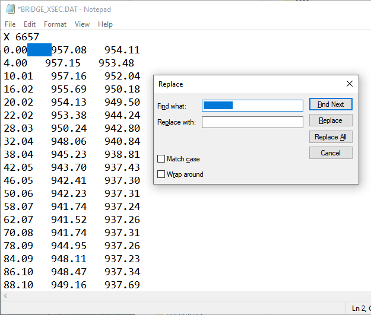

Step 4: Save, export and run.
-----------------------------

1. This is a good point to save project.

.. image:: ../img/Advanced-Workshop/Module046.png

2. Export the data files to the Project Folder in Module 2\Bridge Tutorial\Bridge Tutorial Export.

.. image:: ../img/Advanced-Workshop/Module089.png

.. image:: ../img/Advanced-Workshop/Module090.png

.. image:: ../img/Advanced-Workshop/Module091.png

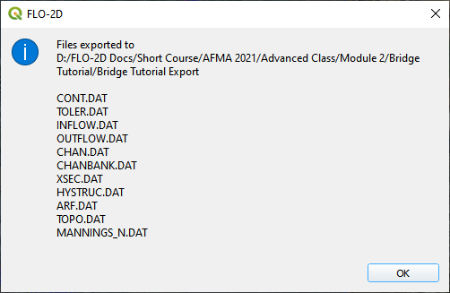

3. Click the Run FLO-2D Icon.

.. image:: ../img/Advanced-Workshop/Module051.png

4. Correct the paths and click OK to start the simulation.

.. image:: ../img/Advanced-Workshop/Module093.png