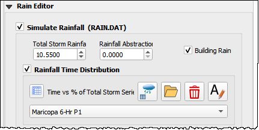
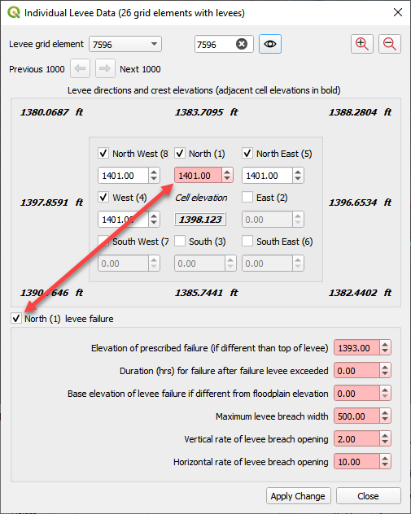
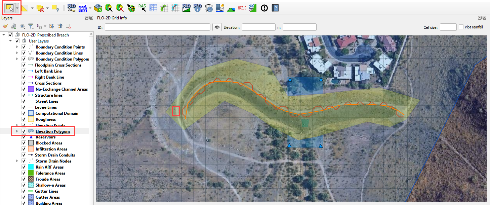
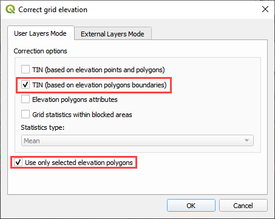
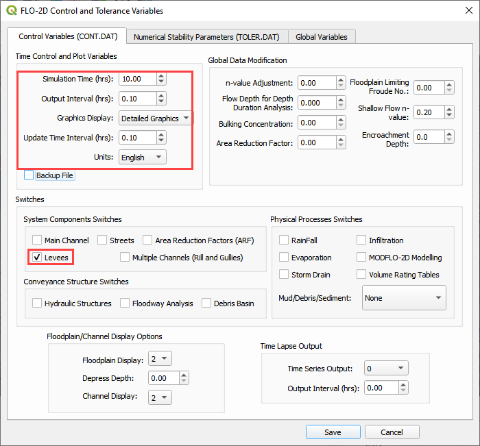
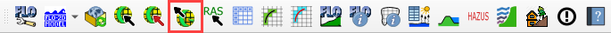
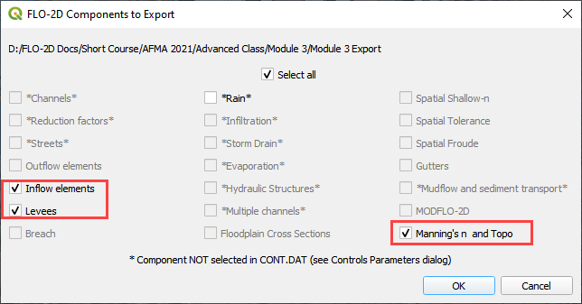
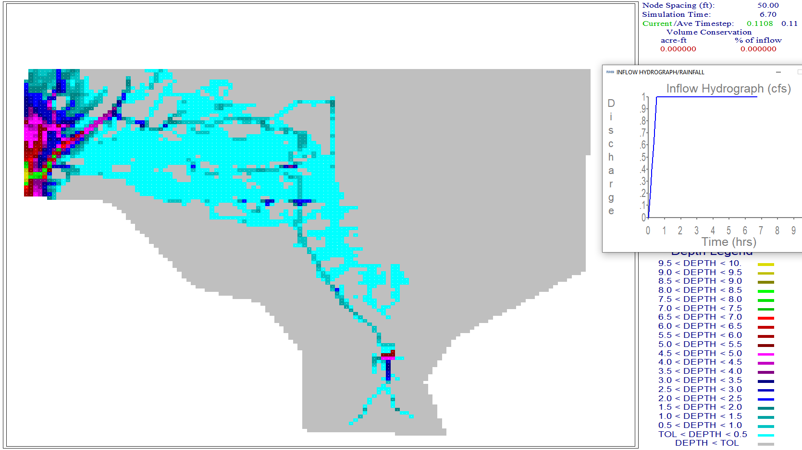

Module 3 – Prescribed Dam Breach
================================

**Overview**

In this tutorial, a simple dam breach with failure is created.
In this example, the reservoir is dry and so no bathymetry or stage volume is required.

.. _required-data-4:

Required Data
-------------

The required data is in Module 3.

======== =================
**File** **Content**
======== =================
\*.qgz   QGIS data files
\*.gpkg  FLO-2D Geopackage
\*.tif   Elevation file
\*.xml   Hydrography file
\*.pdf   Hydrology manual
======== =================

Citation List for this Tutorial:

Tomlinson, E.M., W.D.
Kappel, G.
Muhlestein, D.
Hulstrand, and T.
Parzybok, 2013.
Probable Maximum Precipitation Study for Arizona, Arizona Department of Water Resources, Phoenix, Arizona.

.. _step-1-load-the-project-1:

Step 1: Load the project
------------------------

1. Start with the project from Module 3 Prescribed Breach

2. Open QGIS and drag the Prescribed Breach.qgz file into the project.

3. Save the project.

.. image:: ../img/Advanced-Workshop/Module094.png

4. Click Yes to load the model.

Step 2. Load the aerial and hydrography
---------------------------------------

1. Click the Quick Map Services button and add a Google Map

.. image:: ../img/Advanced-Workshop/Module096.png

2. Click the Data Source Manager button and add a WMS/WMTS dataset.

.. image:: ../img/Advanced-Workshop/Module097.png

3. Select the Hydrograph

4. Click Connect

5. Highlight all layers

6. Click Add and Close this form

7. If the layer comes in white, set the transparency to 50% Global Opacity.

Step 3. Review hydrology
------------------------

Dam breach models will typically utilize the Probable Maximum Precipitation (PMP).
The data for these studies are typically created at the state or county level.
The Arizona Department of Water Resources has a document that will help determine uniform and spatial rainfall data for dam breach studies (Tomlinson
et al., 2013).
The PMP can be determined spatially using the PMP Evaluation Tool made for ArcGIS.

For the sake of simplicity, a value of 10.55 inches was sampled from Table 10.1 for a 6 hour local storm for a 1 mi2 basin in zone 2 near the Phoenix
area.

.. image:: ../img/Advanced-Workshop/Module100.png

(Source: Figure 10.7 and table 10.1 pg.
111 PMP Study for Arizona)

This value is used in the Uniform Rainfall editor along with the Maricopa 6-Hr P1 rainfall distribution curve.
This hydrology model is used to fill the reservoir or even get a high-water level for the dam.

Infiltration can also be applied to the watershed.
In this example, a simplified set of polygons are used to define Green-Ampt Infiltration.
Once these polygons are created, the Schematize Infiltration button will apply them to the grid.
Instead of the complex infiltration calculation parameters, the direct infiltration parameters are applied.
See the Global and Spatial variables below.

.. image:: ../img/Advanced-Workshop/Module102.png

Step 4. Set up the reservoir
----------------------------

1. Collapse the widgets.

2. Open the Initial Condition Editor widget.

.. image:: ../img/Advanced-Workshop/Module103.png

3. Click the create a reservoir button and click anywhere upstream of the dam.

4. Click the Save button and Schematize button to complete the Reservoir.

5. This will fill the reservoir when FLO-2D starts to run.

6. FLO-2D fills any contiguous cell to the prescribed water surface elevation.

.. image:: ../img/Advanced-Workshop/Module105.png

Step 5. Create the levee
------------------------

1. The levee line is already in the correct location and User Layer.

2. Click the Create Levees button.

.. image:: ../img/Advanced-Workshop/Module106.jpg

3. Check only User levee lines and click Create Schematic Layers from User Layers button.

.. image:: ../img/Advanced-Workshop/Module107.jpg

4. The following message states how many levees were created and how many levees have failure data.
   Click OK.

.. image:: ../img/Advanced-Workshop/Module108.jpg

5. Zoom in to the dam in the red rectangle below.

.. image:: ../img/Advanced-Workshop/Module109.jpg

Step 6. Define the breach
-------------------------

1. Click the collapse widgets button.

2. Click the Levees and Breach Editor widget.

3. Select the Prescribed Failure.

.. image:: ../img/Advanced-Workshop/Module110.png

4. Click the Grid Info Tool Button

.. image:: ../img/Advanced-Workshop/Module111.png

5. Click the cell marked in red below.
   This will become the location of the breach.

.. image:: ../img/Advanced-Workshop/Module112.png

6. Click the Levee Grid Elements button.

7. Type cell number into the Grid Element field and click the little eye.

.. image:: ../img/Advanced-Workshop/Module113.png

8.  Click inside the elevation field of the North direction.
    That will turn it a different color and select it as the “fail direction”.
    See the Pink field under the word North.

9.  Click the levee failure check box.

10. Set the fail data and click Apply Change and Close.

Step 7. Remove the dam elevation (method 1)
-------------------------------------------

1. Do you want to remove the entire structure? Complete Step 6.

2. Do you want to remove a thin slice? GoTo Step 7 (method 2)

3. Highlight the Elevation Polygon Layer

4. Click the Select button

5. Click the large blue polygon.

6. Click the Correct Grid Elevation button

.. image:: ../img/Advanced-Workshop/Module116.png

7. Choose the Tin(based on elevation polygon boundary) and Use only selected polygons check boxes and click OK.

Step 8. Remove the dam elevation thin slice (method 2)
------------------------------------------------------

1. Click the Elevation Polygon Layer

2. Click the Select button

3. Click the small blue polygon.

.. image:: ../img/Advanced-Workshop/Module118.jpeg

4. Click the Correct Grid Elevation button

.. image:: ../img/Advanced-Workshop/Module116.png

5. Choose the Tin(based on elevation points and polygons) and Use only selected polygons check boxes and click OK.

.. image:: ../img/Advanced-Workshop/Module119.png

6. Want to learn more about the Elevation Correction tool? Goto the Plugin User Manual version 2021.

Step 9. Export and run the model
--------------------------------

1. Click the Control Variable editor.

.. image:: ../img/Advanced-Workshop/Module120.png

2. Set the control parameters and turn on the levee switch.

3. Set the Numerical Stability Parameters.
   Click Save to close.

.. image:: ../img/Advanced-Workshop/Module122.png

4. Export the FLO-2D Data files.
   Click OK.

5. Select the Module 3 Export folder.

.. image:: ../img/Advanced-Workshop/Module125.png

6. The data is ready to run.

.. image:: ../img/Advanced-Workshop/Module126.png

7. Correct the paths and click OK to start the simulation.

.. image:: ../img/Advanced-Workshop/Module127.png

The breach ends up in the northeast corner of the study area.

A review of the map shows that there is potential for the water to cross the highway and flow to the southwest.

Step 10. Add a culvert
----------------------

1. This dam is used for flood and sediment control.
   It has a perforated riser inlet to allow solids to settle and clear water to flow through the culvert.

2. A site visit would answer any question about this structure, but some simple assumptions will work fine for the purpose of understanding how FLO-2D
   setup will use the data.

3. In this case a head reference elevation can be used so that the water must achieve a specific elevaton before the culvert will allow discharge.

4. Using the ID tool on the elevation raster shows that the ground elevation is 1373.22 ft.

.. image:: ../img/Advanced-Workshop/Module130.png

5. Estimating that the feature is around waist high means we can use a head reference elevation of 1376 ft for this inlet.

6. Collapse the widgets and click the structure editor.

7. Click Add a structure line and digitize a structure from the upstream side of the dam to the downstream side.
   Click Save to load the data into the table.

8. Finish the data in the Widget.

.. image:: ../img/Advanced-Workshop/Module132.png

9.  Go back to Step 9 and `export and run <#step-9.-export-and-run-the-model>`__ the model again.

10. Copy the Orifice data from the Excel File.

11. Select the first cell of the data table in QGIS and click the Paste Button.

.. image:: ../img/Advanced-Workshop/Module134.png

12. Click the Schematize Button.

.. image:: ../img/Advanced-Workshop/Module135.png

13. Turn on the Hydraulic Structures switch.

.. image:: ../img/Advanced-Workshop/Module136.png

Step 11. Downstream Boundary
----------------------------

1. Collapse the widgets and click the Boundary Condition Widget.

2. Click the create polygon button and digitize a polygon around the downstream boundary.

3. Click the Widget save button.

4. Set the Outflow side of the widget to Outflow.

5. Set the outflow type to 1.

6. Click the Schematize button.

Step 12. Common mistakes demo
-----------------------------

This section will demonstrate some common mistakes that users make when building breach models:

-  The reservoir node is water surface is too high or on the wrong side of the levee.

-  Levee components are not tied into the edge of the dam correctly.

-  Crest elevation is not defined correctly.

-  There is a hole in the levee where a direction was not assigned correctly.

-  The breach node is on the wrong side of the levee.

Bad reservoir or leaky levee component
--------------------------------------

1. Collapse the widgets and click the Initial Condition Editor.

2. Change the reservoir elevation to 1402.00 and click the Schematize button.
   This is 2ft higher than the dam.

.. image:: ../img/Advanced-Workshop/Module140.png

3. Repeat **Step 8** starting at Number 4.

4. This is the result.
   The reservoir was too high so it filled the whole project.

5. Don’t forget to set the elevation back before exiting from QGIS.

Dam elevation not removed
-------------------------

1. Collapse the widgets and click the Grid Tools.

2. Click the Sample Raster button.

3. Fill the form and click OK.
   The elevation file should be in Module 3.

.. image:: ../img/Advanced-Workshop/Module142.png

4. This procedure reset the elevation correction that was applied in Step 6 or 7.

5. Export and run the model by repeating **Step 8**.

6. Error message appears to alert that the breach elevation is lower than the dam elevation.
   This is an indication that something is wrong.

7. There is another more subtle indication that the dam elevation was not removed.
   In this case, the dam has not failed because the *dam elevation was not removed*.

