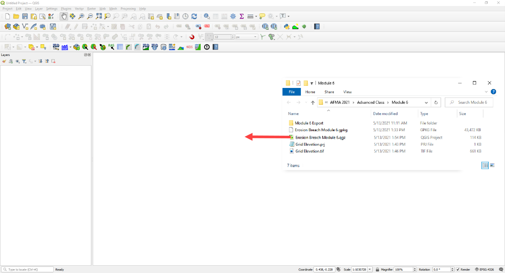
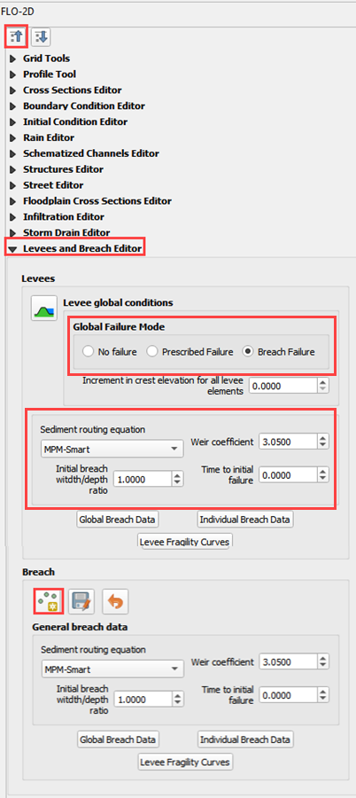

Module 6 – Erosion Dam Breach
=============================

**Overview**

In this tutorial, an erosion dam breach with failure is created.
In this instance, the reservoir is filled but the pre-reservoir elevation is known.

.. _required-data-7:

Required Data
=============

The required data is in Module 6.

======== =================
**File** **Content**
======== =================
\*.qgz   QGIS data files
\*.gpkg  FLO-2D Geopackage
\*.tif   Grid elevation
======== =================

.. _step-1-load-the-project-4:

Step 1: Load the project
------------------------

1. We are finished with the previous project.
   Save and close it.

2. Start with the project from Module 6.

3. If necessary, load it into QGIS.
   Open QGIS and drag the Erosion Breach Module 6.qgz file into the project.

4. Save the project.

5. Click Yes to load the model.

.. image:: ../img/Advanced-Workshop/Module223.png

Step 2: Initial conditions reservoir
------------------------------------

1. An initial condition is set to fill the reservoir when FLO-2D PRO.exe initiates the simulation.

2. Set up this condition in QGIS.

3. Click the collapse widgets button.

4. Open the Initial Condition Editor widget.

5. Click the add reservoir button.

.. image:: ../img/Advanced-Workshop/Module224.png

6. Place a reservoir node anywhere within the reservoir area and fill the form.
   Click ok to close the data.

.. image:: ../img/Advanced-Workshop/Module225.png

7. Click the Save button and the Schematize button on the widget.

8. This data is saved to the INFLOW.DAT file when the model is exported.

.. image:: ../img/Advanced-Workshop/Module226.png

Step 3: Review dam geometry
---------------------------

Crest width = 32 ft

Crest length = 7900 ft

Shell slope US and DS = 2

Core slope = 0.5

.. image:: ../img/Advanced-Workshop/Module227.png

.. image:: ../img/Advanced-Workshop/Module228.png

Step 4. Review dam material
---------------------------

Each variable is discussed in the Data Input Manual BREACH.DAT tab.
This data may be available from the original dam construction manual or from periodical safety reports.
Check with the dam owner, or dam safety agency for data.

==== =========== ==========================================
0.1  d50c        d50 core (mm)
==== =========== ==========================================
0.35 porc        porosity core ()
120  uwc         unit weight core (lb/ft\ :sup:`3`)
0.15 cnc         roughness n core
33   afrc        angle of internal friction core(degrees)
750  cohc        cohesive strength core (lb/ft\ :sup:`3`)
50   unfcc       sediment gradient ratio
50   d50s        d50 shell (mm)
0.4  pors        porosity shell ()
100  uws         unit weight shell (lb/ft\ :sup:`3`)
0.2  cns         roughness n shell
32   afrs        angle of internal friction shell (degrees)
250  cohs        cohesive strength shell (lb/ft\ :sup:`3`)
10   unfcs       sediment gradient ratio
0    grasslength grass length downstream face (in)
0    grasscond   grass condition downstream face (0 or 1)
0    grassvmaxp  maximum permissible velocity (fps)
300  d50df       d50 downstream face (mm)
2    unfcdf      sediment gradient downstream face
==== =========== ==========================================

Step 5. Review general breach parameters
----------------------------------------

Each variable is discussed in the Data Input Manual BREACH.DAT tab.

.. _`2500`:

2500:

brbotwidmax

Maximum width to constrict the bottom of the breach.

.. _`7900`:

7900:

brtopwidmax

Maximum width to constrict the top of the breach.

.. _`1755`:

1755:

brbottomel

start of breach elevation.
Sensitive to instability.
If unstable, set to 1 to 3 ft below the crest elevation.

.. _`3.05`:

3.05:

weircoef

weir coefficient

.. _`1.5`:

1.5:

bratio

Initial breach width to depth ratio.

.. _`0`:

0:

breachtime

Time the water surface elevation must last before the breach initiates.

Step 6. Create the breach point
-------------------------------

1. Identify a good breach location.
   You can choose any location you desire.

.. image:: ../img/Advanced-Workshop/Module229.png

2. Select a breach location. This location can represent a
   weak point on a dam.

   - Spillways

   - Stilling basins

   - Sag, deformation, or erosion

   - Boreholes

   - Ends points

3. Location is *not always* important.
   For large reservoirs flooding is a function of the volume not breach parameters.

4. It is important to start the breach from the correct side of the levee feature.

5. Put the breach point on the water side of the levee.

.. image:: ../img/Advanced-Workshop/Module230.png

6.  Click collapse FLO-2D widgets button.

7.  Click the Levees and Breach Editor widget.

8.  Click the create a breach point button.

.. image:: ../Advanced-Workshop/Module290.png

9.  Click the map where the breach should go and fill the table.

10. You can choose a good location based on engineering judgment.

11. The data is listed in step 3, 4 and 5.

12. Click OK to close the table.

13. If you mess up, Click Revert Breach Edits button and try again.

.. image:: ../img/Advanced-Workshop/Module231.png

14. Go to the next page.

15. Complete the breach data in the widget.

.. image:: ../img/Advanced-Workshop/Module232.png

Step 7. Export and run the model
--------------------------------

1. Export the FLO-2D Data files.
   Click OK.

.. image:: ../img/Advanced-Workshop/Module123.png

.. image:: ../img/Advanced-Workshop/Module233.png

2. Select the Module 6 Export folder.

.. image:: ../img/Advanced-Workshop/Module234.png

3. The data is ready to run.

.. image:: ../img/Advanced-Workshop/Module235.png

4. Correct the paths and click OK to start the simulation.

.. image:: ../img/Advanced-Workshop/Module236.png

Step 8. Review the data
-----------------------

1. These are the 3 data files that were created.

2. Levee.dat needed a Breach switch in Line 1.

3. Inflow.dat has a “dummy” inflow node.
   This allows graphics mode to function.

4. Inflow.dat has the reservoir elevation.
   When run initiates, FLO-2D will fill the reservoir.

5. Breach.dat stores the breach variables.

.. image:: ../img/Advanced-Workshop/Module237.png

