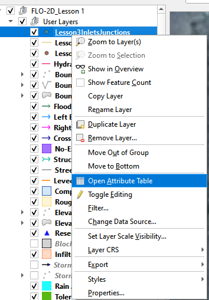
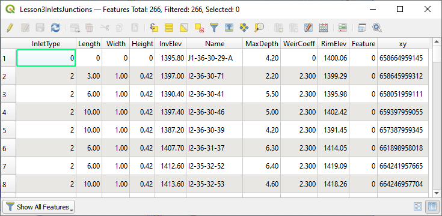
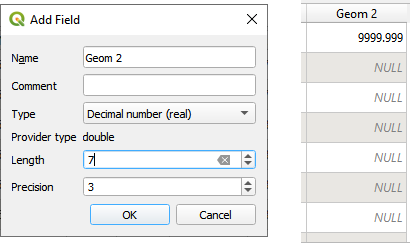

Module 8 – Storm Drain Shapefile Development
============================================

**Overview**

This lesson will outline how to construct a storm drain network that is ready for FLO-2D Plugin to process.

.. _required-data-9:

Required Data
=============

The required data is in Module 8.

================== ==========================
**File**           **Content**
================== ==========================
Point shapefile    Inlets/Junctions
Polyline shapefile Conduit
Point shapefile    Outfalls
\*.qgz             QGIS project from Module 8
\*.gpkg            Geopackage file
================== ==========================

.. _step-1-load-the-project-6:

Step 1: Load the project
------------------------

1. Start with the project from Module 8.

2. If necessary, load it into QGIS.
   Open QGIS and drag the Lesson 1.qgz file into the project.

3. Save the project.

.. image:: ../img/Advanced-Workshop/Module258.png

4. Click Yes to load the model.

.. image:: ../img/Advanced-Workshop/Module259.png

Step 2: Import shapefiles for storm drain features
--------------------------------------------------

1. Select the Layer Boundary Condition Points

2. Drag the 3 Shapefiles from Module 8 and drop the files in the map space.

3. The shapefiles should be located inside the User Layer group.

4. Clean up your screen a little if you want.

5. Uncheck Schema layers

6. Uncheck the Google Image

.. image:: ../img/Advanced-Workshop/Module260.png

7. The shapefiles can be described as follow:

-  **Lesson3Outfalls.shp** is a point shapefile that contains the outfalls.

-  **Lesson3Conduits.shp** is a line shapefile that contains the pipes.

-  **Lesson3InletsJunctions.shp** is a point shapefile that contains the Inlets and Junctions.
  Inlets collect flow from the surface and their name should start with “I”, this is a requirement for all inlets from type 1 to 5, including manholes.

8. Check the Attribute Tables for the layers conduits, inlets/junctions, and outfalls.
   To do this right click each layer and then Click Attributes Table.

The following data must be available in the shapefile to create the **SWMM.INP** files and the associated storm drain data files: **SWMMFLO.DAT**,
**SWMMOUTF.DAT** and **SWMMFLORT.DAT**.

.. _`conduits`:

conduits:

Name

String

Upstream Inlet/Junction

String\* this can be dummy data.
It is auto assigned by the plugin.

Downstream Inlet/Junction

String\* this can be dummy data.
It is auto assigned by the plugin.

Inlet/Outlet Offset (not required)

Real precision 3

Shape

String

Number of Barrels

Integer

Max Depth (Diameter for circular)  (ft or m)

Real precision 3

Geom 2 (Width for rectangle) (ft or m)

Real precision 3

Geom 3 (ft or m)

Real precision 3

Geom 4 (ft or m)

Real precision 3

Length (ft or m)

Real precision 3

conduit roughness n

Real precision 4

Initial Flow (Not required) (cfs or cms)

Real precision 3

Maximum Flow (Not required)  (cfs or cms)

Real precision 3

Entry Loss Coef (Not required)

Real precision 3

Exit Loss Coef (Not required)

Real precision 3

Average Loss Coef (Not required)

Real precision 3

Flap Gate

Integer

.. list-table::
   :widths: 33 33 33
   :header-rows: 0

   * - **INLETS/JUNCTIONS**
     - Name
     - String

   * -
     - Type
     - Integer

   * -
     - Invert Elevation (ft or m)
     - Real precision 3

   * -
     - Maximum Depth (ft or m)
     - Real precision 3

   * -
     - Initial Depth (Not required) (ft or m)
     - Real precision 3

   * -
     - Surcharge Depth (Not required) (ft or m)
     - Real precision 3

   * -
     - Length/Perimeter (ft or m)
     - Real precision 3

   * -
     - Width/Area (see manual for units)
     - Real precision 3

   * -
     - Height/Sag/Surcharge Depth (ft or m)
     - Real precision 3

   * -
     - Weir Coefficient
     - Real precision 3

   * -
     - Feature (Not required)
     - Integer

   * -
     - Curb Height (Not required)
     - Real precision 3

   * -
     - Clogging Factor (Not required)
     - Real precision 3

   * -
     - Time for Clogging (Not required)
     - Real precision 3

   * - **OUTFALLS**
     - Name
     - String

   * -
     - Invert Elevation (ft or m)
     - Real precision 3

   * -
     - Flap Gate
     - Integer or String 0/1 or yes/no

   * -
     - Allow Discharge Switch
     - Integer

   * -
     - Outfall Type
     - Integer

   * -
     - Water Depth (Not required) (ft or m)
     - Real precision 3

   * -
     - Tide Curve (Not required)
     - String

   * -
     - Time Series (Not required)
     - String

Step 3. Add missing columns to shapefiles
-----------------------------------------

1. Open the attributes for any storm drain shapefile.

2. Click the Edit pencil and the Add Field button.

.. image:: ../img/Advanced-Workshop/Module263.png

3. Using the tables in **Step 2**, add a field or two to the shapefiles.

4. In this example a new field called Geom 2 is a real or float and has 7 length and 3 precision.

5. See how the length and precision works.
   I cannot add more than 4 number places or 3 decimal places.

6. Length is the total length (not including “.”) of the number and precision is the number of decimals.

7. This is the end of the lesson.
   Keep adding fields until the class continues.
   It’s OK to leave them blank because they won’t be used in the next module.

