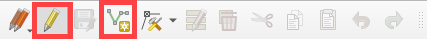
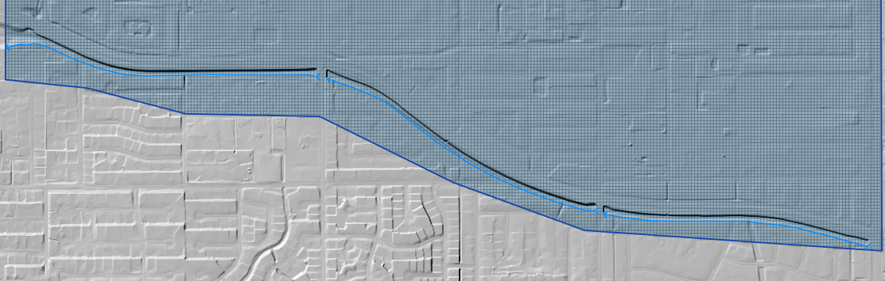
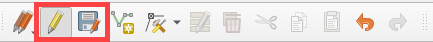
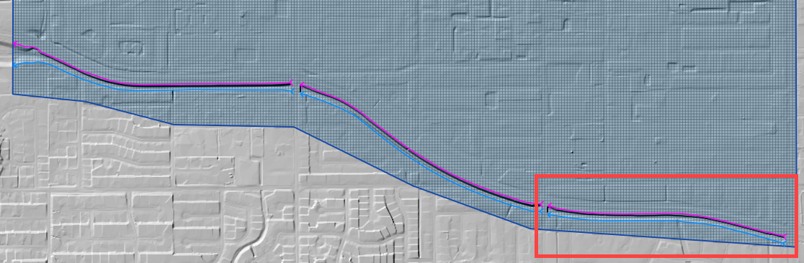
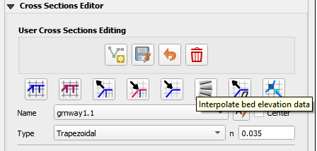
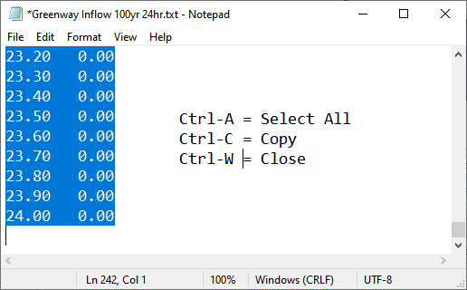
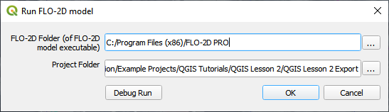

Module 10 - Advanced Channel Modeling
======================================

Overview
________

Complete QGIS Lesson 1 before starting this lesson.
Use Lesson 2 to build an urban drainage channel and add culverts to the channel.

Required Data
_____________

The lesson makes use of the original data from Lesson 1, left bank, right bank, and cross section data, and culvert rating tables.
Start from the end of Lesson 1.
All data is provided in the Lesson folders.

.. list-table::
   :widths: 33 33 33
   :header-rows: 0

   * - **File**
     - **Content**
     - **Location**

   * - QGIS Lesson 1.gpkg
     - FLO-2D GeoPackage
     - \\QGIS Lesson 1

   * - QGIS Lesson 1.qgz
     - QGIS file
     - \\QGIS Lesson 1

   * - Grnway Inflow 24 hr100yr.txt
     - Inflow hydrograph
     - \\QGIS Lesson 2

   * - \*.txt
     - Culvert rating tables
     - \\QGIS Lesson 2\\Hydraulic Structures

Project Location C:\\Users\\Public\\Documents\\FLO-2D PRO Documentation\\Example Projects\\QGIS Tutorials

This video will get through Step 9.  The second video is linked to Step 10.

.. youtube:: iPdn6yWuwPA

Step-by-Step Procedure
______________________

To setup a FLO-2D flood simulation use these steps.

1.  Open Lesson 1;

2.  Digitize left banks;

3.  Digitize right banks;

4.  Digitize cross sections;

5.  Complete cross section attributes;

6.  Sample elevation;

7.  Schematize channel;

8.  Revise Bank Alignment;

9.  Interpolate channel;

10.  Channel In/Out condition;

11. Create culverts;

12. Set up control parameters and Export Project;

13. Run the FLO-2D model.

Step 1: Open Lesson 1 in QGIS
-----------------------------

1. Search the start menu and run the “QGIS Desktop” program.

.. image:: ../img/Advanced-Workshop/Lesson002.png

2. Open QGIS and drag Lesson 1.qgz onto the canvas the file in QGIS and Load the Project into the FLO-2D Plugin.

C:\\Users\\Public\\Documents\\FLO-2D PRO Documentation\\Example Projects\\QGIS Tutorials\\QGIS Lesson 1\\QGIS Lesson 1.qgz

3. Click Yes to load the model.

.. image:: ../img/Advanced-Workshop/Lesson004.png

4. If necessary, use Quick Map Services to load an aerial image onto the map.
   See Lesson 1 - Part 2 - Step 3 for instructions.

.. image:: ../img/Advanced-Workshop/Lesson005.png

5. If necessary, import and check visible box of the Elevation Raster from Lesson 1.
   This layer should be right above the Google Hybrid layer.
   It may be necessary to move it from another location in the Layers List.

6. Double click the Elevation raster layer and click Symbology.

7. Set the Hillshade parameters as shown in the following image.

.. image:: ../img/Advanced-Workshop/Lesson007.png

Step 2: Digitize the left banks
-------------------------------

**Note: Digitize the lines from upstream to downstream.**

1. Zoom in on the upstream channel segment in the southeast corner of the map.

.. image:: ../img/Advanced-Workshop/Lesson008.png

2. In the User Layers Group, click the Left Banks Lines to activate the layer.

.. image:: ../img/Advanced-Workshop/Lesson009.png

3. Click the Editor pencil to turn on edits for this layer and click the Add Line Feature to add a left bank line.

Cool digitizing features:

-  Use the scroll wheel to zoom in and out.

-  Click the scroll wheel to pan while in editing mode.

-  Use the delete key to delete the last point clicked.

-  Esc key will cancel polyline.

-  The point won’t drop until the mouse button is released.

-  Redo and undo have limited functionality and can be useful.

4. Start at the beginning of the channel on the left bank looking downstream.
   Click the left mouse button to create a line that runs along the left bank.
   Click the right mouse button to close the polyline and fill the attributes.

5. The channel runs from east to west so the left bank looking downstream is on the south side.

.. image:: ../img/Advanced-Workshop/Mod10_002.gif

6. Repeat this process for the next two segments.
   The final left banks should look something like the following image.

7. Click the Save Icon to save the features and turn the editing pencil off.

Step 3: Digitize the right banks
--------------------------------

1. Zoom in on the upstream channel segment in the southeast corner of the map.

.. image:: ../img/Advanced-Workshop/Lesson014.png

2. In the User Layers Group, click the Right Bank Lines to activate the layer.

.. image:: ../img/Advanced-Workshop/Lesson015.png

3. Click the Editor pencil to turn on edits for this layer and click the Add Line Feature to add a right bank line.

4. Start at the beginning of the channel on the right bank looking downstream.
   Click the left mouse button to create a line that runs along the right bank.
   Click the right mouse button to close the polyline and fill the attributes.

5. The channel runs from east to west so the right bank looking downstream is on the north side.

.. image:: ../img/Advanced-Workshop/Mod10_003.gif

6. Repeat this process for the next two segments.
   The final left banks should look something like the following image.

.. image:: ../img/Advanced-Workshop/Lesson017.png

7. Click the Save Icon to save the features and turn the editing pencil off.

Step 4: Digitize the cross sections
-----------------------------------

**Important Note: Try to digitize the cross sections in order from upstream to downstream.**

1. Zoom in on the upstream channel segment in the southeast corner of the map.

2. In the User Layers Group, click Cross Sections to activate the layer.

.. image:: ../img/Advanced-Workshop/Lesson019.png

3. Click the Editor pencil to turn on edits for this layer and click the Add Line Feature to add a right bank line.

The first cross section has important restrictions.

-  The line must cross the left bank line

-  The line must start in the same cell as the left bank line.

-  The line must cross the right bank line.

-  The line must start in the same cell as the right bank line.

4. Digitize the first cross section.
   Click the left side first and then the right side.
   Right click to close the line and fill the data.

.. image:: ../img/Advanced-Workshop/Mod10_004.gif

5. The remaining cross sections are not restricted.
   Finish the cross sections by adding 4 or 5 to each segment.
   Since this is a uniform system, it is not necessary to use more than a cross section every 20 or 30 cells.

6. The final cross sections should look like something like this:

.. image:: ../img/Advanced-Workshop/Lesson021.png

Step 5. Complete cross section attributes
-----------------------------------------

1. Right click the Cross Sections layer and click Open Attribute Table.

2. Click the Edit pencil.

3. Set the field to fcn.

4. Set the n value to 0.03.

5. Click Update All.

6. Change the cross section types to R, T, and N in groups of 4.

7. Name the cross sections.

8. Click Save button and turn off editor.

9. Close the table.

.. image:: ../img/Advanced-Workshop/Mod10_005.gif

10. Methods to determine the channel geometry.

    a. As-built files are the first source of data but not available in all cases.

    b. Measure the width with QGIS measure tool.

    c. Measure depth from elevation or site visit.

    d. Measure side slope from elevation data or site visit.

**Note: The real channel geometry is a mix of gabion lined and natural, but this tutorial also uses rectangular, trapezoidal
and natural geometry to show the different method.**

11. Open the following attribute tables from the Channel Tables group and fill the data.

    a. User Cross Sections (user_chan_r)

    b. User Cross Sections (user_chan_t)

12. Channel details:

    a. Rectangular width = 40 ft

    b. Rectangular depth = 10 ft

    c. Trapezoidal width = 28 ft

    d. Trapezoidal depth = 10 ft

    e. Trapezoidal side slope = 0.5

.. image:: ../img/Advanced-Workshop/Mod10_006.gif

Step 6: Sample elevation
------------------------

1. The rectangular and trapezoidal channels need bank elevation.
   Use the Cross Section Editor widget to sample the elevation from the elevation raster.

2. Set the Source to From Raster Layer: Elevation.

3. Click Sample bank elevation for all R, T, and V cross sections.

.. image:: ../img/Advanced-Workshop/Lesson024.png

4. Click Yes to finish the process.

.. image:: ../img/Advanced-Workshop/Lesson025.png

5. See that the Table and Plot now have full data for the R and T cross sections.  The N type cross sections have Place
   Holder Data.

.. image:: ../img/Advanced-Workshop/Mod10_007.gif

6. Select the first Natural cross section and click the Sample current natural cross section elevation button.

.. image:: ../img/Advanced-Workshop/Lesson027.png

7. Repeat this step for each Natural Type cross section.

**Note: If natural cross sections are present, they can be sampled at the same time using the Sample All button.**

Step 7: Schematize channel
--------------------------

**Important Note: If any of the following procedure needs to be repeated, always return to this Schematize step to reset
the data before trying to modify anything.**

1. Click Schematize channels.

.. image:: ../img/Advanced-Workshop/Lesson028.png

2. If the channel schematizing process was successful, the following message will appear.
   Click Close.

.. image:: ../img/Advanced-Workshop/Lesson029.png

Step 8: Revise Bank Alignment
-----------------------------

Channel alignment in urban projects can be important because channels are usually squeezed between features like
buildings, walls, and streets.  In this image, the left bank is on the wrong side of an urban wall.

Urban channels also vary widely in their design.
This channel is not a rectangular channel or a trapezoidal channel.
It has a stepped gabion lining along the banks.

.. image:: ../img/Advanced-Workshop/Lesson031.png

It is simple to make minor corrections to the left bank lines and right bank lines to realign the channels.

1. In the User Layers group, turn on the Editor Pencil for Left Bank Lines, Right Bank Lines, and Cross Sections.

.. image:: ../img/Advanced-Workshop/Lesson032.png

2. Set the Vertex Tool to All Layers.

.. image:: ../img/Advanced-Workshop/Lesson033.png

3. Reposition the Left Bank Line so that it is in between the retaining wall and the channel.

.. image:: ../img/Advanced-Workshop/Lesson034.png

4. Click the Schematize button to reposition the Schematized Channel and click Yes and Close to close the windows.  In
   This case, hitting the enter button twice will be faster.

.. image:: ../img/Advanced-Workshop/Lesson036.png

.. image:: ../img/Advanced-Workshop/Lesson037.png

5. If necessary, uncheck the Center button.
   This will keep the channel in place, so the corrections are easy to track.

.. image:: ../img/Advanced-Workshop/Lesson038.png

6. Squeezing the left bank like this means some of the bank elements might be inside the channel.

7. Slight corrections can be made to Left Bank Line to ensure good bank placement.

.. image:: ../img/Advanced-Workshop/Mod10_008.gif

8. The same procedure can be used on the right bank.

.. image:: ../img/Advanced-Workshop/Mod10_009.gif

9.  Always finish by clicking the schematize button to ensure the final edits were updated.

10. Once the final edits are complete, save and close the editors for the User Layers.

Step 9: Interpolate the channel
-------------------------------

In this project, use two interpolator because there are rectangular, trapezoidal, and natural channels.

**Rectangular and Trapezoidal**

R and T type channels are interpolated using the Interpolate bed elevation data button.

1. Click the Interpolate bed elevation data button.

2. Click OK.

.. image:: ../img/Advanced-Workshop/Lesson042.png

3. This process will apply a linear interpolation to R and T type channel data between User Cross Sections.

**Natural**

N type channels are interpolated using the Interpolator.exe program.
This method will outline how to call the interpolator and reload the data.

**Important Note: If this process needs to be repeated for any reason, click Schematize button before repeating anything beyond this step.**

1. Click the Create CHAN.DAT, XSEC.DAT, AND CHANBANK.DAT button.

.. image:: ../img/Advanced-Workshop/Lesson044.png

2. Select the folder where the \*.DAT files will be saved.

C:\\Users\\Public\\Documents\\FLO-2D PRO Documentation\\Example Projects\\QGIS Tutorials\\QGIS Lesson 2\\Lesson 2 Export

.. image:: ../img/Advanced-Workshop/Lesson045.png

3. The first action saves the channel data.
   Click OK to close the message.

.. image:: ../img/Advanced-Workshop/Lesson046.png

4. The second action calls the Interpolate.exe program from the FLO-2D Pro folder.

**Important Note: If this process results in an Interpolate.exe error, it is possible to move that file to another location and make sure it is named
correctly.**

**Note: In this case only the 4 natural cross sections are used.**

5. Click Interpolate.

.. image:: ../img/Advanced-Workshop/Lesson047.png

6. If the interpolation is performed correctly the following message will appear.
   Click Import CHAN.DAT and XSEC.DAT to update the channel data in QGIS.

.. image:: ../img/Advanced-Workshop/Lesson048.png

7. Click the OK icon when the process is finished.

.. image:: ../img/Advanced-Workshop/Lesson049.png

Step 10: Channel in/out condition
---------------------------------

**Place Holder Video.  Replace with webinar video.**
.. youtube:: iPdn6yWuwPA

Inlet
^^^^^^

1. Zoom to the first channel element on the southeast corner of the map.

.. image:: ../img/Advanced-Workshop/Lesson050.png

2. Uncheck the visibility of the User Layers Left Bank Lines, Right Bank Lines, Cross Sections.

.. image:: ../img/Advanced-Workshop/image50.png

3. Collapse the Cross Section Editor

4. Expand the Boundary Condition Editor.

5. Click the Add point BC button.

.. image:: ../img/Advanced-Workshop/Lesson052.png

6. Digitize a point to the first left bank channel cell and click OK.

.. image:: ../img/Advanced-Workshop/Lesson053.png

7. Click Save on the Widget

.. image:: ../img/Advanced-Workshop/Lesson054.png

8.  Change the BC name of the inflow to GrnwayIN

9.  Set Defined for to Channel

10. Click Add new Time Series

11. Name the new Time Series to Grnway 24hr 100yr.

12. The widget should look like this.

.. image:: ../img/Advanced-Workshop/Mod10_010.gif

13. Open the hydrograph file in Notepad and copy the data.

C:\\Users\\Public\\Documents\\FLO-2D PRO Documentation\\Example Projects\\QGIS Tutorials\\QGIS Lesson 2\\Greenway Inflow 100yr 24hr.txt

14. Place the cursor in the first cell of the Table and click Paste.

.. image:: ../img/Workshop/Worksh040.gif

Outlet
^^^^^^^

1. Zoom to the end of the channel.

2. Add a BC Point to the last element of the channel.

.. image:: ../img/Advanced-Workshop/Lesson058.png

.. image:: ../img/Advanced-Workshop/Lesson059.png

3. Save the form and set the BC type to Outflow

.. image:: ../img/Advanced-Workshop/Lesson054.png

4. Name the BC to GrnwayOut

5. Set the Outflow type to 3.

.. image:: ../img/Advanced-Workshop/Lesson060.png

6. Click the Schematize button the outflow conditions and click OK to close the message.

.. image:: ../img/Advanced-Workshop/Lesson061.png

.. image:: ../img/Advanced-Workshop/Lesson062.png

Step 11: Culverts
------------------

This structure will calculate discharge through a box culvert.
This example has a box culvert that is longer than the grid element.
The channel segments are split up to allow for the width of the roadway.

**Note:  This image shows how the culverts should look once they have been digitized**

.. image:: ../img/Workshop/Worksh074.png

1. Zoom to the first culvert.

.. image:: ../img/Workshop/Worksh175.png

2. Open the Structures Editor.
   Click the Add Structure icon.

.. image:: ../img/Workshop/Worksh075.png

3. Digitize the first culvert by clicking on the upstream left bank element and downstream left bank element of the channel.
   Right click to complete the line and click OK to close the Structure Line attribute box.

.. image:: ../img/Workshop/Worksh176.png

4. Repeat the process on the second culvert downstream.

.. image:: ../img/Workshop/Worksh177.png

5. Click the Save Button on the Structure Editor.

.. image:: ../img/Workshop/Worksh077.png

6. Fill out the data for each structure.

-  Name the culverts Grnway1, Grnway2

-  Type \= Channel

-  Rating \= Rating table

-  Tailwater condition is none.

.. image:: ../img/Workshop/Worksh076.png

7.  Click the Import Rating Tables button

.. image:: ../img/Workshop/Worksh078.png

8.  Navigate to the Rating Tables files, select both tables and click Open.

C:\\Users\\Public\\Documents\\FLO-2D PRO Documentation\\Example Projects\\QGIS Tutorials\\QGIS Lesson 2\\Hydraulic Structures

.. image:: ../img/Workshop/Worksh079.png

9. Note that the data was loaded into the FLO-2D Table Editor for the active structure.

.. image:: ../img/Workshop/Worksh179.png

10. Click Schematize to write the data to the schematic layers.

.. image:: ../img/Workshop/Worksh080.png

11. The hydraulic structures are now ready.

12. If the table and plot did not update, refresh the tables by selecting the structure again in the widget.

.. image:: ../img/Workshop/Worksh081.png

Step 12: Export the project
----------------------------

1. Click the Setup Control Parameters icon.

.. image:: ../img/Workshop/Worksh017.png

3. Check the boxes for Main Channel and Hydraulic structures if needed.

4. Click Save.

.. image:: ../img/Workshop/Worksh082.png

5. This is a good point to save project.

.. image:: ../img/Workshop/Worksh011.png

Step 13: Run the simulation
----------------------------

1. Click the Run FLO-2D Icon.

.. image:: ../img/Workshop/Worksh005.png

2. Set the FLO-2D Folder.
   C:\\program files (x86)\\flo-2d pro

3. Set the Project Folder.

C:\\users\\public\\public documents\\flo-2d pro documentation\\Example Projects\\QGIS Tutorials\\QGIS Lesson 2\\Lesson 2 Export

4. Click OK.

Summary
________

This completes the detailed advanced urban channel digitizing lesson.
These processes outlined in the tutorial are common channel methods used in urban modeling with FLO-2D.
