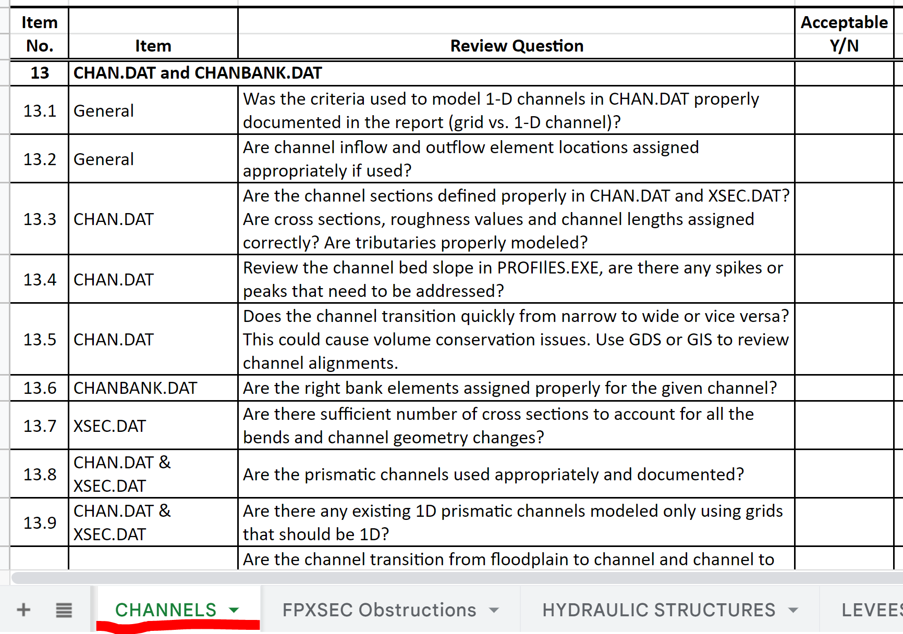

Lesson 2 Advanced - Channel Review
============================================

**Overview**

This tutorial covers the methods used to review a channel for instability, volume conservation issues, and data errors.

Required Data

The lesson makes use of the original data from Lesson 1, left bank, right bank, and cross section data, and culvert
rating tables.

All data is provided in the Lesson folders.

.. list-table::
   :widths: 33 33 33
   :header-rows: 0

   * - **File**
     - **Content**
     - **Location**

   * - QGIS Lesson 1.gpkg
     - FLO-2D GeoPackage
     - \\QGIS Lesson 1

   * - QGIS Lesson 1.qgz
     - QGIS file
     - \\QGIS Lesson 1

   * - \*.OUT, \*.CHK
     - Output and check files
     - \\QGIS Lesson 2\\Lesson 2 Export

   * - \*.xlsx
     - FLO-2D Reviewers Checklist
     - \\QGIS Lesson 2\\Lesson 2 Export

Project Location C:\\Users\\Public\\Documents\\FLO-2D PRO Documentation\\Example Projects\\QGIS Tutorials

This video explains how to review the channel to check if it is running correctly.

.. youtube:: shtqYasu_Qo

Step 1: Open the Channel Checklist
__________________________________________

1. Open the Reviewer's Checklist in Excel or Google Sheets.

Excel Spreadsheet |ExcelChk|.

.. |ExcelChk| raw:: html

   <a href="https://flo-2d.sharefile.com/d-se485d1efcd46409db1b0ebc94002b2cc"
   target="_blank">Download</a>

Google Spreadsheet |Googlechk|.

.. |Googlechk| raw:: html

   <a href="https://docs.google.com/spreadsheets/d/1yGAyYajBAmsADhhQStI50epvbzebAXrx0LeWNkmuX4Y/edit?usp=sharing"
   target="_blank">Download</a>

2. Find the Channel tab.

