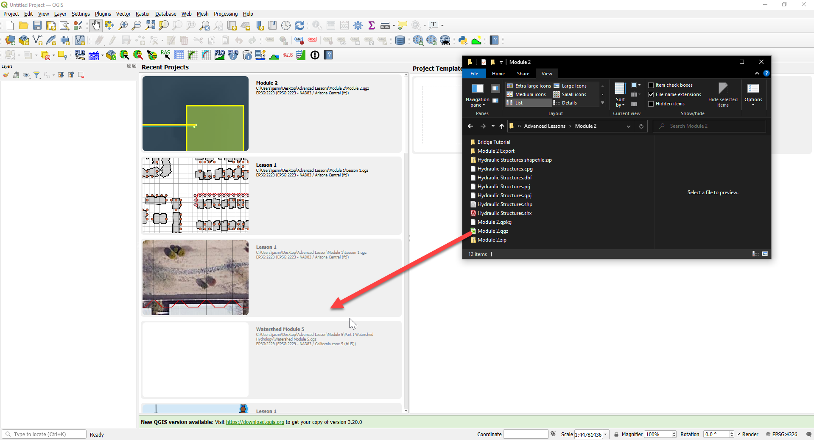
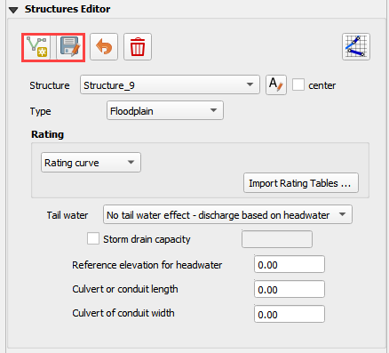
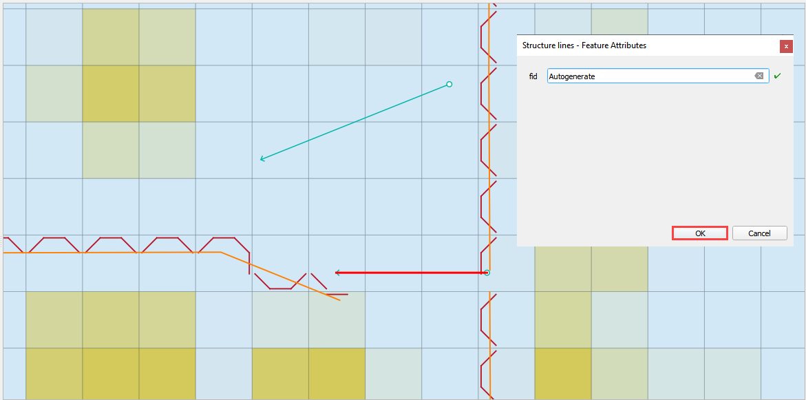
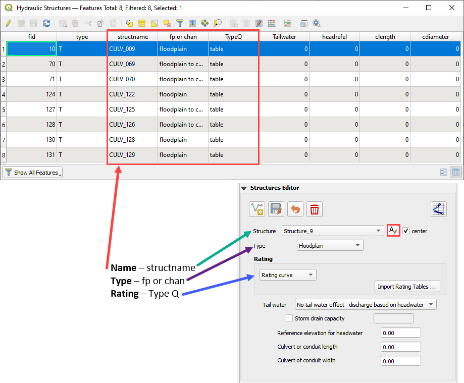
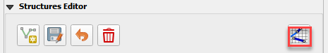

Module 2 - Part 1 – Hydraulic Structures
========================================

**Overview**

This tutorial outlines the process of creating hydraulic structures with rating tables and generalized culvert equations.
This lesson needs a channel so please use the data from QGIS Lesson 2, 3, or 4 to run through this tutorial.
Finish Lesson 2 before performing the following steps.

Required Data
-------------

The required data is in Module 1 and 2.

============= ===================== ======================
**File**      **Content**           **Location**
============= ===================== ======================
Lesson 1.qgz  Module 2 qgis file    Module 2 Part 1 Folder
Lesson 1.gpkg Module 2 GeoPackage
\*.tif        Elevation file        Lesson 1 Folder
\*.txt        Culvert Rating Tables Module 2 Part 1 Folder
============= ===================== ======================

Check these folders to ensure the data is available before starting the lesson.

Step 1: Setup the project
-------------------------

1. Start with the project from Lesson 2, 3, or 4 Complete.

2. If necessary, load it into QGIS.

3. Open QGIS and drag the lesson 1.qgz file into the project.

4. Save the project.

Step 2: Import data
-------------------

Start by cleaning up the map space so the next layer will be easy to see.

1. Uncheck the User Left bank, Right Bank Cross section layers;

2. Uncheck the Blocked Areas;

3. Uncheck the Storm Drain User Layers;

4. Click the User Boundary Conditions Layer;

5. Drag the Hydraulic Structures onto the map space.

.. image:: ../img/Advanced-Workshop/Module032.png

Step 3: Format the data layers
------------------------------

1. Open the Attributes Table on the Hydraulic Structures Layer.

.. image:: ../img/Advanced-Workshop/Module033.png

2. Select structure 130, and 131 and click Zoom map to selected rows button.
   This will zoom your map to these two structures.

.. image:: ../img/Advanced-Workshop/Module034.png

3. Label the Hydraulic Structures Layer.

4. Double click the Hydraulic Structures layer

5. Set the Labels like the following image.

6. This allows you to see which culvert you are working on.

.. image:: ../img/Advanced-Workshop/Module035.png

7. Change the layer Symbology

8. Change the selector to Symbology

9. Set the Symbol Layer Type to Arrow

10. Uncheck Curved Arrows

11. This will show you the flow direction of each structure.

.. image:: ../img/Advanced-Workshop/Module036.png

Step 4: Build the structures into the User Layers.
--------------------------------------------------

1. Use the Structure Editor to add all of the new structures.

2. Digitize all of the structures.

3. Click the Save icon to confirm that you are finished with the digitizing tool.

**Digitizing process:**

4. Left click the inlet node (upstream node)

5. Left click the outlet node (downstream node)

6. Right Click to finish the polyine.
   Click OK to finish the feature.

Step 5: Assign the structure attributes
---------------------------------------

.. image:: ../img/Advanced-Workshop/Module039.png

1. Click Save in the Structures Widget to load the data into the dialog box.

**Complete the Structure Fields**

2. Load the Hydraulic Structures Attribute table.
   The attributes will help fill out each structure table.

3. Check the center button.

4. Select the first structure.

5. Rename the Structure with the “A” button.

6. Fill the Type and Rating fields

7. Move to the next structure and repeat the process.

8. Schematize the structure data.

Step 6: Assign the rating tables
--------------------------------

1. Click the Import Rating Tables button

.. image:: ../img/Advanced-Workshop/Module042.png

7. Select the rating tables from the project folder.

8. Click open.

.. image:: ../img/Advanced-Workshop/Module043.png

9. The data has been imported.
   If you can’t see it, switch to a different structure.

.. image:: ../img/Advanced-Workshop/Module044.png

Step 7: Schematize the data
---------------------------

1. Schematize the structure data and click Yes to replace the data.

.. image:: ../img/Advanced-Workshop/Module045.png

Step 8: Save, export, and run
-----------------------------

1. This is a good point to save project.
   Refer to Step 9 in Lesson 1.

.. image:: ../img/Advanced-Workshop/Module046.png

2. Export the data files to the Project Folder in QGIS Lesson 6 Export.

.. image:: ../img/Advanced-Workshop/Module047.png

3. All GDS data files will be created in the selected project folder.

.. image:: ../img/Advanced-Workshop/Module048.png

.. image:: ../img/Advanced-Workshop/Module049.png

4. The swmm.inp file was not exported. Copy it from Lesson 3 Export folder or export it again using the Storm Drain Editor.

.. image:: ../img/Advanced-Workshop/Module050.png

5. Click the Run FLO-2D Icon.

.. image:: ../img/Advanced-Workshop/Module051.png

6. Set the Project path and the FLO-2D Engine Path and click OK to start the simulation.

.. image:: ../img/Advanced-Workshop/Module052.png
