Module 2 - Part 2 – Advanced Hydraulic Structures
==================================================

**Overview**

In part 2, the data from the previous lesson is extended with a new generalized culvert equation.

Required Data
--------------

The required data is in Module 1 and 2

======== ===========================
**File** **Content**
======== ===========================
\*.qgz   Project files from Module 1
\*.gpkg  Geopackage from Module 1
\*.tif   Elevation file
======== ===========================

.. _step-1-setup-the-project-1:

Step 1: Setup the project
-------------------------

1. Start with the project from Module 1 Lesson 1.qgz.
   This is the completed project from the previous class.
   FLO-2D Self-Help.

2. Open QGIS and drag the lesson 1.qgz file into the project.

3. Save the project.

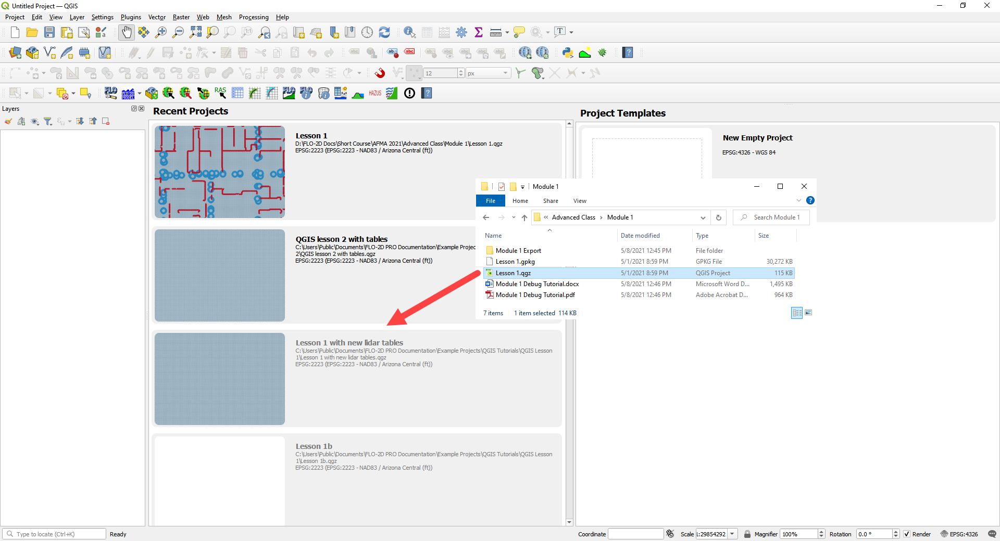

Step 2: Simplify the map
------------------------

1. Turn off unnecessary layers

   - Blocked Areas

   - Storm drain conduits

   - Storm drain nodes

   - Storm Drain group

   - Levee Lines

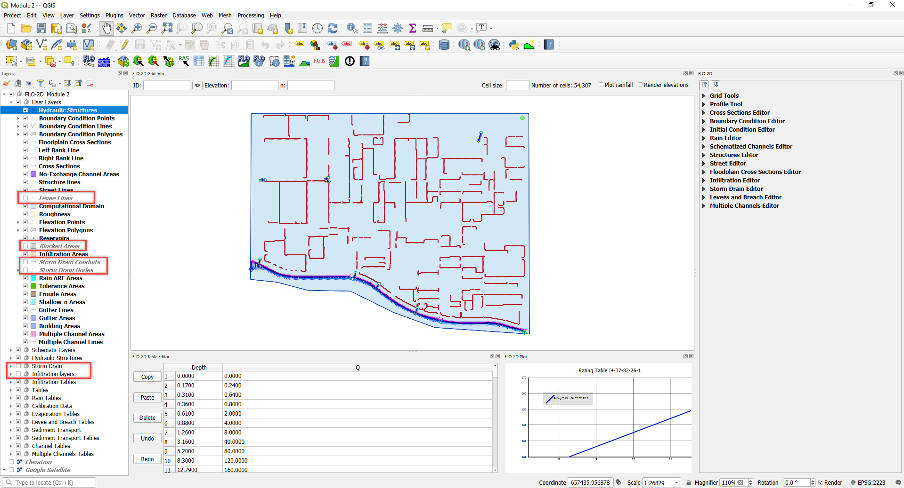

Step 3: Build a new structure
-----------------------------

1. Zoom to the northwest basin as shown by the yellow box.

2. Find the culvert in the green box.

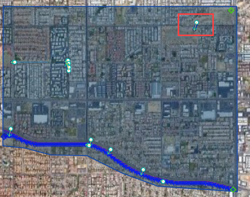

3. Open the Structures widget.

4. Click the Digitize polyline tools.

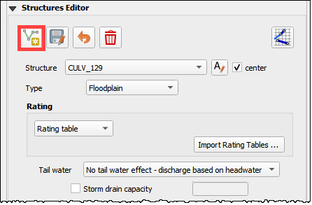

5. Click the east side of the structure and then click the west side of the structure.

6. Right click to close the polyline and click OK to close the dialog.

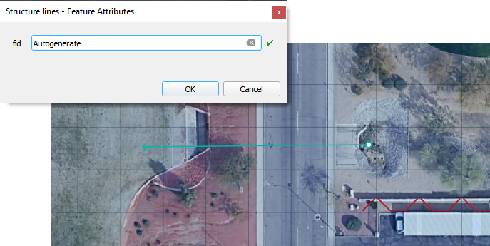

Step 4: Measure the culvert length
----------------------------------

1. Click the measure tool.

2. Measure the length of the culvert from the upstream headwall to the downstream headwall.

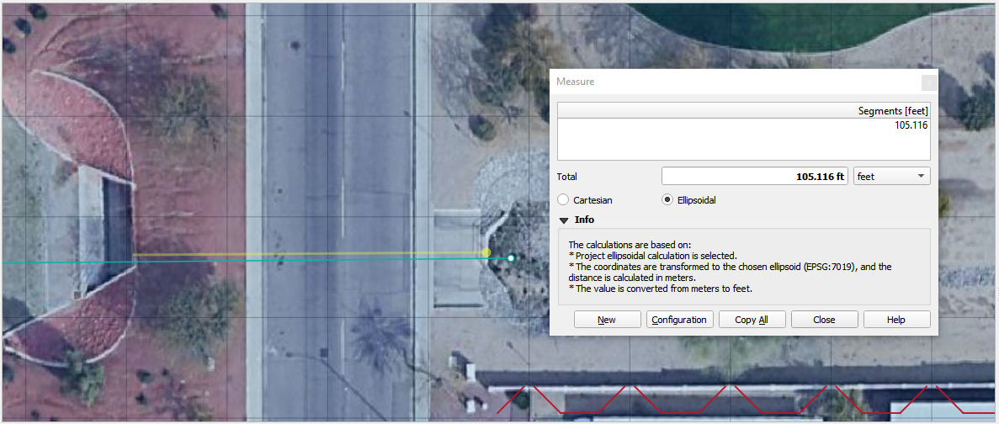

3. Click the Save button and enter the data into culvert.

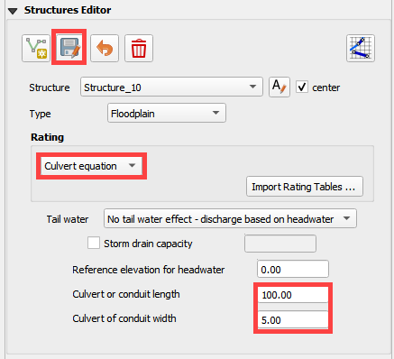

Step 5: Complete the structure data and schematize.
---------------------------------------------------

1. Fill the remaining data in the FLO-2D Table Editor.
   Use the Data Input Manual to learn the parameters.

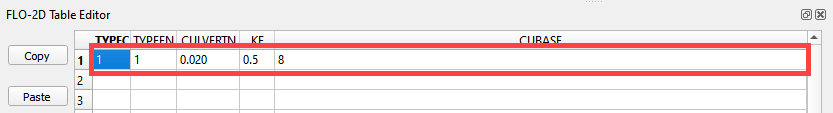

2. Typec = 1 box

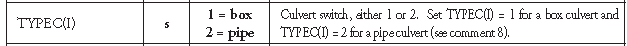

3. Typeen = 1

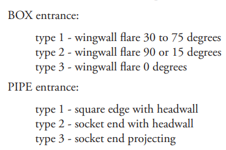

4. Culvertn = 0.020

5. KE = 0.50

6. Cubase = 8ft

7. Finish the structure by clicking the schematize button.

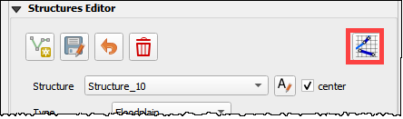

Step 6: Correct invert elevation
--------------------------------

1. Select the Google Satellite layer.

2. Drag the elevation file onto the map.

3. The Elevation.tif file is in Module 2 or QGIS Lesson 1.

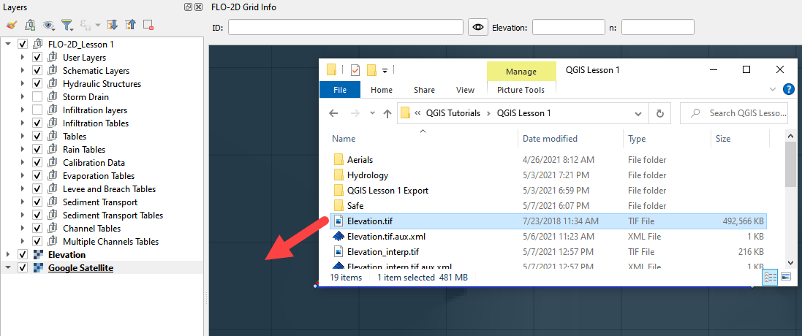

4. Use the ID tool to find the invert elevation of the upstream side of the culvert.

5. 5.	The Identify Results table shows the grid element elevation (purple arrow) and the ras-ter elevation (green arrow).

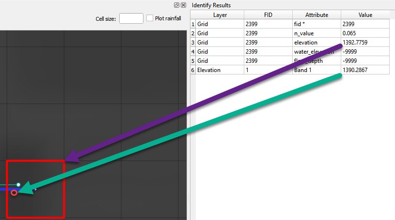

6. Create a feature in the Elevation Polygon layer and assign the corrected elevation to that feature.

   - Select the elevation polygon layer.

   - Click edit pencil and the Add Polygon Feature button.

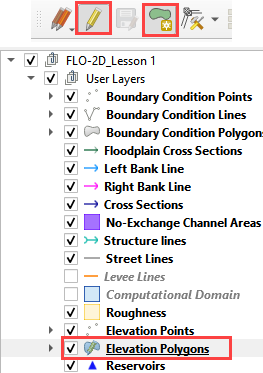

- Add a polygon to the grid that needs adjustment.

- Right click to close the polygon and fill the form.

- It is only necessary to cover the centroid with this polygon.

- Click OK to close the form.

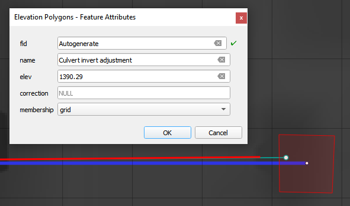

7. Collapse the FLO-2D Widgets.

8. Open the Grid widget.

9. Click the Correction Tool

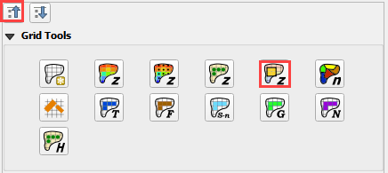

10. Click yes to save the changes.

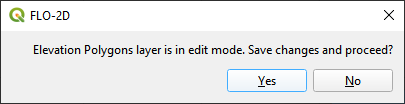

11. Select the User Layer Mode.

12. Click the Elevation Polygon Attributes check box.

13. Click OK to perform the calculation and OK once it is finished.

14. The cell elevation is now adjusted to the correct culvert invert.

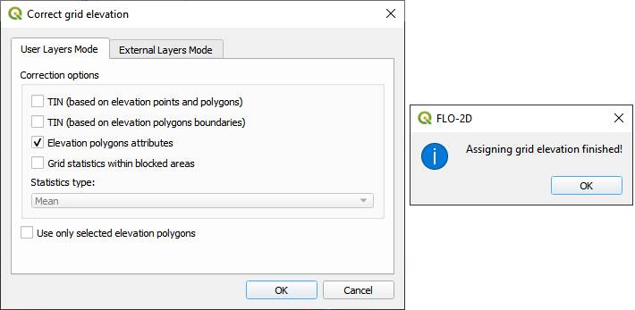

Step 7: Save, export, and run.
------------------------------

1. This is a good point to save project.

.. image:: ../img/Advanced-Workshop/Module046.png

2. Export the data files to the Advanced Class Folder Module 2 Export.

.. image:: ../img/Advanced-Workshop/Module071.png

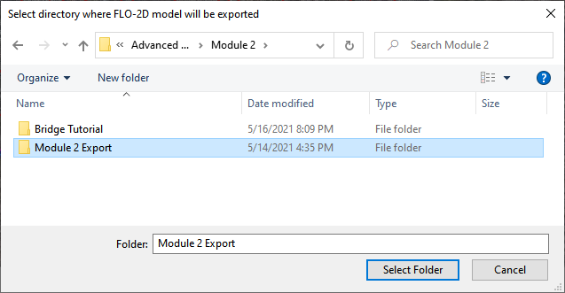

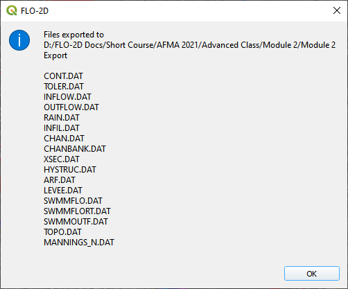

3. Go to the Storm Drain Widget and Export the swmm.inp file.

4. Collapse all widgets.

5. Open Storm Drain widget.

6. Click Export SWMM.INP… button

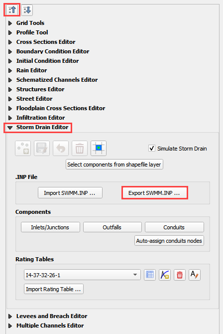

7. Find the Module 2 Export.

8. Name the file swmm.inp and click Save.

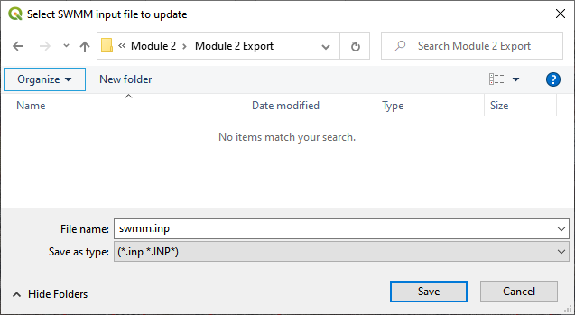

9. Click OK to close both windows.

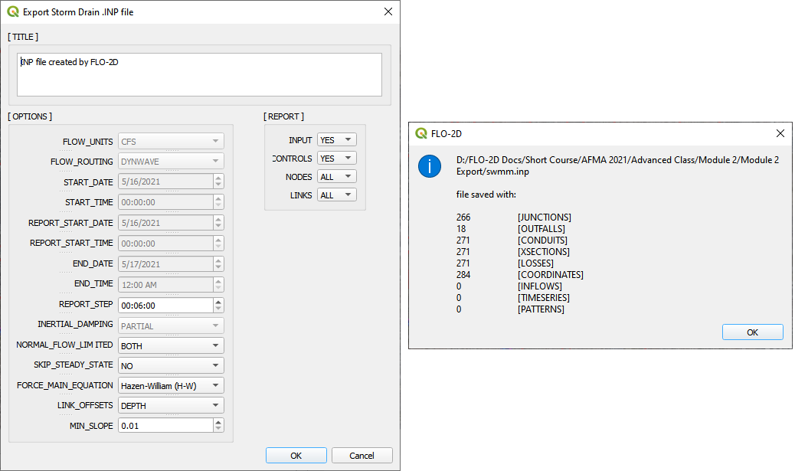

10. Click the Run FLO-2D Icon.

11. Correct the Paths and click OK to start the simulation.

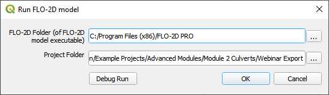

