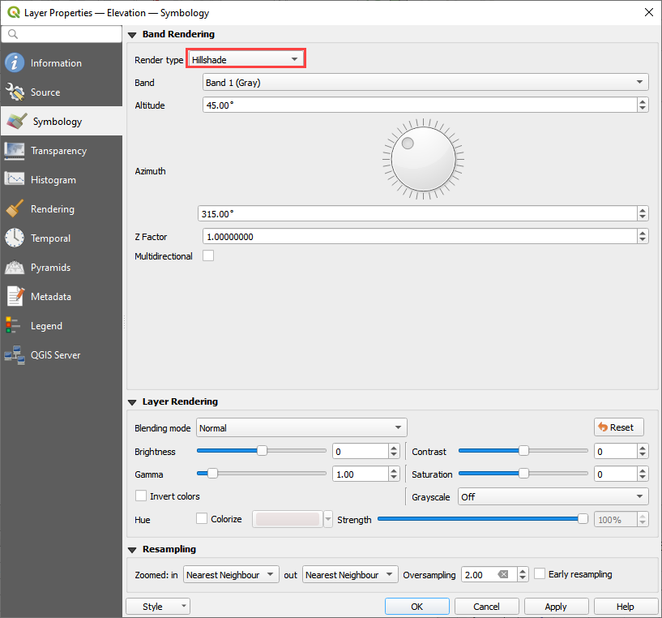
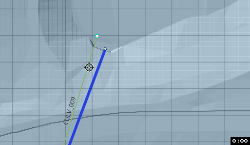
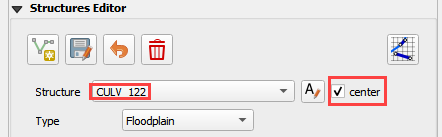
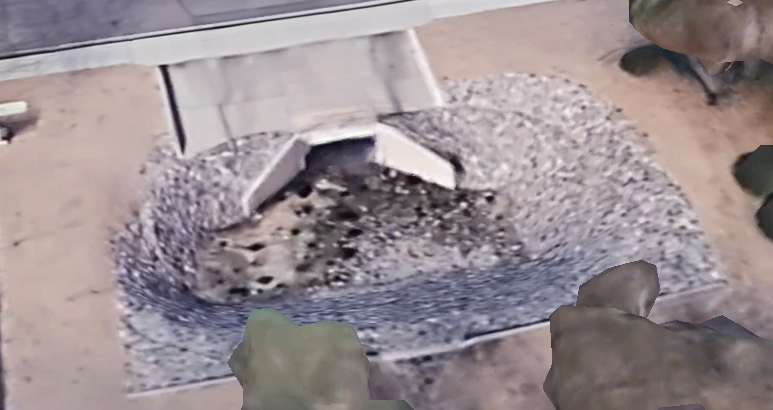
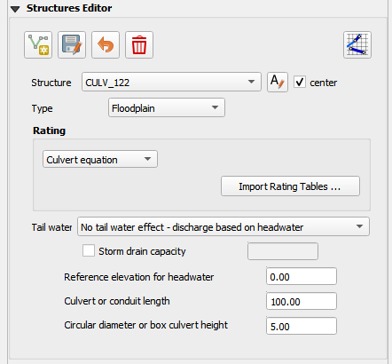
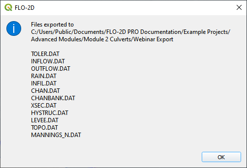

Module 2 Part 2 – Advanced Hydraulic Structures
================================================

**Overview**

This tutorial will illustrate how to use QGIS table editor and the FLO-2D plugin to manage and edit culvert data.

Required Data

The required data is in Module 1 and 2

======== ===========================
**File** **Content**
======== ===========================
\*.qgz   QGIS Project files
\*.gpkg  Geopackage
\*.tif   Elevation file
\*.shp   Culvert shapefiles
======== ===========================

.. youtube:: 5XFkNQ6z8Oc

Step 1: Setup the project
__________________________

Get the data: https://flo-2d.sharefile.com/d-s05913b9b6c0149c1a93cec4fe52d7bb5

1. Download and extract the data from the link above.

2. Open QGIS and drag the lesson 1d.qgz file into the project.

3. Save the project.

.. image:: ../img/Advanced-Workshop/Module031.png

Step 2: Review culvert 009
____________________________________

1. Zoom to the northeast basin as shown by the yellow box.

2. Find the culvert.

3. Turn on the Elevation layer and set the elevation style to hillshade.  If the elevation layer is missing, load it
   from lesson 1.

4. Notice the blue polygon.  It covers the centroid of the grid.  The gif shows how to build one.  This polygon is used
   identify the grid that needs an elevation correction.  It can be more than one but in this case 1 is sufficient.

5. The elevation correction will be applied in a later step.  Step 2.4 sets shows how to set up the correction.

6. Click the measure tool and measure the length of the culvert.

7. Review the culvert geometry.

   - Circular pipe culvert
   - 48" diameter
   - 3 barrels
   - Square headwall

Step 3: Complete the structure data
___________________________________________________

1. Select CULV_009 in the structure editor.

   - Rating = Culvert equation
   - Length = 252ft
   - Diameter = 4ft

.. image:: ../img/Advanced-Workshop/culv005.png

2. TYPEC = 2 circular pipe.

.. image:: ../img/Advanced-Workshop/Module061.png

3. TYPEEN = 1 square edge with headwall.

4. CULVERTN = 0.018

5. KE = 0.50

.. image:: ../img/Advanced-Workshop/culv006.png

source: Hydraulic Design of Highway Culverts - HDS-5-Third Edition

6. CUBASE = 0ft

7. MULTBARRELS = 3

Step 4: Review culvert 122
____________________________________

1. Check the Center box and change the structure to CULV_122.

2. The map is centered on the CULV_122.

3. In this culvert, the elevation polygon was applied to the whole basin.

4. Note how the blue polygon covers the centroid of the cells that will be modified.  This correction is applied to the
   attenuation basin and the stilling basin.

5. The culvert has a stilling basin just upstream with a levee applied to control the water surface.  The grid element
   elevation is set to min by the blue polygon and the levee elevation is set to the crest of the weir.  The water will
   flow over the levee and fill the stilling basin before it flows through the culvert.

6. The levee elevation is 1396.48ft.

7. The culvert length 100ft.

.. image:: ../img/Advanced-Workshop/culv010.png

8. The entrance type is box culvert with wingwalls 30 to 70 degrees.

Step 5: Complete the structure data
___________________________________________________

1. Select CULV_122.

   - Rating = Culvert equation
   - Length = 100ft
   - Diameter = 5ft

7. The culvert dimensions

   - TYPEC = 1 Box culvert
   - TYPEEN = 1 Wingwall 30 to 70 Square Head at Crown
   - CULVERTN = 0.018
   - KE = 0.4
   - CUBASE = 8ft
   - MULTBARRELS = 1

.. image:: ../img/Advanced-Workshop/culv012.png

Step 6: Save, export, and run.
______________________________

.. note:: The accompanying YouTube video shows several more advanced ideas for modeling culverts.

            - Advanced channel culvert modeling
            - Simple storm drain
            - When to use tailwater switches.
            - How to use the head reference elevation.

1. Save the project.

.. image:: ../img/Advanced-Workshop/Module046.png

2. Export the data files to the Advanced Class Folder Module 2 Export.

.. image:: ../img/Advanced-Workshop/Module047.png

.. image:: ../img/Advanced-Workshop/Module071.png

.. image:: ../img/Advanced-Workshop/Module072.png

2. Click the Run FLO-2D Icon.

.. image:: ../img/Advanced-Workshop/Module051.png

3. Click OK to start the simulation.

.. note:: The end of the YouTube video will cover hydraulic structure review.

