Module 2 - Part 3 – Bridge Hydraulic Structure
===============================================

**Overview**

In this tutorial, the bridge variables are added to a hydraulic structure.

Required Data
-------------

The required data is in Module 2 Bridge Tutorial.
This is a new project.
Please save and close the previous QGIS.

======== ======================================
**File** **Content**
======== ======================================
\*.qgz   QGIS data files
\*.gpkg  FLO-2D Geopackage
\*.tif   Bridge asbuilt files
\*.DAT   Bridge coefficients and cross sections
======== ======================================

Additional Resources:

Hamill, L., 1999.
Bridge Hydraulics, E & FN Spon, NY.
https://www.google.com/books/edition/Bridge_Hydraulics/e0VZDwAAQBAJ?hl=en&gbpv=0

Measurement of Peak Discharge at Width Contractions by Indirect Methods
Howard F. Matthai
https://pubs.er.usgs.gov/publication/twri03A4

Flow Through Openings in Width Constrictions
JACOB DAVIDIAN, P. H. CARRIGAN, JR., and JOHN SHEN
https://pubs.usgs.gov/wsp/1369d/report.pdf

Bridge Hydraulics Component
Jimmy S. O'Brien
See Tutorial Folder

Step 1: Load the project
------------------------

1. Start with the project from Module 2 Bridge Tutorial

2. If necessary, load it into QGIS.
   Open QGIS and drag the Bridge Tutorial.qgz file into the project.

3. Save the project.

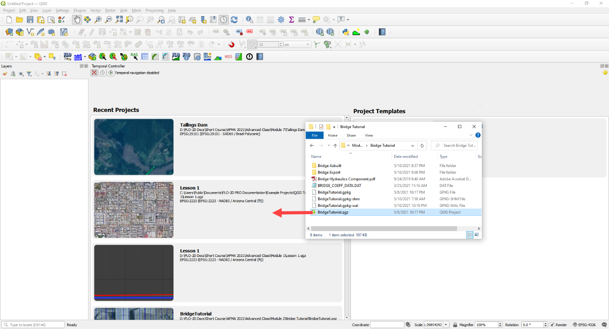

Step 2: Define the bridge variables and coefficients
----------------------------------------------------

Bridge variables and coefficients are defined by the USGS method for calculating discharge through a bridge.
Hamill defines this approach in his book on bridge hydraulics (1999).
O’Brien describes how to apply these variables to FLO-2D in a white paper called Bridge Hydraulics Component (2019).
This tutorial will show how to estimate or calculate the required variables for a real project setup.

This bridge in Simi Valley, CA crosses Arroyo Simi at Tapo St.
It appears to have vertical embankments and abutments.

Plan view parameters
____________________

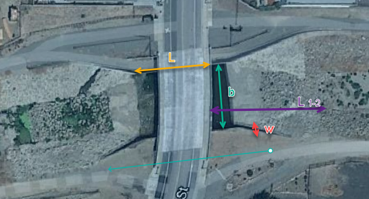

b = 66 ft measured from QGIS map

L = 70 ft measured from QGIS map

w = 5 ft measured from QGIS map

L\ :sub:`1-2` = 177 ft measured from QGIS map

Profile parameters
__________________

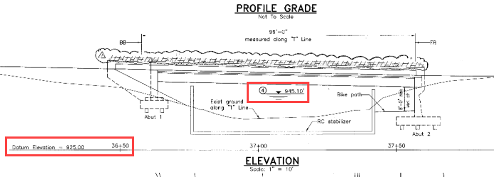

Z = 9.23 ft

Abutment left elevation = 941 ft

Abutment right elevation = 937.74

Average low chord = 937.4 ft

Average bridge deck elevation = 953.4 ft

Deck weir length = 114 ft

Bridge opening ratio
____________________

1. Calculate M = q/Q = 0.83 = Discharge through bridge opening/pre-structure discharge)

q = 8600 cfs at normal depth = 8.06

Q = 10325 cfs at normal depth 8.06

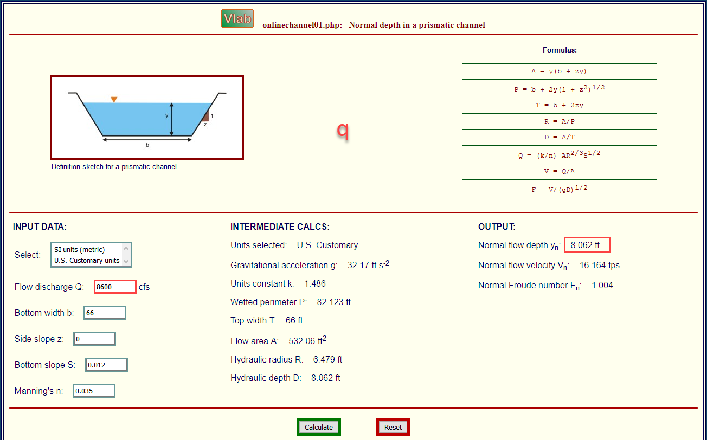

Bridge tables
_____________

This bridge is a Type I: Vertical embankments and abutments.

M =0.83 = q/Q = (8600/10325 calculated from sdsu open channel calc)

C’ = 0.94 derived from table a (L/b = 70/66 = 1.06, M = 0.83)

k\ :sub:`F` = 1.10 derived from table b (F calculated with open channel calc = 1.0)

k\ :sub:`w` = 1.05 derived from table e (w/b = 5/66 = 0.076)

k\ :sub:`ɸ` = 1.00 derived from table g (angle = 10°)

Z = 9.23 ft (bridge low chord to channel bed)

Yu = 8.061 ft (normal depth upstream at 100yr discharge.)

No submergence at 100 yr discharge.

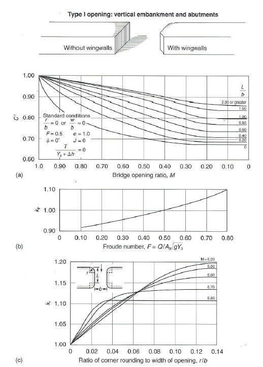

Type 1 Bridge Opening (from Hamill, 1999; p.
111, Figure 4.3)

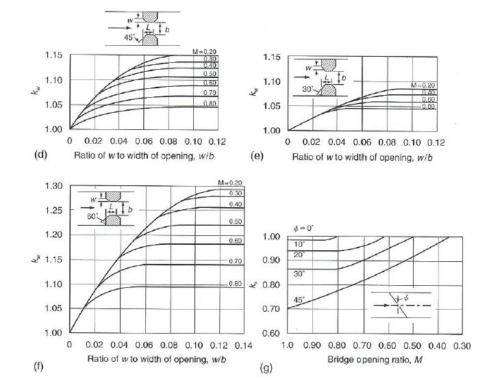

Type 1 Bridge Opening cont.
(from Hamill, 1999; p.
112, Figure 4.3)

Bridge variables dialog
_______________________

1. Fill the table from the preceding instructions.

2. Click ok to close this form.

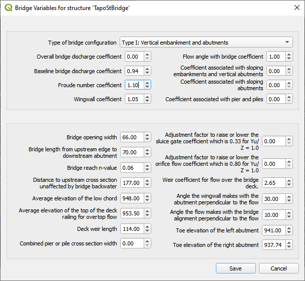

3. Click the Schematize button on the Structure editor.

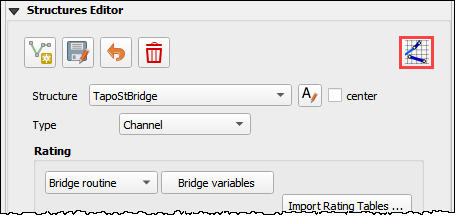

Step 3: Build the cross section data
------------------------------------

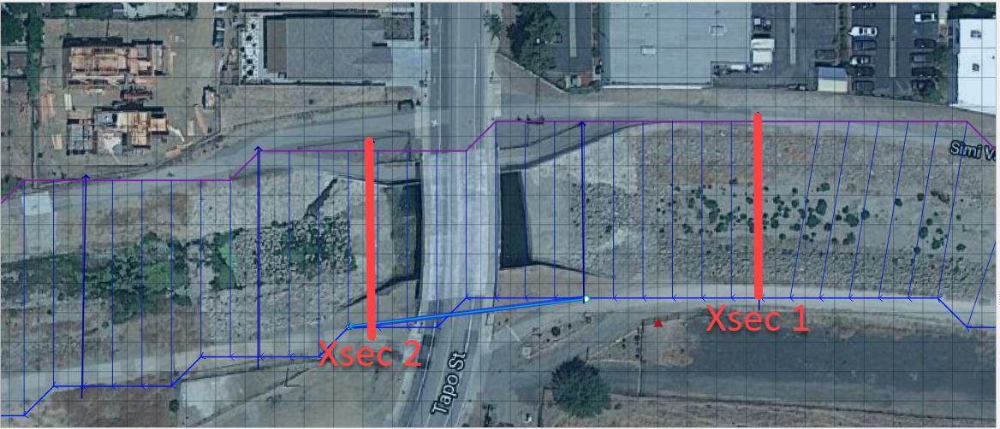

1. The cross section data for L\ :sub:`1-2` is taken from the cross section table of Cross-Section-60 and the Bridge cross section estimated based
   on the geometry of the bridge.

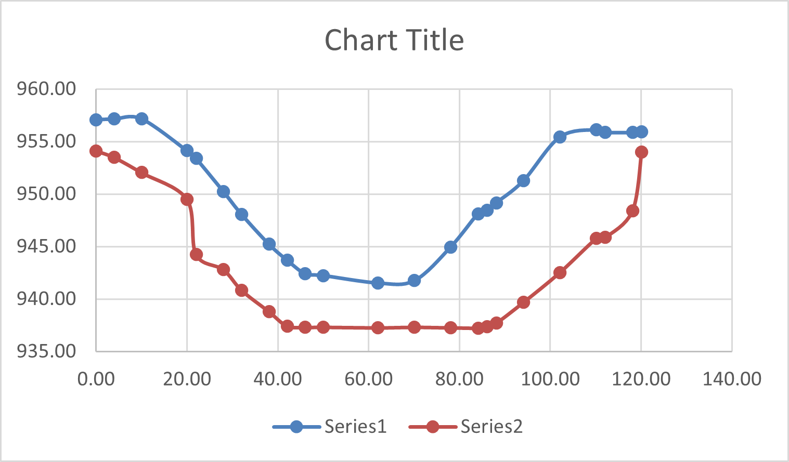

====== ====== ======
X      6657
====== ====== ======
0.00   957.08 954.11
4.00   957.15 953.48
10.01  957.16 952.04
20.02  954.13 949.50
22.02  953.38 944.24
28.03  950.24 942.80
32.04  948.06 940.84
38.04  945.23 938.81
42.05  943.70 937.43
46.05  942.41 937.30
50.06  942.23 937.31
62.07  941.52 937.26
70.08  941.74 937.31
78.09  944.95 937.26
84.09  948.11 937.23
86.10  948.47 937.34
88.10  949.16 937.69
94.11  951.27 939.68
102.12 955.43 942.52
110.12 956.13 945.75
112.13 955.87 945.87
118.13 955.86 948.39
120.14 955.90 954.00
====== ====== ======

2. Create a text file called BRIDGE_XSEC.DAT.

3. Copy the table above into the text file.

4. Replace the tabs with spaces using this method:

   - Select a tab.

   - Ctrl-H or Edit Replace

   - Add a few spaces into the Replace with field.

   - Click Replace All.

   - Save the file.

5. This file would normally be copied to the export folder but there is already one in there.
   This is just to show the procedure.

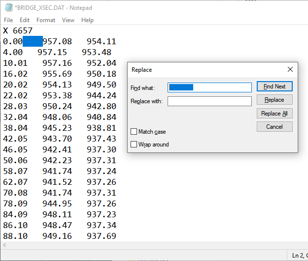

Step 4: Save, export and run.
-----------------------------

1. This is a good point to save project.

.. image:: ../img/Advanced-Workshop/Module046.png

2. Export the data files to the Project Folder in Module 2\Bridge Tutorial\Bridge Tutorial Export.

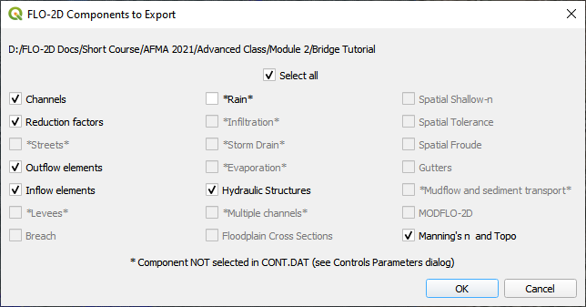

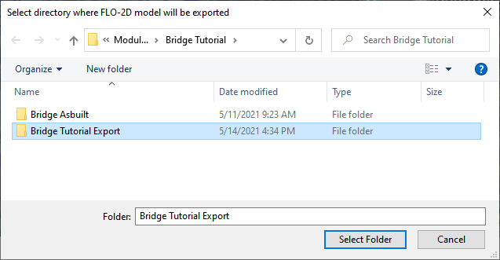

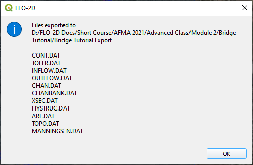

3. Click the Run FLO-2D Icon.

.. image:: ../img/Advanced-Workshop/Module051.png

4. Correct the paths and click OK to start the simulation.

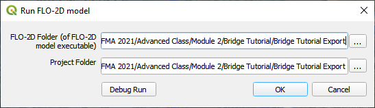