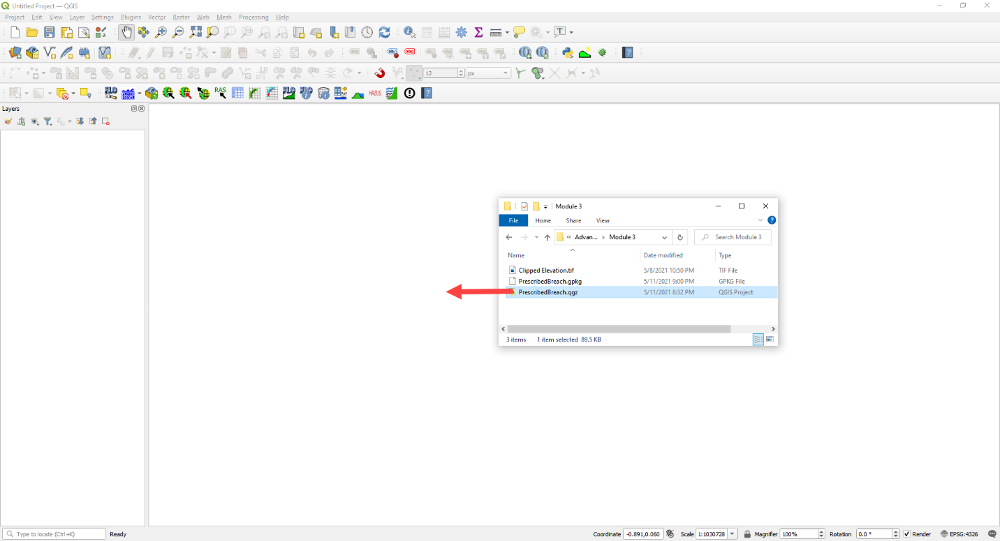
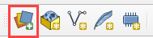
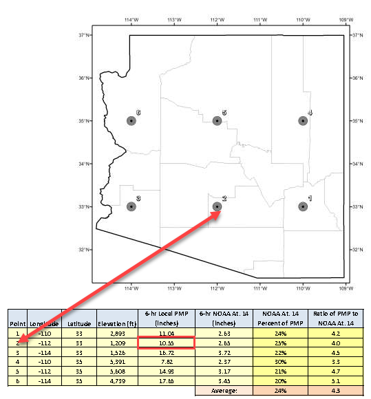
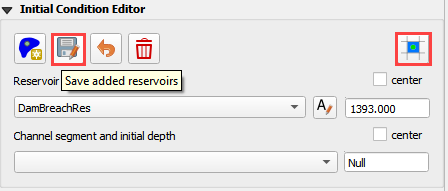

Module 3 Part 1 – Prescribed Breach Define Watershed
====================================================

**Overview**

In this tutorial, a simple dam breach with failure is created.
In this example, the reservoir is dry and so no bathymetry or stage volume is required.

.. _required-data-4:

Required Data
-------------

The required data is in Module 3.

======== =================
**File** **Content**
======== =================
\*.qgz   QGIS data files
\*.gpkg  FLO-2D Geopackage
\*.tif   Elevation file
\*.xml   Hydrography file
\*.pdf   Hydrology manual
======== =================

Citation List for this Tutorial:

Tomlinson, E.M., W.D. Kappel, G. Muhlestein, D. Hulstrand, and T. Parzybok, 2013.
Probable Maximum Precipitation Study for Arizona, Arizona Department of Water Resources, Phoenix, Arizona.

.. _step-1-load-the-project-1:

Step 1: Load the project
------------------------

1. Start with the project from Module 3 Prescribed Breach

2. Open QGIS and drag the Prescribed Breach.qgz file into the project.

3. Save the project.

4. Click Yes to load the model.

.. image:: ../img/Advanced-Workshop/Module095.png

Step 2. Load the aerial and hydrography
---------------------------------------

1. Click the Quick Map Services button and add a Google Map

.. image:: ../img/Advanced-Workshop/Module096.png

2. Click the Data Source Manager button and add a WMS/WMTS dataset.

3. Select the Hydrograph

4. Click Connect

5. Highlight all layers

6. Click Add and Close this form

.. image:: ../img/Advanced-Workshop/Module098.png

7. If the layer comes in white, set the transparency to 50% Global Opacity.

.. image:: ../img/Advanced-Workshop/Module099.png

Step 3. Review hydrology
------------------------

Dam breach models will typically utilize the Probable Maximum Precipitation (PMP).
The data for these studies are typically created at the state or county level.
The Arizona Department of Water Resources has a document that will help determine uniform and spatial rainfall data for dam breach studies (Tomlinson
et al., 2013).
The PMP can be determined spatially using the PMP Evaluation Tool made for ArcGIS.

For the sake of simplicity, a value of 10.55 inches was sampled from Table 10.1 for a 6 hour local storm for a 1 mi:superscript:'2' basin in zone 2 near the Phoenix
area.

(Source: Figure 10.7 and table 10.1 pg.
111 PMP Study for Arizona)

This value is used in the Uniform Rainfall editor along with the Maricopa 6-Hr P1 rainfall distribution curve.
This hydrology model is used to fill the reservoir or even get a high-water level for the dam.

.. image:: ../img/Advanced-Workshop/Module101.png

Infiltration can also be applied to the watershed.
In this example, a simplified set of polygons are used to define Green-Ampt Infiltration.
Once these polygons are created, the Schematize Infiltration button will apply them to the grid.
Instead of the complex infiltration calculation parameters, the direct infiltration parameters are applied.
See the Global and Spatial variables below.

.. image:: ../img/Advanced-Workshop/Module102.png

Step 4. Set up the reservoir
----------------------------

1. Collapse the widgets.

2. Open the Initial Condition Editor widget.

.. image:: ../img/Advanced-Workshop/Module103.png

3. Click the create a reservoir button and click anywhere upstream of the dam.

.. image:: ../img/Advanced-Workshop/Module104.png

4. Click the Save button and Schematize button to complete the Reservoir.

5. This will fill the reservoir when FLO-2D starts to run.

6. FLO-2D fills any contiguous cell to the prescribed water surface elevation.

