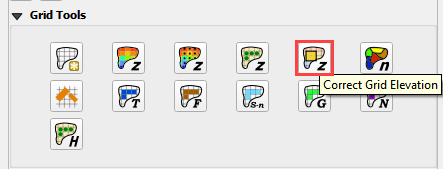
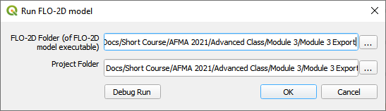

Module 3 Part 2 – Prescribed Breach Create Levee and Breach
===========================================================

**Overview**

In this tutorial, a simple dam breach with failure is created.
In this example, the reservoir is dry and so no bathymetry or stage volume is required.

.. _required-data-4:

Required Data
-------------

The required data is in Module 3.

======== =================
**File** **Content**
======== =================
\*.qgz   QGIS data files
\*.gpkg  FLO-2D Geopackage
\*.tif   Elevation file
======== =================

In this tutorial, a simple dam breach with failure is created.
In this example, the reservoir is dry and so no bathymetry or stage volume is required.

Step 1. Create the levee
------------------------

1. The levee line is already in the correct location and User Layer.

2. Click the Create Levees button.

.. image:: ../img/Advanced-Workshop/Module106.jpg

3. Check only User levee lines and click Create Schematic Layers from User Layers button.

.. image:: ../img/Advanced-Workshop/Module107.jpg

4. The following message states how many levees were created and how many levees have failure data.
   Click OK.

.. image:: ../img/Advanced-Workshop/Module108.jpg

5. Zoom in to the dam in the red rectangle below.

Step 2. Define the breach
-------------------------

1. Click the collapse widgets button.

2. Click the Levees and Breach Editor widget.

3. Select the Prescribed Failure.

4. Click the Grid Info Tool Button

5. Click the cell marked in red below.
   This will become the location of the breach.

.. image:: ../img/Advanced-Workshop/Module112.png

6. Click the Levee Grid Elements button.

7. Type cell number into the Grid Element field and click the little eye.

.. image:: ../img/Advanced-Workshop/Module113.png

8.  Click inside the elevation field of the North direction.
    That will turn it a different color and select it as the “fail direction”.
    See the Pink field under the word North.

9.  Click the levee failure check box.

10. Set the fail data and click Apply Change and Close.

.. image:: ../img/Advanced-Workshop/Module114.png

Step 3. Remove the dam elevation (method 1)
-------------------------------------------

1. Do you want to remove the entire structure? Complete Step 6.

2. Do you want to remove a thin slice? go to Step 7 (method 2)

3. Highlight the Elevation Polygon Layer

4. Click the Select button

5. Click the large blue polygon.

.. image:: ../img/Advanced-Workshop/Module115.png

6. Click the Correct Grid Elevation button

7. Choose the Tin(based on elevation polygon boundary) and Use only selected polygons check boxes and click OK.

.. image:: ../img/Advanced-Workshop/Module117.png

Step 4. Remove the dam elevation thin slice (method 2)
------------------------------------------------------

1. Click the Elevation Polygon Layer

2. Click the Select button

3. Click the small blue polygon.

.. image:: ../img/Advanced-Workshop/Module118.jpeg

4. Click the Correct Grid Elevation button

5. Choose the Tin(based on elevation points and polygons) and Use only selected polygons check boxes and click OK.

.. image:: ../img/Advanced-Workshop/Module119.png

6. Want to learn more about the Elevation Correction tool? go to the Plugin User Manual version 2021.

Step 5. Export and run the model
--------------------------------

1. Click the Control Variable editor.

.. image:: ../img/Advanced-Workshop/Module120.png

2. Set the control parameters and turn on the levee switch.

.. image:: ../img/Advanced-Workshop/Module121.png

3. Set the Numerical Stability Parameters.
   Click Save to close.

.. image:: ../img/Advanced-Workshop/Module122.png

4. Export the FLO-2D Data files.
   Click OK.

.. image:: ../img/Advanced-Workshop/Module123.png

.. image:: ../img/Advanced-Workshop/Module124.png

5. Select the Module 3 Export folder.

.. image:: ../img/Advanced-Workshop/Module125.png

6. The data is ready to run.

.. image:: ../img/Advanced-Workshop/Module126.png

7. Correct the paths and click OK to start the simulation.

The breach ends up in the northeast corner of the study area.

.. image:: ../img/Advanced-Workshop/Module128.png

A review of the map shows that there is potential for the water to cross the highway and flow to the southwest.

