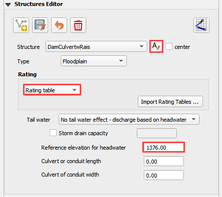
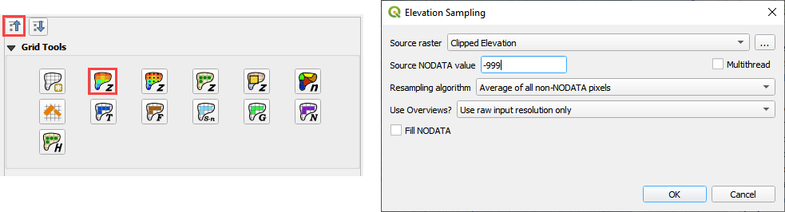

Module 3 Part  – Prescribed Breach - Add Detail and Troubleshoot
================================================================

**Overview**

In this tutorial, a simple dam breach with failure is created.
In this example, the reservoir is dry and so no bathymetry or stage volume is required.

Required Data
-------------

The required data is in Module 3.

======== ========================
**File** **Content**
======== ========================
\*.qgz   QGIS data files
\*.gpkg  FLO-2D Geopackage
\*.tif   Elevation file
\*.xlsx  Hydraulic structure file
======== ========================

Step 1. Add a culvert
----------------------

1. This dam is used for flood and sediment control.
   It has a perforated riser inlet to allow solids to settle and clear water to flow through the culvert.

2. A site visit would answer any question about this structure, but some simple assumptions will work fine for the purpose of understanding how FLO-2D
   setup will use the data.

.. image:: ../img/Advanced-Workshop/Module129.png

3. In this case a head reference elevation can be used so that the water must achieve a specific elevaton before the culvert will allow discharge.

4. Using the ID tool on the elevation raster shows that the ground elevation is 1373.22 ft.

.. image:: ../img/Advanced-Workshop/Module130.png

5. Estimating that the feature is around waist high means we can use a head reference elevation of 1376 ft for this inlet.

6. Collapse the widgets and click the structure editor.

7. Click Add a structure line and digitize a structure from the upstream side of the dam to the downstream side.
   Click Save to load the data into the table.

.. image:: ../img/Advanced-Workshop/Module131.png

8. Finish the data in the Widget.

9.  Go back to Part 2 Step 9 and `export and run <#step-9.-export-and-run-the-model>`__ the model again.

10. Copy the Orifice data from the Excel File.

.. image:: ../img/Advanced-Workshop/Module133.png

11. Select the first cell of the data table in QGIS and click the Paste Button.

12. Click the Schematize Button.

.. image:: ../img/Advanced-Workshop/Module135.png

13. Turn on the Hydraulic Structures switch.

.. image:: ../img/Advanced-Workshop/Module136.png

.. image:: ../img/Advanced-Workshop/Module137.png

Step 2. Downstream Boundary
----------------------------

1. Collapse the widgets and click the Boundary Condition Widget.

2. Click the create polygon button and digitize a polygon around the downstream boundary.

3. Click the Widget save button.

4. Set the Outflow side of the widget to Outflow.

5. Set the outflow type to 1.

6. Click the Schematize button.

.. image:: ../img/Advanced-Workshop/Module138.png

.. image:: ../img/Advanced-Workshop/Module139.png

Step 3. Common mistakes demo
-----------------------------

This section will demonstrate some common mistakes that users make when building breach models:

-  The reservoir node is water surface is too high or on the wrong side of the levee.

-  Levee components are not tied into the edge of the dam correctly.

-  Crest elevation is not defined correctly.

-  There is a hole in the levee where a direction was not assigned correctly.

-  The breach node is on the wrong side of the levee.

Step 4. Bad reservoir or leaky levee component
-----------------------------------------------

1. Collapse the widgets and click the Initial Condition Editor.

2. Change the reservoir elevation to 1402.00 and click the Schematize button.
   This is 2ft higher than the dam.

.. image:: ../img/Advanced-Workshop/Module140.png

3. Repeat Part 2 Step 8 starting at Number 4.

4. This is the result.
   The reservoir was too high so it filled the whole project.

5. Don’t forget to set the elevation back before exiting from QGIS.

.. image:: ../img/Advanced-Workshop/Module141.png

Step 5. Dam elevation not removed
----------------------------------

1. Collapse the widgets and click the Grid Tools.

2. Click the Sample Raster button.

3. Fill the form and click OK.
   The elevation file should be in Module 3.

4. This procedure reset the elevation correction that was applied in Step 6 or 7.

5. Export and run the model by repeating **Step 8**.

6. Error message appears to alert that the breach elevation is lower than the dam elevation.
   This is an indication that something is wrong.

.. image:: ../img/Advanced-Workshop/Module143.png

7. There is another more subtle indication that the dam elevation was not removed.
   In this case, the dam has not failed because the *dam elevation was not removed*.

.. image:: ../img/Advanced-Workshop/Module144.png