Module 5 Part I – Create a Watershed Model
==========================================
Advanced class attendees.
Skip this lesson.
It is here for you to peruse.

**Overview**

In this tutorial, create a watershed model to estimate the runoff.
Part 1 will set up the watershed rainfall runoff model.
Part II will apply mudflow parameters to the watershed hydrograph.

.. _required-data-5:

Required Data
-------------

The required data is in Module 5 Watershed Mudflow Tutorial.
This is a new project.
Please save and close the previous QGIS.

======== ====================== ==========
**File** **Content**
======== ====================== ==========
\*.qgz   QGIS data files
\*.gpkg  FLO-2D Geopackage
\*.tif   Elevation data
\*.shp   LandSoil shapefile     Hydrology
\*.tif   CN and rainfall raster Hydrology
\*.asc   NOAA rainfall data     Hydrology
\*.shp   AOI                    Shapefiles
======== ====================== ==========

.. _step-1-load-the-project-2:

Step 1: Load the project
------------------------

1. Start with the project from Module 5 Part I Watershed Hydrology.

2. If necessary, load it into QGIS.
   Open QGIS and drag the Watershed Module 5.qgz file into the project.

3. Save the project.

.. image:: ../img/Advanced-Workshop/Module145.png

4. Click yes to load the model.

.. image:: ../img/Advanced-Workshop/Module146.png

Step 2. Load the hydrography map
--------------------------------

1. Click the Open Data Source Manager button.

2. Select the WMS/WMTS tab.

3. Choose Hydrography layer.

4. Connect the data.

5. Select the desired map layers.

6. Click Add.

.. image:: ../img/Advanced-Workshop/Module148.png

7. Change the transparency.
   Double click the layer.

8. Select the Transparency tab.

9. Set the opacity to 50%

10. Click OK.

.. image:: ../img/Advanced-Workshop/Module149.png

Step 3. Review the watershed.
-----------------------------

1. Scan the AOI and hydrography map to see if the feature is collecting all the water from the watershed above the point of concentration where the
   mudflow is most likely to occur.

2. This is typically at the apex of the fan.

3. The AOI shapefile needs an integer cell_size field.
   In this case, the cell size is 100ft.

.. image:: ../img/Advanced-Workshop/Module150.png

Step 4. Create the grid.
------------------------

1. Click the create grid button.

2. Select Use External Layer.

3. Set the layer to AOI.

4. Set the Cell size field to cell_size.

5. Click OK to start the calculation and OK to close the message form.

.. image:: ../img/Advanced-Workshop/Module151.png

Step 5. Interpolate Elevation.
------------------------------

1. Click the Interpolate from Raster button.

2. Fill the form and click OK.

3. Click OK to close the message form.

.. image:: ../img/Advanced-Workshop/Module152.png

Step 6. Calculate Roughness
---------------------------

1. Check the LandSoil Layer is turned on.

.. image:: ../img/Advanced-Workshop/step6.png

2. Click the Calculate roughness button.

3. Fill the form and click OK.

4. Click OK to close the message form.

.. image:: ../img/Advanced-Workshop/Module153.png

Step 7. Save and create a recovery point.
-----------------------------------------

1. Save QGIS.

2. Close QGIS.

3. Zip the \*.qgz and \*.gpkg together.

4. Rename the zipped file **Part I Watershed Hydrology Elev and Man OK.zip**

5. Reload the project.

Step 8. Determine the total rainfall
------------------------------------

1. In an internet browser, go here: https://hdsc.nws.noaa.gov/hdsc/pfds/

2. Click on California.

.. image:: ../img/Advanced-Workshop/Module154.png

3. Scroll down to the table data and change the Tab to Supplementary Information.

4. Change PF in GIS Format to 10yr, 3-hr and click submit.

.. image:: ../img/Advanced-Workshop/Module155.png

5. Extract the new data into the project/Hydrology folder.

.. image:: ../img/Advanced-Workshop/Module156.png

6. Click the User Layers Group.

7. Drag the sw10yr03ha.asc file onto the map.

.. image:: ../img/Advanced-Workshop/Module157.png

8. These pixels are rainfall in inches \* 1000.

9. Use the Export option to save the data in the correct coordinate system and clipped to the project area.

10. Right click the layer and Export the data.

.. image:: ../img/Advanced-Workshop/Module158.png

11. Save the data to the Hydrology folder.

12. Set the coordinate system to EPSG 2229.

13. Reduce the size of the raster with the Map Canvas Extent button.

14. Add the saved file to the map.

15. Click OK.

.. image:: ../img/Advanced-Workshop/Module159.png

Step 9. Sample the rainfall raster
----------------------------------

1. Remove the original raster from the layers list.

2. Move the raster to the bottom of the map.

3. Use the ID tool to find the peak rainfall.

.. image:: ../img/Advanced-Workshop/Module160.png

4. In this case, the lightest color is the highest rainfall.

5. 2.98 inches.

.. image:: ../img/Advanced-Workshop/Module161.png

Step 10. Set up the rainfall
----------------------------

1. Collapse the FLO-2D widgets and click Rain Editor.

2. Enter the total rainfall.

3. Select or create a rainfall distribution.

   - C:\Users\Public\Documents\FLO-2D PRO Documentation\Rainfall Distributions

4. Check the Spatial Variation (Depth Area Reduction)

.. image:: ../img/Advanced-Workshop/Module162.png

5. Interpolate the rainfall depth reduction factor.

6. Click the AR button.

7. Fill the form.

8. Click OK to calculate the rainARF and OK to close the message.

.. image:: ../img/Advanced-Workshop/Module163.png

Step 11. Calculate infiltration
-------------------------------

1. Click the collapse FLO-2D Widgets button and click the Infiltration Editor Widget.

2. Click the Global Infiltration button and fill the form.

3. Click OK to close the form.

.. image:: ../img/Advanced-Workshop/Module164.png

4. Click the Calculate SCS CN button

5. Fill the form and click OK to calculate and OK to close the message.

.. image:: ../img/Advanced-Workshop/Module165.png

A scan of the Curve Number field indicates that the infiltration calculation was not correct.

.. image:: ../img/Advanced-Workshop/Module166.png

Normally, the Curve Number calculator is used to calculate the SCS Curve Number for each cell.
The LandSoil shapefile that was provided for this project has good data but bad geometry.
It is so bad that the QGIS Fix Geometry tools cannot fix it.
This happens with complex shapefiles.
For example, there are hundreds of duplicated features.
The following ID click shows that there are 4 duplicate features in this specific spot.
Two alternate methods can be applied to calculate the infiltration.
Once either method is applied, the data is easily converted to the INFIL.DAT file.

1. Point sample the layer using the n value calculator.
   No averaging applied.

2. Convert the data to a raster and interpolate it.
   Weighted average applied.

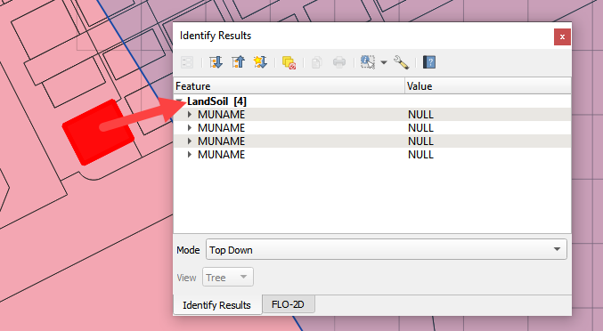

Step 12. Alternate infiltration method 2
----------------------------------------

1. Convert the data to Raster.

2. Open the Processing Toolbox and search Rasterize.

.. image:: ../img/Advanced-Workshop/Module168.png

3. Click the Rasterize (vector to raster)

4. Set the Input layer to LandSoil

5. Set the Field to CN

6. Output size = Georeferenced Units

7. Resolution = 25ft

8. Output Extent = AOI Layer

9. Click Run

.. image:: ../img/Advanced-Workshop/Module169.png

10. Collapse the FLO-2D widgets and click the Grid Tools widget.

11. Click the Interpolate from Raster button.

12. Fill the Elevation Sampling form and click OK to calculate and OK to close the message.

.. image:: ../img/Advanced-Workshop/Module170.png

Step 13. Export infiltration data.
----------------------------------

1. Find the Grid Layer.

2. Right click it and click Export / Save Features As.

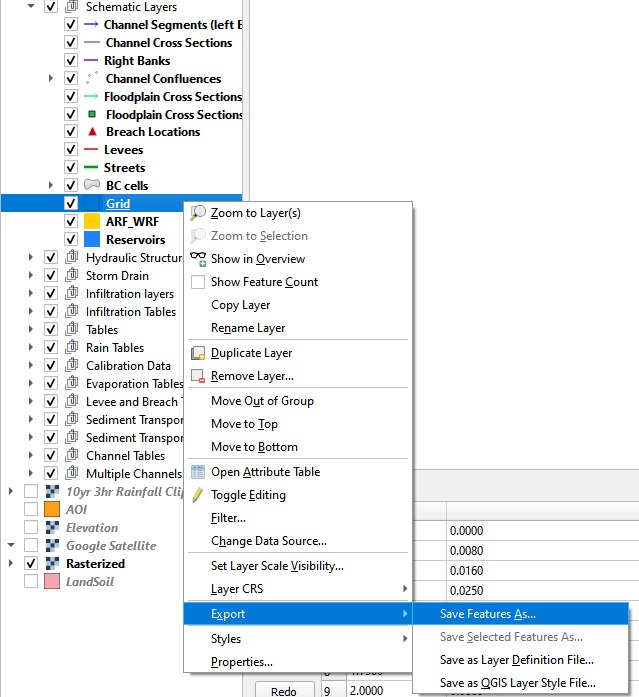

3. Set the format to CSV.

4. Save the file to Hydrology\CurveNumberGrid.csv.

5. The coordinates are EPSG 2229.

6. The only necessary fields are fid and elevation.

7. Click OK to create the data.

.. image:: ../img/Advanced-Workshop/Module172.png

Step 14. Recalculate the elevation.
-----------------------------------

1. Repeat Step 5 (Interpolate Elevation) and return here.

Step 15. Export INFIL.DAT
-------------------------

1. Click the Control Variables button.

.. image:: ../img/Advanced-Workshop/Module173.png

2. Turn on the Infiltration switch, fill the form and click Save.

.. image:: ../img/Advanced-Workshop/Module174.png

3. Click the Export button.

.. image:: ../img/Advanced-Workshop/Module175.png

4. Save the data to the Hydrology folder.

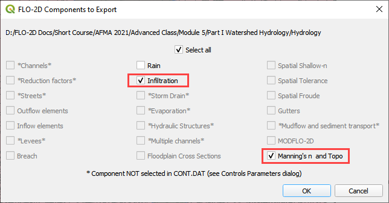

Step 16. Format the CN data
---------------------------

1. Open both files side by side in NotePad++ or Excel

2. Set up the new CN data in the proper format.

3. Number of spaces between data is not important.

4. Block mode in Notepad is Alt-Click and then Shift-Alt-Click the end of the file.

.. image:: ../img/Advanced-Workshop/Module177.png

5. The final step is to replace the data on the left with the data on the right.

6. Save and close INFIL.DAT.

Step 17. Reload the infiltration data.
--------------------------------------

1. Click the import individual data into Schema layer button.

.. image:: ../img/Advanced-Workshop/Module178.png

2. Choose the cont.dat file and click Open.

.. image:: ../img/Advanced-Workshop/Module179.png

3. Make sure the only option is Infiltration and click OK and click OK to close the message.

.. image:: ../img/Advanced-Workshop/Module180.png

4. The curve number values are now correct.

5. Click the scsn field to sort the curve number from high to low to validate the range of data.

.. image:: ../img/Advanced-Workshop/Module181.png

Step 18. Save, export, and run
------------------------------

1. This is a good point to save project.

.. image:: ../img/Advanced-Workshop/Module046.png

2. Export the data files to the Project Folder in Advanced Class Folder

3. Part I Watershed Hydrology\Watershed Export.

.. image:: ../img/Advanced-Workshop/Module089.png

.. image:: ../img/Advanced-Workshop/Module182.png

4. Click the Run FLO-2D Icon.

.. image:: ../img/Advanced-Workshop/Module051.png

5. Set the Project path and the FLO-2D Engine Path and click OK to start the simulation.

.. image:: ../img/Advanced-Workshop/Module183.png

Step 19. Map the velocity vectors and import them into QGIS
-----------------------------------------------------------

1. The first run is used to identify an area of concentrated flow and build a Floodplain Hydrograph.

2. Close the run.

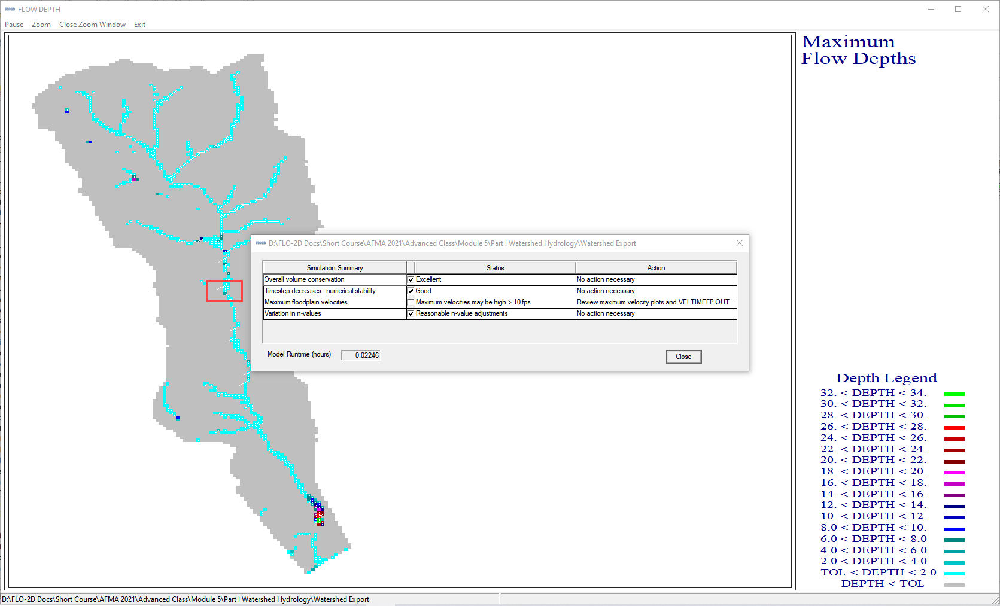

3. Run Mapper.

.. image:: ../img/Advanced-Workshop/Module185.png

4. Set the paths and click OK.

.. image:: ../img/Advanced-Workshop/Module186.png

5. Load the data into Mapper.
   Click File/Read FLO-2D results.

.. image:: ../img/Advanced-Workshop/Module187.png

6. Find the FLPLAIN.DAT and click Open.

.. image:: ../img/Advanced-Workshop/Module187.png

7. Plot the Velocity Vector Map.
   Scale factor = 1.

.. image:: ../img/Advanced-Workshop/Module188.png

8. Close Mapper.

9. Drag the Velocity Vector shapefile onto the map.

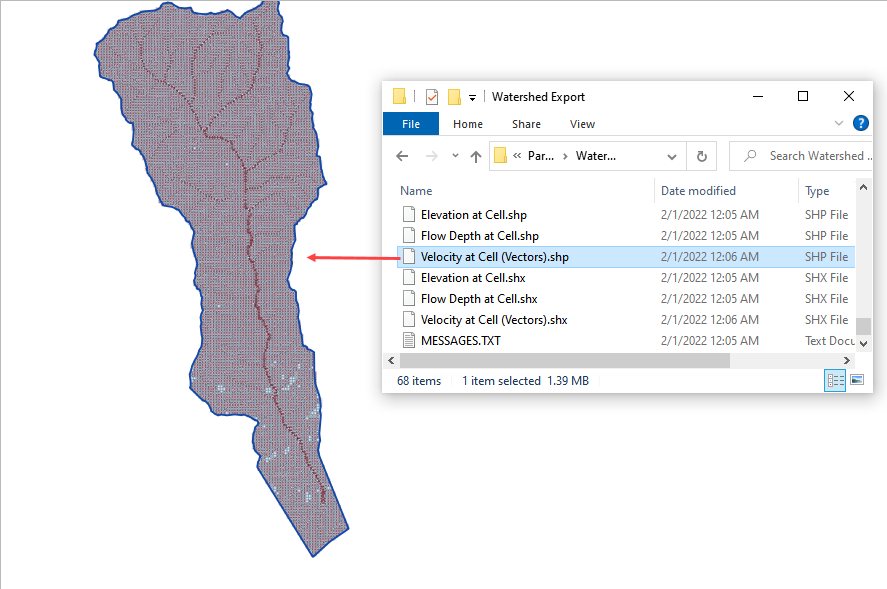

Step 20. Create a floodplain cross section.
-------------------------------------------

1. Zoom in to the apex of the alluvial fan.

.. image:: ../img/Advanced-Workshop/Module190.png

2. Click the Digitize Floodplain Cross Section button.

3. Draw the cross section across the canyon.

4. click OK button to complete the feature.

5. Click the Save button to load the Widget.

6. Set the Flow direction.

7. Click Schematize.

.. image:: ../img/Advanced-Workshop/Module191.png

Step 21. Save, export, and run again
------------------------------------

1. This is a good point to save project.

.. image:: ../img/Advanced-Workshop/Module046.png

2. Export the data files to the Project Folder in Advanced Class Folder

3. Part I Watershed Hydrology\Watershed Export.

.. image:: ../img/Advanced-Workshop/Module089.png

.. image:: ../img/Advanced-Workshop/Module192.png

4. Click the Run FLO-2D Icon.

.. image:: ../img/Advanced-Workshop/Module051.png

5. Correct the paths and click OK to start the simulation.

.. image:: ../img/Advanced-Workshop/Module183.png

Module 5 Part II – Watershed Mudflow Model
==========================================

**Overview**

In this tutorial, create a watershed model to estimate the runoff for a mudflow condition.
Part I will set up the watershed rainfall runoff model.
Part II will apply mudflow parameters to the watershed hydrograph.

.. _required-data-6:

Required Data
--------------

The required data is in Module 5 Part II Mudflow folder.
This is a new project.
Please save and close the previous QGIS.

======== =========================================
**File** **Content**
======== =========================================
\*.qgz   QGIS data files
\*.gpkg  FLO-2D Geopackage
\*.xlsx  Cv Calculator
\*.DAT   Mudflow parameters
\*.pdf   Mudflow guidelines and USGS sample report
\*.shp   Mudflow volume polygon
======== =========================================

Citation List for this Tutorial:

O’Bri

en, J.S., (2020).
Simulating Mudflow Guidelines.
FLO-2D Software, Inc., Nutrioso, Arizona.

.. _step-1-load-the-project-3:

Step 1: Load the project
------------------------

1. Start with the project from Module 5 Part II.
   This is the completed watershed project.

2. If necessary, load it into QGIS.
   Open QGIS and drag the Watershed Module 5.qgz file into the project.

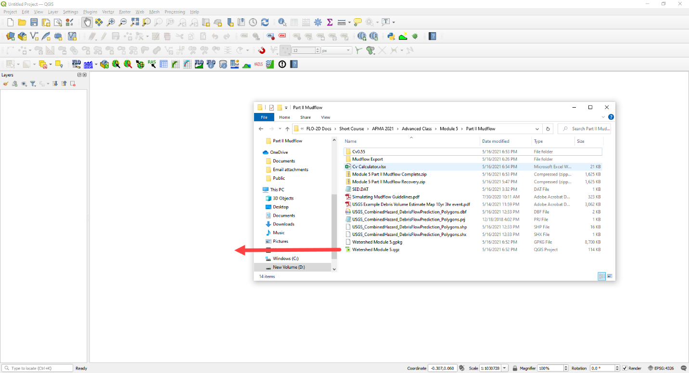

3. Click Yes to load the model.
   If you don’t see this window, you might need to delete the \*.gpkg in Module 5 Part I and try again.
   The data needs to come from Part II.

.. image:: ../img/Advanced-Workshop/Module194.png

\**\*

**Important note:** If the project doesn’t look like the following image, you might be using the watershed model.

1. Close QGIS

2. Delete the \*.qgz and \*.gpkg in Part I and Part II folder.

3. Extract the Module 5 Mudflow Part II Recovery.zip

4. Reload the project.

\**\*

.. image:: ../img/Advanced-Workshop/Module195.png

Step 2. Create inflow hydrograph
--------------------------------

1. Open the HYDROG Program.

.. image:: ../img/Advanced-Workshop/Module196.png

2. Find the Watershed Export Project and click ok.

.. image:: ../img/Advanced-Workshop/Module197.png

3. Click the Plot Cross Section hydrographs button.

.. image:: ../img/Advanced-Workshop/Module198.png

4. Select cross section 1 and click OK.

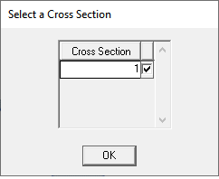

5. Click the Return to Menu button.

.. image:: ../img/Advanced-Workshop/Module200.png

6. Click the Print Text to File button.
   This creates a file named “1”.
   Click ok to close the message.
   **Close HYDROG**

.. image:: ../img/Advanced-Workshop/Module201.png

7. Load the file named “1” into NotePad++ or Excel.

8. Trim data so that it has 2 tab-delimited columns.

9. Ctrl-A will select all.
   Ctrl-C will copy.

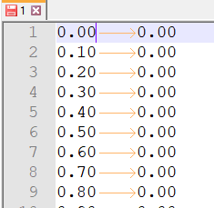

Step 3. Assign the hydrograph to a BC node.
-------------------------------------------

1. In QGIS, collapse the FLO-2D Widgets and click the Boundary Condition Editor widget.

2. If the Table Editor is blank, click Add Time Series button.

3. Name the Time Series 10yr 3hr NoMud.

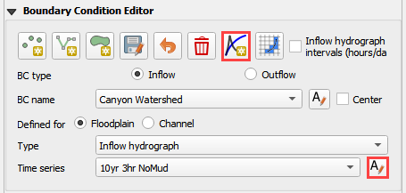

4. Add the hydrograph from the clipboard into the Table widget.

5. Click the first cell and click Paste.

.. image:: ../img/Advanced-Workshop/Module204.png

6. Go back to the widget and click the Schematize button.

.. image:: ../img/Advanced-Workshop/Module205.png

Step 4. Set a global bulking factor.
------------------------------------

1. Click the Control Variables table.

.. image:: ../img/Advanced-Workshop/Module206.png

2. Add a Bulking Concentration, set Mud switch to None, and click Save.

.. image:: ../img/Advanced-Workshop/Module207.png

Step 5. Export and run the model
--------------------------------

1. Export the FLO-2D Data files.
   Click OK.

.. image:: ../img/Advanced-Workshop/Module123.png

.. image:: ../img/Advanced-Workshop/Module208.png

2. Select the Module 5\Part II Mudflow\Mudflow Export folder.

.. image:: ../img/Advanced-Workshop/Module209.png

3. The data is ready to run.

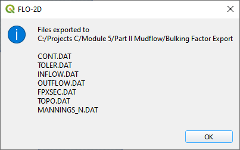

4. Set the Paths and Run the model.

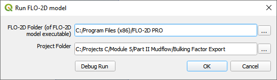

Step 6. Set up the mudflow.
---------------------------

1. Open the Cv Calculator.xlsx file.

.. image:: ../img/Advanced-Workshop/Module212.png

2. Copy the first 3 columns into the clipboard.

.. image:: ../img/Advanced-Workshop/Module213.png

3. Click the Boundary Condition Editor.

4. Click Add a Time series button.

5. Name the new time series.

.. image:: ../img/Advanced-Workshop/Module214.png

6. Paste the data from Excel into the Table Editor widget.

.. image:: ../img/Advanced-Workshop/Module215.png

7. Go back to the BC widget and click the Schematize button.

.. image:: ../img/Advanced-Workshop/Module205.png

8. The SED.DAT file is also required but QGIS cannot make it right now.
   it is not a difficult file to create.
   The GDS or any Text Editor can make it.

.. image:: ../img/Advanced-Workshop/Module216.png

.. image:: ../img/Advanced-Workshop/Module217.png

See Simulating Mudflow Guidelines to get instructions for the soil viscosity and yield stress parameters.
These parameters are generally retrieved from laboratory studies but if no study is available, a conservative dataset of Glenwood 4 can be applied.

Step 5. Export and run the *Mudflow* model
------------------------------------------

1. Click the Control Variables table.

.. image:: ../img/Advanced-Workshop/Module206.png

2. Set the Bulking Concentration to 0.00, set Mud switch to Mud/Debris, and click Save.

.. image:: ../img/Advanced-Workshop/Module218.png

3. Export the FLO-2D Data files.
   Click OK.

.. image:: ../img/Advanced-Workshop/Module123.png

.. image:: ../img/Advanced-Workshop/Module208.png

4. Select the Module 5\Part II Mudflow\Cv0.55 folder.

.. image:: ../img/Advanced-Workshop/Module219.png

5. The data is ready to run.

.. image:: ../img/Advanced-Workshop/Module220.png

6. Correct the paths and click OK to start the simulation.

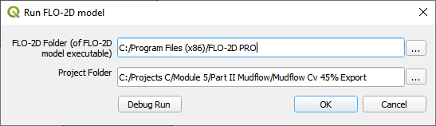