Mudflow Part 1 - Create a Watershed Model
==========================================

**Overview**

In this tutorial, create a watershed model to estimate the runoff.
Part 1 will set up the watershed rainfall runoff model.
Part II will apply mudflow parameters to the watershed hydrograph.

Required Data
-------------

The required data is in Module 5 Watershed Mudflow Tutorial.
This is a new project.
Please save and close the previous QGIS.

======== ====================== ==========
**File** **Content**            Location
======== ====================== ==========
\*.qgz   QGIS data files
\*.gpkg  FLO-2D Geopackage
\*.tif   Elevation data
\*.shp   LandSoil shapefile     Hydrology
\*.tif   CN and rainfall raster Hydrology
\*.asc   NOAA rainfall data     Hydrology
\*.shp   AOI                    Shapefiles
======== ====================== ==========

Step 1: Load the project
------------------------

1. Start with the project from Module 5 Part I Watershed Hydrology.

2. If necessary, load it into QGIS.
   Open QGIS and drag the Watershed Module 5.qgz file into the project.

3. Save the project.

.. image:: ../img/Advanced-Workshop/Module145.png

4. Click yes to load the model.

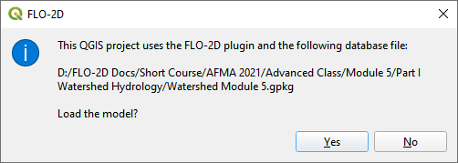

Step 2. Load the hydrography map
--------------------------------

1. Open this website: https://apps.nationalmap.gov/services/

2. Click on the Theme Overlays button.

3. Find the National Hydrography Dataset.

4. Right click the WMS/WMTS link and click Copy Link Address.

5. Click the Open Data Source Manager button.

.. image:: ../img/Advanced-Workshop/Module147.png

6. Select the WMS/WMTS tab and click New.

.. image:: ../img/Advanced-Workshop/Module306.png

7. Enter the name and paste the URL into the top two boxes and click OK.

8. Click Connect.
9. Select 4 flowlines.
10. Set the Image Encoding to PNG.
11. If the CRS is not set, set it to EPSG 4326.
12. Name the data Flow Line and click Add.

.. image:: ../img/Advanced-Workshop/Module308.png

13.  Click close to close the Data Source Manager.

14. Double click the Flow Directions Layer.

15. Click Transparency and set the Opacity to 50%.

.. image:: ../img/Advanced-Workshop/Module309.png

16. Doubleclick the Elevation layer and click Symbology.

17. Set the Render to Hillshade and click OK.

.. image:: ../img/Advanced-Workshop/Module310.png

Step 3. Review the watershed
-----------------------------

1. Scan the AOI and hydrography map to see if the feature is collecting all the water from the watershed above the point
   of concentration where the mudflow is most likely to occur.

2. This is typically at the apex of the fan.

3. The AOI shapefile needs an integer cell_size field.
   In this case, the cell size is 100ft.

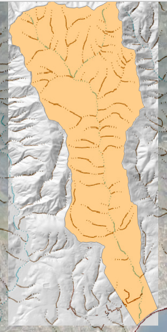

Step 4. Create the grid
------------------------

1. Click the create grid button.

2. Select Use External Layer.

3. Set the layer to AOI.

4. Set the Cell size field to cell_size.

5. Click OK to start the calculation and OK to close the message form.

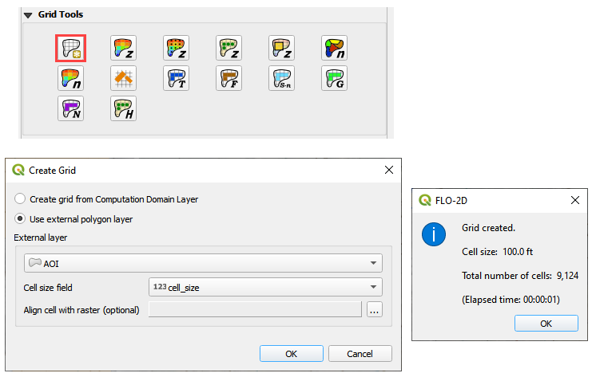

Step 5. Interpolate Elevation
------------------------------

1. Click the Interpolate from Raster button.

2. Fill the form and click OK.

3. Click OK to close the message form.

.. image:: ../img/Advanced-Workshop/Module152.png

Step 6. Calculate Roughness
---------------------------

1. Check the LandSoil Layer is turned on.

.. image:: ../img/Advanced-Workshop/step6.png

2. Click the Calculate roughness button.

3. Fill the form and click OK.

4. Click OK to close the message form.

.. image:: ../img/Advanced-Workshop/Module153.png

Step 7. Save and create a recovery point
-----------------------------------------

1. Save QGIS.

2. Close QGIS.

3. Zip the \*.qgz and \*.gpkg together.

4. Rename the zipped file Part I Watershed Hydrology Elev and Man OK.zip

5. Reload the project.

Step 8. Determine the total rainfall
------------------------------------

1. In an internet browser, go here: https://hdsc.nws.noaa.gov/hdsc/pfds/

2. Click on California.

.. image:: ../img/Advanced-Workshop/Module154.png

3. Scroll down to the table data and change the Tab to Supplementary Information.

4. Change PF in GIS Format to 10yr, 3-hr and click submit.

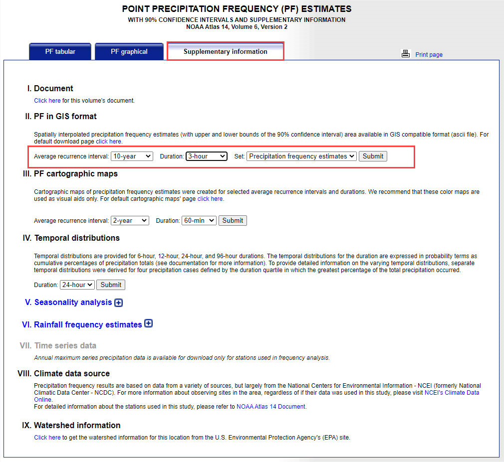

5. Extract the new data into the project/Hydrology folder.

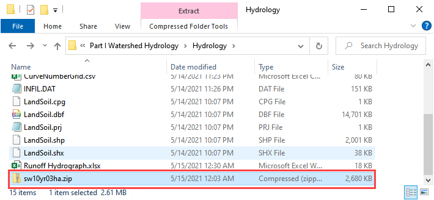

6. Click the User Layers Group.

7. Drag the sw10yr03ha.asc file onto the map.

.. image:: ../img/Advanced-Workshop/Module157.png

8. These pixels are rainfall in inches \* 1000.

Step 9. Sample the rainfall raster
----------------------------------

1. Use the ID tool to find the peak rainfall.

4. In this case, the lightest color is the highest rainfall.

5. 2.98 inches.

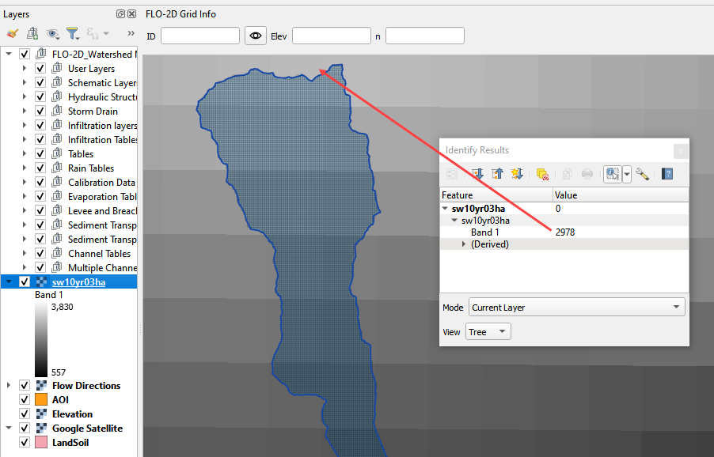

Step 10. Set up the rainfall
----------------------------

1. Collapse the FLO-2D widgets and click Rain Editor.

2. Enter the total rainfall.

3. Select or create a rainfall distribution.

   - C:\\Users\\Public\\Documents\\FLO-2D PRO Documentation\\Rainfall Distributions

4. Check the Spatial Variation (Depth Area Reduction)

.. image:: ../img/Advanced-Workshop/Module162.png

5. Interpolate the rainfall depth reduction factor.

6. Click the AR button.

7. Fill the form.

8. Click OK to calculate the rainARF and OK to close the message.

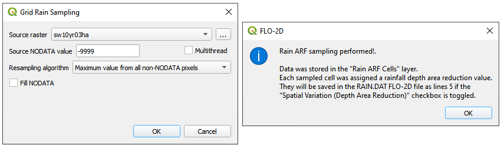

Step 11. Generate the curve number data
----------------------------------------

1. If necessary, add the Plugin Curve Number Generator.

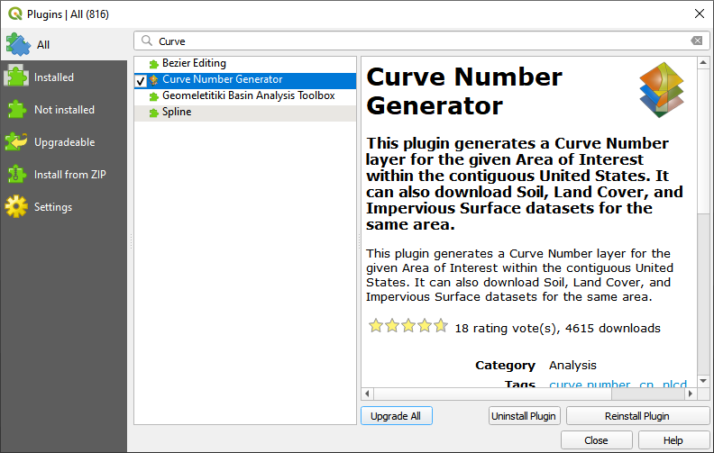

2. Open the Curve Number Generator.

.. image:: ../img/Advanced-Workshop/Module312.png

3.  Set the Area Boundary to Grid.  Check the boxes and click OK.

.. image:: ../img/Advanced-Workshop/Module313.png

4. Click Close when it is finished.

Step 12. Calculate the infiltration
------------------------------------

1. Click the collapse FLO-2D Widgets button and click the Infiltration Editor Widget.

2. Click the Global Infiltration button and fill the form.

3. Click OK to close the form.

.. image:: ../img/Advanced-Workshop/Module164.png

4. Click the Calculate SCS CN button

5. Fill the form and click OK to calculate and OK to close the message.

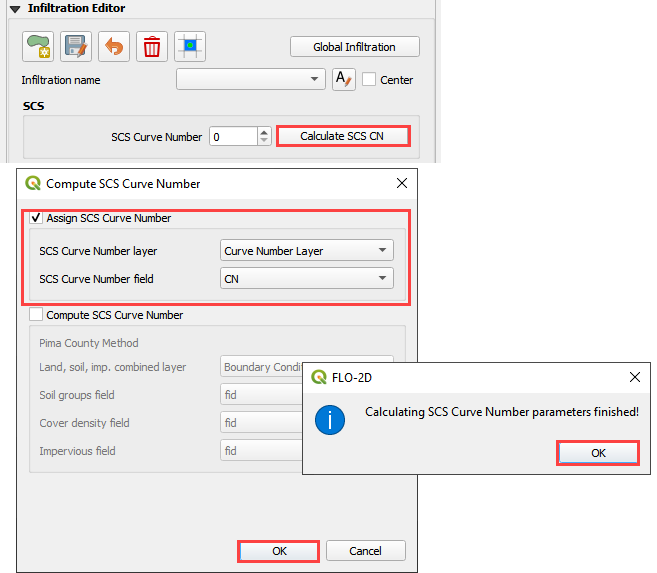

6. Review the Curve Number field to make sure the curve number data is as expected.

.. image:: ../img/Advanced-Workshop/Module166.png

Step 13. Save, export, and run
------------------------------

1. This is a good point to save project.

.. image:: ../img/Advanced-Workshop/Module046.png

2. Set the Control Variables and click Save.

.. image:: ../img/Advanced-Workshop/Module315.png

2. Export the data files to the Project Folder in Advanced Class Folder

3. Part I Watershed Hydrology\Watershed Export.

.. image:: ../img/Advanced-Workshop/Module089.png

.. image:: ../img/Advanced-Workshop/Module182.png

4. Click the Run FLO-2D Icon.

.. image:: ../img/Advanced-Workshop/Module051.png

5. Set the Project path and the FLO-2D Engine Path and click OK to start the simulation.

Step 14. Map the velocity vectors and import them into QGIS
-----------------------------------------------------------

1. The first run is used to identify an area of concentrated flow and build a Floodplain Hydrograph.

2. Close the run.

.. image:: ../img/Advanced-Workshop/Module184.png

3. Run Mapper.

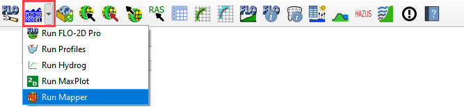

4. Set the paths and click OK.

.. image:: ../img/Advanced-Workshop/Module186.png

5. Load the data into Mapper.
   Click File/Read FLO-2D results.

.. image:: ../img/Advanced-Workshop/Module187.png

6. Find the FLPLAIN.DAT and click Open.

7. Plot the Velocity Vector Map.
   Scale factor = 1.

.. image:: ../img/Advanced-Workshop/Module188.png

8. Close Mapper.

9. Drag the Velocity Vector shapefile onto the map.

.. image:: ../img/Advanced-Workshop/Module189.png

Step 15. Create a floodplain cross section
-------------------------------------------

1. Zoom in to the apex of the alluvial fan.

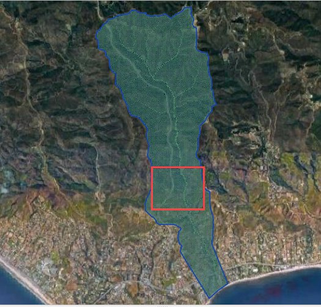

2. Click the Digitize Floodplain Cross Section button.

3. Draw the cross section across the canyon.

4. click OK button to complete the feature.

5. Click the Save button to load the Widget.

6. Set the Flow direction.

7. Click Schematize.

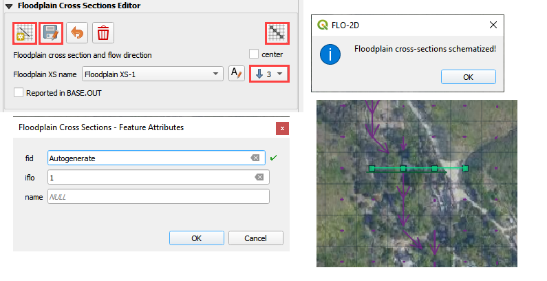

Step 16. Save, export, and run again
------------------------------------

1. This is a good point to save project.

.. image:: ../img/Advanced-Workshop/Module046.png

2. Export the data files to the Project Folder in Advanced Class Folder

3. Part I Watershed Hydrology\Watershed Export.

.. image:: ../img/Advanced-Workshop/Module089.png

.. image:: ../img/Advanced-Workshop/Module192.png

4. Click the Run FLO-2D Icon.

.. image:: ../img/Advanced-Workshop/Module051.png

5. Correct the paths and click OK to start the simulation.

