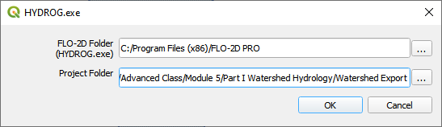
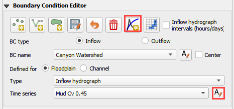
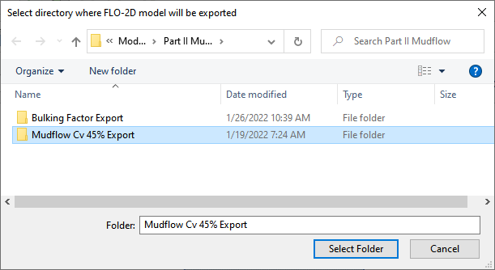
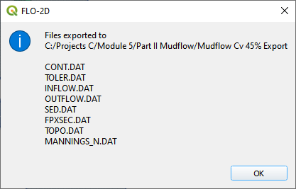

Module 5 - Part 2 – Watershed Mudflow Model
============================================

**Overview**

In this tutorial, create a watershed model to estimate the runoff for a mudflow condition.
Part I will set up the watershed rainfall runoff model.
Part II will apply mudflow parameters to the watershed hydrograph.

Required Data
--------------

The required data is in Module 5 Part II Mudflow folder.
This is a new project.
Please save and close the previous QGIS.

======== =========================================
**File** **Content**
======== =========================================
\*.qgz   QGIS data files
\*.gpkg  FLO-2D Geopackage
\*.xlsx  Cv Calculator
\*.DAT   Mudflow parameters
\*.pdf   Mudflow guidelines and USGS sample report
\*.shp   Mudflow volume polygon
======== =========================================

Citation List for this Tutorial:

O’Brien, J.S., (2020).
Simulating Mudflow Guidelines.
FLO-2D Software, Inc., Nutrioso, Arizona.

Step 1: Load the project
------------------------

1. Start with the project from Module 5 Part II.
   This is the completed watershed project.

2. If necessary, load it into QGIS.
   Open QGIS and drag the Watershed Module 5.qgz file into the project.

.. image:: ../img/Advanced-Workshop/Module193.png

3. Click Yes to load the model.
   If you don’t see this window, you might need to delete the \*.gpkg in Module 5 Part I and try again.
   The data needs to come from Part II.

.. image:: ../img/Advanced-Workshop/Module194.png

**Important note: If the project does not look like the following image, you might be using the watershed model.**

1. Close QGIS

2. Delete the \*.qgz and \*.gpkg in Part I and Part II folder.

3. Extract the Module 5 Mudflow Part II Recovery.zip

4. Reload the project.

.. image:: ../img/Advanced-Workshop/Module195.png

Step 2. Create inflow hydrograph
--------------------------------

1. Open the HYDROG Program.

.. image:: ../img/Advanced-Workshop/Module196.png

2. Find the Watershed Export Project and click ok.

3. Click the Plot Cross Section hydrographs button.

.. image:: ../img/Advanced-Workshop/Module198.png

4. Select cross section 1 and click OK.

.. image:: ../img/Advanced-Workshop/Module199.png

5. Click the Return to Menu button.

6. Click the Print Text to File button.
   This creates a file named “1”.
   Click ok to close the message.
   **Close HYDROG**

.. image:: ../img/Advanced-Workshop/Module201.png

7. Load the file named “1” into NotePad++ or Excel.

8. Trim data so that it has 2 tab-delimited columns.

9. Ctrl-A will select all.
   Ctrl-C will copy.

.. image:: ../img/Advanced-Workshop/Module202.png

Step 3. Assign the hydrograph to a BC node.
-------------------------------------------

1. In QGIS, collapse the FLO-2D Widgets and click the Boundary Condition Editor widget.

2. If the Table Editor is blank, click Add Time Series button.

3. Name the Time Series 10yr 3hr NoMud.

.. image:: ../img/Advanced-Workshop/Module203.png

4. Add the hydrograph from the clipboard into the Table widget.

5. Click the first cell and click Paste.

.. image:: ../img/Advanced-Workshop/Module204.png

6. Go back to the widget and click the Schematize button.

Step 4. Set a global bulking factor.
------------------------------------

1. Click the Control Variables table.

.. image:: ../img/Advanced-Workshop/Module206.png

2. Add a Bulking Concentration, set Mud switch to None, and click Save.

.. image:: ../img/Advanced-Workshop/Module207.png

Step 5. Export and run the model
--------------------------------

1. Export the FLO-2D Data files.
   Click OK.

.. image:: ../img/Advanced-Workshop/Module123.png

.. image:: ../img/Advanced-Workshop/Module208.png

2. Select the Module 5\Part II Mudflow\Mudflow Export folder.

.. image:: ../img/Advanced-Workshop/Module209.png

3. The data is ready to run.

.. image:: ../img/Advanced-Workshop/Module210.png

4. Set the Paths and Run the model.

.. image:: ../img/Advanced-Workshop/Module211.png

Step 6. Set up the mudflow.
---------------------------

1. Open the Cv Calculator.xlsx file.

.. image:: ../img/Advanced-Workshop/Module212.png

2. Copy the first 3 columns into the clipboard.

3. Click the Boundary Condition Editor.

4. Click Add a Time series button.

5. Name the new time series.

6. Paste the data from Excel into the Table Editor widget.

.. image:: ../img/Advanced-Workshop/Module215.png

7. Go back to the BC widget and click the Schematize button.

8. The SED.DAT file is also required but QGIS cannot make it right now.
   it is not a difficult file to create.
   The GDS or any Text Editor can make it.

.. image:: ../img/Advanced-Workshop/Module216.png

.. image:: ../img/Advanced-Workshop/Module217.png

See Simulating Mudflow Guidelines to get instructions for the soil viscosity and yield stress parameters.
These parameters are generally retrieved from laboratory studies but if no study is available, a conservative dataset of Glenwood 4 can be applied.

Step 5. Export and run the *Mudflow* model
------------------------------------------

1. Click the Control Variables table.

.. image:: ../img/Advanced-Workshop/Module206.png

2. Set the Bulking Concentration to 0.00, set Mud switch to Mud/Debris, and click Save.

3. Export the FLO-2D Data files.
   Click OK.

.. image:: ../img/Advanced-Workshop/Module123.png

.. image:: ../img/Advanced-Workshop/Module208.png

4. Select the Module 5\Part II Mudflow\Cv0.55 folder.

5. The data is ready to run.

6. Correct the paths and click OK to start the simulation.

.. image:: ../img/Advanced-Workshop/Module221.png