Tailings Dam Model
==================

**Overview**

In this tutorial, use QGIS and the tailings dam tool to create a tailings dam hydrograph and simulate a tailings dam failure.
The following video covers the Data Assembly Process for a Tailings Dam Study.

.. youtube:: z8epzv95l4k

Required data

The required data is in Module 7.

======== ================= ================
**File** **Content**       **Location**
======== ================= ================
\*.qgz   QGIS data files   Module 7 Folder
\*.gpkg  FLO-2D Geopackage
\*.xml   Tailings dam data
\*.exe   Tailings dam tool
======== ================= ================

Citation List for this Tutorial:

Robertson, P.K., de Melo, L., Williams, D.J., & Wilson, G.W. (2019).
Report of the Expert Panel on the Technical Causes of the Failure of Feijão Dam I.
Pg. 1–71.

http://www.b1technicalinvestigation.com/report.html

TUV SUD Bureau, Periodic Review Dam Mine Safety Stream Bean - Dam I Technical Report.
SP-RC-117/17 Rev.4.Pg.1–265. published on May 17, 2017, Ordinance DNPM No. 70,389 / 2017.

https://worldminetailingsfailures.org/wp-content/uploads/2019/03/TUV_SUD_2017_Periodic_Safety_Review.en_.pdf

**Note:  Copy the link into a browser if broken.**

The following video will use the tutorial steps below to create the tailings dam hydrograph and run the model.

.. youtube:: KJ7NYb_YIHo

Step 1: Load the project
_______________________________________

1. Start with the project from Module 7.

2. If necessary, load it into QGIS.
   Open QGIS and drag the Tailings Dam Module 7.qgz file into the project.

3. Save the project.

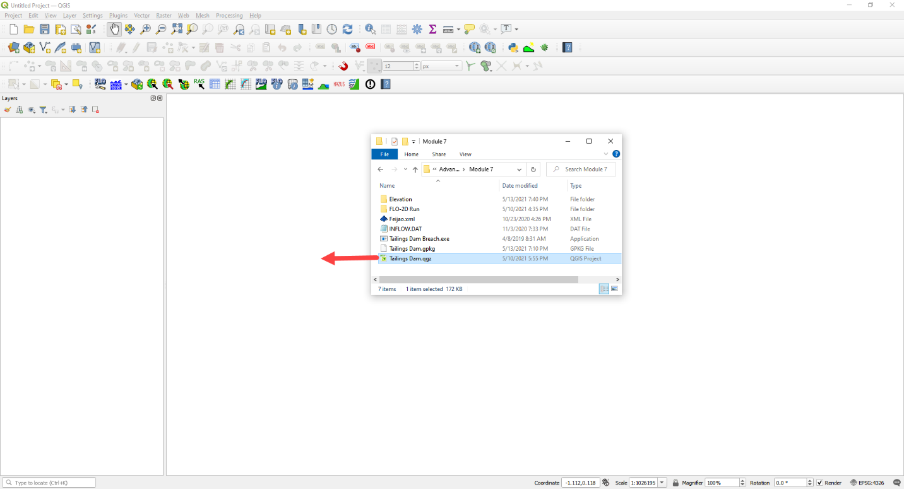

4. Click Yes to load the model.

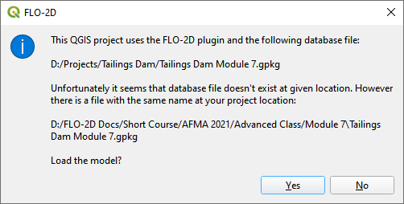

Step 2. Find inflow node
_______________________________________

1. Zoom in on the inflow node.

2. Open the Boundary Condition Editor

3. Check the Center check box.

4. Click the Tailings Dam Loc

.. image:: ../img/Advanced-Workshop/Module240.png

5. Zoom in with the mouse wheel.
   This is the inflow node location where the breach starts.

.. image:: ../img/Advanced-Workshop/Module241.png

Step 3. Run the Tailings Dam Tool
_______________________________________

1. Click the run Tailings Dam Tool button.

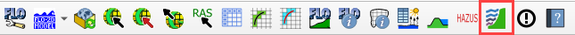

2. Set both file locations to the Module 7 folder.

.. image:: ../img/Advanced-Workshop/Module243.png

Step 4. Review Dam geometry
_______________________________________

Dam Height = 86 m

Downstream Slope = 1.5:1

.. image:: ../img/Advanced-Workshop/Module244.png

Figure 1.
Dam Profile.
Source: Feijao Dam 1 Expert Panel Appendices (2019).

Freeboard = 5m

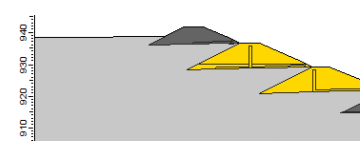

Figure 2.
Dam geometry at crest.
Source: Periodic Safety Review Vale TUV SUD (2017).

Step 5. Dam and Tailings Volume
_______________________________________

Volume Solids: 7.53X10^6 m\ :sup:`3`

Actual Volume: 8X10^6 m\ :sup:`3`

Volume to the crest 8.80X10^6 m\ :sup:`3`

.. image:: ../img/Advanced-Workshop/Module246.png

Figure 3.
Volume Curve 6.22.
Source: Periodic Safety Review Vale TUV SUD (2017).

Step 6. Dam geotech data
_______________________________________

Dam compacted Unit Weight = 19 KN/m\ :sup:`3` = 9279.43 kg/m\ :sup:`3`

Dam Cohesion = 10 KPa = 1,019.72 kg/m\ :sup:`2`

Angle of friction = 30 degrees

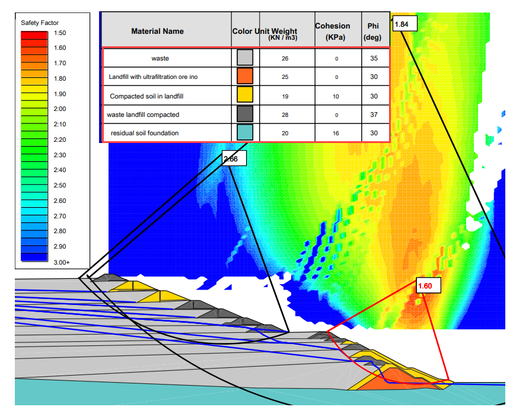

Figure 4.
Adopted Geotechnical Parameters.
Source: Periodic Safety Review Vale TUV SUD (2017).

Step 7. Foundation geotechnical data from TUV report
_____________________________________________________

NSPT silty clay between 5 and 11 strokes

NSPT saprolite horizon between 15 and 40 strokes

Unit weight = 20 KN/m\ :sup:`3` = 2039.44 kg/m\ :sup:`3`

Step 8. Saturated tailings depth
_______________________________________

Dam elevation = 942 m

Water depth = 20 m (max) 5 m (min)

Freeboard 5 m

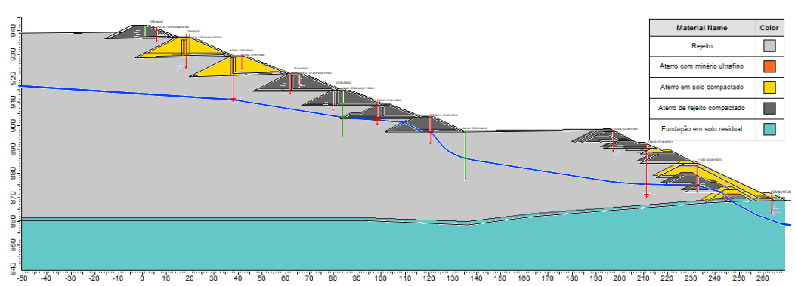

Figure 5.
Overlay of the Interpreted Water Surface and the Cross Section 3-3 Profile.
Source: Periodic Safety Review Vale TUV SUD (2017).

Step 9. Tailings dam tool
_______________________________________

1. Fill the data from the previous pages.  Start with Options/Units = Metric

.. image:: ../img/Advanced-Workshop/Module249.png

2. On the next, Choose the Static Mode and set the Reservoir Level to Medium.

3. Click the Create INFLOW.DAT button.

.. image:: ../img/Advanced-Workshop/Module250.png

4. Set the volume to Vrmax.

5. Change the event time to 0.50 hours.  This variable is highly sensitive to the early hazard zone.
   The report states that in 10 min 75% of the reservoir was drained.

6. Set the max concentration to 0.50 or 0.60.
   This value can be used to test sensitivity of the breach runnout and deposition.

7. The inflow node is 7872.

8. Click the graph on the bottom left shown in the blue rectangle.

.. image:: ../img/Advanced-Workshop/Module251.png

9. Change the tab to Sediment Concentration by Volume.

10. Set the graph to the blue box and Save the INFLOW.DAT file.

11. Save the INFLOW.DAT file to the **Module 7 Export** folder.

.. image:: ../img/Advanced-Workshop/Module252.png

12. Save the Tailings Breach 1.xml file.

.. image:: ../img/Advanced-Workshop/Module291.png

13. Close the Tailings Dam Tool.

Step 10. Import the inflow data
_______________________________________

1. Close the message in QGIS.

.. image:: ../img/Advanced-Workshop/Module292.png

2. Click the Import Components button.

.. image:: ../img/Advanced-Workshop/Module293.png

3. Open the CONT.DAT file.

.. image:: ../img/Advanced-Workshop/Module294.png

4. Uncheck Select All, check Inflow Elements and click OK.

.. image:: ../img/Advanced-Workshop/Module295.png

5. Click ok to close the import message.

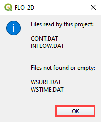

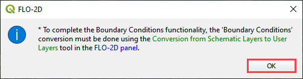

6. Click the Schematized layers to User layers conversion button.

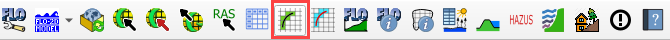

7. Check the boundary conditions box and click OK and then click ok to close the message.

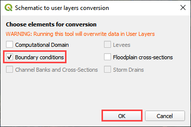

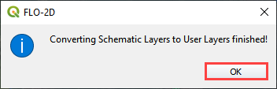

8. Click the Schematize button on the Boundary Condition Editor widget and then close both messages.

.. image:: ../img/Advanced-Workshop/Module305.png

Step 11. Set the Mud/Debris Data
_______________________________________

1. Click the Mudflow / Sediment transport button.

2. Fill the dialog box as shown below and click OK.

.. image:: ../img/Advanced-Workshop/Module302.png

3. Click the Control Variable button.

4. Select Mud/Debris from the drop down box and click Save.

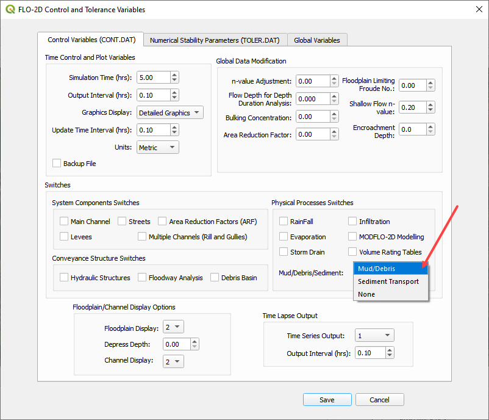

Step 12. Export and run the model
_______________________________________

1. Export the FLO-2D Data files.
   Click OK.

.. image:: ../img/Advanced-Workshop/Module123.png

.. image:: ../img/Advanced-Workshop/Module253.png

2. Select the Module 7 Export folder.

.. image:: ../img/Advanced-Workshop/Module254.png

3. The data is ready to run.

.. image:: ../img/Advanced-Workshop/Module255.png

4. Correct the paths and click OK to start the simulation.

.. image:: ../img/Advanced-Workshop/Module256.png

5. Results imported from Mapper.

.. image:: ../img/Advanced-Workshop/Module257.png

