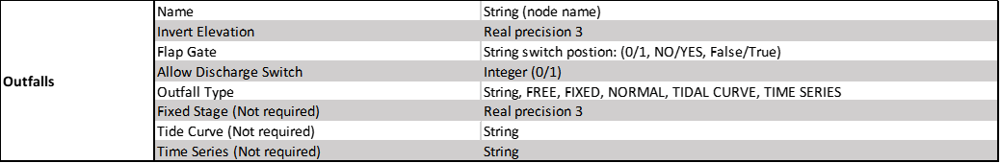

Lesson 3 Advanced - Review Shapefiles
======================================

**Overview**

This lesson will outline how to construct a storm drain network that is ready for FLO-2D Plugin to process.

Required Data

The required data is in Lesson 3 Advanced Storm Drain Shapefiles

================== ============================================
**File**           **Content**
================== ============================================
Point shapefile    Inlets/Junctions, Outfalls, Storage Units
Polyline shapefile Conduit, Pumps, Orifices, Weirs
\*.qgz             Project file
\*.gpkg            Geopackage file
\*.txt             Rating table file
================== ============================================

Step 1: Load the project
_______________________________________

1. Start with the project from QGIS Lesson 1.  This project should be complete up to the end of Lesson 2.

2. If necessary, load it into QGIS.
   Open QGIS and drag the Lesson 1.qgz file into the project.

3. Save the project.

.. image:: ../img/Advanced-Workshop/Module258.png

4. Click Yes to load the model.

.. image:: ../img/Advanced-Workshop/Module259.png

Step 2: Import storm drain shapefiles
__________________________________________

1. Click User Layers Group.

2. Drag the \*.shp files from QGIS Lesson 3 folder and drop the files in the map space.
   The shapefiles should be located in the User Layers group.

C:\\Users\\Public\\Documents\\FLO-2D PRO Documentation\\Example Projects\\QGIS Tutorials\\QGIS Lesson 3\\
Advanced Storm Drain Shapefiles

.. image:: ../img/Workshop/Worksh093a.png

3. Open the attribute table for any of the storm drain layers to review the attributes.

.. image:: ../img/Workshop/Worksh093b.png

Step 3: Review the storm drain attributes
____________________________________________

.. important:: The shapefiles that go with this lesson make excellent templates for your own projects.  Export them
               into a project folder with the project CRS.  You can then delete all of the features and
               copy or digitize your own data into each shapefile.

               Review how to set up a Table Join so you can fill the fields with your data using the field calculator.

               For more information on the data requirements,
               review the **Storm Drain Guidelines** or the **EPA SWMM User Manual**:

               C:\\Users\\Public\\Documents\\FLO-2D PRO Documentation\\flo_help\\Manuals\\FLO-2D Storm Drain Guidelines
               C:\\ProgramData\\Microsoft\\Windows\\Start Menu\\Programs\\EPA SWMM 5.0\\EPA SWMM 5.0 Help.lnk

**L3InletsJunctions.shp** is a point shapefile that contains the Inlets and Junctions.

- Inlets collect flow from the surface and their name should start with “I” or "i", this is a requirement for all inlets
  from type 1 to 5, including manholes.

- Inlets require inlet geometry to define the opening that allows the water to flow from a grid element into a storm
  drain network.  These fields are part of swmmflo.dat, swmmflort.dat.

- Junctions do not share flow with the surface only require the fields that are part of the swmm.inp.

.. warning:: An inlet name must start with “I” or "i".  This is a requirement
             for all inlets type 1 to 5, including manholes.

             Junctions do not share to the surface and do not require a
             special name.

.. image:: ../img/Advanced-Workshop/inlets.png

**L3Outfalls.shp** is a point shapefile that contains the outfalls.

- Outfalls can return flow to the surface and they
  require a switch allowQ to return water back to a grid element or channel cross section.  The require field for
  swmm.inp and swmmoutf.dat files.

**L3StorageUnit.shp** is a polyline shapefile that contains the storage units.

.. note:: As of FLO-2D Plugin version 0.10.64, the storage units are place holders for the finished plugin.

.. image:: ../img/Advanced-Workshop/storageunits.png

.. image:: ../img/Advanced-Workshop/storageunits1.png

**L3Conduits.shp** is a line shapefile that contains the pipes.

- Conduit data only requires fields for the swmm.inp.

- Conduit Upstream Node and Downstream Node fields can be NULL.  They will be filled by the **Auto Assign** tool.

.. image:: ../img/Advanced-Workshop/conduits.png

.. image:: ../img/Advanced-Workshop/conduits1.png

**L3Pumps.shp** is a polyline shapefile that contains the pumps.

- Pump data only requires fields for the swmm.inp.

- Pump Upstream Node and Downstream Node fields can be NULL.  They will be filled by the **Auto Assign** tool.

- Review the EPA SWMM user manual for pump setup instructions.
  C:\\ProgramData\\Microsoft\\Windows\\Start Menu\\Programs\\EPA SWMM 5.0\\EPA SWMM 5.0 Help.lnk

.. image:: ../img/Advanced-Workshop/pumps.png

**L3Orifice.shp** is a polyline shapefile that contains the orifices.

- Orifice data only requires fields for the swmm.inp.

- Orifice Upstream Node and Downstream Node fields can be NULL.  They will be filled by the **Auto Assign** tool.

- Review the EPA SWMM user manual for orifice setup instructions.
  C:\\ProgramData\\Microsoft\\Windows\\Start Menu\\Programs\\EPA SWMM 5.0\\EPA SWMM 5.0 Help.lnk

**L3Weirs.shp** is a polyline shapefile that contains the weirs.

- Weir data only requires fields for the swmm.inp.

- Weir Upstream Node and Downstream Node fields can be NULL.  They will be filled by the **Auto Assign** tool.

- Review the EPA SWMM user manual for weir setup instructions.
  C:\\ProgramData\\Microsoft\\Windows\\Start Menu\\Programs\\EPA SWMM 5.0\\EPA SWMM 5.0 Help.lnk

.. image:: ../img/Advanced-Workshop/weirs.png

.. image:: ../img/Advanced-Workshop/weirs1.png

Step 4. Move back or move on
_____________________________

1. If you came here from Lesson 3, `click here <https://documentation.flo-2d.com/Workshops/Lesson%203.html#step-3-selec
   t-storm-drain-fields-from-the-shapefiles>`_
   to return to the lesson.

2. If you are ready to move on, go to the next lesson.

Step 5. Adding fields to shapefiles
___________________________________________

.. warning:: Before adding or deleting fields from any shapefile in QGIS, create a recovery point of the
             shapefile.  Zip the shapefile into a safe backup folder.  QGIS has a nasty habit of rearranging attribute
             data.

.. note:: This step is for outlining the process only.  All fields are present in the lesson shapefiles.

1. Open the attributes for any storm drain shapefile.

2. Click the Edit pencil and the Add Field button.

.. image:: ../img/Advanced-Workshop/Module263.png

3. Using the tables in Step 2, add a field or two to the shapefiles.

4. In this example a new field called Geom 2 is a real or float and has 7 length and 3 precision.

5. See how the length and precision works.
   No more than 4 number places or 3 decimal places can be entered.

6. Length is the total length (not including “.”) of the number and precision is the number of decimals.

.. image:: ../img/Advanced-Workshop/Module264.png

7. Flapgate is a boolean variable in the Plugin.  Anything that represent on or off should work for this field.
   The SWMM.INP uses NO and YES for flap gates.

.. image:: ../img/Advanced-Workshop/Module264a.png

