Module 9 – Storm Drain Schematize
=================================

**Overview**

This lesson will outline how to construct a storm drain network that is ready for FLO-2D Plugin to process.

.. _required-data-10:

Required Data
--------------

The required data is in Module 8 and Module 9

================== =================
**File**           **Content**
================== =================
Point shapefile    Inlets/Junctions
Polyline shapefile Conduit
Point shapefile    Outfalls
\*.qgz             Project file
\*.gpkg            Geopackage file
\*.txt             Rating table file
================== =================

Step 1: Select components from shapefile layer
----------------------------------------------

1. Display the Storm Drain Editor widget and click the Select components from shapefile layer button.

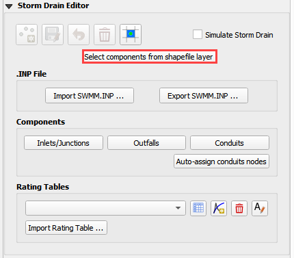

2. Use the Editor to assign the Inlets/Junctions parameters from the shapefile to the attribute table.

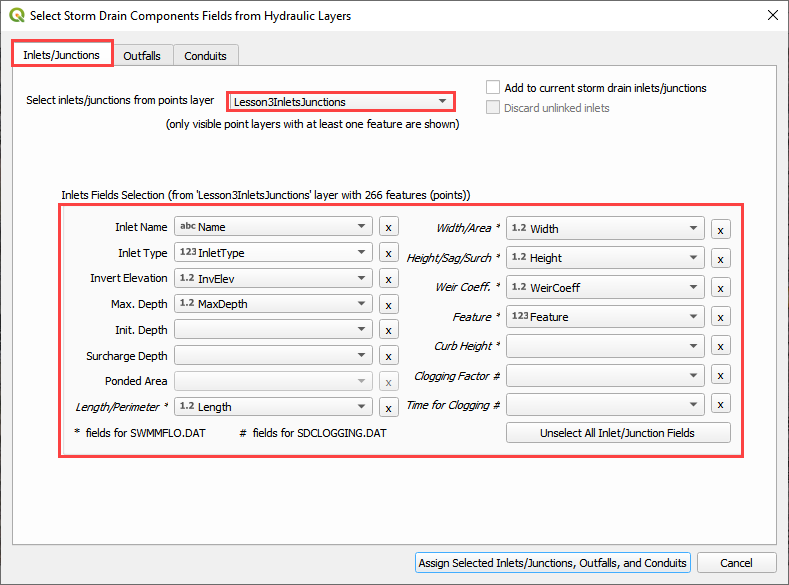

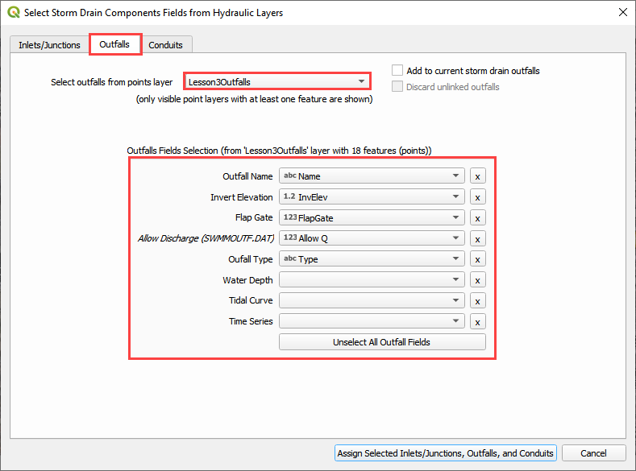

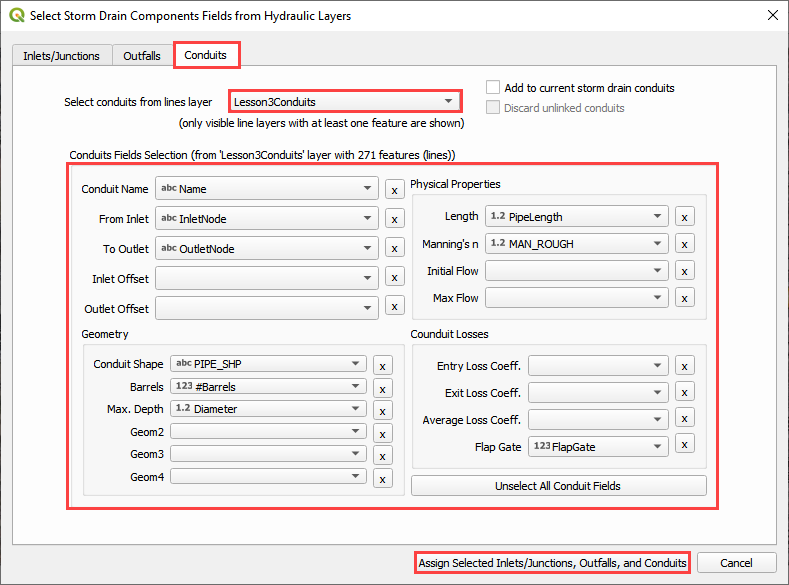

3. Once all features are assigned, click on Assign Selected Inlets/Junctions, Outfalls and Conduits to create the data structures of the Storm Drain
   Components.

4. The following message will be displayed.
   Click OK.

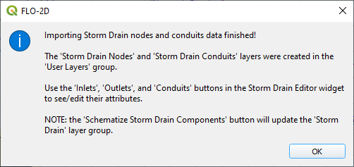

Step 2: Calculate the conduit node connections
----------------------------------------------

1. Display the Storm Drain Editor widget and click on *Inlets/Junctions.*

2. Click the Simulate Storm Drain check box.

3. Click the Auto-assign conduits nodes button.
   This step will fill the upstream and downstream node connections between conduits.
   In order for this step to be successful, the conduits must be oriented from upstream to downstream.
   See the arrows on the conduits.

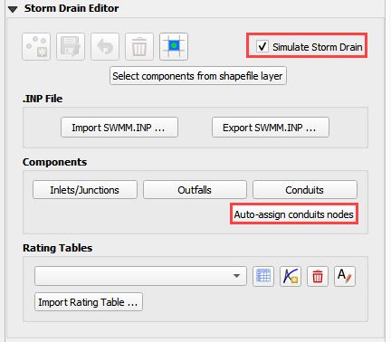

Step 3: Import Rating Tables
----------------------------

1. Click the Import Rating Table Button

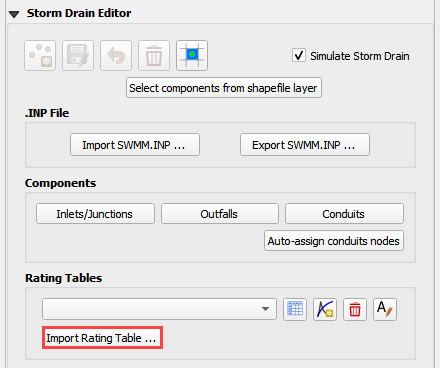

2. Navigate to the I4 table with this path.
   Select the file and click Open.
   It should be in Module 8 Shapefile Folder.

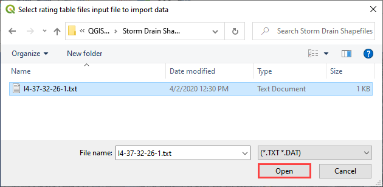

3. The table was imported and assigned to the correct inlet node.

.. image:: ../img/Advanced-Workshop/Module273.png

Step 4: Schematize storm drain components
-----------------------------------------

1. Click on Schematize Storm Drain Components in the Storm Drain Editor widget.

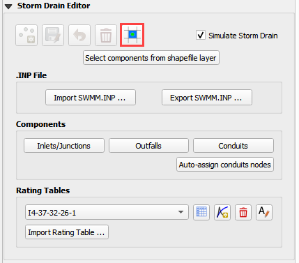

2. Once the storm drain components are schematized, the following dialog will appear.
   Click OK to close.

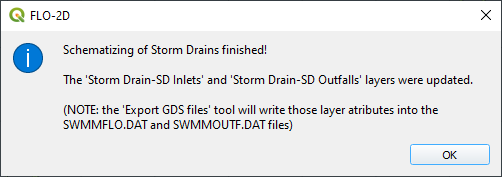

3. The storm drain schematized data layers have been completed and the atribute tables can be reviewed in the Storm Drain layers: Inlets and Outfalls.

4. The storm drain components are now part of the shematized layers in the project.

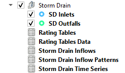

Step 5: Export SWMM.INP file
----------------------------

1. Check the *Simulate Storm Drain* check box.

2. Click on *Export SWMM.INP* button in the **Storm Drain Editor** widget.

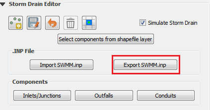

3. Browse to the Project Folder and Save the **SWMM.INP** file.
   The \*.INP file should be named as ‘SWMM.INP’, no other names will be read by FLO-2D model.
   Click *Save*.

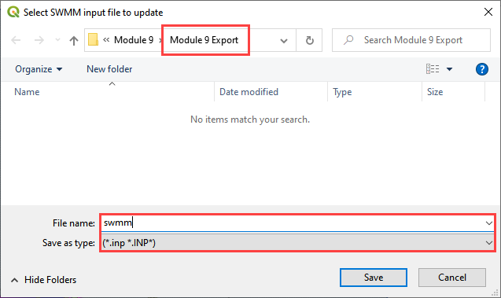

4. The *Storm Drain Control Dialog* is displayed.

5. The control parameters can be entered.

6. The time, date, flow units and other data are hardwired from the FLO-2D surface Control Dialog.

7. All gray out data in the control dialog is hardwired.

8. The data is default for FLO-2D.
   The report_step can be set to any desired value.

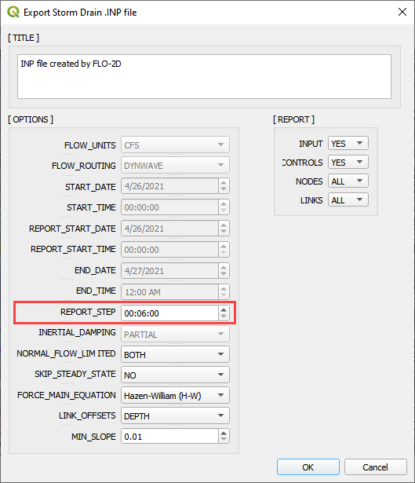

9. A dialog displays stating the features that were written to the \*.INP file.
   Click *OK*.

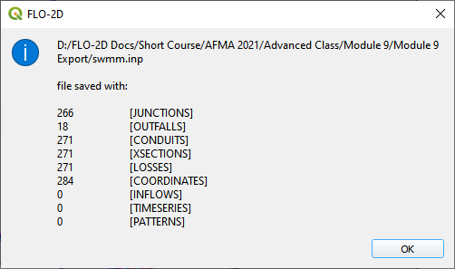

Step 6: Export the project
--------------------------

1. The files that connect inlets and outfalls with the FLO-2D surface layer are created when the GDS Data Files are exported.

2. Click the *Set* *Control Variable* icon and enter the data in the FLO-2D Toolbar.
   The following dialog will be displayed, make sure the *Storm Drain* component switch is selected.
   Click *Save*.

.. image:: ../img/Advanced-Workshop/Module282.png

3. This is a good point to save project.

.. image:: ../img/Advanced-Workshop/Module046.png

4. Export the data files to the Project Folder in Module 9 Export Folder.

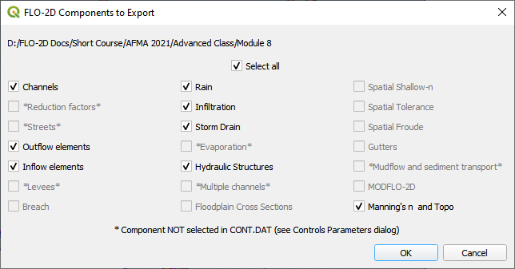

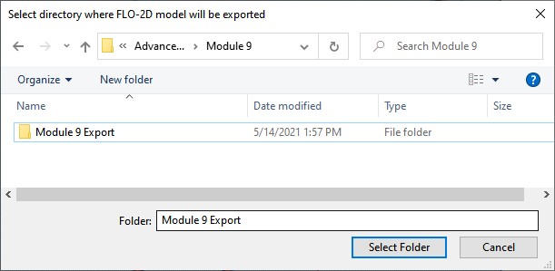

5. All GDS Data files will be created in the selected project folder, including **SWMMFLO.DAT, SWMMFLORT.DAT,** and **SWMMOUTF.DAT** files.

6. The following dialog will be displayed, associated storm drain data files are created when the storm drain switch has been turned ON.

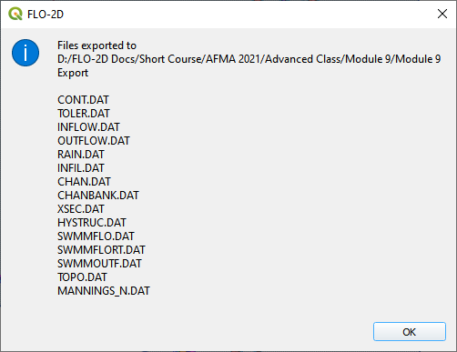

Step 7: Run the simulation
--------------------------

1. Click the *Run FLO-2D* Icon.

2. Correct the paths and click OK to start the simulation.

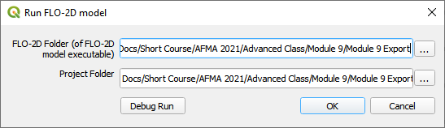

3. While the Storm Drain model is running, review FLO-2D Storm Drain Manual Chapter 6 for more details about reviewing results.
   It is found here:

C:\Users\Public\Documents\FLO-2D PRO Documentation\flo_help\Manuals\FLO-2D Storm Drain Manual Build 19.pdf

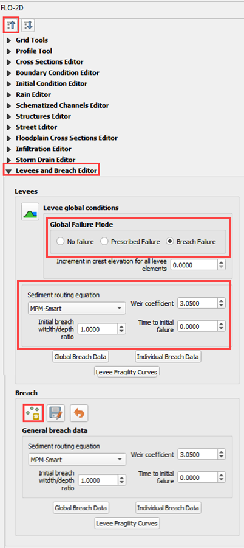

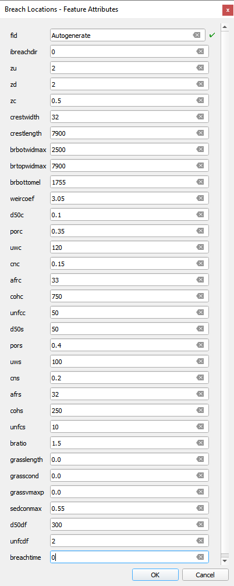
