Lesson 3 Advanced - Storm drain Network
============================================

**Overview**

This lesson will outline how to construct an advanced storm drain network that is ready for FLO-2D Plugin to process.

Required Data

This lesson starts from the end of the Storm Drain - Shapefile Overview.  Please complete that lesson and return here.

================== ============================================
**File**           **Content**
================== ============================================
Point shapefile    Inlets/Junctions, Outfalls, Storage Units
Polyline shapefile Conduit, Pumps, Orifices, Weirs
\*.qgz             Project file
\*.gpkg            Geopackage file
\*.txt             Rating table file
================== ============================================

Step 1: Complete previous lesson
___________________________________
1. Finish |mod8|

.. |mod8| raw:: html

   <a href="https://documentation.flo-2d.com/Advanced-Lessons/Module%208.html"
   target="_blank">Storm Drain - Shapefile Overview</a>

2. The Storm drain overview adds the data and gets the project ready.  Return to this step once it is finished.

Step 2: Select component fields from the shapefiles
_____________________________________________________

1. Expand the Storm Drain Editor widget and click the Select components from shapefile layer button.

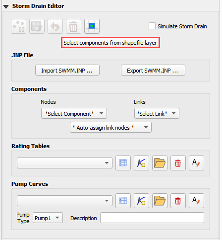

2. Use the Editor to assign all of the fields from the shapefiles.

.. image:: ../img/Workshop/Worksh096.png

.. image:: ../img/Workshop/Worksh097.png

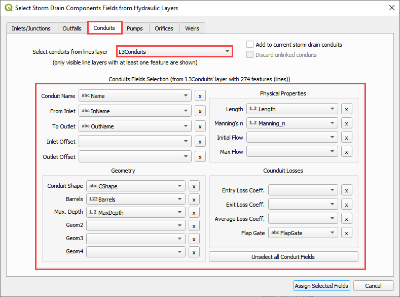

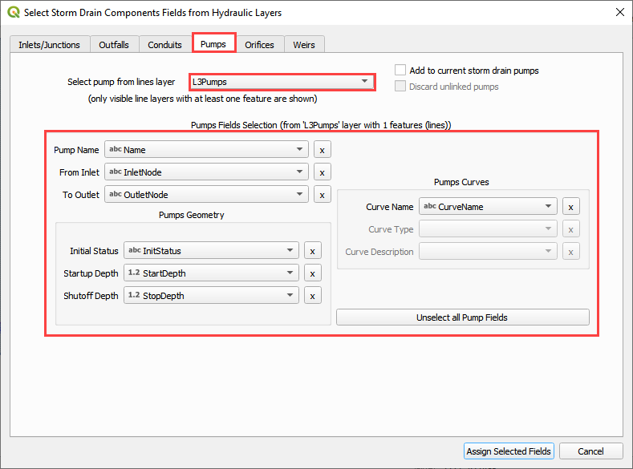

.. image:: ../img/Workshop/Worksh098b.png

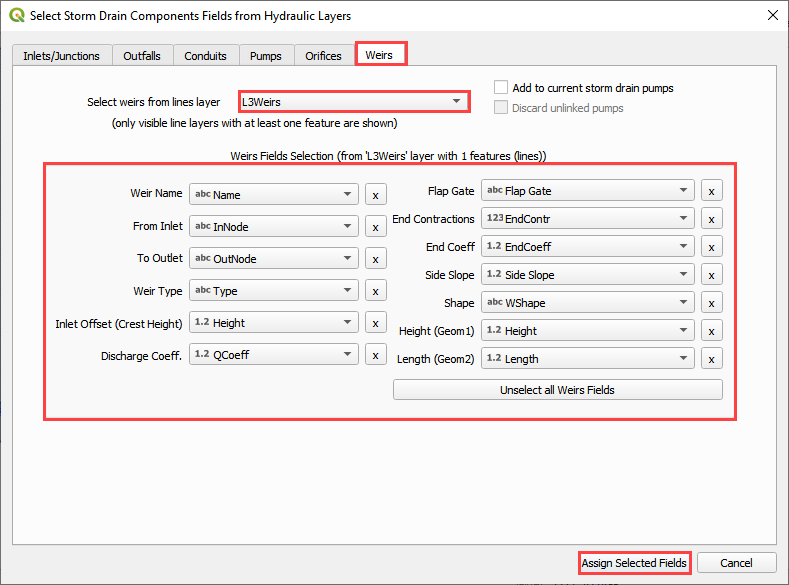

3. Once all features are selected in the drop-down menus, click **Assign Selected Inlets/Junctions, Outfalls and
   Conduits** to create the data structures of the Storm Drain Components.

4. The following message will be displayed.
   Click *OK*.

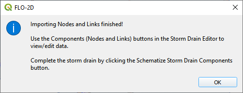

Step 3: Assign the link node connections
_________________________________________

1. Click the Simulate storm drain checkbox.

2. Click the Auto-assign link nodes button and select Conduits.

3. Repeat the step 3.2 for Pumps, Orifices, and Weirs

.. image:: ../img/Workshop/Worksh100.png

4. The success message identifies the number of links that were automatically assigned an Inlet and Outlet node name.

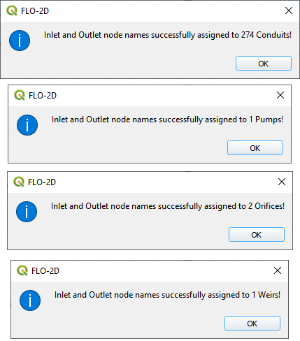

Step 4: Import rating tables
____________________________

1. Click the Import Rating Table Button

.. image:: ../img/Workshop/Worksh101.png

2. Navigate to the I4 table with this path.
   Select the file and click Open.

C:\\Users\\Public\\Documents\\FLO-2D PRO Documentation\\Example Projects\\QGIS Tutorials\\QGIS Lesson 3\\Advanced
Storm Drain Shapefiles\\I4-37-32-26-1.txt

3. The table was imported and assigned to the correct inlet node.

4. If an error was detected because one Type 4 inlet didn't match a selected text file, it
   would be reported to this file:

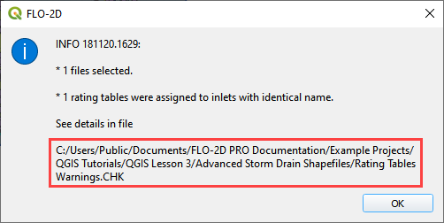

.. warning:: If a Python error pops up because the Rating Table Warnings file can't be written, simply perform this
             step again.  The path correction is applied the second time.

Step 5: Set up the pump data
______________________________________
1. Click the Add pump curve button.

2. Name the Pump "P1".

3. Set the Pump Type to Pump4.

4. Add a description. (not required)

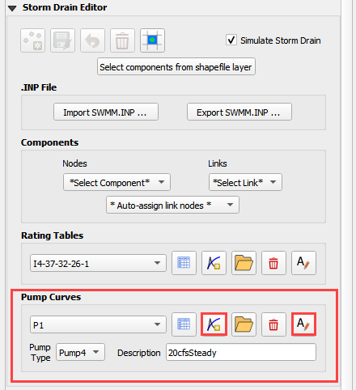

5. Apply a rating table.

.. image:: ../img/Workshop/Worksh101b.png

6. Pump instructions can be found in the EPA SWMM 5.0 Help Document

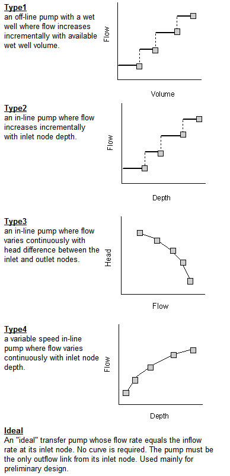

C:\\ProgramData\\Microsoft\\Windows\\Start Menu\\Programs\\EPA SWMM 5.0\\EPA SWMM 5.0 Help

Step 6: Review the orifice data
______________________________________
1. Select Orifces from the Links menu.

.. image:: ../img/Workshop/orifice1.png

2. Review the table to identify the important details for this system.

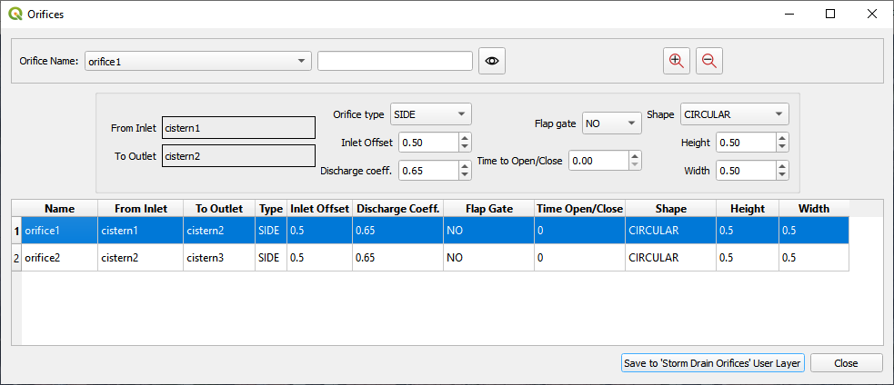

3. The Invert of this system is set by the cistern1, cistern2, and cistern3 features.

4. The inlet offset defines the depth to the opening.

5. The orifice has a 6 inch circular opening that allows water to transfer to the other cisterns.

.. image:: ../img/Workshop/orifice3.png

6. Click close to close the window.

Step 7: Review the weir data
______________________________________
1. Select Weirs from the Links menu.

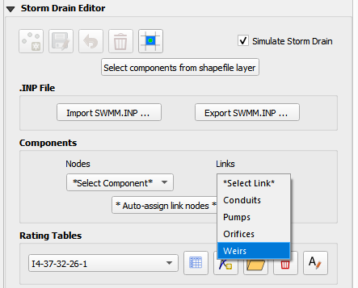

2. Review the table to identify the important details for this system.

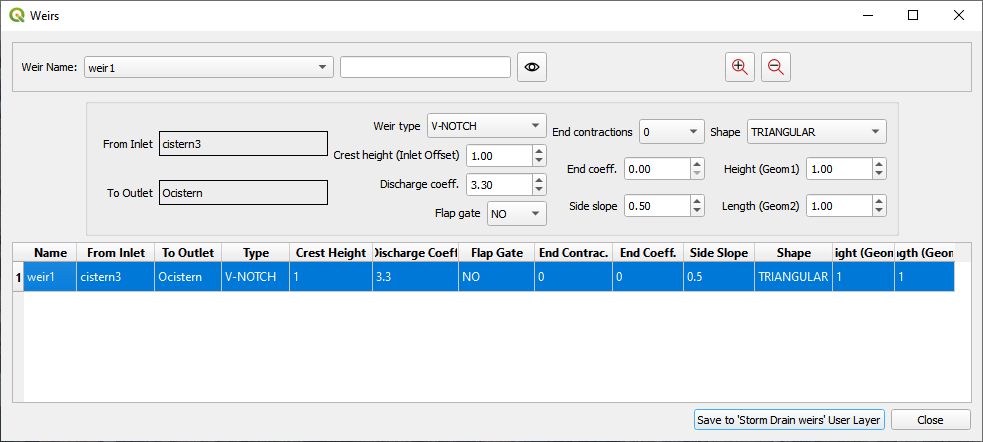

3. This weir is a control that of the cistern overflow.  The water is retained in the system until it fills the tanks
   to 4.5 ft.  At 4.5ft depth, the water flows out of a V-Notch weir into an outfall node with free bubble up discharge
   back onto the surface retention basin to the East.

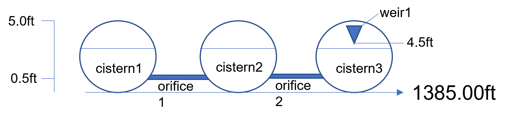

Step 8: Schematize the storm drain components
_________________________________________________

1. Click on Schematize Storm Drain Components in the Storm Drain Editor widget.

.. image:: ../img/Workshop/Worksh104.png

2. Once the storm drain components are schematized, the following dialog will appear.
   Click *OK* to close.

.. image:: ../img/Workshop/Worksh105.png

3. The storm drain schematized data layers have been completed.  The storm drain components are now part of the
   schematized layers in the project.

.. image:: ../img/Workshop/Worksh106.png

Step 9: Export the project
______________________________________

1. Click the Set Control Variable icon.

.. image:: ../img/Workshop/Worksh017.png

2. Verify the data and Click Save.

.. image:: ../img/Workshop/Worksh111.png

3. This is a good point to save project.

.. image:: ../img/Workshop/Worksh083.png

4. Export the data files to the Project Folder in QGIS Lesson 3

.. image:: ../img/Workshop/Worksh021.png

C:\\Users\\Public\\Documents\\FLO-2D PRO Documentation\\Example Projects\\QGIS Tutorials\\QGIS Lesson 3\\QGIS Lesson 3
Export Advanced

5. Click OK to export the main project data files.

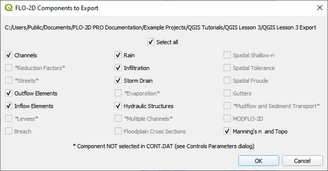

6. Save the swmm.inp file with the next dialog.  Make sure the path is still Lesson 3 Export.

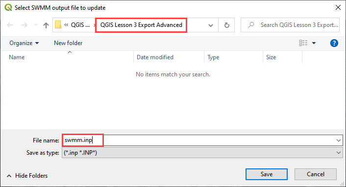

7. Check the .INP control variables and click OK.

.. image:: ../img/Workshop/Worksh021d.png

8. These are the storm drain components that were written to the swmm.inp file.

.. image:: ../img/Workshop/Worksh021e.png

9. The final dialog will be displayed.  The associated storm drain data files are created when the storm drain switch
   has been turned ON.

.. image:: ../img/Workshop/Worksh021f.png

Step 10: Set up the storage unit data
______________________________________

.. note:: The plugin cannot make a storage unit yet.  This step will be finished in EPA SWMM GUI.  The tutorial will be
          updated when the storage units are added to the plugin.

1. Open EPA SWMM GUI

.. image:: ../img/Workshop/stunit001.png

2. Drag the swmm.inp file onto EPA SWMM 5.0 GUI.

3. Zoom to the LID system.

.. image:: ../img/Workshop/stunit002.png

4. Right click the cistern1, cistern2, and cistern3 nodes. Convert them into Storage Units.

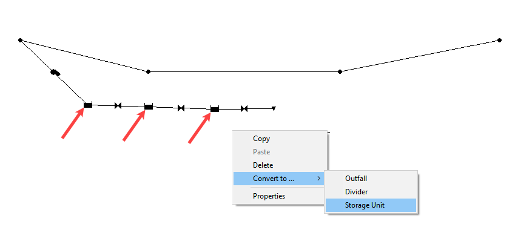

5. Double click each storage unit and set up the storage data.

.. image:: ../img/Workshop/stunit004.png

6. Under the Data Tab, click Storage Curves and the + button to create a curve named storage1.

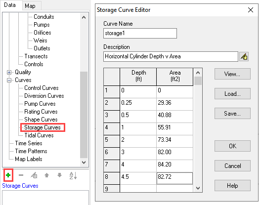

7. Save and close the EPA SWMM GUI.

8. Make a backup of the swmm.inp file in case it is overwritten by a plugin export.

.. image:: ../img/Workshop/stunit006.png

Step 11: Run the simulation
______________________________________

1. Click the Run FLO-2D Icon.

.. image:: ../img/Workshop/Worksh0052.png

2. Set the Project path and the FLO-2D Engine Path and click OK to start the simulation.

3. Set the *FLO-2D Folder*.

C:\\program files (x86)\\flo-2d pro

4. Set the *Project Folder*.

C:\\Users\\Public\\Documents\\FLO-2D PRO Documentation\\Example Projects\\QGIS Tutorials\\QGIS Lesson 3\\QGIS Lesson 3
Export Advanced

.. image:: ../img/Workshop/Worksh113a.png

5. After the storm drain model is complete, review FLO-2D Storm Drain Manual Chapter 6 for more details about reviewing
   results.

