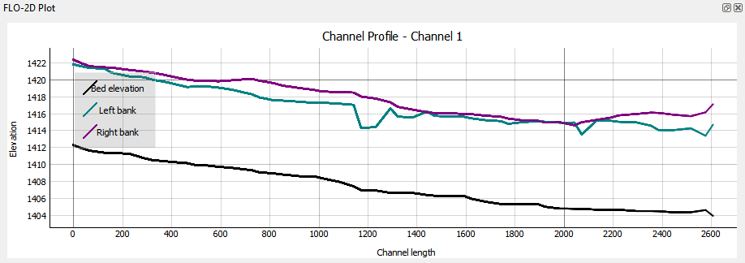
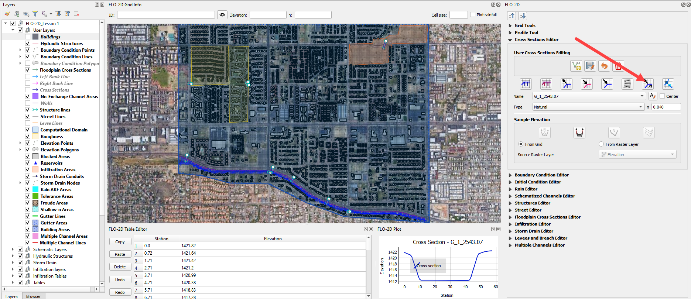

Channel Profile Tool
====================

This tool can be used to view channel profiles.

  

1. This tool will plot profiles of various layers but is most used to
   plot the channel profile.

2. Click the Profile Tool button and click any left bank line.

3. Select the left bank from the menu.

4. The profile plot is loaded into the Plot area and the data is loaded
   into the Table area.

.. image:: img/channelprofile2.png

5. GoTo the Cross Section Editor widget and click the Add Water Surface
   Elevation tool.

   

6. To add water surface elevation to the plot, load the data first from
   the HYCHAN.OUT file. Navigate to the file HYCHAN.OUT and click Open
   to load it into the project.

.. image:: img/channelprofile5.png
  

7. The channel plot will automatically update.

.. image:: img/channelprofile6.png
  