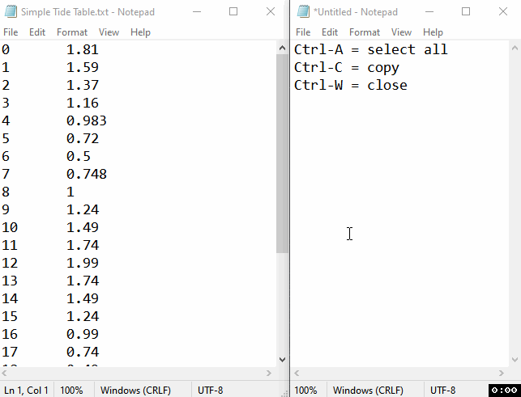
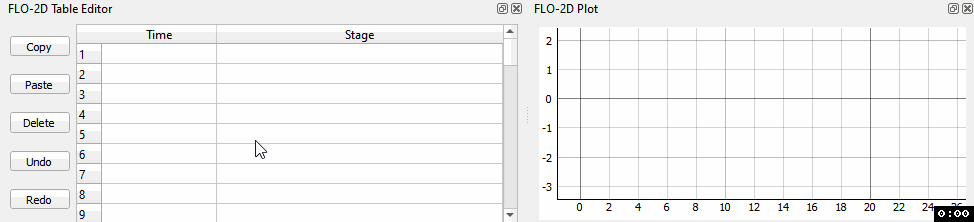
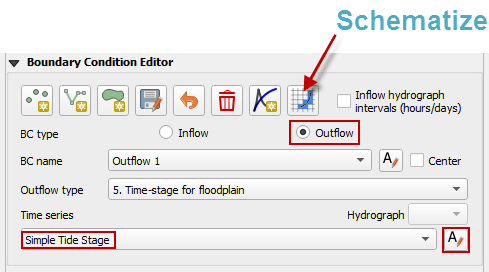
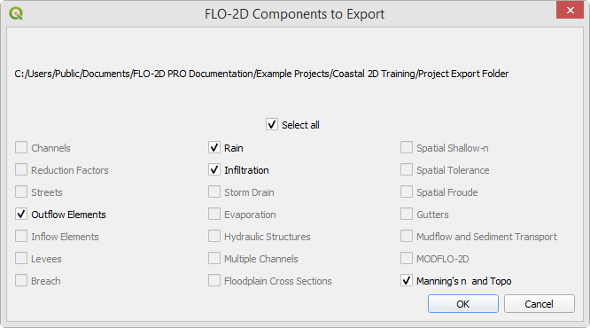
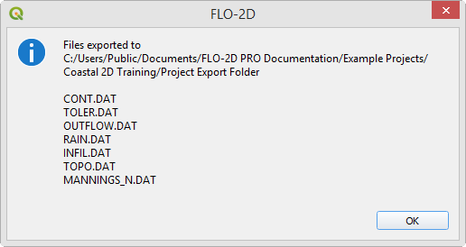
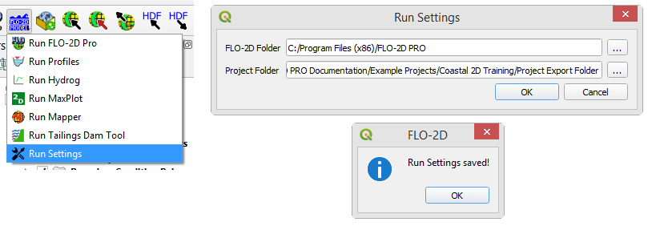
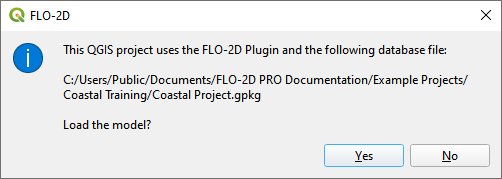

Boundary Conditions
====================
.. youtube::

**Overview**

This module will outline how to add a storm tide to the boundary of the project.

Required Data
-------------

The required data is in project data folder.

============= ===================
**File**      **Content**
============= ===================
\*.txt        Tide table
============= ===================

Data Location:  \\Coastal Training\\Project Data\\Boundary Conditions

Step 1: Prepare the map
-----------------------

1. Uncheck the following layers:

* Infiltration Layers
* Soil Training
* LandUse Training

2. Check Elevation Raster

.. image:: ../img/Coastal/managelayers.gif

3. Double click the Elevation Raster layer.  Set the symbology to Hillshade and click OK.

Step 2: Set up the boundary polygon
-----------------------------------

1. Use the mouse wheel to zoom to the West side of the project where the water leaves the map.

2. Collapse the FLO-2D widgets and click Boundary Condition Editor.

.. image:: ../img/Coastal/hydrology013.png

3. Click the polygon button and draw a polygon across the Cocohatchee outlet.

4. Right click to close the polygon.  Set the type to Outflow and click OK.

5. Click the Boundary Condition Editor Save button.  Set the BC type to Outflow.  Set the Outflow type to 5.

6. In the project folder, open the storm tide text file.

\\Coastal Training\\Project Data\\Boundary Conditions\\Storm Tide Cocohatche 100yr 24hr.txt

7. Place the mouse cursor at the beginning of the line with 0.000 hours.

8. Press Ctrl-Shift End on the keyboard to select all data to the end of the file.

9. Press Ctrl-V to copy the data.  Press Ctrl-W to close the file.

10. Click on the first cell of the FLO-2D Table Editor and click the Paste Button.

11. Name the time series and click the Schematize button.

12. The boundary should look like this:

Step 3. Save, export, and run
------------------------------

1. This is a good point to save project.

.. image:: ../img/Advanced-Workshop/Module046.png

2. It is not necessary to set Control Variables for Boundary Conditions.

3. It may be necessary to close the FLO-2D Run.

4. Export the project.

.. image:: ../img/Advanced-Workshop/Module089.png

4. Save the data to the Project Folder and click OK to close the message.

.. image:: ../img/Coastal/hydrology023.png

4. Click the Run FLO-2D Icon.

.. image:: ../img/Advanced-Workshop/Module051.png

5. Set the Project path and the FLO-2D Engine Path and click OK to start the simulation.

6. Let the project run and continue on to the next step.

Step 4: Create a backup file
----------------------------

1. Close QGIS.

2. Open the project folder.  Select the Coastal Project.gpkg and Coastal Project.qgz files.  Right click them and
   click Sent to/Compressed (zipped) folder.

.. image:: ../img/Coastal/creategrid019.png

3. Name the zipped file.
   It is good to choose a name that identifies project progress.
   For Example: **BCOK.zip**

4. Open QGIS and reload the project.

.. image:: ../img/Coastal/creategrid021.png

5. Click yes to load the model.

