Channel
=======
**THIS MODULE IS UNDER CONSTRUCTION.  DO NOT USE THIS TUTORIAL**

**Overview**

Use this training module to build an urban drainage channel by digitizing the channel components.  Finish it up by
adding tide gates and boundary conditions to the channel.

Required Data
-------------

All data is provided in the Lesson folders.

======== ======================
**File** **Content**
======== ======================
\*.shp   Left bank
\*.shp   Right bank
\*.shp   Cross sections
\*.shp   Points
\*.txt   Tide gate tables
======== ======================

Data Location:  \\Coastal Training\\Project Data\\Channel

.. youtube:: iPdn6yWuwPA

Step 1: Prepare the map
------------------------

1. Use Quick Map Services to load an aerial image onto the map.

.. image:: ../img/Advanced-Workshop/Lesson005.png

.. image:: ../img/Coastal/chan003.png

2. Make sure the Elevation Raster layer is checked on and if necessary change symbology to Hillshade.

.. image:: ../img/Coastal/chan001.png

Step 2: Load the data
---------------------

1. Click the Project Data group.

2. Drag the channel shapefiles onto the map.

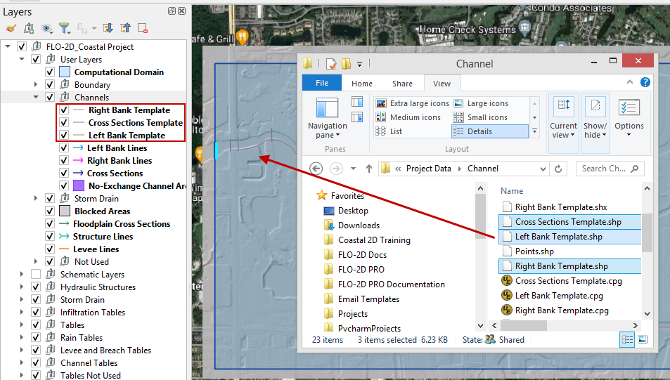

Step 3: Left bank digitize
---------------------------

1. Go to the Project Data Group.  Click the Left Bank layer.

2. Click the select features tool and drag the mouse over the channel to select the line.

3. Ctrl-C will copy the line.

4. Go to the User Layers Group.  Click the Left Bank Lines.

5. Click the Edit Pencil button and Ctrl-V to paste the line into the Left Bank Lines layer.

6. Save the User Bank Lines layer and untoggle the Editor Pencil.

7. Watch the animated image for a demo.

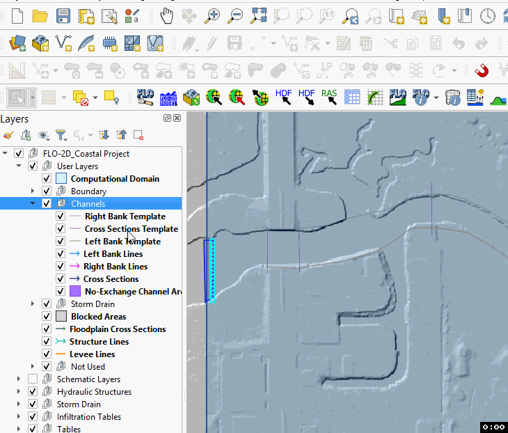

Step 4: Right bank digitize
---------------------------

1. Go to the Project Data Group.  Click the Right Bank layer.

2. Click the select features tool and drag the mouse over the channel to select the line.

3. Ctrl-C will copy the line.

4. Go to the User Layers Group.  Click the Right Bank Lines.

5. Click the Edit button and Ctrl-V to paste the line into the Right Bank Lines layer.

6. Save the Right Bank Lines layer and untoggle the Editor Pencil.

.. image:: ../img/Coastal/copyrightbank.gif

Step 5: Cross sections digitize
-------------------------------

**Important Note: Digitize the cross sections in order from upstream to downstream.**

1. Zoom in on the southeast corner of the map.

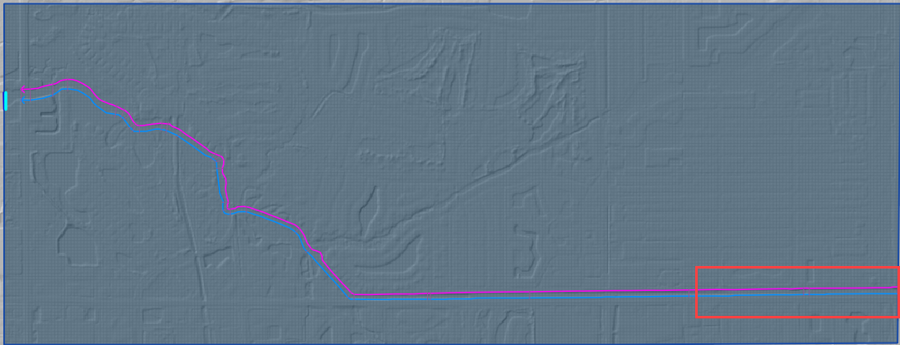

2. Uncheck the Grid layer in the Schematized Layers Group.

3. Go to the Project Data group and double click the Cross Sections layer.

4. Click Symbology and Click Simple Line.  Set the color to red and the stroke width to 1.  Click OK to close the
   window.

.. image:: ../img/Coastal/chan005.png

5. Add the Snapping toolbar.  Right click the toolbar area and check the Snapping toolbar.

.. image:: ../img/Coastal/chan008.png

6. Click the eye tool and set the active layer to Cross Sections.  Set the snapping group to Advanced.

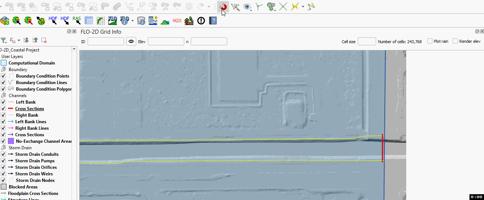

7. Collapse the FLO-2D widgets and click Cross Sections Editor.

8. The first cross section has important restrictions.

-  The line must cross the left bank line

-  The line must start in the same cell as the left bank line.

-  The line must cross the right bank line.

-  The line must start in the same cell as the right bank line.

9. Click the Add Cross Section Lines button on the Cross Section Editor.

.. image:: ../img/Coastal/chan007.png

10. Digitize all 32 cross sections using process shown the following animation.  Use the red lines as guides.

   a. Left click the south side

   b. Left click the north side

   c. Right click to close

   d. Click OK to close attributes window

.. image:: ../img/Coastal/crossection1.gif

11. Handy digitizing features:

- Left click to drop a point.  Right click to close a polyline

- Rotate the scroll wheel to zoom in and out.

- Click and hold the scroll wheel to pan while in editing mode.

- Use the delete key to delete the last point created.

- Use the Esc key to cancel the polyline.

- The point won’t drop until the mouse button is released.

- Redo and undo have limited functionality and can be useful.

12. Once the last cross section is complete.  Click the Save icon on the Cross Sections Editor.

.. image:: ../img/Coastal/chan009.png

13. The final cross sections should look like something like this:

Step 6. Cross section attributes
--------------------------------

1. Go to the User layers group.  Right click the Cross Sections layer and click Open Attribute Table.

2. Click the Edit pencil.

3. Set the field to fcn.

4. Set the n value to 0.03.

5. Click Update All.

8. Click Save button and turn off editor.

9. Close the table.

.. image:: ../img/Coastal/chanattrib.gif

10. Methods to determine the channel geometry.

    a. As-built files are the first source of data but not available in all cases.

    b. Measure the width with QGIS measure tool.

    c. Measure depth from elevation or site visit.

    d. Measure side slope from elevation data or site visit.

Step 7: Sample elevation
------------------------

1. The rectangular and trapezoidal channels need bank elevation.
   Use the Cross Section Editor widget to sample the elevation from the elevation raster.

2. Set the Source to From Raster Layer: Elevation.

3. Click Sample bank elevation for all R, T, and V cross sections.

.. image:: ../img/Advanced-Workshop/Lesson024.png

4. Click Yes to finish the process.

.. image:: ../img/Advanced-Workshop/Lesson025.png

5. See that the Table and Plot now have full data for the R and T cross sections.  The N type cross sections have Place
   Holder Data.

.. image:: ../img/Advanced-Workshop/Mod10_007.gif

6. Select the first Natural cross section and click the Sample current natural cross section elevation button.

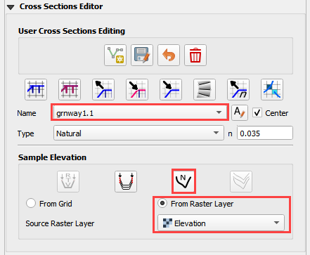

7. Repeat this step for each Natural Type cross section.

**Note: If natural cross sections are present, they can be sampled at the same time using the Sample All button.**

Step 8: Schematize channel
--------------------------

**Important Note: If any of the following procedure needs to be repeated, always return to this Schematize step to reset
the data before trying to modify anything.**

1. Click Schematize channels.

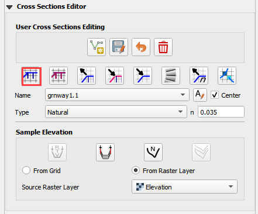

2. If the channel schematizing process was successful, the following message will appear.
   Click Close.

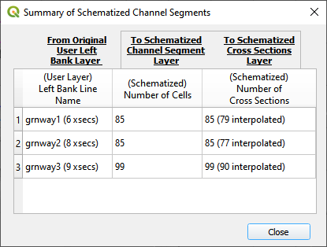

Step 9: Review bank alignment
-----------------------------

Channel alignment in urban projects can be important because channels are usually squeezed between features like
buildings, walls, and streets.  In this image, the left bank is on the wrong side of an urban wall.

.. image:: ../img/Advanced-Workshop/Lesson030.png

Urban channels also vary widely in their design.
This channel is not a rectangular channel or a trapezoidal channel.
It has a stepped gabion lining along the banks.

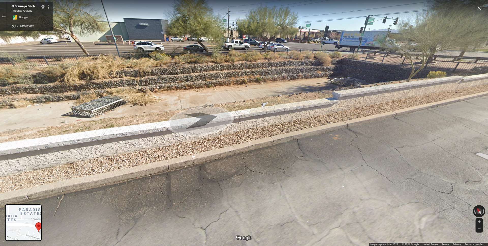

It is simple to make minor corrections to the left bank lines and right bank lines to realign the channels.

1. In the User Layers group, turn on the Editor Pencil for Left Bank Lines, Right Bank Lines, and Cross Sections.

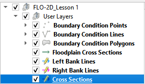

2. Set the Vertex Tool to All Layers.

.. image:: ../img/Advanced-Workshop/Lesson033.png

3. Reposition the Left Bank Line so that it is in between the retaining wall and the channel.

.. image:: ../img/Advanced-Workshop/Lesson034.png

4. Click the Schematize button to reposition the Schematized Channel and click Yes and Close to close the windows.  In
   This case, hitting the enter button twice will be faster.

.. image:: ../img/Advanced-Workshop/Lesson035.png

.. image:: ../img/Advanced-Workshop/Lesson036.png

.. image:: ../img/Advanced-Workshop/Lesson037.png

5. If necessary, uncheck the Center button.
   This will keep the channel in place, so the corrections are easy to track.

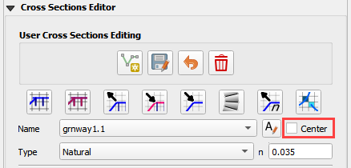

6. Squeezing the left bank like this means some of the bank elements might be inside the channel.

7. Slight corrections can be made to Left Bank Line to ensure good bank placement.

.. image:: ../img/Advanced-Workshop/Mod10_008.gif

8. The same procedure can be used on the right bank.

.. image:: ../img/Advanced-Workshop/Mod10_009.gif

9.  Always finish by clicking the schematize button to ensure the final edits were updated.

10. Once the final edits are complete, save and close the editors for the User Layers.

Step 10: Interpolate the channel
--------------------------------

**Natural Channel Geometry**

N type channels are interpolated using the Interpolator.exe program.
This method will outline how to call the interpolator and reload the data.

**Important Note: If this process needs to be repeated for any reason, click Schematize button before repeating anything beyond this step.**

1. Click the Create CHAN.DAT, XSEC.DAT, AND CHANBANK.DAT button.

.. image:: ../img/Advanced-Workshop/Lesson044.png

2. Select the folder where the \*.DAT files will be saved.

\\Coastal Training\\Project Data\\Channel Export

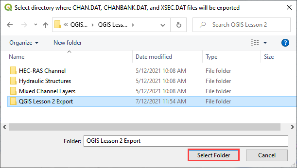

3. The first action saves the channel data.
   Click OK to close the message.

.. image:: ../img/Advanced-Workshop/Lesson046.png

4. The second action calls the Interpolate.exe program from the FLO-2D Pro folder.

**Important Note: If this process results in an Interpolate.exe error, it is possible to move that file to another location and make sure it is named
correctly.**

**Note: In this case only the 4 natural cross sections are used.**

5. Click Interpolate.

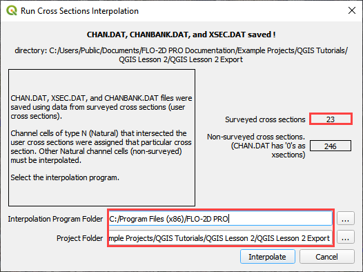

6. If the interpolation is performed correctly the following message will appear.
   Click Import CHAN.DAT and XSEC.DAT to update the channel data in QGIS.

.. image:: ../img/Advanced-Workshop/Lesson048.png

7. Click the OK icon when the process is finished.

.. image:: ../img/Advanced-Workshop/Lesson049.png

Step 10: Channel in/out condition
---------------------------------

Instructional Video

.. youtube:: 8zm8ach2jpc

Inlet
^^^^^^

1. Zoom to the first channel element on the southeast corner of the map.

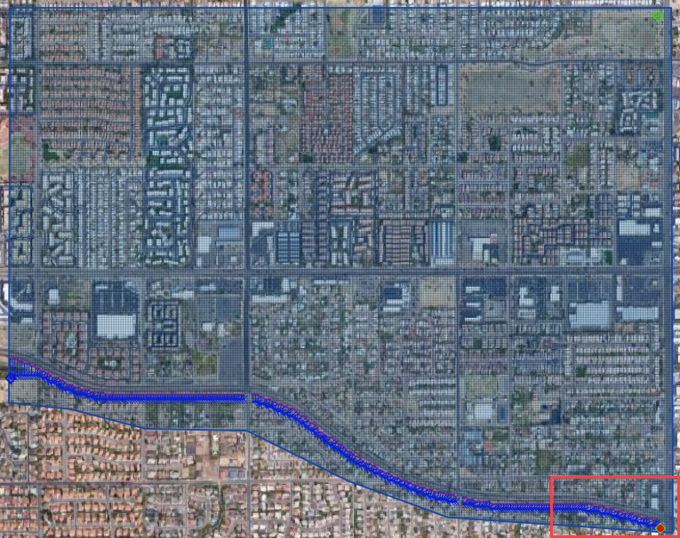

2. Uncheck the visibility of the User Layers Left Bank Lines, Right Bank Lines, Cross Sections.

.. image:: ../img/Advanced-Workshop/image50.png

3. Collapse the Cross Section Editor

4. Expand the Boundary Condition Editor.

5. Click the Add point BC button.

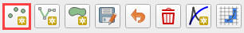

6. Digitize a point to the first left bank channel cell and click OK.

.. image:: ../img/Advanced-Workshop/Lesson053.png

7. Click Save on the Widget

.. image:: ../img/Advanced-Workshop/Lesson054.png

8.  Change the BC name of the inflow to GrnwayIN

9.  Set Defined for to Channel

10. Click Add new Time Series

11. Name the new Time Series to Grnway 24hr 100yr.

12. The widget should look like this.

.. image:: ../img/Advanced-Workshop/Mod10_010.gif

13. Open the hydrograph file in Notepad and copy the data.

.. image:: ../img/Advanced-Workshop/Lesson056.png

C:\\Users\\Public\\Documents\\FLO-2D PRO Documentation\\Example Projects\\QGIS Tutorials\\QGIS Lesson 2\\Greenway Inflow 100yr 24hr.txt

14. Place the cursor in the first cell of the Table and click Paste.

.. image:: ../img/Workshop/Worksh040.gif

Outlet
^^^^^^^

1. Zoom to the end of the channel.

2. Add a BC Point to the last element of the channel.

.. image:: ../img/Advanced-Workshop/Lesson058.png

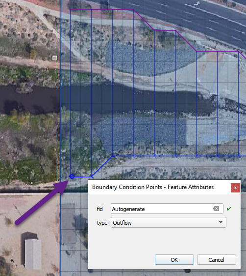

3. Save the form and set the BC type to Outflow

.. image:: ../img/Advanced-Workshop/Lesson054.png

4. Name the BC to GrnwayOut

5. Set the Outflow type to 3.

.. image:: ../img/Advanced-Workshop/Lesson060.png

6. Click the Schematize button the outflow conditions and click OK to close the message.

.. image:: ../img/Advanced-Workshop/Lesson061.png

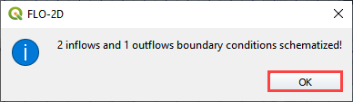

Step 11: Tide Gates
-------------------

This structure will calculate discharge through a box culvert.
This example has a box culvert that is longer than the grid element.
The channel segments are split up to allow for the width of the roadway.

**Note:  This image shows how the culverts should look once they have been digitized**

.. image:: ../img/Workshop/Worksh074.png

1. Zoom to the first culvert.

.. image:: ../img/Workshop/Worksh175.png

2. Open the Structures Editor.
   Click the Add Structure icon.

.. image:: ../img/Workshop/Worksh075.png

3. Digitize the first culvert by clicking on the upstream left bank element and downstream left bank element of the channel.
   Right click to complete the line and click OK to close the Structure Line attribute box.

.. image:: ../img/Workshop/Worksh176.png

4. Repeat the process on the second culvert downstream.

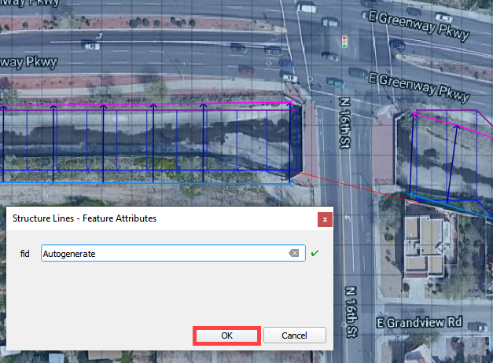

5. Click the Save Button on the Structure Editor.

.. image:: ../img/Workshop/Worksh077.png

6. Fill out the data for each structure.

-  Name the culverts Grnway1, Grnway2

-  Type \= Channel

-  Rating \= Rating table

-  Tailwater condition is none.

.. image:: ../img/Workshop/Worksh076.png

7.  Click the Import Rating Tables button

.. image:: ../img/Workshop/Worksh078.png

8.  Navigate to the Rating Tables files, select both tables and click Open.

C:\\Users\\Public\\Documents\\FLO-2D PRO Documentation\\Example Projects\\QGIS Tutorials\\QGIS Lesson 2\\Hydraulic Structures

.. image:: ../img/Workshop/Worksh079.png

9. Note that the data was loaded into the FLO-2D Table Editor for the active structure.

.. image:: ../img/Workshop/Worksh179.png

10. Click Schematize to write the data to the schematic layers.

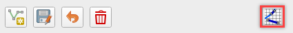

11. The hydraulic structures are now ready.

12. If the table and plot did not update, refresh the tables by selecting the structure again in the widget.

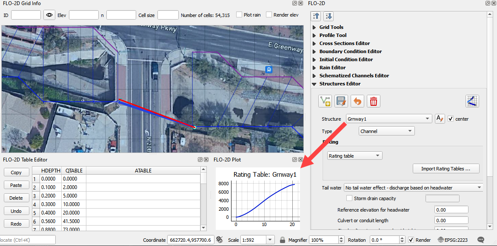

Step 12: Export the project
----------------------------

1. Click the Setup Control Parameters icon.

.. image:: ../img/Workshop/Worksh017.png

2. Check the boxes for Main Channel and Hydraulic structures if needed.

3. Click Save.

.. image:: ../img/Workshop/Worksh082.png

4. Click the Export button for the FLO-2D Data files.
   Click OK.

.. image:: ../img/Advanced-Workshop/Module123.png

.. image:: ../img/Advanced-Workshop/Lesson063.png

5. Select the QGIS Lesson 2 Export folder.

6. The data is ready to run.

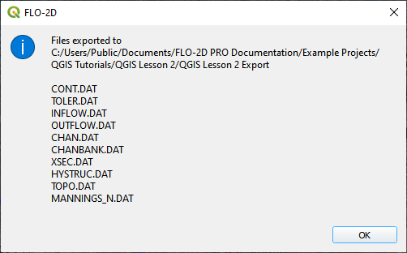

Step 13: Run the simulation
----------------------------

1. Click the Run FLO-2D Icon.

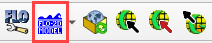

2. Set the FLO-2D Folder.
   C:\\program files (x86)\\flo-2d pro

3. Set the Project Folder.

C:\\users\\public\\public documents\\flo-2d pro documentation\\Example Projects\\QGIS Tutorials\\QGIS Lesson 2\\Lesson 2 Export

4. Click OK.

.. image:: ../img/Workshop/Worksh090.png

5. This is a good point to save project.

.. image:: ../img/Workshop/Worksh011.png

This final video explains how to review the channel to check if it is running correctly.

.. youtube:: p8EeQ81_pmE

