Coastal Set-Up
==============

**Overview**

Please use these instructions to get your computer ready for Coastal Training Package.

.. raw:: html

    <iframe width="560" height="315" src="https://www.youtube.com/embed/sTDCm6NX1Pw" frameborder="0" allowfullscreen></iframe>

Step 1: Admin Installation
___________________________________

1. Find the email that has the data link.  Log In to flo-2d.sharefile.com to get the data.

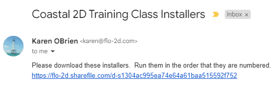

2. Download all 5 files.

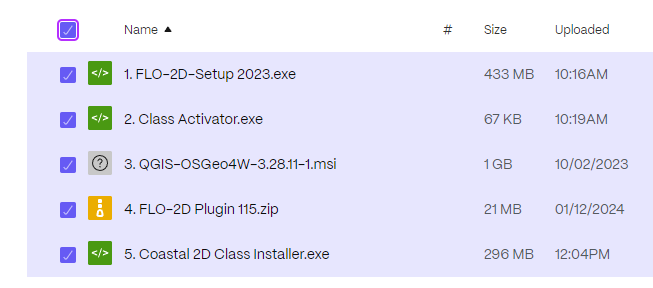

3. Extract the files into a safe folder.

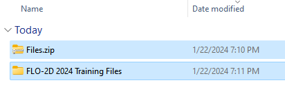

4. Start running the installers almost sequentially.  Use Default settings for all installers.

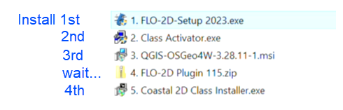

5. Watch the video if you have questions.

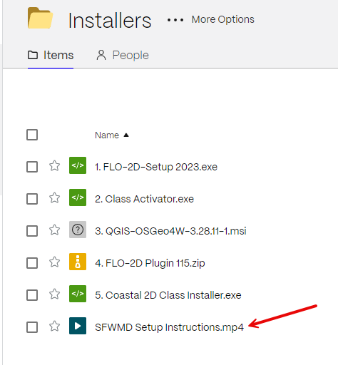

Step 2: Test the installation
_______________________________

1. Copy the FLO-2D engine and its dlls.

File location: C:\\Program Files (x86)\\FLO-2D PRO\\Run for Project Folder

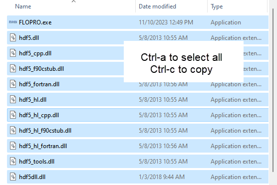

2. Open Barn Mudflow folder and paste the files in that folder.

File location: C:\\Users\\Public\\Documents\\FLO-2D PRO Documentation\\Example Projects\\Examples\\Barn Mudflow

3. Doubleclick FLOPRO.EXE.

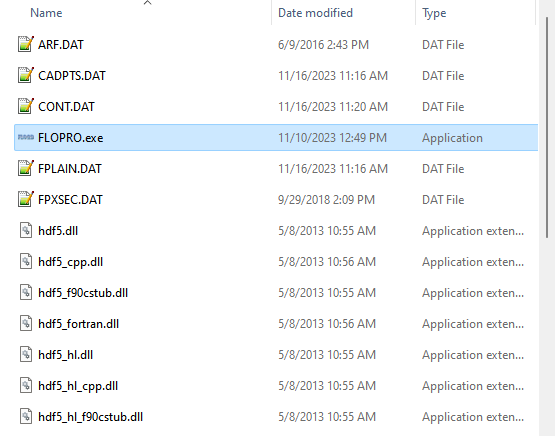

4. If this message appears, the test passed.  Close the run.

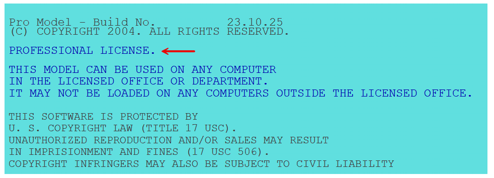

Step 3: Create a Quick Access Link
___________________________________

1. Prepare the computer with the class data.  This will help keep everyone on the same page as we run through the lessons.

2. Open Microsoft Explorer

3. Navigate to C:\\Users\\Public\\Documents\\FLO-2D PRO Documentation\\Example Projects

4. Add the Coastal 2D Training folder to the Quick Access Link.

5. Review the animated gif for help.  Keep your eye on the timestamp to see when it restarts.

6. Move the Class data from the Download folder into the Coastal Training Folder.

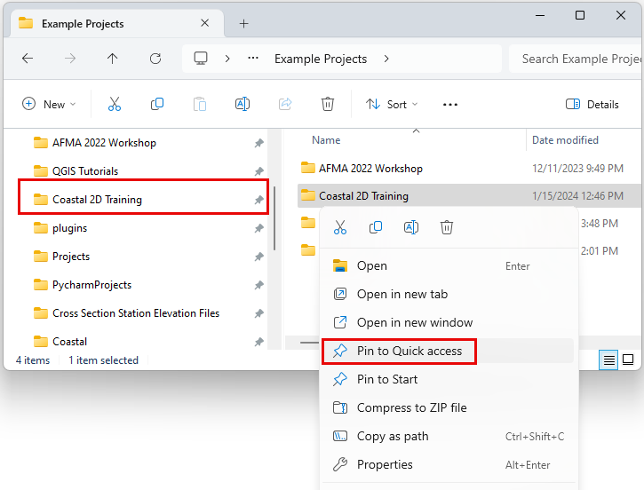

See this animation if the instructions are vague.  Open it in a new tab if it isn't easily visible.

.. image:: ../img/Coastal/quickaccess.gif

Step 4: Setup QGIS
_______________________________

.. warning:: Message to IT.  This step will only work if you are logged into the computer as the Student.  We will do
   this in class as a group so you can skip this step.

1. Load QGIS

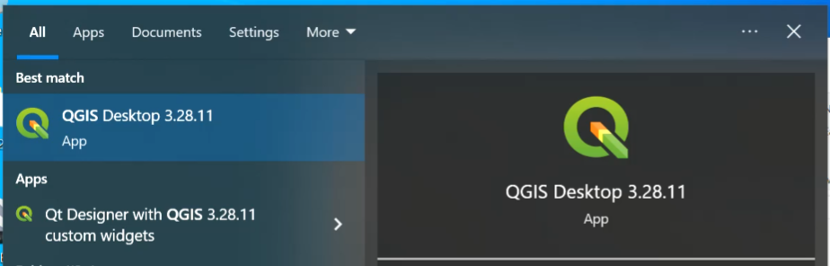

2. Close the Browser Panel or dock it with the Layers Panel.  The video shows how to dock it.

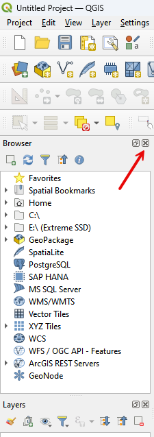

3. Set the CRS options as shown in the following image.

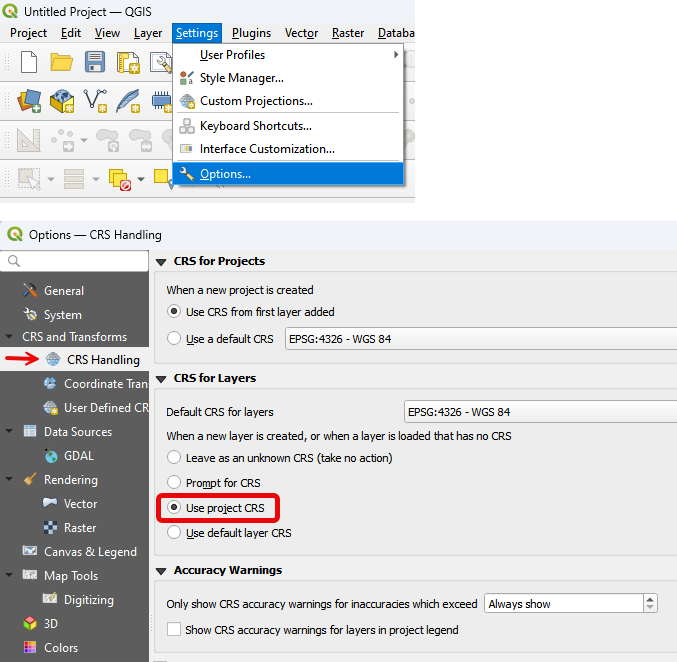

Step 5: Add Plugins to QGIS
___________________________________

1. Open the Plugin Manager.

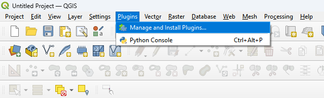

2. Add the FLO-2D Plugin v115.  Use Install from Zip option.

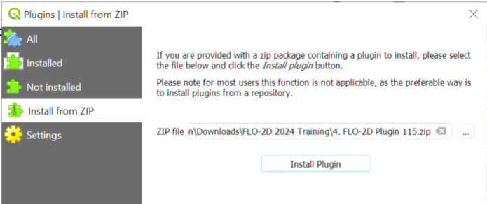

3. Add all other plugins using the normal plugin installation method from the All Group.

.. note:: If the following image is hard to see, open it in a new tab.

.. image:: ../img/Coastal/setup007.png

Step 6: Add Quick Map Services
___________________________________

1. Open the Quick Map Services Settings.

2. Go to the More Services tab and Get Contributed Pack

.. image:: ../img/Coastal/setup021.png

3. Uncheck all visible items and turn on Google, ESRI, and OSM.

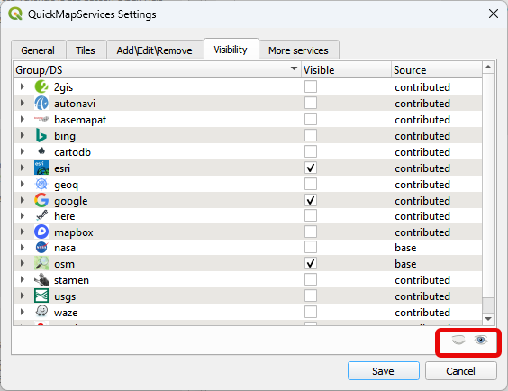

4. That concludes the setup tutorial.

