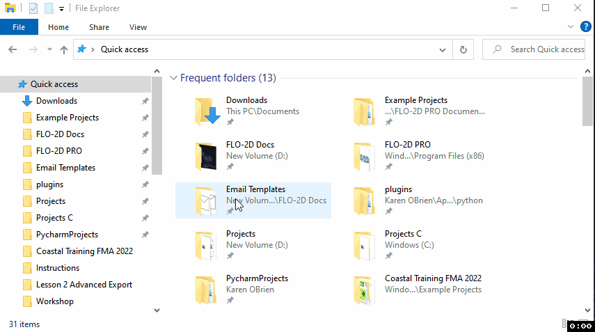
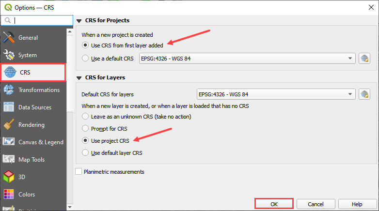
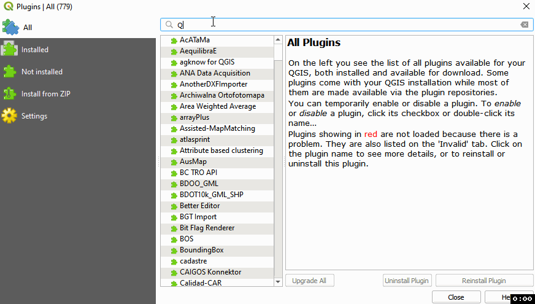
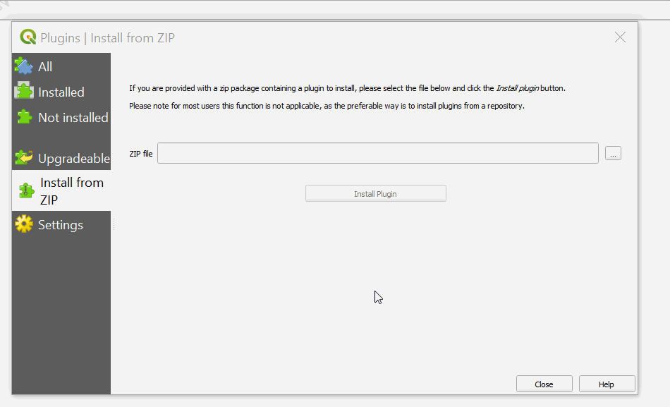
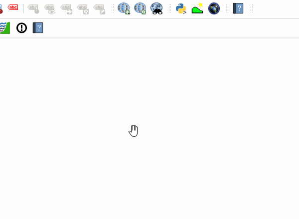
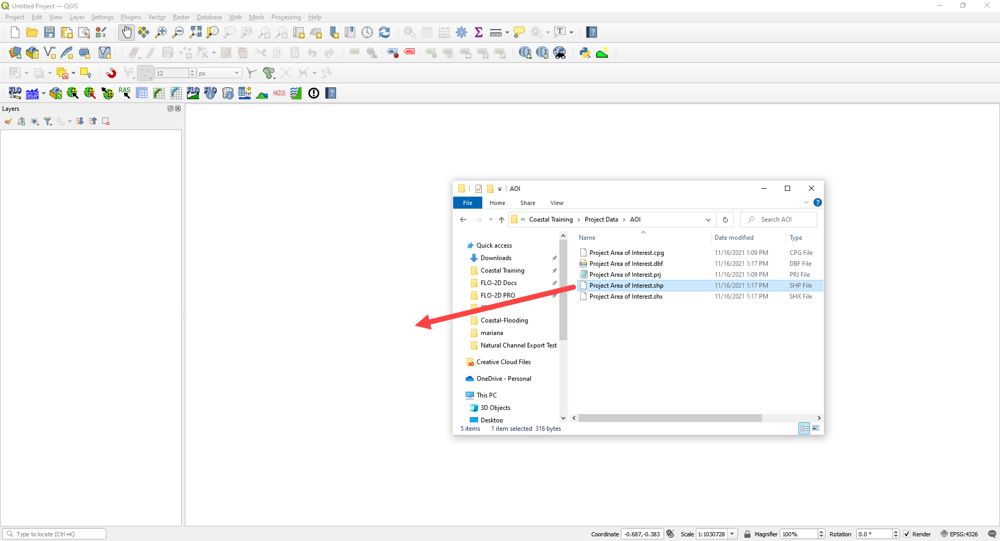
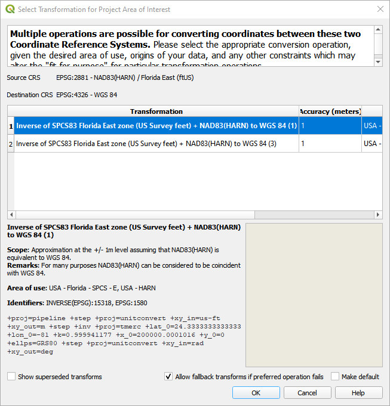
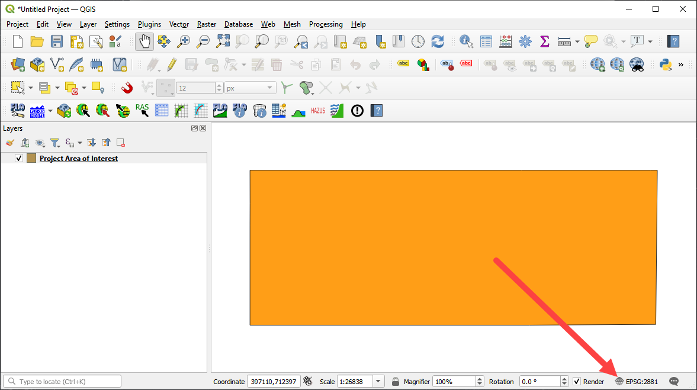

Coastal Set-Up
==============

Get the Data:  https://flo-2d.sharefile.com/d-s70082745e4c8400cb4a966fca21b906e

**Overview**

This module will outline how to Set-Up QGIS in order to facilitate the following modules.  If you get stuck, please see
the video below.  It may have steps that were missed in the instructions.

Required Data

The following data is required for this module.

============= ========================
**File**      **Content**
============= ========================
\*.zip        FLO-2D Plugin Update
\*.shp        Project Area of Interest
============= ========================

Data Location:  \\Coastal Training\\

.. youtube:: qTTvXkl9Bmk

Step 1: Create a Quick Access Link
___________________________________

1. Open Microsoft Explorer

2. Navigate to C:\\Users\\Public\\Documents\\FLO-2D PRO Documentation\\Example Projects

3. Drag Coastal Training to the Quick Access area on the sidebar.

4. Note the small timestamp on the lower right hand corner of the animation.  Wait for it to restart if this animation
   is confusing.

Step 2: Open QGIS
____________________

1. Open QGIS.

.. image:: ../img/Workshop/Worksh002.png

2. Click Settings/Options

.. image:: ../img/Instructions/image13.png

3. Click the CRS tab and set the options as shown below.  Use CRS from first layer added.  Use Project CRS.  Click OK to
   close the window.

Step 3: Add Plugins
______________________________

Add the FLO-2D plugin and a few other handy plugins.

1. Open to the plugin manager.

.. image:: ../img/Instructions/image10.png

2. Install **Quick Map Services** and **Profile Tool**.

3. Lastly **Install from Zip** FLO-2D Plugin.
   Close the Plugin Manager once everything is finished installing.

4. Add **more services** to Quick Map Services and eliminate unwanted maps.  Click Quick Map Services button and click
   Settings.  On the settings window, go to More Services and click Get Contributed pack.  On the Visibility window,
   uncheck the unwanted maps.

Step 4: Load the Project Domain
________________________________

1. Open Coastal Training project folder.
   C:\\Users\\Public\\Documents\\FLO-2D PRO Documentation\\Example Projects\\Coastal Training\\Project Data\\AOI

2. Drag the Project Area of Interest shapefile onto the map space.

3. Click OK to apply the coordinate system.  The coordinate system for this project is
   NAD 83 High Accuracy Reference Network (HARN) Florida East with units of US ft.

4. The project CRS EPSG 2881 is now applied to the map.

Please continue to Load the Data into QGIS.

