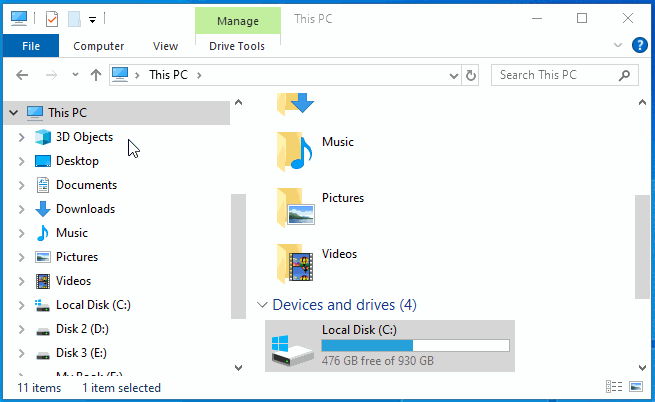
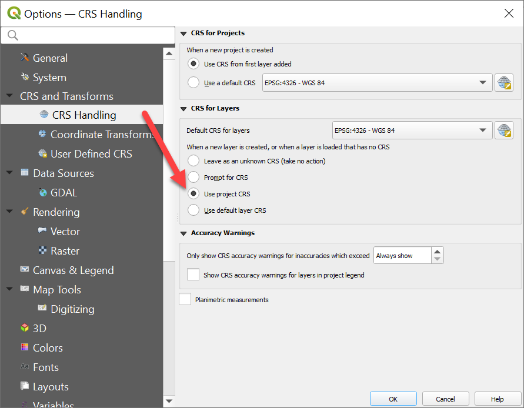
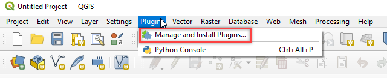
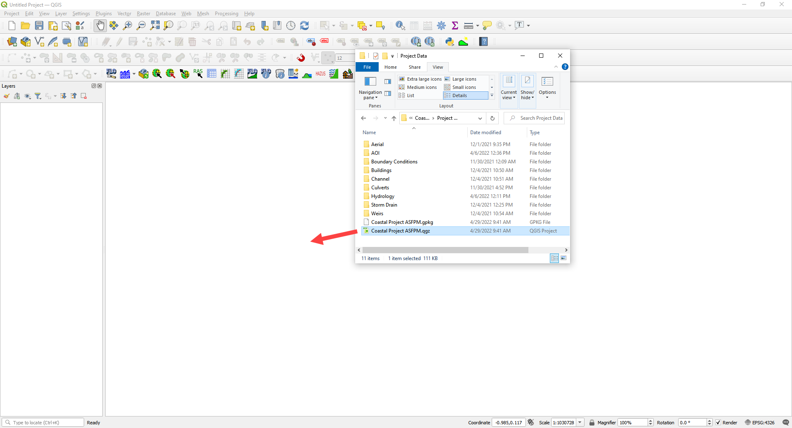
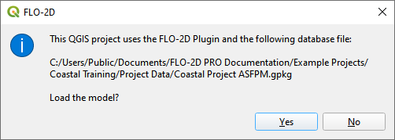
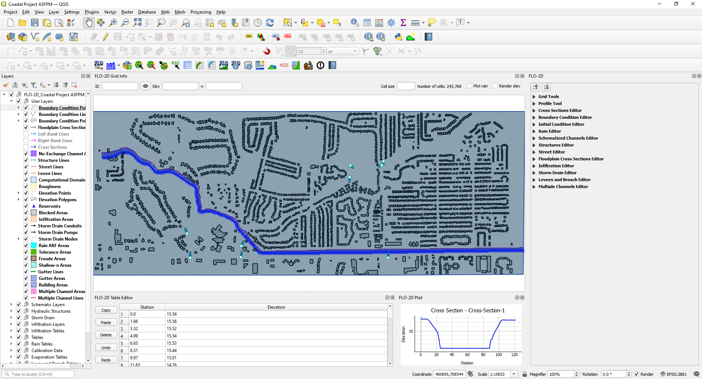

Coastal Set-Up
==============

**Overview**

Please use these instructions to get your computer ready for the Coastal Urban Modeling training class.

**Regular Class Setup.**

.. youtube:: qTTvXkl9Bmk

**ASFPM Workshop Setup.**

.. youtube:: tTvmjdDRnzw

Step 1: Run the Installers
___________________________________

Run through the FLO-2D Setup using the following link.  Then return here and go to Step 2.

https://documentation.flo-2d.com/Intro/Set-up.html

.. Note:: Admin rights are required to set up the computers.  Please get assistance from your IT.  Please reply to the
          class notification email or use the contact form to get help from Karen O'Brien.
          https://flo-2d.com/contact/

Step 2: Set up the Coastal Training Project
____________________________________________

1. Use this link to download the project data for the ASFPM Workshop.

https://flo-2d.sharefile.com/d-s3fe663fd0cb540b9b18261681b627d10

Step 3: Create a Quick Access Link
___________________________________

1. Prepare the computer with the class data.  This will help keep everyone on the same page as we run through the lessons.

2. Open Microsoft Explorer

3. Navigate to C:\\Users\\Public\\Documents\\FLO-2D PRO Documentation\\Example Projects

4. Create a folder called Coastal Training add it to the to the Quick Access area on the sidebar.

5. Review the animated gif for help.  Keep your eye on the timestamp to see when it restarts.

6. Move the Class data from the Download folder into the Coastal Training Folder.

Step 3: Open QGIS
____________________

1. Open QGIS.

.. image:: ../img/Workshop/Worksh002.png

2. Click Settings/Options

.. image:: ../img/Instructions/image13.png

3. Click the CRS tab and set the options as shown below.  Use CRS from first layer added.  Use Project CRS.  Click OK to
   close the window.

Step 4: Add Plugins
______________________________

Add the FLO-2D plugin and a few other handy plugins.

1. Open to the plugin manager.

2. Install **Quick Map Services** and **Profile Tool** and **Curve Number Generator**

3. Lastly **Install from Zip** FLO-2D Plugin.
   Close the Plugin Manager once everything is finished installing.

.. image:: ../img/Instructions/image12.gif

4. Add **more services** to Quick Map Services and eliminate unwanted maps.  Click Quick Map Services button and click
   Settings.  On the settings window, go to More Services and click Get Contributed pack.  On the Visibility window,
   uncheck the unwanted maps.

.. image:: ../img/Instructions/image15.gif

.. note:: ASFPM class Skip Step 5.  Everyone else do Skip Step 6.

Step 5: Load the Project AOI into QGIS
________________________________________

1. Open Coastal Training project folder.
   C:\\Users\\Public\\Documents\\FLO-2D PRO Documentation\\Example Projects\\Coastal Training\\Project Data\\AOI

2. Drag the AOI.shp file onto the map space.

.. image:: ../img/Coastal/setup001.png

3. Note the coordinate system is now set to EPSG 2881.

Step 6: ASFPM Workshop Method Load the Project into QGIS
__________________________________________________________

1. Open Coastal Training project folder.
   C:\\Users\\Public\\Documents\\FLO-2D PRO Documentation\\Example Projects\\Coastal Training\\Project Data\\Coastal
   Training.qgz

2. Drag the \*.qgz file onto the map space.

3. Click Yes to Load the Model.

4. The map should look like this.

7. ASFPM Class.  The next lesson is Hydrology starting at Step 3.
https://documentation.flo-2d.com/Coastal-Flooding/Hydrology.html#step-3-set-up-the-rainfall