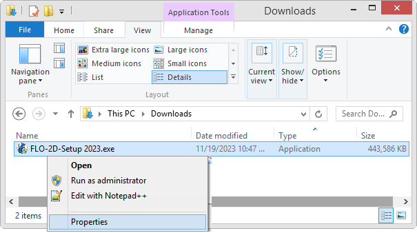
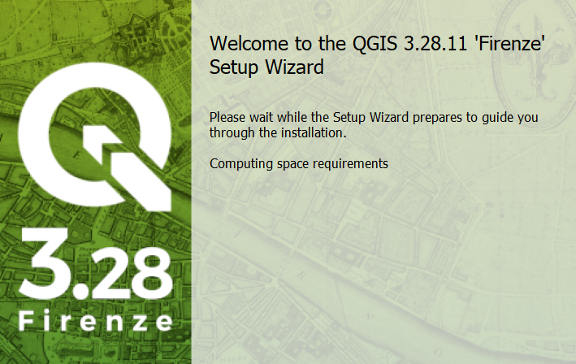

Coastal Set-Up
==============

**Overview**

Please use these instructions to get your computer ready for Coastal Training Package.

.. raw:: html

    <iframe width="560" height="315" src="https://www.youtube.com/embed/sTDCm6NX1Pw" frameborder="0" allowfullscreen></iframe>

Step 1: Get the Data
___________________________________

Use this Download Link to access all **installers**, training data, and videos.

https://flo-2d.sharefile.com/d-sb89b11c6eb40468c9d48669f101bcc3d

.. image:: ../img/Coastal/coastalsetup001.png

1. Select all.

2. Download.

3. The files are zipped into "file.zip".  Extract them into a safe location.

Step 2: Run the FLO-2D Installer
___________________________________

.. Note:: Admin rights are required.  Please get assistance from your IT.

          *If you don't want to deal with IT, feel free to use your own laptop.  Admin rights are nice to have.*

          Reply to the workshop email or use the contact form to get help from Karen O'Brien.

          https://flo-2d.com/contact/

Install FLO-2D using the following instructions.  **Admin Rights Required.**

1. Right click zipped file to access properties.

2. Unblock the file if necessary.

.. image:: ../img/Instructions/image4.png

3. Extract the file and run the installer.

.. image:: ../img/Instructions/image5.png

4. Click **NO** for silent, and finish installing with the default settings.

.. image:: ../img/Instructions/image6.png

5. If running a new install, check all options.  If running an update, uncheck Map Objects and EPA SWMM.

.. image:: ../img/Instructions/image15.png

6. Click next and Install to run the installer.

.. image:: ../img/Instructions/image16.png

7. If an error appears related to the DAO35.EXE, run the installer again but uncheck
   Map Objects.

8. The last embedded installation package **may trigger a restart**.

.. image:: ../img/Instructions/image17.png

Step 3: FMA Workshop Data Installer
___________________________________
Use these instructions to install the Workshop data.  Admin Rights Not Required.

1. Run the installer.  FMA Workshop 2022 Data Installer.exe

2. Default settings are fine, click Close to finish.

.. image:: ../img/Instructions/image7.png

Step 4: QGIS Installer
___________________________________
Follow these instructions to set up QGIS.

1. Double click the QGIS-OSGeo4W-3.22.9.msi file.

2. Finish installing with the **default** settings.

3. Open QGIS.  **This step should be completed on the User Account not the Admin Account.**

.. image:: ../img/Workshop/Worksh002.png

4. Click Settings/Options

.. image:: ../img/Instructions/image13.png

5. Click the CRS tab and set the options as shown below.  Use CRS from first layer added.  Use Project CRS.  Click OK to
   close the window.

.. image:: ../img/Instructions/image14.png

Step 5: FLO-2D Plugin
___________________________________
With QGIS installed it is time to add the FLO-2D plugin and a few other handy plugins.

1. Navigate to the plugin manager.

.. image:: ../img/Instructions/image10.png

2. Install Quick Map Services and Profile Tool.

.. image:: ../img/Instructions/image11.png

3. Install from Zip is used for the FLO-2D Plugin.  Your plugin name may not match the animation below.
   Close the Plugin Manager once everything is finished installing.

.. image:: ../img/Instructions/image12.gif

4. Add more services to Quick Map Services and eliminate unwanted maps.  Click Quick Map Services icon and click Settings.
   On the settings window, go to More Services and click Get Contributed pack.  On the Visibility window, uncheck the
   unwanted maps.

.. image:: ../img/Instructions/image15.gif

Step 6: Create a Quick Access Link
___________________________________

1. Prepare the computer with the class data.  This will help keep everyone on the same page as we run through the lessons.

2. Open Microsoft Explorer

3. Navigate to C:\\Users\\Public\\Documents\\FLO-2D PRO Documentation\\Example Projects

4. Add the Coastal Training FMA 2022 folder to the Quick Access Link.

5. Review the animated gif for help.  Keep your eye on the timestamp to see when it restarts.

6. Move the Class data from the Download folder into the Coastal Training Folder.

.. image:: ../img/Coastal/quickaccess.gif

