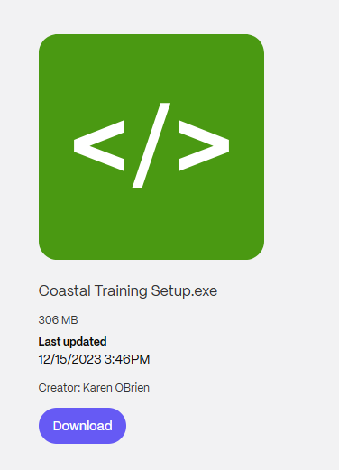
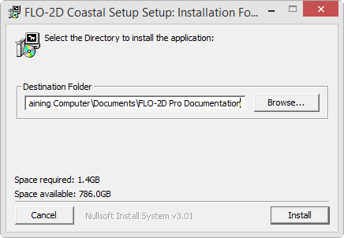

Coastal Set-Up
==============

**Overview**

Please use these instructions to get your computer ready for Coastal Training Package.

.. raw:: html

    <iframe width="560" height="315" src="https://www.youtube.com/embed/sTDCm6NX1Pw" frameborder="0" allowfullscreen></iframe>

Step 1: Get the Data
___________________________________

.. Note:: Use the FLO-2D Setup page on the top left of the side bar.  Install FLO-2D Setup, QGIS, and the plugins and
          then return to this step.

|Setup_Download|

.. |Setup_Download| raw:: html

   <a href="https://flo-2d.sharefile.com/d-sc8150c9f75804766875d9a4ff7db0dd0" target="_blank">Click Here to Download</a>

Step 2: Coastal Workshop Data Installer
________________________________________
Use these instructions to install the Workshop data.  Admin Rights Not Required.

1. Run the installer.  Coastal Training Setup.exe

2. Default settings are fine, click Close to finish.

Step 3: Create a Quick Access Link
___________________________________

1. Prepare the computer with the class data.  This will help keep everyone on the same page as we run through the lessons.

2. Open Microsoft Explorer

3. Navigate to C:\\Users\\Public\\Documents\\FLO-2D PRO Documentation\\Example Projects

4. Add the Coastal 2D Training folder to the Quick Access Link.

5. Review the animated gif for help.  Keep your eye on the timestamp to see when it restarts.

6. Move the Class data from the Download folder into the Coastal Training Folder.

.. image:: ../img/Coastal/quickaccess.gif

