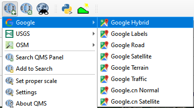
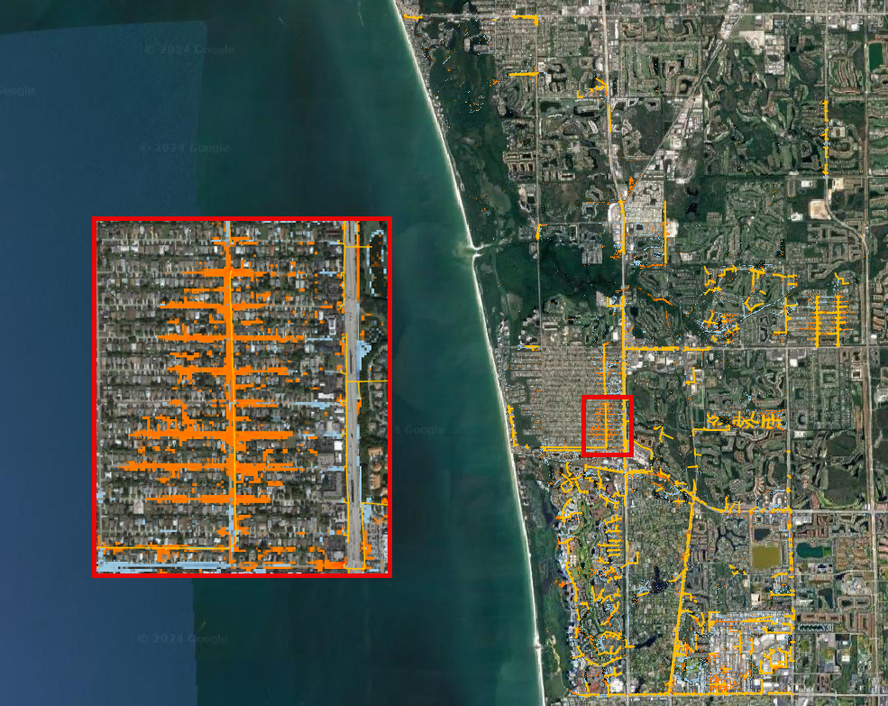
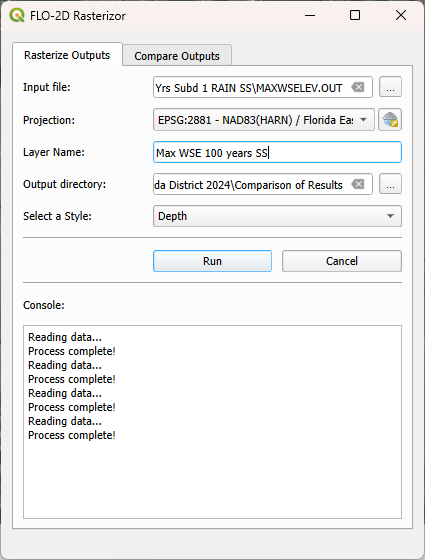
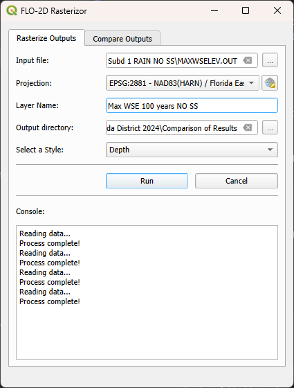
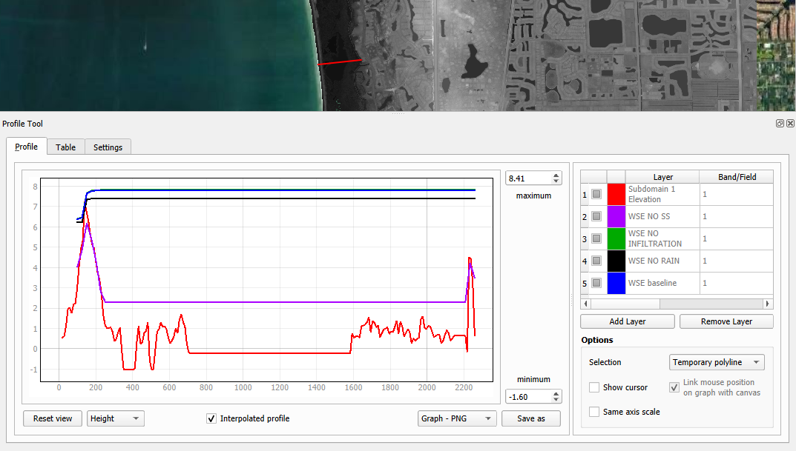

Comparison of Results
=======================

**Overview**

In this module, the outcomes of various simulations conducted within the ACUNE+ Project are presented and analyzed.
Discussions and result mapping utilizing Rasterizor and MapCrafter are also included.

Required Data

The required data is in the Coastal 2D Training Folder.

======================== ====================================== =====================================
**File** **Content**                            Location
======================== ====================================== =====================================
\\Storm Drain Sub 1.shp  Storm Drain Sub 1                      Project Data\\Comparison of Results\\
\\Elevation.tif          Elevation Raster                       Project Data\\AOI\\
\\*.OUT                  Subdomain 1 Design Storm 10 Yrs        Scenarios\\
\\*.OUT                  Subdomain 1 Design Storm 10 Yrs NO SC  Scenarios\\
\\*.OUT                  Subdomain 1 Design Storm 20 Yrs        Scenarios\\
\\*.OUT                  Subdomain 1 Design Storm 20 Yrs NO SC  Scenarios\\
\\*.OUT                  Subdomain 1 Design Storm 50 Yrs        Scenarios\\
\\*.OUT                  Subdomain 1 Design Storm 50 Yrs NO SC  Scenarios\\
\\*.OUT                  100 Yrs Subd 1 RAIN NO SS              Scenarios\\
\\*.OUT                  100 Yrs Subd 1 RAIN SS                 Scenarios\\
======================== ====================================== =====================================

Data Location: \\Coastal 2D Training\\Scenarios

Step 1. Create a review project
_____________________________________

Given the complexity of layers in the QGIS FLO-2D Project and the necessity for scenario comparisons,
it is more effective to maintain a distinct QGIS project specifically for FLO-2D result comparisons.

1. Open QGIS and create a new project.

2. Locate the Current CRS button on the bottom right of QGIS.
   Set the project CRS to Florida East HARN USft.
   Filter the list with an EPSG code: 2881.
   Select EPSG: 2881 and click OK.

.. image:: ../img/Coastal/comp002.png

.. image:: ../img/Coastal/comp003.png

3. Save it as Comparison Project

.. image:: ../img/Coastal/comp004.png

.. image:: ../img/Coastal/comp005.png

Step 2. Storm Drain engine comparison
______________________________________

The initial comparison will focus on models with and without the storm drain for different return periods.

1. Drag and drop the Storm Drain layer into the project.

.. image:: ../img/Coastal/comp010.png

2. Use Quick Map Services to load an aerial image onto the map.

.. image:: ../img/Advanced-Workshop/Lesson005.png

.. image:: ../img/Coastal/comp011.png

.. hint:: Increase the line thickness in the symbology settings to enhance the visibility of the storm drains.

3. Create a folder under the Coastal 2D Training directory called Comparison of Results.

Compare the 10 years scenarios
^^^^^^^^^^^^^^^^^^^^^^^^^^^^^^^^^^

Let's use the 10-year return period scenario to compare depth changes between the two simulations.

1. Open Rasterizor and create the Depth Max for the 10-years scenario.
   The DEPTH.OUT file is located on the Subdomain 1 Design Storm 10 Yrs folder.

2. Open Rasterizor and create the Depth Max for the 10-years scenario without the storm drain.
   The DEPTH.OUT file is located on the Subdomain 1 Design Storm 10 Yrs NO SD folder.

Differences between the two rasters can be visually identified.
However, accurately visualizing and quantifying the significance of these differences can be challenging.
To address this, let's employ the Rasterizor comparison tool to achieve a clearer visualization of these differences

3. Click on the Rasterizor Compare Outputs.
   Select the two raster previously generated and fill the data as follows.

4. Drag the storm drain layer on top of the comparison raster and uncheck the Depth rasters.

.. image:: ../img/Coastal/comp012.png

This tool computes the difference between raster values, presenting the results using a color ramp ranging from
blue (indicating negative differences) to red (highlighting positive differences).

.. important:: The order of input rasters influences how the resulting comparison raster maps the differences.
               Rasterizor subtracts the second raster from the first, indicating that negative differences (blues)
               represent lower values on the first raster, while positive differences
               (reds) signify higher values on the first raster.

The northern section of the project exhibits a less dense storm drain system, resulting in fewer differences.
Conversely, the southern portion displays a denser storm drain system and a higher prevalence of blues and reds,
indicating greater disparities between the two simulations.

The blue pixels represent a reduction in depth when the storm drain was added to the project area,
while red pixels indicate an increase in depth. In the zoomed area,
it is evident that the storm drain system effectively removed water from streets (blue areas)
and discharged the collected water into a detention pond (red areas) elevating its water level.

5. Create a group called '10 Years' on the QGIS Layer Tree to organize the results.
   Select the three rasters, Right Click, Group Selected, and name it 10 Years.

.. image:: ../img/Coastal/comp014.png

.. image:: ../img/Coastal/comp015.png

Compare the 20 years scenarios
^^^^^^^^^^^^^^^^^^^^^^^^^^^^^^^^^^

Let's use the 20-years to compare velocity changes between the two simulations.

1. Open Rasterizor and create the Max Velocity for the 20-years scenario.
   The VELFP.OUT file is located on the Subdomain 1 Design Storm 20 Yrs folder.

.. image:: ../img/Coastal/comp016.png

2. Open Rasterizor and create the Max Velocity for the 20-years scenario without the storm drain.
   The VELFP.OUT file is located on the Subdomain 1 Design Storm 20 Yrs NO SD folder.

.. image:: ../img/Coastal/comp017.png

3. Click on the Rasterizor Compare Outputs tab.
   Select the two raster previously generated and fill the data as follows.

.. image:: ../img/Coastal/comp018.png

.. note:: Ensure to reorganize the layers, placing the Storm Drain layer on top for better visualization.

It is noticeable that near the storm drain inlets, more red pixels are present.
This is attributed to the accelerated flow entering the storm drain system,
exhibiting higher velocity compared to the simulation without the storm drain system.

4. Group the 20-years rasters into their own group.

Compare the 50 years scenarios
^^^^^^^^^^^^^^^^^^^^^^^^^^^^^^^^^^

Let's use another type of
result for the 50-years scenario: Time to Peak. This variable represents the
time of occurrence of the maximum depth.

1. Open Rasterizor and create the Time to Peak for the 50-years scenario.
   The TIMETOPEAK.OUT file is located on the Subdomain 1 Design Storm 50 Yrs folder.

.. image:: ../img/Coastal/comp020.png

2. Open Rasterizor and create the Time to Peak for the 50-years scenario without the storm drain.
   The TIMETOPEAK.OUT file is located on the Subdomain 1 Design Storm 50 Yrs NO SD folder.

.. image:: ../img/Coastal/comp021.png

3. Click on the Rasterizor Compare Outputs.
   Select the two raster previously generated and fill the data as follows.

.. image:: ../img/Coastal/comp022.png

The blue areas represent a reduction on the time to peak. This is because the storm drain quickly drains the water
from the streets. Without a storm drain, water may need to flow overland or through natural drainage paths,
taking longer to reach the peak flow. The storm drain system efficiently removes water,
reducing the time it takes for the flow to reach its maximum.

.. image:: ../img/Coastal/comp023.png

4. Group the 50-years rasters into their own group.

Step 3. Storm Surge Impact
______________________________

In this lesson, the impact of incorporating Storm Surge in a FLO-2D simulation is explored.
Storm surge is the abnormal rise in seawater level during a storm,
measured as the height of the water above the normal predicted astronomical tide.

1. Uncheck all layers but the Aerial Image (Google Hybrid/Satellite). Drag the Elevation raster to the project.

.. image:: ../img/Coastal/comp027.png

2. Open Rasterizor and create the Maximum WSE for the 100-years scenario considering the Storm Surge.
   The MAXWSELEV.OUT file is located on the 100 Yrs Subd 1 RAIN SS.

3. Open Rasterizor and create the Maximum WSE for the 100-years scenario without considering the Storm Surge.
   The MAXWSELEV.OUT file is located on the 100 Yrs Subd 1 RAIN NO SS.

4. Right click on the Elevation Raster and click on Zoom to Layer.

5. Uncheck the recently created Max WSE 100 years SS and Max WSE 100 years NO SS.

6. Select the Profile Tool on the QGIS toolbar.

7. Select the Max WSE 100 years SS and click on add layer on the Profile Tool. Repeat this process for
   Max WSE 100 years NO SS and Elevation.

.. image:: ../img/Coastal/comp031.png

8. Change the Layers colors by double clicking on the red square at the left of the Layer's name.

- Max WSE 100 years SS: Dark blue
- Max WSE 100 years NO SS: Light blue
- Elevation: Red

.. image:: ../img/Coastal/comp032.png

9. Create a profile line on the floodplain as the following image.

The Profile Tool displays the Maximum Water Surface Elevation for scenarios with and without Storm Surge,
providing a basis for comparison. The graph indicates a substantial increase in the maximum water surface elevation
(exceeding 4 feet) when the Storm Surge is taken into account, compared to the scenario without it. Notably,
this profile is situated approximately 2 miles from the ocean.
The impact is more pronounced in areas closer to the ocean,
emphasizing the crucial role of modeling Storm Surge in coastal regions.

Step 4. Mitigation Maps
___________________________

Step 5. Hazard Maps
____________________

MapCrafter creates hazard maps, highlighting areas with elevated risks based on FLO-2D simulations,
aiding in risk management.

1. Open MapCrafter.

.. image:: ../img/Coastal/haz006.png

2. Choose the '100 Yrs Subd 1 RAIN SS' scenario as the FLO-2D Export Folder
   since this scenario is considered the most critical.
   Navigate to the Hazard Maps tab and check all maps under the US Bureau of Reclamation.

.. image:: ../img/Coastal/haz007.png

.. note:: The USBR (United States Bureau Reclamation) Hazard map follows the criteria described in the
          Downstream Hazard Classification Guidelines (USBR, 1988). MapCrafter allows the user to select
          five hazard mapping classification systems: Houses, Mobile Homes, Vehicles, Adults, and Children.
          Each of these hazard mapping options define the hazard based on Danger zone curves that are
          separated into High Danger Zone, Judgement Zone and Low Danger Zone.
          The danger zones are curves that define a relationship between depth and velocity.

          .. image:: ../img/Coastal/haz014.png

3. Click on Create maps and wait for the process to complete.
   The maps are added on their own group on the QGIS Layer Tree.

.. image:: ../img/Coastal/haz008.png

..  important:: The Hazard maps are generated for the entire project domain.
                It is not meaningful to assess House Hazard in regions without houses
                (e.g., waterbodies, channels, grasslands). The same applies to all hazard maps.
                Engineering judgment must be employed to identify areas more susceptible
                to the specific type of flood damages.

Step 3. Houses Hazard
^^^^^^^^^^^^^^^^^^^^^^^^

Houses Hazard Map is focused on permanent residences attached to foundations
and worksite areas, including facilities that contain workers on a daily basis.
This includes farm operations, oil and gas operations,
sand and gravel operations, and fish hatcheries.

1. Review the complete hazard raster and zoom in on Vanderbilt Beach for a more detailed examination.

.. image:: ../img/Coastal/haz009.png

.. tip:: Increase transparency in the Hazard layer to facilitate the analysis and visualization.

- HIGH DANGER ZONE (RED): Occupants of most houses are in danger from floodwater.
- JUDGMENT ZONE (YELLOW): Danger level is based upon engineering judgement.
- LOW DANGER ZONE (BLUE): Occupants of most houses are not seriously in danger from flood water.

Step 4. Mobile Houses Hazard
^^^^^^^^^^^^^^^^^^^^^^^^^^^^^^

Mobile Houses are typically located in flood plains due to zoning
requirements in many areas, creating a very dangerous situation for
occupants of mobile homes, as they are very susceptible to movement
from relatively small floods.

1. Examine the same area as in the previous step.
   This hazard map is more conservative than the Houses Hazard map,
   given the increased impact of small floods on mobile homes

.. image:: ../img/Coastal/haz010.png

- HIGH DANGER ZONE (RED): Occupants of almost any size mobile home are in danger from flood water.
- JUDGMENT ZONE (YELLOW): Danger level is based upon engineering judgement.
- LOW DANGER ZONE (BLUE): Occupants of almost any size mobile home are not seriously in danger from flood water.

Step 5. Vehicles Hazard
^^^^^^^^^^^^^^^^^^^^^^^^

Vehicles Hazard is focused on the possibility for loss
of life to motorists and pedestrians.

1. Zoom into Naples Park. In this area, specific regions are designated as judgment zones for vehicles.

.. image:: ../img/Coastal/haz011.png

- HIGH DANGER ZONE (RED): Occupants of almost any size passenger vehicle are in danger from flood water.
- JUDGMENT ZONE (YELLOW): Danger level is based upon engineering judgment.
- LOW DANGER ZONE (BLUE): Occupants of almost any size passenger vehicle are not seriously in danger from flood water.

Step 6. Adults Hazard
^^^^^^^^^^^^^^^^^^^^^^^^

In Adults Hazard Map, an adult is considered any human over 5 feet (150 cm) tall and weighing over
120 pounds (54 kg).

1. Zoom into the Tarpon Cove Yacht \& Racquet Club.
   The neighborhood near the mangrove is situated in a high danger zone according to the USBR Adults Hazard Mapping.

.. image:: ../img/Coastal/haz012.png

- HIGH DANGER ZONE (RED): Almost any size adult is in danger from flood water.
- JUDGMENT ZONE (YELLOW): Danger level is based upon engineering judgment.
- LOW DANGER ZONE (BLUE): Almost any size adult is not seriously threatened by flood water.

Step 7. Children Hazard
^^^^^^^^^^^^^^^^^^^^^^^^

The Children Hazard map represents a more conservative classification compared to the Adults Hazard Map.

1. Zoom into the southeast of the project domain.
   Significant areas of judgment zones for children are identified in this region.

.. image:: ../img/Coastal/haz013.png

- HIGH DANGER ZONE (RED): Almost any size child is in danger from flood water.
- JUDGMENT ZONE (YELLOW): Danger level is based upon engineering judgment.
- LOW DANGER ZONE (BLUE): Almost any size child (excluding infants) is not seriously threatened by flood water.
