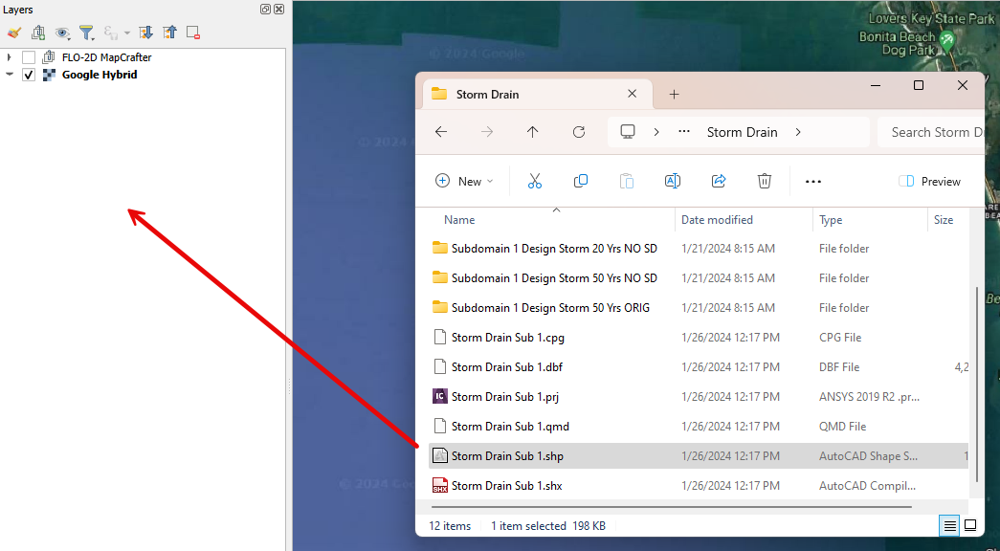
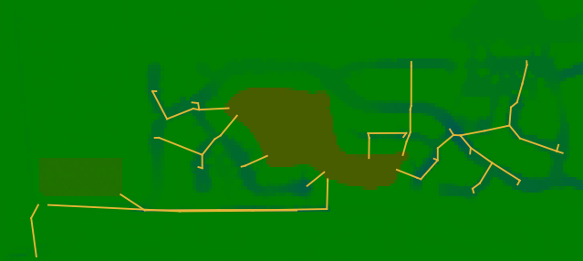

Comparison of Results
=======================

**Overview**

In this module, learn how to compare FLO-2D results using Rasterizor.

Required Data

The required data is in the Coastal 2D Training Folder.

======== ====================================== ===========
**File** **Content**                            Location
======== ====================================== ===========
\*.OUT   Subdomain 1 Design Storm 10 Yrs        Scenarios\
\*.OUT   Subdomain 1 Design Storm 10 Yrs NO SC  Scenarios\
\*.OUT   Subdomain 1 Design Storm 20 Yrs        Scenarios\
\*.OUT   Subdomain 1 Design Storm 20 Yrs NO SC  Scenarios\
\*.OUT   Subdomain 1 Design Storm 50 Yrs        Scenarios\
\*.OUT   Subdomain 1 Design Storm 50 Yrs NO SC  Scenarios\
======== ====================================== ===========

Data Location: \\Coastal 2D Training\\Scenarios

Step 1. Create a review project
_____________________________________

Given the complexity of layers in the QGIS FLO-2D Project and the necessity for scenario comparisons,
it is more effective to maintain a distinct QGIS project specifically for FLO-2D result comparisons.

1. Open QGIS and create a new project.

.. image:: ../img/Coastal/comp001.png

2. Set the project CRS to Florida East HARN USft.
   Filter the list with an EPSG code: 2881.
   Select EPSG: 2881 and click OK.

.. image:: ../img/Coastal/comp002.png

.. image:: ../img/Coastal/comp003.png

3. Save it as Comparison Project

.. image:: ../img/Coastal/comp004.png

.. image:: ../img/Coastal/comp005.png

Step 2. Add the Storm Drain Layer and basemap
____________________________________________________

The initial comparison will focus on models with and without the storm drain for different return periods.

1. Drag and drop the Storm Drain layer into the project.

2. Use Quick Map Services to load an aerial image onto the map.

.. image:: ../img/Advanced-Workshop/Lesson005.png

.. image:: ../img/Coastal/chan003.png

.. note:: Increase the line thickness in the symbology settings to enhance the visibility of the storm drains.

Step 3. Create the Depth Maps for 10 years scenarios
________________________________________________________

Rasterizor can be utilized to generate comparisons between two rasters,
allowing users to identify areas with significant differences between two datasets.

.. note:: The results presented in this lesson may differ from those generated throughout the entire training.
          However, it's crucial to note that this lesson is primarily for demonstration purposes,
          and the actual results are not of paramount importance.
          The emphasis lies in understanding the process of conducting comparisons.

1. Create a folder under the Coastal 2D Training directory called Comparison of Results.

2. Open Rasterizor and create the Depth Max for the 10 years scenario.
   The DEPTH.OUT file is located on the Subdomain 1 Design Storm 10 Yrs folder.

.. image:: ../img/Coastal/comp006.png

3. Open Rasterizor and create the Depth Max for the 10 years scenario without the storm drain.
   The DEPTH.OUT file is located on the Subdomain 1 Design Storm 10 Yrs NO SD folder.

.. image:: ../img/Coastal/comp007.png

Step 3. Compare the 10 years scenarios
___________________________________________

Differences between the two rasters can be visually identified.
However, accurately visualizing and quantifying the significance of these differences can be challenging.
To address this, let's employ the Rasterizor comparison tool to achieve a clearer visualization of these differences

1. Click on the Rasterizor Compare Outputs.
   Select the two raster previously generated and fill the data as follows.

.. image:: ../img/Coastal/comp008.png

2. Drag the storm drain layer on top of the comparison raster.

3. This tool computes the difference between raster values, presenting the results using a color ramp ranging from
   blue (indicating negative differences) to green (representing small differences) and
   red (highlighting positive differences).

.. image:: ../img/Coastal/comp012.png

.. important:: The order of input rasters influences how the resulting comparison raster maps the differences.
               Rasterizor subtracts the second raster from the first, indicating that,
               when compared to the first raster, negative differences (blues)
               represent higher values on the second raster, while positive differences
               (reds) signify lower values on the second raster.

The northern section of the project exhibits a less dense storm drain system,
resulting in more green areas indicating fewer differences.
Conversely, the southern portion displays a denser storm drain system and a higher prevalence of blues and reds,
indicating greater disparities between the two simulations.
Zoom in to the southern portion and analyze the following image.

The blue pixels represent a reduction in depth when the storm drain was added to the project area,
while red pixels indicate an increase in depth.
The storm drain system effectively removes water from streets or ponds (blues),
but it can discharge excess water into certain detention ponds (reds).

4. Create a group called '10 Years' on the QGIS Layer Tree to organize the results.
   Select the three rasters, Right Click, Group Selected, and name it 10 Years.

.. image:: ../img/Coastal/comp014.png

.. image:: ../img/Coastal/comp015.png

Step 4. Create the Depth Maps for 20 years scenarios
________________________________________________________

1. Open Rasterizor and create the Depth Max for the 20 years scenario.
   The DEPTH.OUT file is located on the Subdomain 1 Design Storm 20 Yrs folder.

.. image:: ../img/Coastal/comp016.png

2. Open Rasterizor and create the Depth Max for the 20 years scenario without the storm drain.
   The DEPTH.OUT file is located on the Subdomain 1 Design Storm 20 Yrs NO SD folder.

Step 5. Compare the 20 years scenarios
___________________________________________

1. Click on the Rasterizor Compare Outputs.
   Select the two raster previously generated and fill the data as follows.

.. image:: ../img/Coastal/comp018.png

.. note:: Ensure to reorganize the layers, placing the Storm Drain layer on top for better visualization.

2. Zoom into the same area analyzed in the 10-year scenario and assess the differences.

.. image:: ../img/Coastal/comp019.png

3. Group the 20-years rasters into their own group.

Step 6. Create the Depth Maps for 50 years scenarios
______________________________________________________

1. Open Rasterizor and create the Depth Max for the 50 years scenario.
   The DEPTH.OUT file is located on the Subdomain 1 Design Storm 50 Yrs folder.

.. image:: ../img/Coastal/comp020.png

2. Open Rasterizor and create the Depth Max for the 50 years scenario without the storm drain.
   The DEPTH.OUT file is located on the Subdomain 1 Design Storm 50 Yrs NO SD folder.

.. image:: ../img/Coastal/comp021.png

Step 7. Compare the 50 years scenarios
___________________________________________

1. Click on the Rasterizor Compare Outputs.
   Select the two raster previously generated and fill the data as follows.

.. image:: ../img/Coastal/comp022.png

.. note:: Ensure to reorganize the layers, placing the Storm Drain layer on top for better visualization.

2. Zoom into the same area analyzed in the 10-year and 20-year scenario and assess the differences.

.. image:: ../img/Coastal/comp023.png

3. Group the 50-years rasters into their own group.

Step 8. Comparison between return periods
____________________________________________

The comparison between utilizing or not utilizing the storm drain engine is more meaningful within the same return period.
By comparing the results of two return periods, it becomes possible to identify critical points in the watershed and
determine where engineering solutions should be prioritized.
Let's examine the key differences between the 10-year and 50-year return periods.

1. Select the 10-years and 50-years depth rasters for comparison

The areas with a more pronounced blue color indicate higher depth differences.
According to the comparison raster, estuary regions will experience a higher water level during more intense rainfalls.
This observation also holds true for some detention ponds within the project area.

