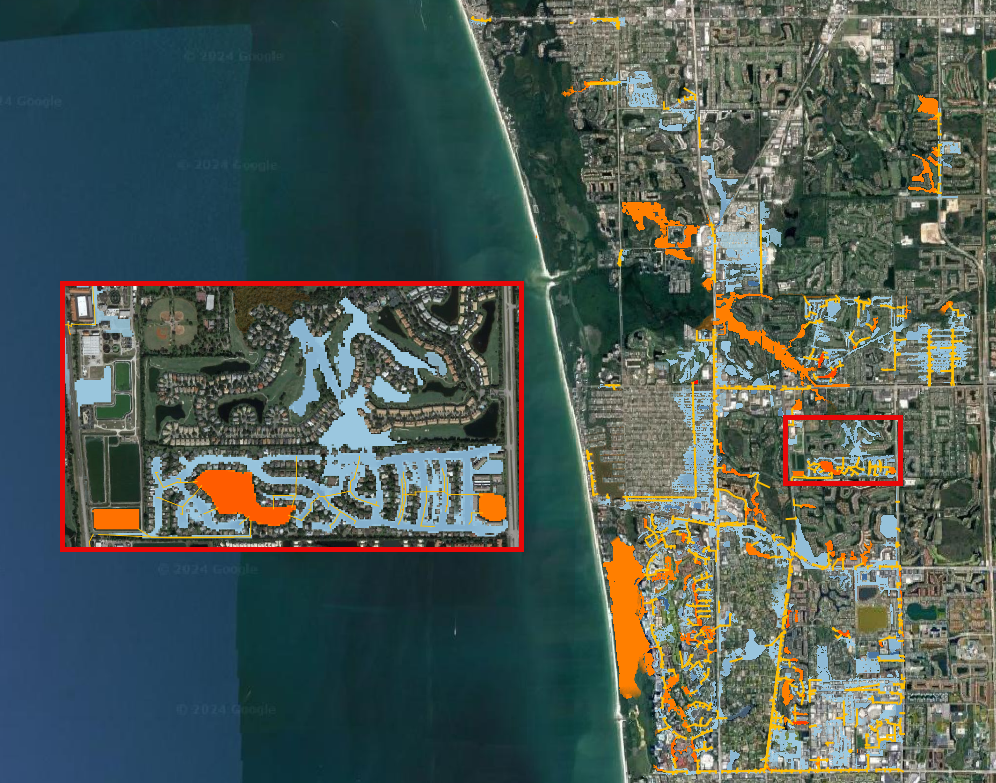
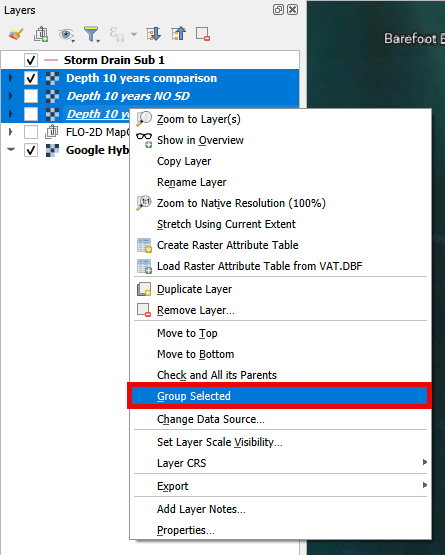
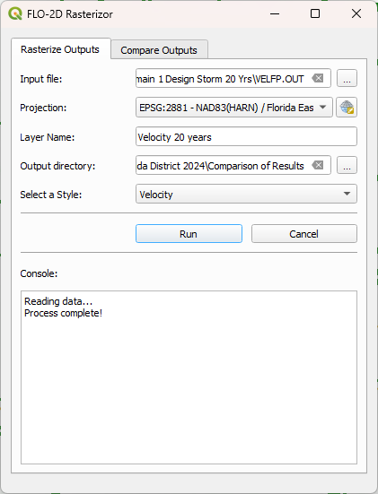

Comparison of Results
=======================

**Overview**

In this module, the outcomes of various simulations conducted within the ACUNE+ Project are presented and analyzed.
Discussions and result mapping utilizing Rasterizor and MapCrafter are also included.

Required Data

The required data is in the Coastal 2D Training Folder.

======== ====================================== ===========
**File** **Content**                            Location
======== ====================================== ===========
\*.OUT   Subdomain 1 Design Storm 10 Yrs        Scenarios\
\*.OUT   Subdomain 1 Design Storm 10 Yrs NO SC  Scenarios\
\*.OUT   Subdomain 1 Design Storm 20 Yrs        Scenarios\
\*.OUT   Subdomain 1 Design Storm 20 Yrs NO SC  Scenarios\
\*.OUT   Subdomain 1 Design Storm 50 Yrs        Scenarios\
\*.OUT   Subdomain 1 Design Storm 50 Yrs NO SC  Scenarios\
======== ====================================== ===========

Data Location: \\Coastal 2D Training\\Scenarios

Step 1. Create a review project
_____________________________________

Given the complexity of layers in the QGIS FLO-2D Project and the necessity for scenario comparisons,
it is more effective to maintain a distinct QGIS project specifically for FLO-2D result comparisons.

1. Open QGIS and create a new project.

.. image:: ../img/Coastal/comp001.png

2. Set the project CRS to Florida East HARN USft.
   Filter the list with an EPSG code: 2881.
   Select EPSG: 2881 and click OK.

.. image:: ../img/Coastal/comp002.png

3. Save it as Comparison Project

.. image:: ../img/Coastal/comp004.png

.. image:: ../img/Coastal/comp005.png

Step 2. Storm Drain engine comparison
______________________________________

The initial comparison will focus on models with and without the storm drain for different return periods.

1. Drag and drop the Storm Drain layer into the project.

.. image:: ../img/Coastal/comp010.png

2. Use Quick Map Services to load an aerial image onto the map.

.. image:: ../img/Advanced-Workshop/Lesson005.png

.. image:: ../img/Coastal/chan003.png

.. image:: ../img/Coastal/comp011.png

.. hint:: Increase the line thickness in the symbology settings to enhance the visibility of the storm drains.

3. Create a folder under the Coastal 2D Training directory called Comparison of Results.

Compare the 10 years scenarios
^^^^^^^^^^^^^^^^^^^^^^^^^^^^^^^^^^

Let's use the 10-year return period scenario to compare depth changes between the two simulations.
While other variables can be used for comparison,
for the sake of time, let's focus on using maximum depth as the comparison variable for this return period.

1. Open Rasterizor and create the Depth Max for the 10 years scenario.
   The DEPTH.OUT file is located on the Subdomain 1 Design Storm 10 Yrs folder.

.. image:: ../img/Coastal/comp006.png

2. Open Rasterizor and create the Depth Max for the 10 years scenario without the storm drain.
   The DEPTH.OUT file is located on the Subdomain 1 Design Storm 10 Yrs NO SD folder.

.. image:: ../img/Coastal/comp007.png

Differences between the two rasters can be visually identified.
However, accurately visualizing and quantifying the significance of these differences can be challenging.
To address this, let's employ the Rasterizor comparison tool to achieve a clearer visualization of these differences

3. Click on the Rasterizor Compare Outputs.
   Select the two raster previously generated and fill the data as follows.

.. image:: ../img/Coastal/comp008.png

4. Drag the storm drain layer on top of the comparison raster.

.. note:: This tool computes the difference between raster values, presenting the results using a color ramp ranging from
          blue (indicating negative differences) to green (representing small differences) and
          red (highlighting positive differences).

.. important:: The order of input rasters influences how the resulting comparison raster maps the differences.
               Rasterizor subtracts the second raster from the first, indicating that negative differences (blues)
               represent lower values on the first raster, while positive differences
               (reds) signify higher values on the first raster.

The northern section of the project exhibits a less dense storm drain system,
resulting in more green areas indicating fewer differences.
Conversely, the southern portion displays a denser storm drain system and a higher prevalence of blues and reds,
indicating greater disparities between the two simulations.
Zoom in to the southern portion and analyze the following image.

.. image:: ../img/Coastal/comp013.png

The blue pixels represent a reduction in depth when the storm drain was added to the project area,
while red pixels indicate an increase in depth. In the previous picture,
it is evident that the storm drain system effectively removed water from streets (blue areas)
and discharged the collected water into a detention pond (red areas).
See the aerial image of the area for a clearer understanding.

5. Create a group called '10 Years' on the QGIS Layer Tree to organize the results.
   Select the three rasters, Right Click, Group Selected, and name it 10 Years.

.. image:: ../img/Coastal/comp015.png

Compare the 20 years scenarios
^^^^^^^^^^^^^^^^^^^^^^^^^^^^^^^^^^

Let's use the 20-years to compare velocity changes between the two simulations.

1. Open Rasterizor and create the Max Velocity for the 20 years scenario.
   The VELFP.OUT file is located on the Subdomain 1 Design Storm 20 Yrs folder.

2. Open Rasterizor and create the Max Velocity for the 20 years scenario without the storm drain.
   The VELFP.OUT file is located on the Subdomain 1 Design Storm 20 Yrs NO SD folder.

.. image:: ../img/Coastal/comp017.png

3. Click on the Rasterizor Compare Outputs tab.
   Select the two raster previously generated and fill the data as follows.

.. image:: ../img/Coastal/comp018.png

.. note:: Ensure to reorganize the layers, placing the Storm Drain layer on top for better visualization.

4. Zoom into a storm drain system

.. image:: ../img/Coastal/comp019.png

It is noticeable that near the storm drain, more red pixels are present.
This is attributed to the accelerated flow entering the storm drain system,
exhibiting higher velocity compared to the simulation without the storm drain system.

5. Group the 20-years rasters into their own group.

Compare the 50 years scenarios
^^^^^^^^^^^^^^^^^^^^^^^^^^^^^^^^^^

Let's use another result for the 50-years scenario: Time to Peak. This variable represents the
time of occurrence of the maximum depth.

1. Open Rasterizor and create the Time to Peak for the 50 years scenario.
   The TIMETOPEAK.OUT file is located on the Subdomain 1 Design Storm 50 Yrs folder.

.. image:: ../img/Coastal/comp020.png

2. Open Rasterizor and create the Time to Peak for the 50 years scenario without the storm drain.
   The TIMETOPEAK.OUT file is located on the Subdomain 1 Design Storm 50 Yrs NO SD folder.

.. image:: ../img/Coastal/comp021.png

3. Click on the Rasterizor Compare Outputs.
   Select the two raster previously generated and fill the data as follows.

.. image:: ../img/Coastal/comp022.png

4. Zoom into the southern portion of the project area.

.. image:: ../img/Coastal/comp023.png

The blue areas represent a reduction on the time to peak. This is because the storm drain quickly drains the water
from the streets. Without a storm drain, water may need to flow overland or through natural drainage paths,
taking longer to reach the peak flow. The storm drain system efficiently removes water,
reducing the time it takes for the flow to reach its maximum.

