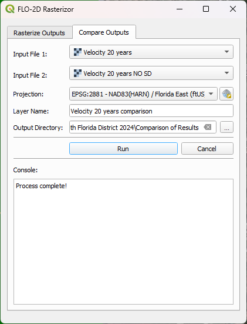
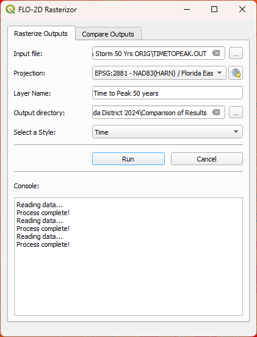
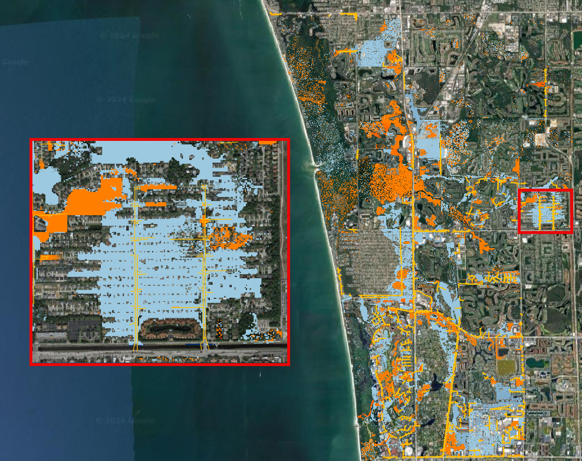
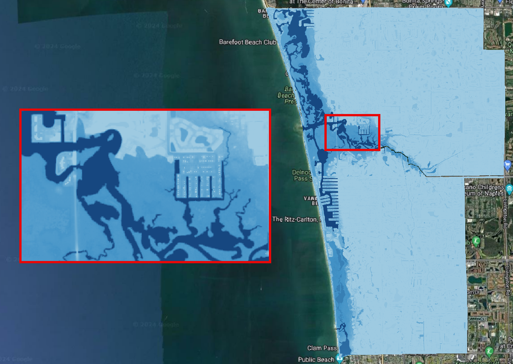
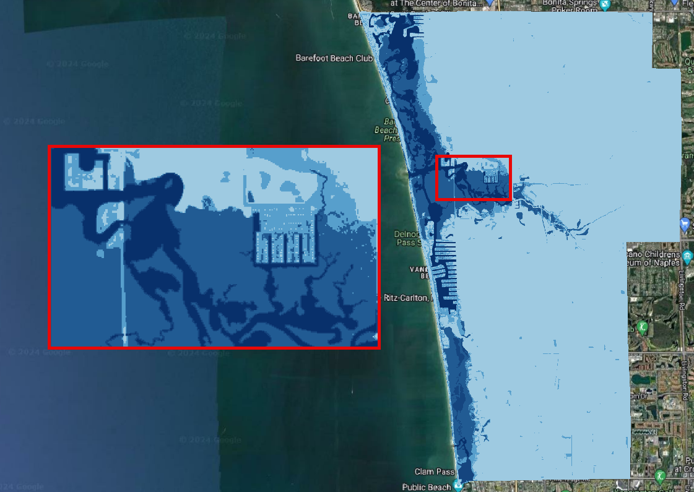
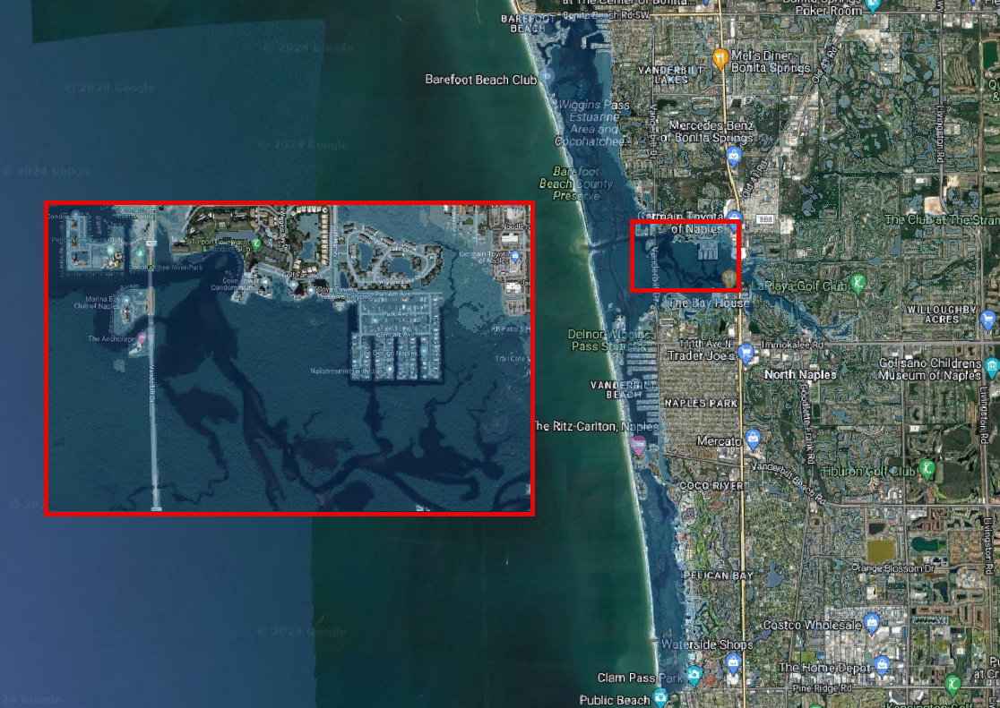
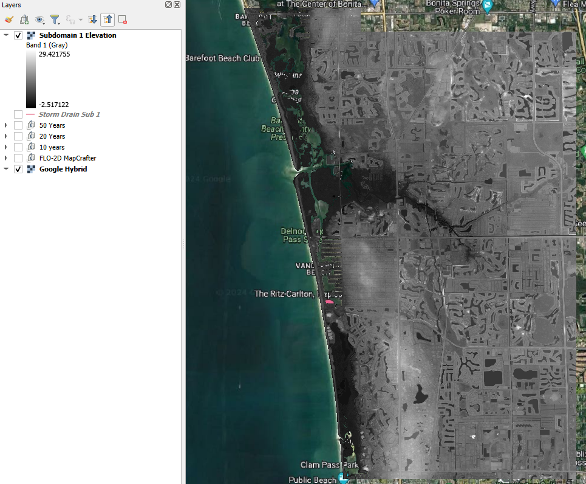
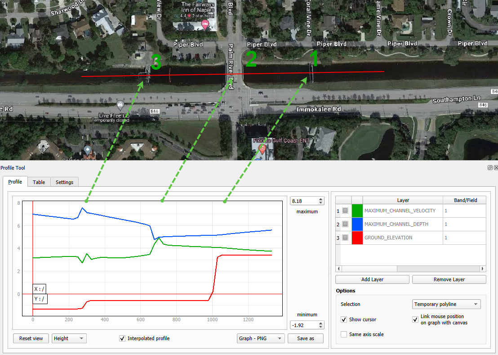
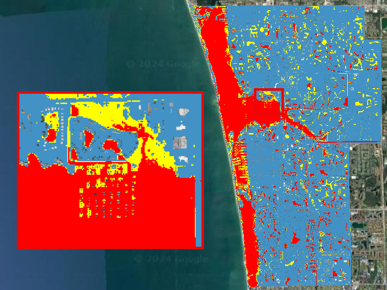

Comparison of Results
=======================

**Overview**

In this module, the outcomes of various simulations conducted within the ACUNE+ Project are presented and analyzed.
Discussions and result mapping utilizing Rasterizor, MapCrafter, and many other QGIS tools are also included.

Required Data

The required data is in the Scenarios Subfolder.

======================== ====================================== =====================================
**File**                 **Content**                            **Location**
======================== ====================================== =====================================
\\Storm Drain Sub 1.shp  Storm Drain Sub 1                      Storm Drain\\
\\*.OUT                  Subdomain 1 Design Storm 10 Yrs        Storm Drain\\
\\*.OUT                  Subdomain 1 Design Storm 10 Yrs NO SC  Storm Drain\\
\\*.OUT                  Subdomain 1 Design Storm 20 Yrs        Storm Drain\\
\\*.OUT                  Subdomain 1 Design Storm 20 Yrs NO SC  Storm Drain\\
\\*.OUT                  Subdomain 1 Design Storm 50 Yrs        Storm Drain\\
\\*.OUT                  Subdomain 1 Design Storm 50 Yrs NO SC  Storm Drain\\
\\Elevation.tif          Elevation Raster                       Flood Components\\
\\*.OUT                  100 Yrs Subd 1 baseline                Flood Components\\
\\*.OUT                  100 Yrs Subd 1 NO SS                   Flood Components\\
\\*.OUT                  100 Yrs Subd 1 NO RAIN                 Flood Components\\
\\*.OUT                  100 Yrs Subd 1 NO INFILTRATION         Flood Components\\
\\WARMER.tif             Warmer raster                          Mitigation\\
\\*.OUT                  MR-Design 100 YRS                      Mitigation\\
\\*.OUT                  MR-Design 100 YRS High Manning         Mitigation\\
\\Naples Streets.shp     Naples Streets                         Mitigation\\
\\*.OUT                  Design Storm 100 Yrs Subd 2 Elev US 41 Mitigation\\
\\*.OUT                  F2100_10AEP_High836SLR                 Future Scenarios\\
\\*.OUT                  F2100_10AEP_Low128SLR                  Future Scenarios\\
\\*.OUT                  F2100_10AEP_Med377SLR                  Future Scenarios\\
\\*.OUT                  F2060_10AEP_Med177SLR                  Future Scenarios\\
\\*.OUT                  F2030_10AEP_Med072SLR                  Future Scenarios\\
\\*.OUT                  100 Yrs Subd 1 Baseline                Hazard Maps\\
======================== ====================================== =====================================

Data Location: \\Coastal 2D Training\\Scenarios

Step 1. Create a review project
_____________________________________

Given the complexity of layers in the QGIS FLO-2D Project and the necessity for scenario comparisons,
it is more effective to maintain a distinct QGIS project specifically for FLO-2D result comparisons.

1. Open QGIS and create a new project.

.. image:: ../img/Coastal/comp001.png

2. Locate the Current CRS button on the bottom right of QGIS.
   Set the project CRS to Florida East HARN USft.
   Filter the list with an EPSG code: 2881.
   Select EPSG: 2881 and click OK.

.. image:: ../img/Coastal/comp002.png

.. image:: ../img/Coastal/comp003.png

3. Save it as Comparison Project

.. image:: ../img/Coastal/comp004.png

.. image:: ../img/Coastal/comp005.png

Step 2. Storm Drain
____________________

In this step, we'll explore the distinctions between models with and without the storm drain engine,
taking into account different return periods. Our investigation will encompass maximum depth (DEPTH.OUT),
maximum velocity (VELFP.OUT), and time to peak (TIMETOPEAK.OUT) results. The FLO-2D Rasterizor Plugin will
be utilized to assess the differences.

1. Drag and drop the Storm Drain layer into the project.

.. image:: ../img/Coastal/comp010.png

2. Use Quick Map Services to load an aerial image onto the map.

.. image:: ../img/Coastal/chan003.png

.. image:: ../img/Coastal/comp011.png

.. hint:: Increase the line thickness in the symbology settings to enhance the visibility of the storm drains.

3. Create a folder under the Coastal 2D Training directory called Comparison of Results.

Compare the 10 years scenarios
^^^^^^^^^^^^^^^^^^^^^^^^^^^^^^^^^^

Let's use the 10-year return period scenario to compare depth changes between the two simulations.

1. Open Rasterizor and create the Depth Max for the 10-years scenario.
   The DEPTH.OUT file is located on the Subdomain 1 Design Storm 10 Yrs folder.

.. image:: ../img/Coastal/comp006.png

2. Open Rasterizor and create the Depth Max for the 10-years scenario without the storm drain.
   The DEPTH.OUT file is located on the Subdomain 1 Design Storm 10 Yrs NO SD folder.

.. image:: ../img/Coastal/comp007.png

Differences between the two rasters can be visually identified.
However, accurately visualizing and quantifying the significance of these differences can be challenging.
To address this, let's employ the Rasterizor comparison tool to achieve a clearer visualization of these differences

3. Click on the Rasterizor Compare Outputs.
   Select the two raster previously generated and fill the data as follows.

.. image:: ../img/Coastal/comp008.png

4. Drag the storm drain layer on top of the comparison raster and uncheck the Depth rasters.

.. image:: ../img/Coastal/comp012.png

This tool computes the difference between raster values, presenting the results using a color ramp ranging from
blue (indicating negative differences) to red (highlighting positive differences).

.. important:: The order of input rasters influences how the resulting comparison raster maps the differences.
               Rasterizor subtracts the second raster from the first, indicating that negative differences (blues)
               represent lower values on the first raster, while positive differences
               (reds) signify higher values on the first raster.

The northern section of the project exhibits a less dense storm drain system, resulting in fewer differences.
Conversely, the southern portion displays a denser storm drain system and a higher prevalence of blues and reds,
indicating greater disparities between the two simulations.

The blue pixels represent a reduction in depth when the storm drain was added to the project area,
while red pixels indicate an increase in depth. In the zoomed area,
it is evident that the storm drain system effectively removed water from streets (blue areas)
and discharged the collected water into a detention pond (red areas) elevating its water level.

5. Create a group called '10 Years' on the QGIS Layer Tree to organize the results.
   Select the three rasters, Right Click, Group Selected, and name it 10 Years.

.. image:: ../img/Coastal/comp014.png

Compare the 20 years scenarios
^^^^^^^^^^^^^^^^^^^^^^^^^^^^^^^^^^

Let's use the 20-years to compare velocity changes between the two simulations.

1. Open Rasterizor and create the Max Velocity for the 20-years scenario.
   The VELFP.OUT file is located on the Subdomain 1 Design Storm 20 Yrs folder.

.. image:: ../img/Coastal/comp016.png

2. Open Rasterizor and create the Max Velocity for the 20-years scenario without the storm drain.
   The VELFP.OUT file is located on the Subdomain 1 Design Storm 20 Yrs NO SD folder.

.. image:: ../img/Coastal/comp017.png

3. Click on the Rasterizor Compare Outputs tab.
   Select the two raster previously generated and fill the data as follows.

.. note:: Ensure to reorganize the layers, placing the Storm Drain layer on top for better visualization.

It is noticeable that near the storm drain inlets, more red pixels are present.
This is attributed to the accelerated flow entering the storm drain system,
exhibiting higher velocity compared to the simulation without the storm drain system.

.. image:: ../img/Coastal/comp019.png

4. Group the 20-years rasters into their own group.

Compare the 50 years scenarios
^^^^^^^^^^^^^^^^^^^^^^^^^^^^^^^^^^

Let's use another type of
result for the 50-years scenario: Time to Peak. This variable represents the
time of occurrence of the maximum depth.

1. Open Rasterizor and create the Time to Peak for the 50-years scenario.
   The TIMETOPEAK.OUT file is located on the Subdomain 1 Design Storm 50 Yrs folder.

2. Open Rasterizor and create the Time to Peak for the 50-years scenario without the storm drain.
   The TIMETOPEAK.OUT file is located on the Subdomain 1 Design Storm 50 Yrs NO SD folder.

.. image:: ../img/Coastal/comp021.png

3. Click on the Rasterizor Compare Outputs.
   Select the two raster previously generated and fill the data as follows.

.. image:: ../img/Coastal/comp022.png

The blue areas represent a reduction on the time to peak. This is because the storm drain quickly drains the water
from the streets. Without a storm drain, water may need to flow overland or through natural drainage paths,
taking longer to reach the peak flow. The storm drain system efficiently removes water,
reducing the time it takes for the flow to reach its maximum.

4. Group the 50-years rasters into their own group.

Step 3. Explore symbology options
_____________________________________

The default symbology provided by Rasterizor is not the only way to represent the results.
Let's explore the advanced symbology options available in QGIS.

1. Select the previously generated Depth 10 years.

2. Right click on the raster, go to properties, select the symbology tab. Set the symbology exactly as the following
   image.

.. note:: This symbology categorizes the depth intervals into user-defined classes.
          Feel free to modify these classes as per your requirements.

3. A useful symbology involves removing depth values less than 0.5 ft. On the symbology tab, add another class using
   the green plus button. Set the value to 0.5. Double click on the color, set it to white and full transparent.

.. image:: ../img/Coastal/comp042.png

.. important:: Even with transparency, the selected color will be used in the interpolation.
               Therefore, choose a meaningful color to represent the cut-off depth values.

4. Navigate to the Transparency tab and apply a 75% transparency.
   This will enable a clearer visualization of the aerial image beneath the raster.

.. image:: ../img/Coastal/comp043.png

.. important:: Changing the symbology does not alter the raster results;
               it only affects the way they are visually presented.
               If a user wishes to modify the actual results in a raster (such as removing lower or higher outliers),
               the Raster Calculator must be used.

Step 4. Flood Components
____________________________

Each Flood Component simulated using FLO-2D has a substantial impact on the flood depth.
It is essential to note that compound flood is a non-linear process, implying that one process will influence the other.
In this step, the QGIS Profile Tool Plugin will be used to evaluate the reduction in the flood depth when each
flood component is deactivated. The scenarios analyzed in this step are:

- Baseline scenario: All Flood Components activated
- No SS: Storm Surge deactivated
- No Infiltration: Infiltration deactivated
- No Rain: Rainfall deactivated

.. note:: All of these scenarios are based on the future year 2040 considering high rainfall.

1. Uncheck all layers and drag the Subdomain 1 Elevation raster to the project.

2. Open Rasterizor and create the Maximum WSE for the 100-years scenario considering all flood drivers.
   The MAXWSELEV.OUT file is located on the 100 Yrs Subd 1 Baseline.

3. Create the Maximum WSE for the 100-years scenario without considering Storm Surge.
   The MAXWSELEV.OUT file is located on the 100 Yrs Subd 1 NO SS.

4. Create the Maximum WSE for the 100-years scenario without considering Rainfall.
   The MAXWSELEV.OUT file is located on the 100 Yrs Subd 1 NO RAIN.

.. image:: ../img/Coastal/comp036.png

5. Create the Maximum WSE for the 100-years scenario without considering Infiltration.
   The MAXWSELEV.OUT file is located on the 100 Yrs Subd 1 NO INFILTRATION.

.. image:: ../img/Coastal/comp037.png

6. Right click on the Elevation Raster and click on Zoom to Layer.

7. Select the Profile Tool on the QGIS toolbar.

.. image:: ../img/Coastal/comp030.png

8. Select the Subdomain 1 Elevation and click on add layer on the Profile Tool. Repeat this process for
   WSE baseline, WSE NO SS, WSE NO RAINFALL, and WSE NO INFILTRATION.

.. image:: ../img/Coastal/comp031.png

9. Change the Layers colors by double clicking on the red square at the left of the Layer's name.

- WSE baseline: Dark blue
- WSE NO SS: Purple
- WSE NO RAINFALL: Black
- WSE NO INFILTRATION: Dark Green
- Elevation: Red

.. tip:: Use dark colors for a better visualization.

.. image:: ../img/Coastal/comp032.png

10. Uncheck the recently created WSE baseline, WSE NO SS, WSE NO RAINFALL, and WSE NO INFILTRATION.

11. Zoom into the southwest of the project domain and create a profile line on the floodplain as the following image.

.. image:: ../img/Coastal/comp038.png

.. image:: ../img/Coastal/comp033.png

The QGIS Profile Tool shows raster pixel values along a designated line, serving as an effective means for comparing
diverse data types. Examining the elevation data (red line), distinct features emerge. An elevated region near the ocean
is followed by the estuary and another elevated area near the buildings. In the baseline scenario,
accounting for all flood drivers, a water surface elevation (WSE) of approximately 7.82 ft is predicted.
When infiltration is deactivated, the WSE remains consistent in this region. Upon deactivating rainfall,
a reduction of approximately 0.4 ft in WSE is observed compared to the baseline scenario.
The most substantial difference occurs when the Storm Surge is deactivated, resulting in a notable reduction of 5.53 ft.

.. note:: Utilize the QGIS Profile Tool in various sections of the project domain to evaluate
          the variations across different scenarios.

12. Group the layers (except Subdomain 1 Elevation) into their own group called '100 years'.

.. important:: The compound flood is a nonlinear process. This means that each compound,
               when activated, will influence the other compounds.
               This lesson is for demonstration purposes to showcase the impact of each flood driver

Step 5. Mitigation Alternatives
__________________________________

In this lesson, mitigation scenarios will be explored using the QGIS Raster Calculator.

Mangrove Restoration and Enhancement
^^^^^^^^^^^^^^^^^^^^^^^^^^^^^^^^^^^^^^^^

One mitigation scenario is to consider mangrove restoration and enhancement.
Mangrove forest, specifically the roots, trunks and canopy,
increases roughness and decreases the storm surge flooding and wave propagation.
This scenario is based on the WARMER-mangrove model
(`Kevin J Buffington, 2023 <https://www.usgs.gov/data/elevation-and-mangrove-cover-projections-under-sea-level-rise-scenarios-jn-ding-darling>`_).
A higher vegetation density and extension is simulated increasing the Manning n.

1. Uncheck all layers and groups except for Google Satellite.

2. Drag the WARMER raster to the map canvas. Each pixel value represents a land use pattern:

- 1: Water bodies
- 2: Mangrove
- 3: Salt Marsh
- 4: Fresh Marsh
- 5: Cypress
- 6: Upland Forest

.. image:: ../img/Coastal/comp059.png

3. Open Rasterizor and create the Maximum Depth for the 100-years scenario with original manning.
   The DEPTH.OUT file is located on MR-Design 100 YRS.

.. image:: ../img/Coastal/comp053.png

4. Open Rasterizor and create the Maximum Depth for the 100-years scenario with high manning.
   The DEPTH.OUT file is located on MR-Design 100 YRS High Manning.

.. image:: ../img/Coastal/comp054.png

7. Utilize the Raster Calculator to identify regions where depth changes are more significant.

.. image:: ../img/Coastal/comp049.png

8. Fill the data as the image bellow and click OK.

.. note:: The expression IF(ABS("Depth MG@1" - "Depth MG High@1") > 0.1, "Depth MG@1" - "Depth MG High@1", -9999)
          indicates that only difference values greater than absolute 0.1 will be added to the new raster,
          while values different than that will be assigned as NO DATA (-9999).

9. Once the raster is created, right click on the raster, go to Properties and select the Transparency tab. Set -9999
   as additional NO DATA value and click apply.

.. image:: ../img/Coastal/comp056.png

10. Go to the symbology tab and fill the data as the following figure.

11. The resulting raster will only display areas where the differences are either greater or smaller than 0.1 and -0.1 ft.

12. Compare the recently generated raster with the WARMER raster.

Mangroves act as natural barriers that help reduce the energy of incoming waves and storm surges.
The dense root systems and complex vegetation structure of mangroves dissipate wave energy,
which in turn reduces the force of storm surges.
This protective function can help prevent coastal erosion and minimize flooding in contiguous urban areas.
Furthermore, the intricate root systems of mangroves slow down the movement of water,
allowing for better absorption and storage of excess rainwater.
Increasing the areal distribution of mangrove forests will reduce flood waters entering
stormwater systems during heavy rainfall events mitigating flooding in downstream urban areas.

.. important:: It is possible to achieve the same visualization using the symbology tab or Rasterizor.
               However, the goal of this lesson is to demonstrate various methods for exploring FLO-2D results.

13. Group the layers generated in this lesson in a group called 'Mangrove'

Elevation of US Highway 41
^^^^^^^^^^^^^^^^^^^^^^^^^^^^^^

Another mitigation scenario is the elevation of US Highway 41 by 3 ft.
This modification allows the highway to be safely used for emergency services and evacuation.
Elevating a highway can serve as a protective measure, preventing flooding in crucial areas such as hospitals and other
emergency services. Additionally, the approach demonstrated in this section could be applied to identify other roads
or highways with sufficient elevation to avoid flooding and, consequently, be utilized for emergency services and
evacuation.

1. Uncheck all layers and groups except for Google Satellite.

2. Open Rasterizor and create the Maximum Depth for the 100-years scenario considering an elevation of the US Highway 41.
   The DEPTH.OUT file is located on the Design Storm 100 Yrs Subd 2 Elev US 41 Raise.

3. Drag the Naples Streets into the map.

.. image:: ../img/Coastal/comp046.png

.. note:: This shapefile does not encompass all the roads within the project domain.
          However, it contains sufficient street data to fulfill the objectives of this lesson.

4. Clip the Depth Elev US 41 raster with the Naples Streets shapefile. Select the Clip Raster by Mask layer function.

5. Fill the data as the image bellow and click Run.

.. image:: ../img/Coastal/comp048.png

6. Uncheck the Naples Streets layer.

7. Utilize the Raster Calculator to identify regions on the streets where the water depth is less than 0.25 ft.

.. image:: ../img/Coastal/comp049.png

8. Fill the data as the image bellow and click OK.

.. image:: ../img/Coastal/comp050.png

.. note:: The expression used - IF("Depth Elev US 41 Clipped@1" < 0.25, 1, 0) - evaluates all pixels with a
          depth less than 0.25 ft and sets these pixels to 1. All other pixels are set to 0.

9. Right click on the newly created raster and click on properties. Select the symbology tab and fill the symbology as
   follows.

10. Analyze the Depth Elev US 41 Streets.

In this scenario, the US Highway 41 was elevated by 3 ft.
The green areas on the streets represent a maximum depth less than 0.25 ft,
indicating situations where any vehicle can safely cross.
The red areas represent streets where the maximum depth is greater than 0.25 ft,
indicating situations where it may be difficult for a vehicle to cross.
This map clearly shows that the elevated US Highway 41 can be safely used for emergency services and evacuation.

11. Group the layers generated in this lesson in a group called 'US Highway 41'

Step 6. Future Scenarios
________________________

In this step, the water level predictions in future scenarios will be evaluated.

2100: Low, Medium, and High Sea Level Rise conditions
^^^^^^^^^^^^^^^^^^^^^^^^^^^^^^^^^^^^^^^^^^^^^^^^^^^^^^

The sea water level predictions for 2100 consider three scenarios: high, medium, and low.
In this section, the differences between these three scenarios will be assessed. A 100 years return period is used in
the simulations. The three sea water level values are:

- Low: 1.28 ft
- Medium: 3.77 ft
- High: 8.36 ft

1. Open Rasterizor and create the Maximum Water Surface Elevation for the three sea water levels rise considering
   the 100-years scenario. The MAXWSELEV.OUT files are located on the F2100_10AEP_High836SLR, F2100_10AEP_Low128SLR, and
   F2100_10AEP_Med377SLR.

.. image:: ../img/Coastal/comp060.png

2. Check the Subdomain 1 Elevation used on the Flood Components section and drag it to the top of the layer tree.

.. tip:: If you lose the Subdomain 1 Elevation layer, simply add it again to the map canvas by dragging and dropping it.

3. Let's use the QGIS Profile Tool Plugin again to compare the differences between these three scenarios.

.. image:: ../img/Coastal/comp030.png

8. Select the Subdomain 1 Elevation and click on add layer on the Profile Tool. Repeat this process for
   F2100_10AEP_High836SLR, F2100_10AEP_Low128SLR, and F2100_10AEP_Med377SLR

9. Change the Layers colors by double clicking on the red square at the left of the Layer's name.

- F2100_10AEP_High836SLR: Red
- F2100_10AEP_Low128SLR: Green
- F2100_10AEP_Med377SLR: Orange
- Subdomain 1 Elevation: Brown

.. image:: ../img/Coastal/comp061.png

10. Create a profile plot of the three scenarios over the 111th Avenue North (Immokalee Rd).

.. image:: ../img/Coastal/comp062.png

In this plot, it is evident that the bridge is completely submerged in the High Sea Level Rise scenario but
is not overtopped in the other scenarios (see the area under the green square).
This plot also illustrates that the impact of the storm surge ceases near Livingston Rd.

11. Create another plot on the Bonita Beach Rd SW.

The bridge is also overtopped in the High Sea Level simulation (green square)
but not in the medium and low sea water level scenarios.
Another notable observation is that the Low Sea Level Rise flooding recedes just after West Av,
while the other scenarios still predict flooding in this area.

12. Create a plot over the Bay Colony Dr.

.. image:: ../img/Coastal/comp064.png

This plot is oriented in the north-south direction and clearly indicates that the entire road is flooded.
All three scenarios predict flooding, with the low sea level rise anticipating a water depth of around 11 ft,
while the high sea level rise forecasts a water depth of approximately 21.4 ft.

13. Group the layers generated in this lesson in a group called 'Sea Level Rise'

Flooded Areas in 2030, 2060
^^^^^^^^^^^^^^^^^^^^^^^^^^^^^^^^^^^^^^^

In this section, the areas flooded by more than 1 ft will be mapped and calculated to estimate the
area percentage increment between the 2030 and 2060 scenarios.

1. Open Rasterizor and create the Maximum Depth for the 2030 scenario.
   The DEPTH.OUT file is located on the F2030_10AEP_Med072SLR.

2. Open the Raster Calculator and add the following expression: IF("Depth 2030@1" >= 1, "Depth 2030@1", -9999).

.. image:: ../img/Coastal/comp071.png

.. note:: This raster contains only depth values greater than 1 ft. Users can modify this threshold as needed.

2. Vectorize the Depth 2030 by following the figures below.

.. image:: ../img/Coastal/comp066.png

.. image:: ../img/Coastal/comp067.png

3. Wait the process to finish, right click on the vector layer, go to Open Attribute Table. Select the Select Features Using
   an Expression and select all features with DN = -9999.

.. note:: The DN = -9999 are all features containing depth values less than 1 ft.

4. Delete all these features by toggling the edit mode and clicking on delete selected features.

.. image:: ../img/Coastal/comp072.png

5. Click Delete Features on the message and exit the edit mode to save this modification.

.. image:: ../img/Coastal/comp073.png

5. Use the dissolve algorithm to join all features into one.

.. image:: ../img/Coastal/comp074.png

6. Wait the process to finish. Right click on the dissolved vector and Open Attribute Table.

7. Open the Field Calculator, set the Output Field Name as area and type as decimal.
   Fill the expression (\&area) and click OK.

8. A new field is added to the Attribute Table with the area of the feature.

.. image:: ../img/Coastal/comp077.png

9. Redo steps 1-8 for the DEPTH.OUT located on the F2060_10AEP_Med072SLR.

10. The two vectors will look like this:

.. image:: ../img/Coastal/comp078.png

.. tip:: Add the layer with the higher flooded area to the bottom of the layers with lower flooded areas.

Zooming into specific areas reveals a larger flooded area in the 2060 scenario compared to 2030.

11. Compare the inundated areas greater than 1 ft between the two scenarios.

- 2030: 38,628,891.980 ft^2
- 2060: 40,631,510.310 ft^2

- **Percentage increase: 5.2 \%**

12. Group the layers generated in this lesson in a group called 'Flooded Areas'

Step 7. Channel Analysis
____________________________

In this step, the channel hydraulics will be evaluated utilizing the Hurricane Irma Scenario.

1. Uncheck all layers and groups except for Google Satellite.

2. Open MapCrafter and select the Subdomain 1 Hurricane Irma.

3. Under the Site Characteristics group, check the Ground Elevation. Under the Channel group,
   check Maximum Channel Depth and Maximum Channel Velocity. Click on Create Maps.

.. note:: MapCrafter generates a subfolder named "MapCrafter" within the selected Export Folder where the maps will be
          saved. Users can modify this as needed.

4. Open the Profile Tool and add the Ground Elevation, Maximum Channel Depth, and Maximum Channel velocity to the plot.
   Select red color for Ground Elevation, blue do Maximum Channel Depth, and green for Maximum Channel Velocity.

5. Uncheck the rasters and zoom into the Palm River Blvd Bridge over the Cocohatchee Canal.

6. Create a profile plot on the west-east direction.

- The first hydraulic structure (1) exhibits a significant step of approximately 4 ft in the ground elevation (red).
  This results in a decrease in Maximum Depth (blue) along with an increase in Maximum Velocity (green).

- The second hydraulic structure (2) is a bridge. The bridge columns acts as a constriction
  in the channel, narrowing the available space for water flow. This constriction leads to an increase in
  flow velocity. As the flow accelerates through the bridge columns,
  there is a temporary reduction in the depth of the channel. Beyond the bridge, where the channel
  expands, the flow velocity decreases, allowing the depth of the channel to recover.

- At the last hydraulic structure (3), the ground elevation exhibits a notable step,
  indicating a change in the topography. In the approach to this structure,
  there is a minor reduction in flow velocity accompanied by an increase in channel depth.
  As the water encounters the hydraulic structure, which involves a constriction in channel width,
  the flow accelerates, resulting in a decrease in channel depth.
  This acceleration is consistent with the principles of open-channel hydraulics,
  where constrictions lead to increased flow velocities. Following the structure,
  there is a subsequent increase in flow velocity and a corresponding decrease in channel depth,
  eventually returning to normal flow conditions in the channel

Step 8. Hazard Maps
_________________________

FLO-2D MapCrafter Plugin creates hazard maps, highlighting areas with elevated risks based on FLO-2D simulations,
aiding in risk management.

1. Open MapCrafter.

2. Choose the '100 Yrs Subd 1 baseline' scenario as the FLO-2D Export Folder
   since this scenario considers all flood drivers.
   Navigate to the Hazard Maps tab and check all maps under the US Bureau of Reclamation.

.. image:: ../img/Coastal/haz007.png

.. note:: The USBR (United States Bureau Reclamation) Hazard map follows the criteria described in the
          Downstream Hazard Classification Guidelines (USBR, 1988). MapCrafter allows the user to select
          five hazard mapping classification systems: Houses, Mobile Homes, Vehicles, Adults, and Children.
          Each of these hazard mapping options define the hazard based on Danger zone curves that are
          separated into High Danger Zone, Judgement Zone and Low Danger Zone.
          The danger zones are curves that define a relationship between depth and velocity.

          .. image:: ../img/Coastal/haz014.png

3. Click on Create maps and wait for the process to complete.
   The maps are added on their own group on the QGIS Layer Tree.

..  important:: The Hazard maps are generated for the entire project domain.
                It is not meaningful to assess House Hazard in regions without houses
                (e.g., waterbodies, channels, grasslands). The same applies to all hazard maps.
                Engineering judgment must be employed to identify areas more susceptible
                to the specific type of flood damages.

Houses Hazard
^^^^^^^^^^^^^^^^^^^^^^^^

Houses Hazard Map is focused on permanent residences attached to foundations
and worksite areas, including facilities that contain workers on a daily basis.
This includes farm operations, oil and gas operations,
sand and gravel operations, and fish hatcheries.

1. Review the complete hazard raster and zoom in on Vanderbilt Beach for a more detailed examination.

.. image:: ../img/Coastal/haz009.png

.. tip:: Increase transparency in the Hazard layer to facilitate the analysis and visualization.

- HIGH DANGER ZONE (RED): Occupants of most houses are in danger from floodwater.
- JUDGMENT ZONE (YELLOW): Danger level is based upon engineering judgement.
- LOW DANGER ZONE (BLUE): Occupants of most houses are not seriously in danger from flood water.

Mobile Houses Hazard
^^^^^^^^^^^^^^^^^^^^^^^^^^^^^^

Mobile Houses are typically located in flood plains due to zoning
requirements in many areas, creating a very dangerous situation for
occupants of mobile homes, as they are very susceptible to movement
from relatively small floods.

1. Examine the same area as in the previous step.
   This hazard map is more conservative than the Houses Hazard map,
   given the increased impact of small floods on mobile homes

.. image:: ../img/Coastal/haz010.png

- HIGH DANGER ZONE (RED): Occupants of almost any size mobile home are in danger from flood water.
- JUDGMENT ZONE (YELLOW): Danger level is based upon engineering judgement.
- LOW DANGER ZONE (BLUE): Occupants of almost any size mobile home are not seriously in danger from flood water.

Vehicles Hazard
^^^^^^^^^^^^^^^^^^^^^^^^

Vehicles Hazard is focused on the possibility for loss
of life to motorists and pedestrians.

1. Zoom into Naples Park. In this area, specific regions are designated as judgment zones for vehicles.

.. image:: ../img/Coastal/haz011.png

- HIGH DANGER ZONE (RED): Occupants of almost any size passenger vehicle are in danger from flood water.
- JUDGMENT ZONE (YELLOW): Danger level is based upon engineering judgment.
- LOW DANGER ZONE (BLUE): Occupants of almost any size passenger vehicle are not seriously in danger from flood water.

Adults Hazard
^^^^^^^^^^^^^^^^^^^^^^^^

In Adults Hazard Map, an adult is considered any human over 5 feet (150 cm) tall and weighing over
120 pounds (54 kg).

1. Zoom into the Tarpon Cove Yacht \& Racquet Club.
   The neighborhood near the mangrove is situated in a high danger zone according to the USBR Adults Hazard Mapping.

- HIGH DANGER ZONE (RED): Almost any size adult is in danger from flood water.
- JUDGMENT ZONE (YELLOW): Danger level is based upon engineering judgment.
- LOW DANGER ZONE (BLUE): Almost any size adult is not seriously threatened by flood water.

Children Hazard
^^^^^^^^^^^^^^^^^^^^^^^^

The Children Hazard map represents a more conservative classification compared to the Adults Hazard Map.

1. Zoom into the southeast of the project domain.
   Significant areas of judgment zones for children are identified in this region.

- HIGH DANGER ZONE (RED): Almost any size child is in danger from flood water.
- JUDGMENT ZONE (YELLOW): Danger level is based upon engineering judgment.
- LOW DANGER ZONE (BLUE): Almost any size child (excluding infants) is not seriously threatened by flood water.
