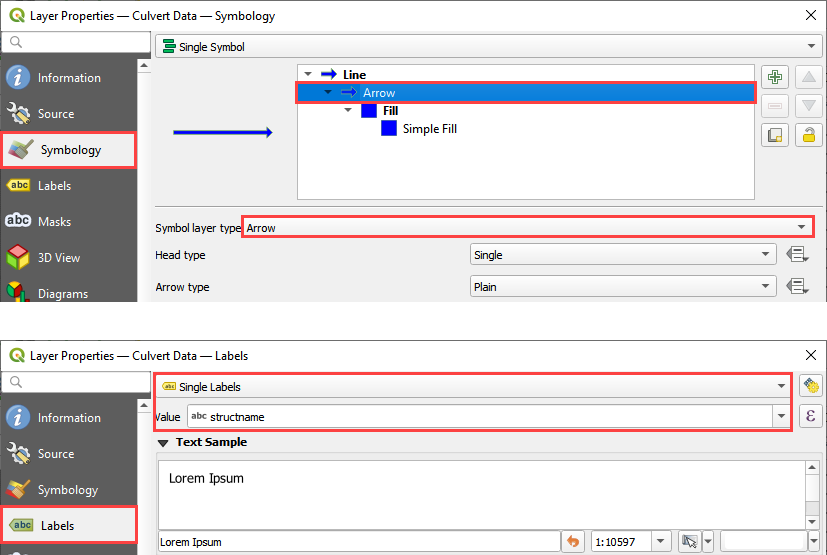
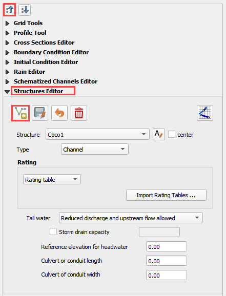
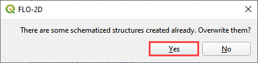

Culverts
========

**Overview**

This tutorial outlines the process of creating hydraulic structures with generalized culvert equations.

**Required Data**

============= =====================
**File**      **Content**
============= =====================
\*.shp         Culvert Data
============= =====================

Data Location: \\Coastal Training\\Project Data\\Culverts

**NEED TO CHANGE THE YOUTUBE LINK**

.. raw:: html

    <iframe width="560" height="315" src="https://www.youtube.com/embed/zv5fN8_JQ0I" frameborder="0" allowfullscreen></iframe>

Step 1: Import data
______________________________

Start by cleaning up the map space so the next layer will be easy to see.

1. Uncheck the Channels group.

2. Check the Elevation Layer to run on the elevation map.

3. Click the Structure Lines layer to activate it.  It is in the User Layers Group.

4. Drag the Culvert Data.shp onto the map space.

.. image:: ../img/Coastal/culv001.png

Step 2: Format the data layers
______________________________

1. Double click the Culvert Data layer.

2. Change the symbology to Arrow.

3. Set the Labels to structname.

4. This helps identify the structure and show the flow direction.

Step 3: Build the structures into the User Layers.
____________________________________________________________

.. important:: On FLO-2D, the Culvert must be created from upstream (higher elevation) to downstream (lower elevation).
               It is possible to check the elevations using the Grid Info Tool.  The grid element elevation is used as
               the invert elevation of the culvert.  If elevation corrections are needed, review the Advanced
               Hydraulic Structures lesson for the methods.  It is found on the left sidebar.

               .. image:: ../img/Coastal/culv026.png

               .. image:: ../img/Coastal/culv027.png

1. Use the Structure Editor to add the new structures.

2. Collapse the Widgets, open the Structures Editor, and click the Add a Structure button.

**Digitizing process:**

3. Locate Culvert #15 (CU15) on the right portion of the map, near the channel.
   In this Culvert, the water flows in the south-north direction.

4. Left click the inlet node (upstream node)

5. Left click the outlet node (downstream node)

6. Right Click to finish the polyline.
   Click OK to close the attribute window.

7. Click save on the widget to save and load the recently added data to the widget

.. important:: Utilize the Widget save button to save and load data into the Widget. Please note that using the QGIS
               save button adds the data but does not populate it into the Widget. If the QGIS save button was used,
               click on edit and save again using the Widget button to ensure the data is populated.

**Copy process:**

8. In order to speed up the live class, click on the Culvert Data layer and select the other 4 culverts

.. image:: ../img/Coastal/culv015.png

9. Culverts that are selected will be highlighted with a yellow color.

10. Use the Ctrl + c command to copy the selected Culverts from the Culvert Data layer.
    Select the Structure Lines layer, click on the Toggle Editing button and paste the Culverts using Ctrl + v.

.. image:: ../img/Coastal/culv017.png

11. Click save on the widget to save and load the recently added data to the widget.

.. image:: ../img/Coastal/culv018.png

Step 4: Assign the structure attributes
___________________________________________

1. Check the center box.

.. image:: ../img/Coastal/culv006.png

2. To identify the Culvert Name, zoom into the selected feature. If the center checkbox is checked, it will be marked in red.

3. Start filling up all the data based on the following tables and figures.

.. image:: ../img/Coastal/culv020.png

.. image:: ../img/Coastal/culv021.png

.. image:: ../img/Coastal/culv022.png

.. note::

    - **TYPEC**

      - type 1: box culvert
      - type 2: pipe culvert

    - **TYPEEN**

      - *BOX entrance:*

        - type 1: wingwall flare 30 to 75 degrees
        - type 2: wingwall flare 90 or 15 degrees
        - type 3: wingwall flare 0 degrees

      - *PIPE entrance:*

        - type 1: square edge with headwall
        - type 2: socket end with headwall
        - type 3: socket end projecting

    - **CULVERTN**

      - Culvert Manning’s roughness coefficient. Default = 0.03.

    - **KE**

      - Culvert entrance loss coefficient.

    - **CUBASE**

      - Flow width (ft or m) of box culvert for TYPEC = 1. For a circular culvert, CUBASE = 0.

.. seealso:: From Hydraulic Design of Highway Culverts - HDS-5-Third Edition

    .. image:: ../img/Coastal/culv028.png

4. Schematize the structure data and click Yes to replace the data.

.. image:: ../img/Coastal/culv009.png

.. note:: To verify the added data, it is possible to open the attribute table of the Hydraulics Structures layer and the Culvert Equations table within the Hydraulic Structures group.

    .. image:: ../img/Coastal/culv024.png

    .. image:: ../img/Coastal/culv025.png

Step 6: Save, and export
______________________________

1. This is a good point to save project.

.. image:: ../img/Advanced-Workshop/Module046.png

2. Export the data files to the Culvert Test folder.

.. image:: ../img/Advanced-Workshop/Module047.png

3. All data files will be created in the selected project folder.

.. image:: ../img/Coastal/culv010.png

.. image:: ../img/Coastal/culv011.png

.. image:: ../img/Coastal/culv011a.png

Step 7: Create a backup file
______________________________

1. Close QGIS.

2. Open the project folder.  Select the Coastal Project.gpkg and Coastal Project.qgz files.  Right click them and
   click Sent to/Compressed (zipped) folder.

.. image:: ../img/Coastal/creategrid019.png

3. Name the zipped file.
   It is good to choose a name that identifies project progress.
   For Example: **CulvertsOK.zip**

.. image:: ../img/Coastal/culv012.png

4. Open QGIS and reload the project.

.. image:: ../img/Coastal/creategrid021.png

5. Click yes to load the model.

.. image:: ../img/Coastal/creategrid022.png

