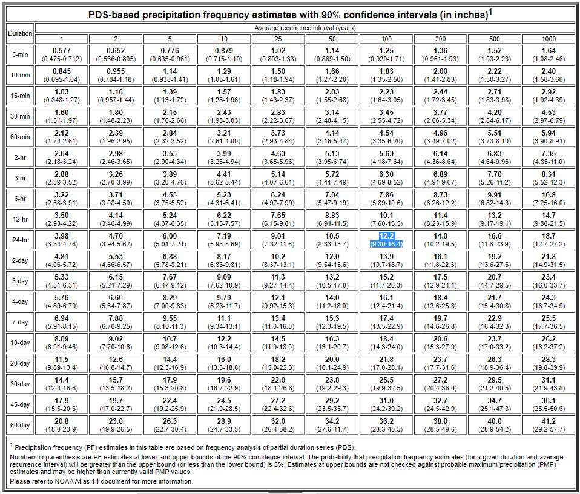
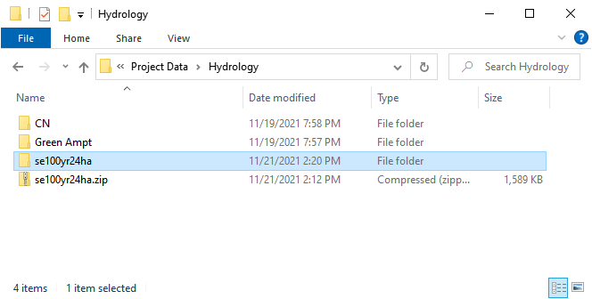
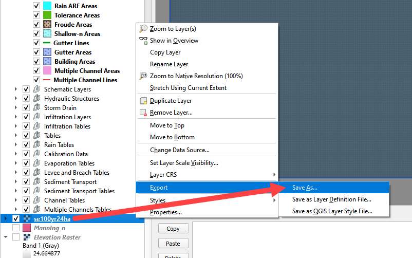
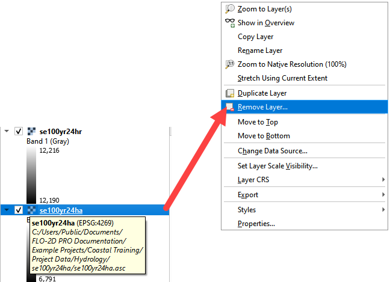
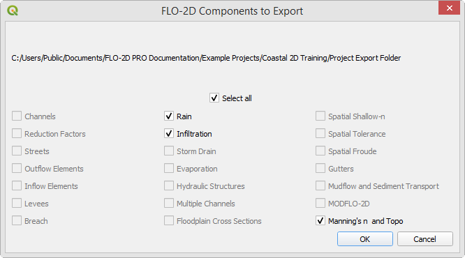
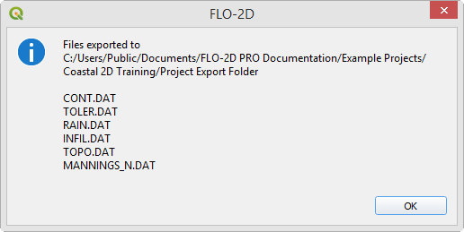

Hydrology
=========

**Overview**

In this module, learn how to retrieve data from NOAA to create rainfall and calculate infiltration from spatial data.

Required Data
-------------

The required data is in the Coastal Training Folder.

======== ====================== =======================
**File** **Content**            Location
======== ====================== =======================
\*.shp   LandUse Training       Hydrology\\Green Ampt
\*.tif   Soil Training          Hydrology\\Green Ampt
\*.asc   NOAA rainfall data     NOAA Website
======== ====================== =======================

Data Location: \\Coastal Training\\Project Data\\Hydrology

.. youtube:: MP_pQuUtI08

Step 1. Determine the total rainfall
------------------------------------

1. In an internet browser right click this link and open it in a new tab. https://hdsc.nws.noaa.gov/hdsc/pfds/

2. On the NOAA website, click on Florida.

3. To navigate to the project area, search for "Immokalee and Tamiami"

.. image:: ../img/Coastal/hydrology002.png

4. Scroll down to the table data and find the total rainfall for this area.  100yr 24hr rainfall is 12.2 inches.

5. Change the Tab to Supplementary Info, set the variables to 100yr, 24hr and click Submit.

.. image:: ../img/Coastal/hydrology004.png

6. The file was most likely saved to the Download folder.  Copy it to the project folder and Extract it.
   \\Coastal Training\\Project Data\\Hydrology

7. Click the manning_n layer near the bottom of the Layers List and drag the se100yr24ha.asc file onto the map space.

.. image:: ../img/Coastal/hydrology006.png

8. Right click the se100yr24ha layer and click Zoom to Layer.

9. These pixels are rainfall in inches \* 1000.

10. Zoom to the Computational Domain

.. image:: ../img/Coastal/hydrology008.png

11. Use the Export option to save the data in the correct coordinate system and clipped to the Map Canvas Extent.

12. Right click the layer and Export the data.

13. Save the data to the Hydrology folder.

14. Set the coordinate system to EPSG 2881.

15. Reduce the size of the raster with the Map Canvas Extent button.

16. Add the saved file to the map.

17. Click OK.

Step 2. Sample the rainfall raster
----------------------------------

1. Remove the original raster from the layers list.  It has the wrong coordinate system and cannot be used to calculate
   rainfall data.

2. Use the ID tool to find the peak rainfall.

3. In this case, the lightest color is the highest rainfall.

4. 12216 is 12.2 inches of rainfall.

.. image:: ../img/Coastal/hydrology012.png

Step 3. Set up the rainfall
----------------------------

1. Collapse the FLO-2D widgets and click Rain Editor.

.. image:: ../img/Coastal/hydrology013.png

2. Enter the total rainfall.

3. Select a rainfall distribution.

   - C:\\Users\\Public\\Documents\\FLO-2D PRO Documentation\\Rainfall Distributions\\SCS 24-Hr Type II

4. Check the Spatial Variation (Depth Area Reduction)

.. image:: ../img/Coastal/hydrology014.png

5. Interpolate the rainfall depth reduction factor.

6. Click the AR button.

7. Fill the form.

8. Click OK to calculate the rainARF and OK to close the message.

9. The rainfall is now complete.  It will be exported into the RAIN.DAT file.

Step 4. Simplify layers list
----------------------------

1. Move all of the external data to the bottom of the Layers List.

2. Select the external layers using CTRL-Click or Shift-Click.

3. Right click the selected layers and click Group Selected.

4. Right click the Grouped Layers and rename them Project data or External data.  The name should be something
   that helps organize the data.

.. image:: ../img/Coastal/hydrology016.png

5. There are many tools to manage the layers list.  These can help organize data so that it is easy to find.

6. Use the cursor to hover over each icon and read the tool tip.  Collapse All and the Hide Selected are two tools
   that will keep the layers list manageable.

.. image:: ../img/Coastal/hydrology017.png

Step 5. Calculate infiltration
-------------------------------

1. Collapse the FLO-2D widgets and click Infiltration Editor.

.. image:: ../img/Coastal/hydrology013.png

2. Select the new Group in the layers list and drag the file LandUse Training.shp onto the map space.

\\Coastal Training\\Project Data\\Hydrology\\Green Ampt\\LandUse Training.shp

3. Drag the file Soil Training.shp onto the map space.

\\Coastal Training\\Project Data\\Hydrology\\Green Ampt\\Soil Training.shp

.. image:: ../img/Coastal/hydrology018.png

4. From the Infiltration Editor click the Global Infiltration icon.

.. image:: ../img/Workshop/Worksh048.png

5. Check the Global Green Ampt switch.  These global values will be replaced by spatial data so it is not necessary
   to complete this data unless uniform infiltration is used.

6. Click OK to close.

.. image:: ../img/Workshop/Worksh049.png

7. On the Infiltration Editor click Calculate Green-Ampt.

.. image:: ../img/Workshop/Worksh050.png

8. Specify the attributes as shown in the following image and click OK.
   The calculation process should take less than 1 minute to complete because this project is small.

**Note:  If a calculator is taking too much time, make sure the data is on the C: drive.  If the project is in a
directory on the C: drive, and the data is in the same directory, the SQLite database manager works much faster.**

.. image:: ../img/Coastal/hydrology019.png

Step 6. Save, export, and run
------------------------------

1. This is a good point to save project.

.. image:: ../img/Advanced-Workshop/Module046.png

2. Set up the Control Variables and click Save.

.. image:: ../img/Coastal/chan047.png

.. image:: ../img/Coastal/hydrology020.png

3. Export the project.

.. image:: ../img/Advanced-Workshop/Module089.png

4. Save the data to the Project Folder and click OK to close the message.

.. image:: ../img/Coastal/hydrology022.png

4. Click the Run FLO-2D Icon.

.. image:: ../img/Advanced-Workshop/Module051.png

5. Set the Project path and the FLO-2D Engine Path and click OK to start the simulation.

.. image:: ../img/Coastal/hydrology024.png

6. Let the project run and continue on to the next step.

Step 7: Create a backup file
----------------------------

1. Close QGIS.

2. Open the project folder.  Select the Coastal Project.gpkg and Coastal Project.qgz files.  Right click them and
   click Sent to/Compressed (zipped) folder.

.. image:: ../img/Coastal/creategrid019.png

3. Name the zipped file.
   It is good to choose a name that identifies project progress.
   For Example: **Hydrology OK.zip**

4. Open QGIS and reload the project.

.. image:: ../img/Coastal/creategrid021.png

5. Click yes to load the model.

.. image:: ../img/Coastal/creategrid022.png
