Mapping Results
===============

**Overview**

This tutorial outlines the process of mapping the FLO-2D results.

Required Data

================== ==========================
**File**           **Content**
================== ==========================
\*.out             FLO-2D output files
\*.out             TIMDEP time series output
================== ==========================

Data Location:  \\Coastal Training\\Project Data\\Project Export Folder

Step 1. Simplify map
_____________________

1. Uncheck unnecessary layers like Grid, Elevation, and the user added layers (e.g. Culvert Data, Storm Drain...). Uncheck the following groups:

- Schematic Layers

- Hydraulic Structures

- Storm Drain

.. image:: ../img/Coastal/map017.png

.. tip:: Remove unnecessary layers to emphasize the specific result or feature intended for mapping.

Step 2. Rasterizor
_____________________________________

Rasterizor is a quick mapping tool for FLO-2D output files.
The files should have a standard format with 4 columns ge, x, y, n.
These are grid element number, x coordinate, y coordinate, and n is the mapped value.
It could be water surface elevation, depth, velocity or time to depth.

.. seealso:: The Rasterizor documentation can be found at: `Rasterizor Wiki <https://github.com/FLO-2DKaren/FLO-2D-Rasterizor/wiki>`_

1. Create a group named 'Rasterizor Results' to simplify the management of results.

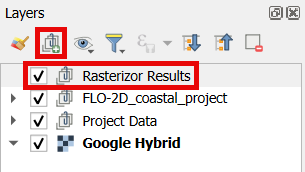

2. Open Rasterizor

.. image:: ../img/Coastal/map018.png

3. A file often mapped by Rasterizor is the DEPTH.OUT. Click on the button to load the file.

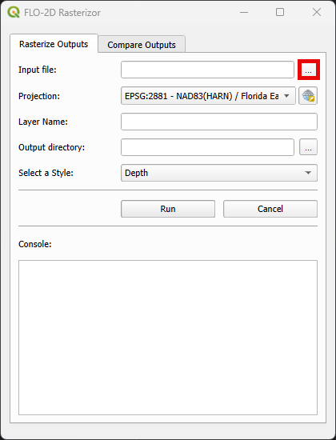

.. seealso:: DEPTH.OUT shows the maximum combined channel/floodplain flow depths. More information regarding the output (\*.OUT) files can be found on FLO-2D Data Input Manual.

4. Select this file in the Run/Export Folder.

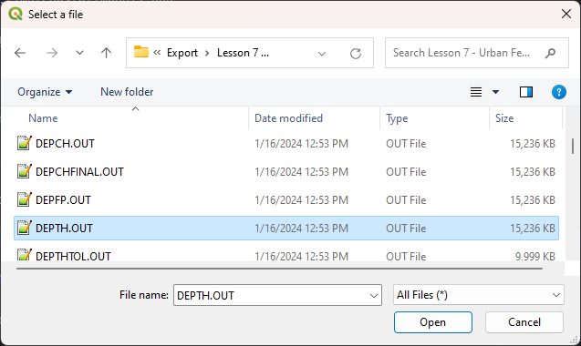

3. Create a folder called Rasterizor to save the results and fill the data as the following image. Click Run.

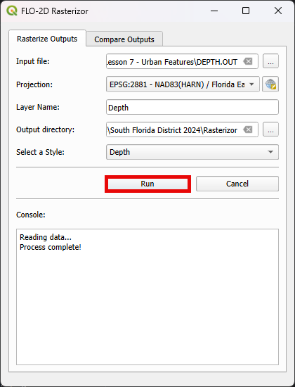

.. note:: The projection has already been retrieved from the QGIS project.
          However, when mapping results from a blank project in Rasterizor,
          the projection defaults to WGS84. In such cases, the user must manually change it to the correct projection.

4. The DEPTH results will be displayed with a default FLO-2D symbology.

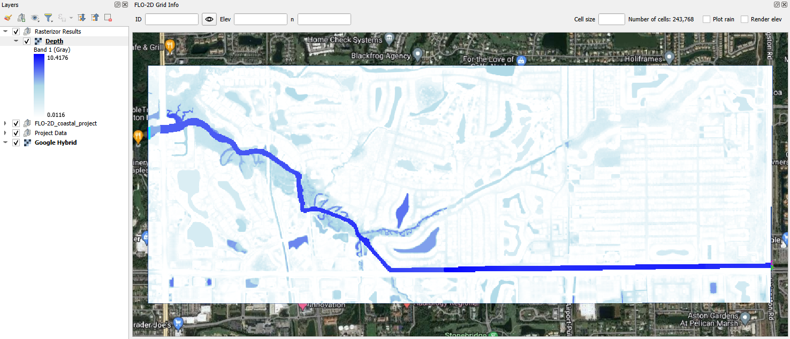

5. It is possible to change the symbology by right clicking on the layer and selecting Properties.

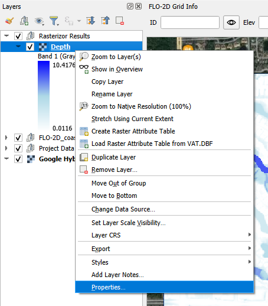

6. Navigate to the symbology tab and modify the color ramp for demonstration purposes. Choose either a predefined color ramp or create a custom one.

.. image:: ../img/Coastal/map025.png

7. Here is the exact same data from the DEPTH.OUT but using another symbology.

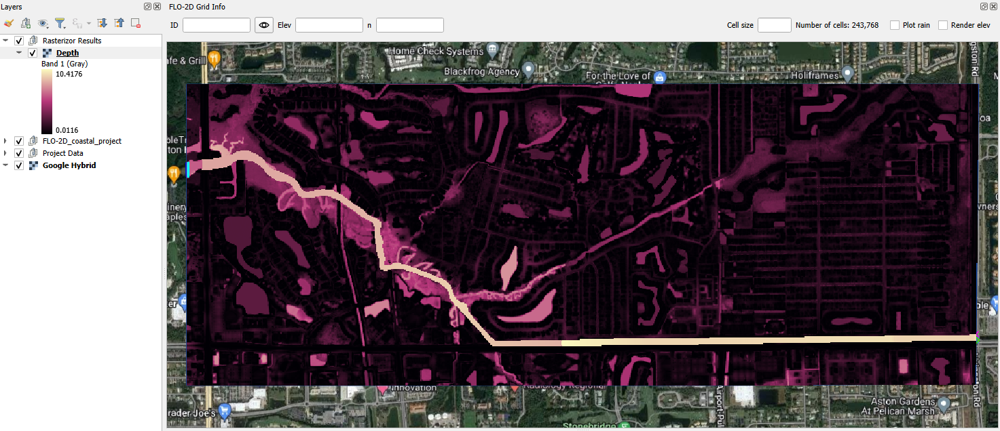

.. note:: The default FLO-2D symbology serves as a color reference and can be customized according to the user's preferences.

8. Rasterizor also can map velocities. Select the VELFP.OUT file and click Run.

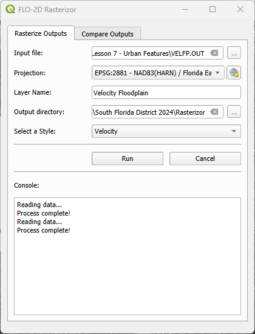

.. seealso:: VELFP.OUT shows the maximum floodplain flow velocity. More information can be found on the FLO-2D Data Input Manual.

9. Uncheck the Depth layer and check the velocity results.

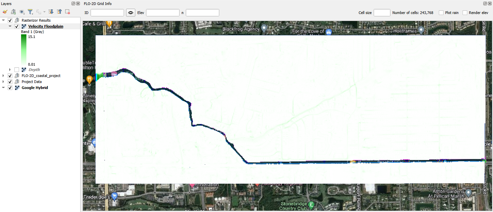

.. tip:: It is possible to use the QGIS Info Tool to check the velocity/depth value.

        .. image:: ../img/Coastal/map029.png

Step 3. MapCrafter - Flood Maps
_________________________________

FLO-2D MapCrafter is designed to transform FLO-2D output files into comprehensive visualizations.
It generates flood maps for single-phase simulations, sediment maps, mudflow maps, and two-phase simulation flood maps.
Additionally, MapCrafter goes beyond by creating hazard maps, highlighting areas with elevated risks based on
FLO-2D simulations, aiding in risk management. The plugin also streamlines the QGIS layout manager process by
automatically generating templates for easy customization.

.. seealso:: The MapCrafter documentation can be found at: `MapCrafter Wiki <https://github.com/FLO-2DSoftware/FLO-2DMapCrafter/wiki>`_

1. Uncheck the 'Rasterizor Results' group. Creating a specific group for MapCrafter is unnecessary as it automatically generates its own group.

2. Open MapCrafter

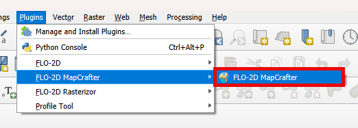

3. Select the Run/Export Folder.

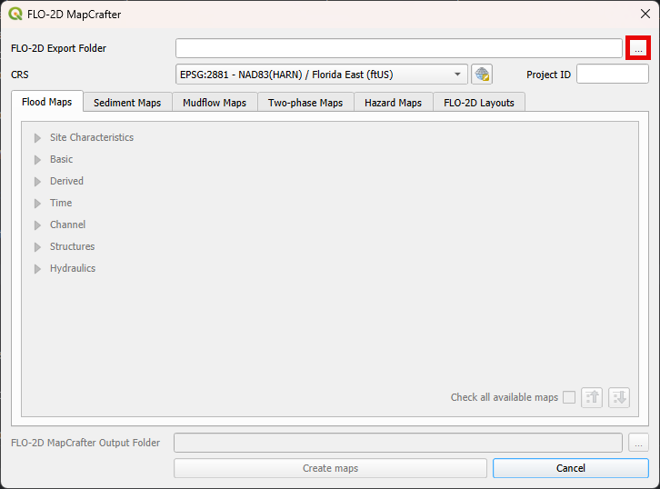

4. Expand the Site Characteristics, Basic, and Channel groups. Select the following variables to be mapped by MapCrafter and click on Create maps.

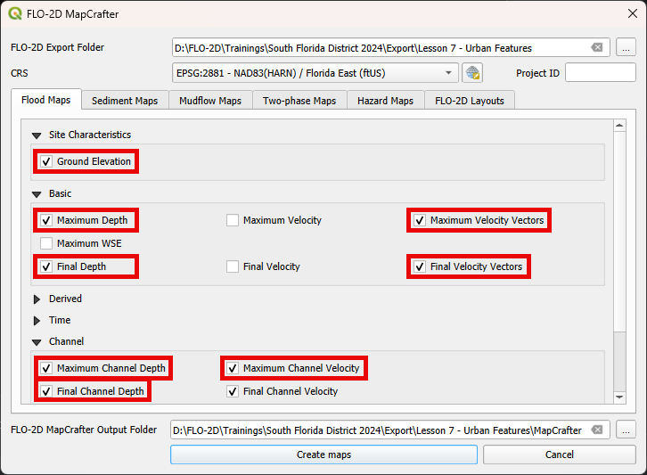

.. important:: MapCrafter filters variables for mapping based on the type of simulation,
    including Flood, Sediment, Mudflow, and Two-Phase. The availability of hazard maps depends on the specific type of simulation and the data that is accessible.

5. Please wait for MapCrafter to generate the maps.
   The duration of this process may vary depending on the number of cells and results being mapped. A notification when the operation is complete will be shown.

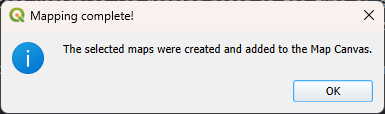

6. All MapCrafter results will be displayed within their dedicated group, labeled 'FLO-2D MapCrafter', and subgroups, 'Site Characteristics', 'Basic', 'Channel' ...

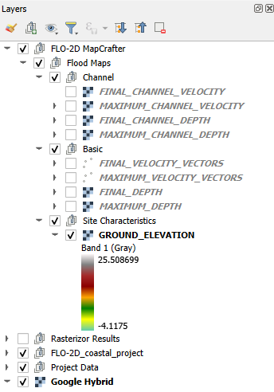

**GROUND ELEVATION**

Maps the ground elevation based on the TOPO.DAT file

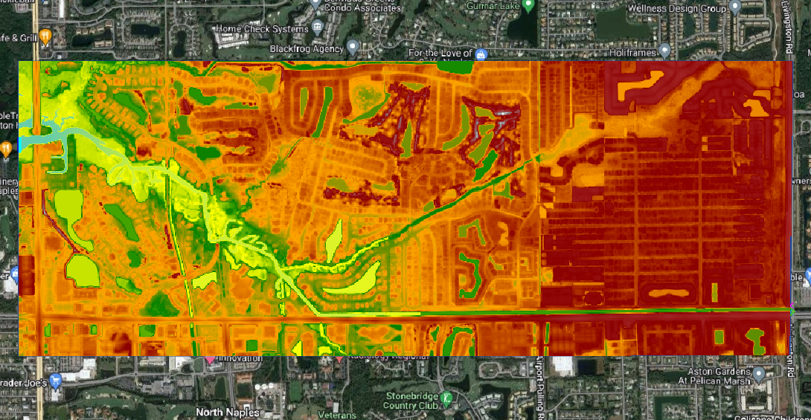

**MAXIMUM DEPTH**

Maps the maximum floodplain depth based on the DEPFP.OUT file

.. image:: ../img/Coastal/map036.png

**FINAL DEPTH**

Maps the final floodplain depth based on the FINALDEP.OUT file

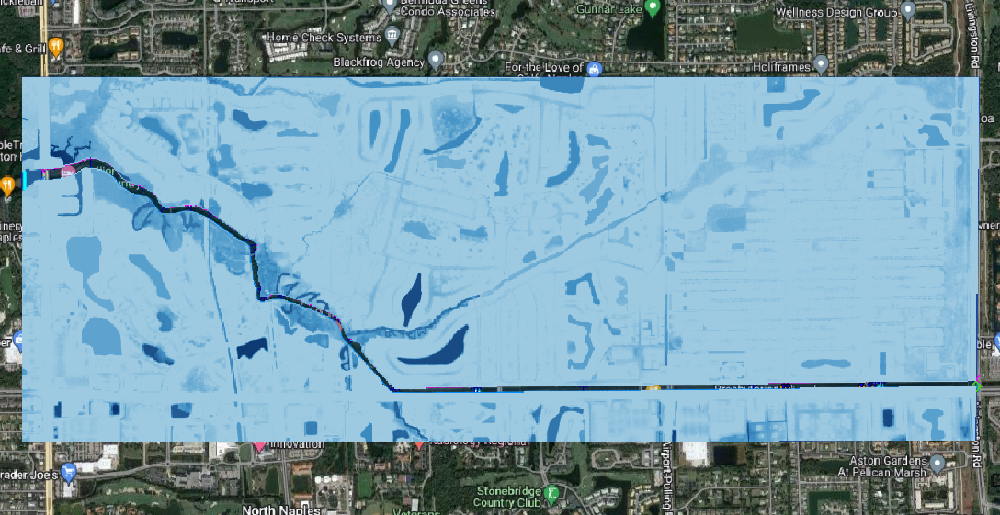

**MAXIMUM VELOCITY VECTORS**

Maps the maximum velocity vectors based on a combination of the VELFP.OUT and VELDIREC.OUT files

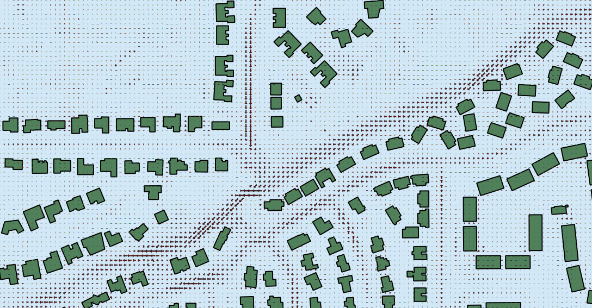

**FINAL VELOCITY VECTORS**

Maps the final velocity vectors based on a combination of the FINALVEL.OUT and FINALDIR.OUT files

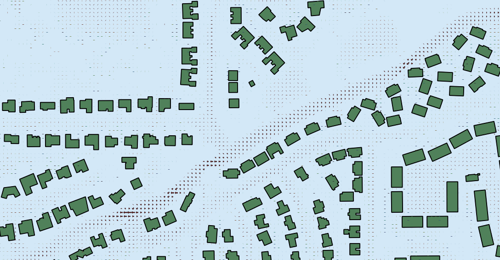

**MAXIMUM CHANNEL DEPTH**

Maps the maximum channel depth based on the DEPCH.OUT file

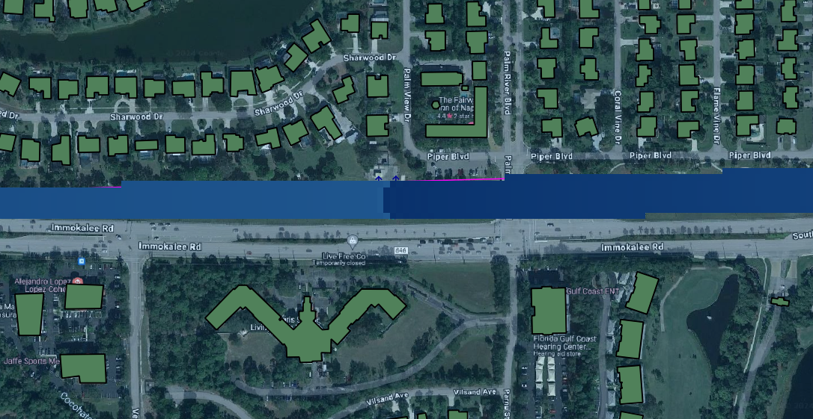

**FINAL CHANNEL DEPTH**

Maps the final channel depth based on the DEPCHFINAL.OUT file

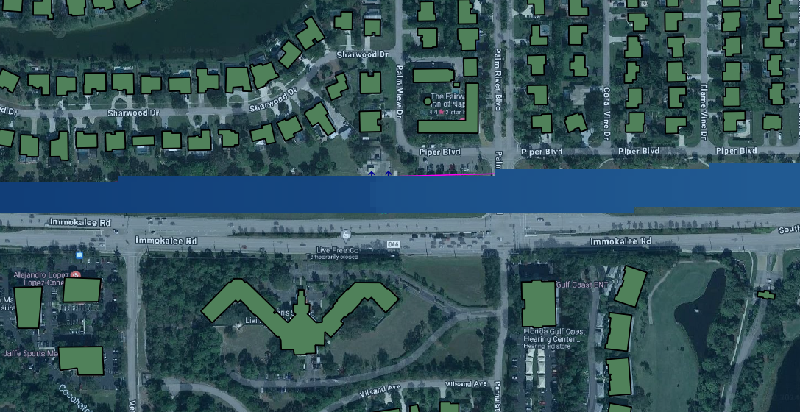

**MAXIMUM CHANNEL VELOCITY**

Maps the maximum channel velocity based on the VELOC.OUT file

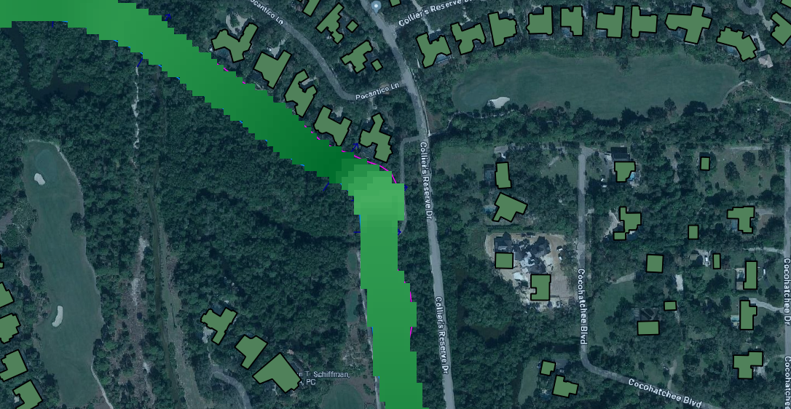

.. important:: There are numerous other options available for mapping results with MapCrafter.
               The examples provided here are just a demonstration of some results that can be mapped.
               It is recommended to explore additional mapping options based on the user's specific needs.

Step 4. MapCrafter - Hazard Maps
____________________________________

1. Open MapCrafter

2. Select the Run/Export Folder.

4. Navigate to the Hazard Maps tab and check all maps under the US Bureau of Reclamation. Click on Create maps.

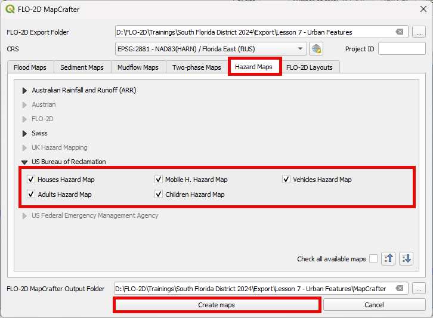

.. note:: The USBR (United States Bureau Reclamation) Hazard map follows the criteria described in the
          Downstream Hazard Classification Guidelines (USBR, 1988). MapCrafter allows the user to select
          five hazard mapping classification systems: Houses, Mobile Homes, Vehicles, Adults, and Children.
          Each of these hazard mapping options define the hazard based on Danger zone curves that are
          separated into High Danger Zone, Judgement Zone and Low Danger Zone.
          The danger zones are curves that define a relationship between depth and velocity.

          .. image:: ../img/Coastal/map051.png

..  important:: The Hazard maps are generated for the entire project domain.
                It is not meaningful to assess House Hazard in regions without houses
                (e.g., waterbodies, channels, grasslands). The same applies to all hazard maps.
                Engineering judgment must be employed to identify areas more susceptible
                to the specific type of flood damages.

**HOUSES HAZARD**

Houses Hazard Map is focused on permanent residences attached to foundations
and worksite areas, including facilities that contain workers on a daily basis.
This includes farm operations, oil and gas operations,
sand and gravel operations, and fish hatcheries

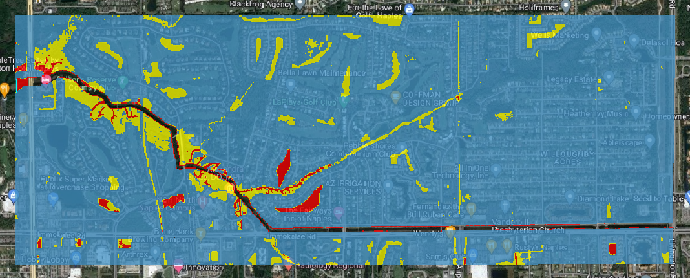

.. tip:: Increase transparency in the Hazard layer to facilitate the analysis and visualization.

- HIGH DANGER ZONE (RED): Occupants of most houses are in danger from floodwater.
- JUDGMENT ZONE (YELLOW): Danger level is based upon engineering judgement.
- LOW DANGER ZONE (BLUE): Occupants of most houses are not seriously in danger from flood water.

**Mobile Houses Hazard**

Mobile Houses are typically located in flood plains due to zoning
requirements in many areas, creating a very dangerous situation for
occupants of mobile homes, as they are very susceptible to movement
from relatively small floods.

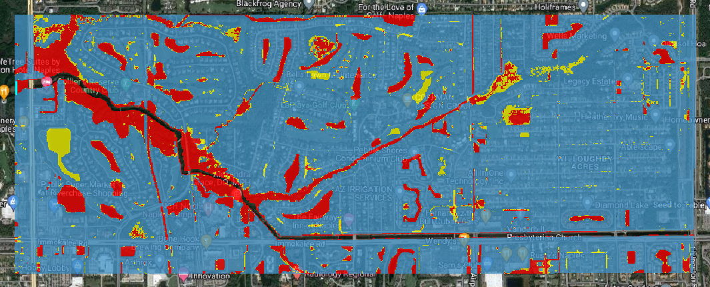

- HIGH DANGER ZONE (RED): Occupants of almost any size mobile home are in danger from flood water.
- JUDGMENT ZONE (YELLOW): Danger level is based upon engineering judgement.
- LOW DANGER ZONE (BLUE): Occupants of almost any size mobile home are not seriously in danger from flood water.

**Vehicles Hazard**

Vehicles Hazard is focused on the possibility for loss
of life to motorists and pedestrians.

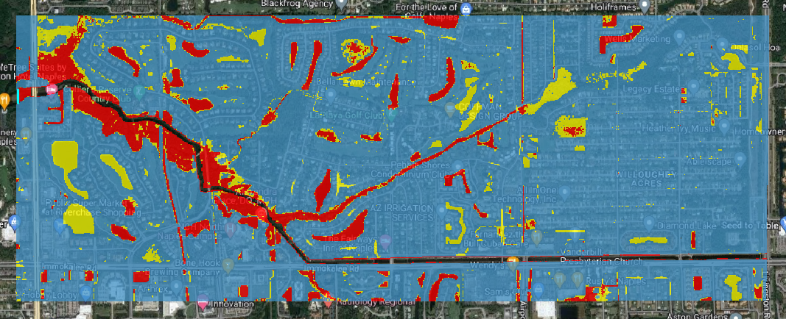

- HIGH DANGER ZONE (RED): Occupants of almost any size passenger vehicle are in danger from flood water.
- JUDGMENT ZONE (YELLOW): Danger level is based upon engineering judgment.
- LOW DANGER ZONE (BLUE): Occupants of almost any size passenger vehicle are not seriously in danger from flood water.

**Adults Hazard**

In Adults Hazard Map, an adult is considered any human over 5 feet (150 cm) tall and weighing over
120 pounds (54 kg).

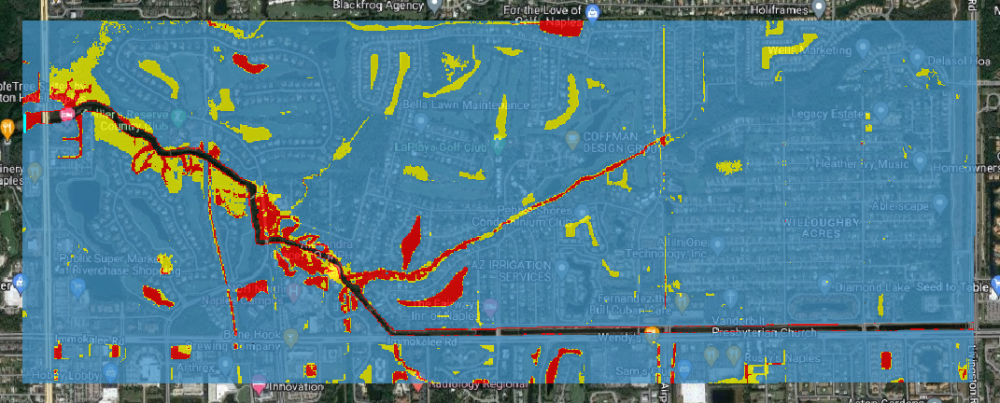

- HIGH DANGER ZONE (RED): Almost any size adult is in danger from flood water.
- JUDGMENT ZONE (YELLOW): Danger level is based upon engineering judgment.
- LOW DANGER ZONE (BLUE): Almost any size adult is not seriously threatened by flood water.

**Children Hazard**

The Children Hazard map represents a more conservative classification compared to the Adults Hazard Map.

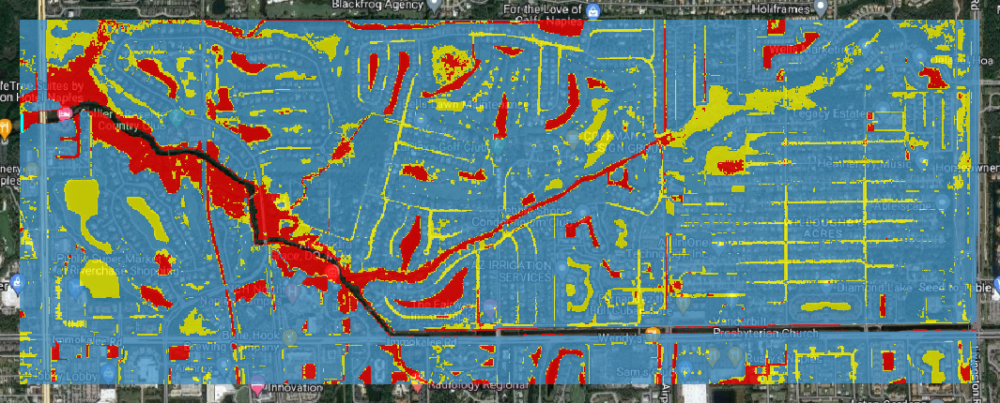

- HIGH DANGER ZONE (RED): Almost any size child is in danger from flood water.
- JUDGMENT ZONE (YELLOW): Danger level is based upon engineering judgment.
- LOW DANGER ZONE (BLUE): Almost any size child (excluding infants) is not seriously threatened by flood water.

Step 5. MapCrafter - Layouts
_______________________________

The latest MapCrafter version comes with FLO-2D Layouts, a tool that automatizes the creation of QGIS maps by using pre-defined map layouts.

1. Select the FLO-2D Layouts tab. Fill out the information bellow and click on 'Open selected layout'

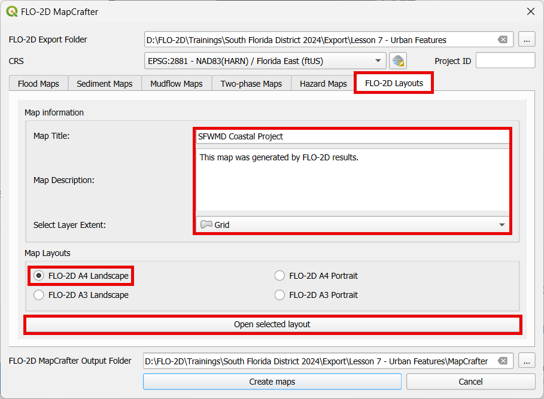

.. note:: The available options include A4 and A3 paper sizes, and you can choose between landscape and portrait orientations.

2. A QGIS New Print Layout window will appear with the data filled in the previous step.

.. important:: This layout serves as a starting point and it should be customized according to the user's specific requirements.

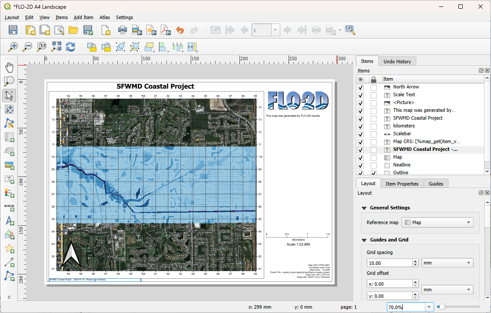

3. To add a legend, click on Add Item and Add Legend. Select a good centered position on the right of the map.

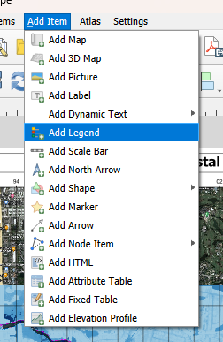

4. Use the item properties to filter out the unnecessary layers and adjust the legend.

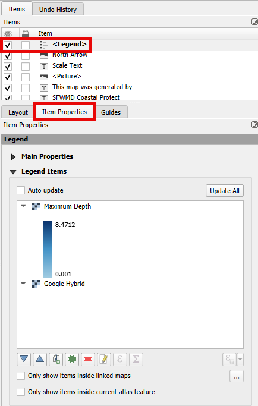

.. note:: QGIS offers numerous tools and features to enhance map layout, but these are beyond the scope of this training and will not be covered for the sake of time.

5. Once the layout is ready, click on Export as PDF to save the map.

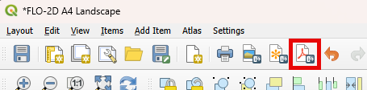

6. Select the desired file name and folder.

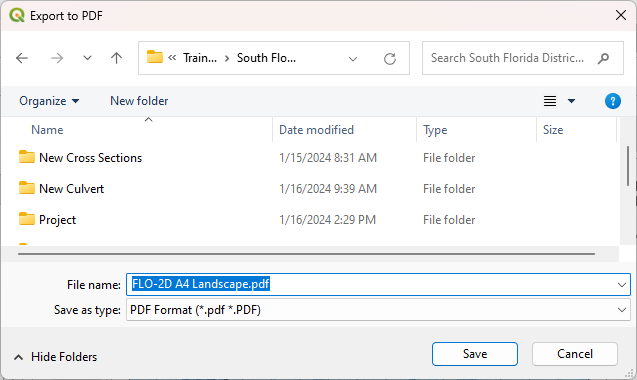

7. It is possible to select as many layers as desired to export to the pdf, but since a Maximum Depth legend was added, only the Maximum Depth will be selected to be saved.

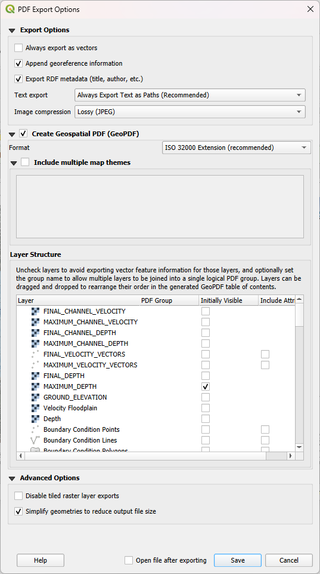

.. important:: This is a user's choice; all layers can be exported in one PDF, or multiple PDFs containing separated layers can be exported.

8. Load the pdf to review it.

9. If multiple layers were selected, they will be displayed as layers in the PDF reader.

.. image:: ../img/Coastal/map015.png
