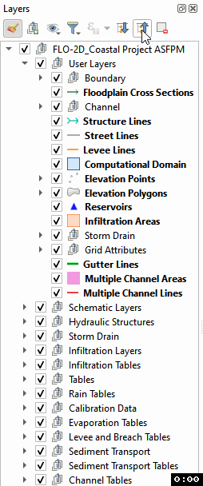
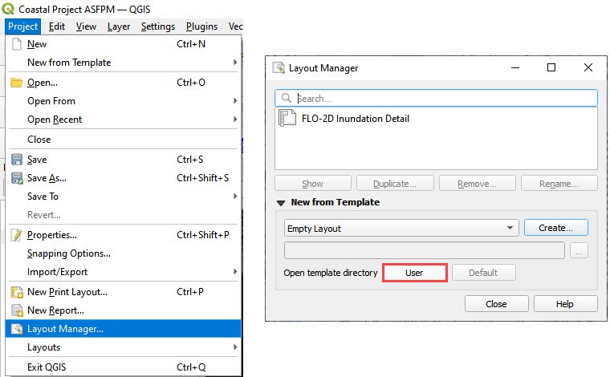
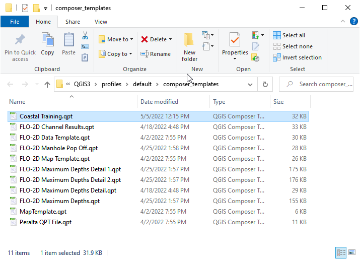
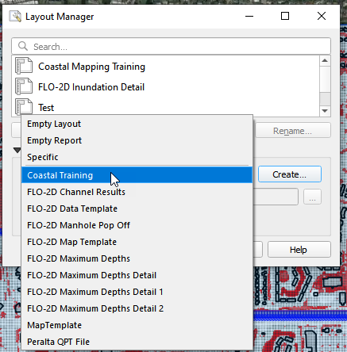
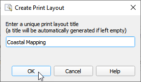
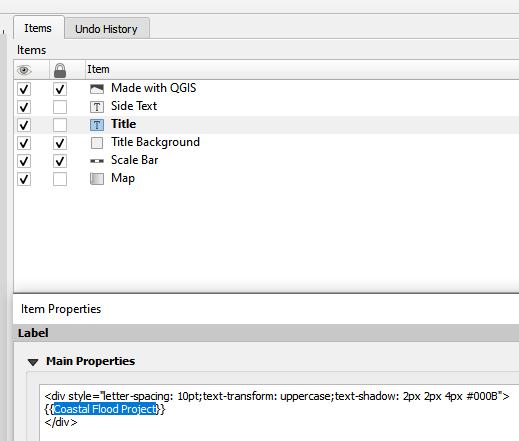
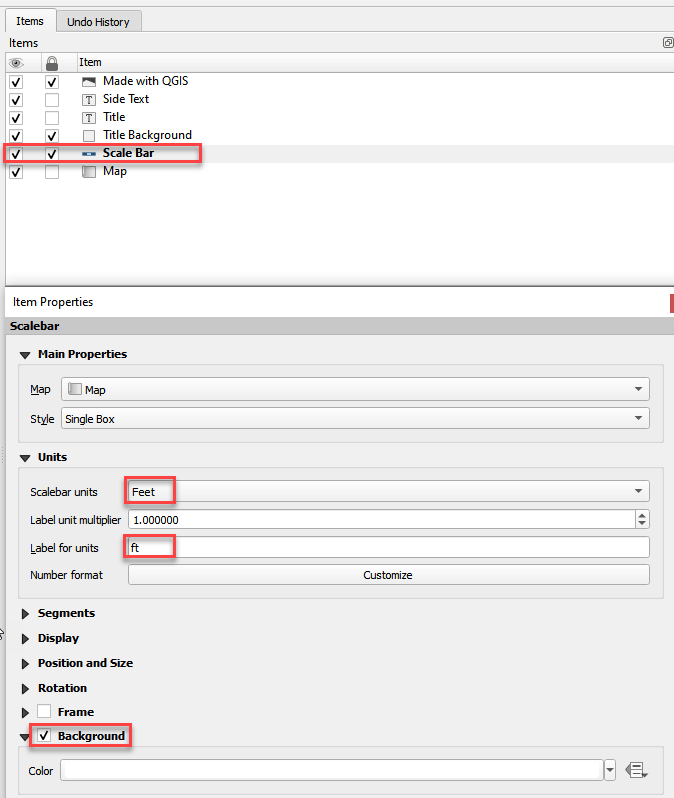

Mapping Results
===============

Required Data

================== ==========================
**File**           **Content**
================== ==========================
\*.out              FLO-2D output files
\*.hdf5             Time series output
================== ==========================

Data Location:  \\Coastal Training\\Project Data\\Project Export Folder

Step 1. Simplify map
_____________________

1. Uncheck unnecessary layers like Grid and Elevation, and Google Hybrid.

2. Set up the layers.

- Collapse all layers

- Click the Layers Styling button.

- Right click the Layers area and create a
  new Group called Results.

Step 2. Import results from mesh tool
______________________________________

1. Click the Data Management button.

.. image:: ../img/Coastal/map002.png

2. Select the Mesh option.

3. Navigate to the FLO-2D Project folder and select the DEPTH.OUT file.

4. Click Add and select the 2D layer and click OK.

.. image:: ../img/Coastal/datamanagermesh.gif

5. Drag the New Layer and drop it into the Results Group.

Step 3. Load the Layer Style panel
____________________________________

1. Dock the layer styling panel with the FLO-2D widgets.

2. Select the Depth layer in the Results Group.

3. Drag the edge of the Layer Styling Panel slightly to the left to make it
   wider.

4. Click the multi-colored block next to Max Depth to load Depth from
   the mesh layer.

.. image:: ../img/Coastal/map003.png

Step 4. Modify the depth layer style
________________________________________

1. Click the Style tab on the Layer Styling Panel.

2. Change the min depth to 0.25ft.

3. Change the color ramp to Blues.

4. Move down and change the Mode to Equal Interval.

5. Change the number of classes to 5.

6. Check Clip out of Range Values.

.. image:: ../img/Coastal/map004.png

Step 5. Setup a Map Layout
___________________________

1. Download the sample map template Coastal Training.qpt file.
https://flo-2d.sharefile.com/d-s3eeda9a7b29c44a786b2b9af531e52ca

2. Open the Layout Manager and User template directory.

3. Copy the sample template file to the User Template Directory.

4. Select the Coastal Training Template from the New from Template button and then click Create.

5. Name the new map layout Coastal Mapping and click OK.

6. Select the Map item, Click Set Map Extent to Match Main Canvas Extent, Click Refresh.  Wait for the map to load
   onto the canvas.

.. image:: ../img/Coastal/map009.png

7. Select the Title Item and change the work Title to Coastal Flood Project.

8. Select the Scale Bar, change the map units to feet, fill in the label with ft, and load a background color.

9. Click the export PDF Button

.. image:: ../img/Coastal/map012.png

10. Save the PDF.

.. image:: ../img/Coastal/map013.png

11. Set the following parameters:

.. image:: ../img/Coastal/map014.png

12. Load the pdf to review it.

13.  The map detail is very solid and the resolution is good.

.. image:: ../img/Coastal/map015.png

