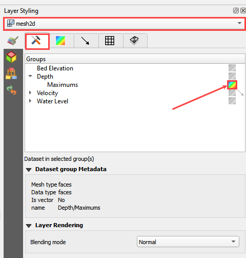

Mapping Results
===============

**Overview**

This tutorial outlines the process of mapping the FLO-2D results.

Required Data

================== ==========================
**File**           **Content**
================== ==========================
\*.out             FLO-2D output files
\*.out             TIMDEP time series output
================== ==========================

Data Location:  \\Coastal Training\\Project Data\\Project Export Folder

Step 1. Simplify map
_____________________

1. Uncheck unnecessary layers like Grid, Elevation, and the user added layers (e.g. Culvert Data, Storm Drain...). Uncheck the following groups:

- Schematic Layers

- Hydraulic Structures

- Storm Drain

.. image:: ../img/Coastal/map017.png

Step 2. Rasterizor
_____________________________________

Rasterizor is a quick mapping tool for FLO-2D output files.
The files should have a standard format with 4 columns ge, x, y, n.
These are grid element number, x coordinate, y coordinate, and n is the mapped value.
It could be water surface elevation, depth, velocity or time to depth.

1. Open Rasterizor

.. image:: ../img/Coastal/map018.png

2.

3. Load an alternate file

4. Create a difference map

Step 3. MapCrafter
____________________

FLO-2D MapCrafter is designed to transform FLO-2D output files into comprehensive visualizations.
It generates flood maps for single-phase simulations, sediment maps, mudflow maps, and two-phase simulation flood maps.
Additionally, MapCrafter goes beyond by creating hazard maps, highlighting areas with elevated risks based on
FLO-2D simulations, aiding in risk management. The plugin also streamlines the QGIS layout manager process by
automatically generating templates for easy customization.

Todo:

Load Maps

Load Review if available

Load Layout

9. Click the export PDF Button

10. Save the PDF.

11. Set the following parameters:

.. image:: ../img/Coastal/map014.png

12. Load the pdf to review it.

.. image:: ../img/Coastal/map016.png

13.  The map detail is very solid and the resolution is good.

.. image:: ../img/Coastal/map015.png

Step 2. Import results from mesh tool
______________________________________

1. Click the Data Management button.

.. image:: ../img/Coastal/map002.png

2. Select the Mesh option.

3. Navigate to the FLO-2D Project folder and select the DEPTH.OUT file.

4. Click Add and select the 2D layer and click OK.

.. image:: ../img/Coastal/datamanagermesh.gif

5. Drag the New Layer and drop it into the Results Group.

Step 3. Load the Layer Style panel
____________________________________

1. Dock the layer styling panel with the FLO-2D widgets.

2. Select the Depth layer in the Results Group.

3. Drag the edge of the Layer Styling Panel slightly to the left to make it
   wider.

4. Click the multi-colored block next to Depth to load Depth from
   the mesh layer.

Update image

Step 4. Animate the flooding - Update
________________________________________

1. Update.

2. Change the min depth to 0.25ft.

3. Change the color ramp to Blues.

4. Move down and change the Mode to Equal Interval.

5. Change the number of classes to 5.

6. Check Clip out of Range Values.

