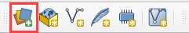

Mapping Results
===============

Required Data

================== ==========================
**File**           **Content**
================== ==========================
\*.out              FLO-2D output files
\*.hdf5             Time series output
================== ==========================

Data Location:  \\Coastal Training\\Project Data\\Project Export Folder

Step 1. Simplify map
_____________________

1. Uncheck unnecessary layers like Grid and Elevation, and Google Hybrid.

2. Set up the layers.

- Collapse all layers

- Click the Layers Styling button.

- Right click the Layers area and create a
  new Group called Results.

.. image:: ../img/Coastal/managelayers2.gif

Step 2. Import results from mesh tool
______________________________________

1. Click the Data Management button.

2. Select the Mesh option.

3. Navigate to the FLO-2D Project folder and select the DEPTH.OUT file.

4. Click Add and select the 2D layer and click OK.

.. image:: ../img/Coastal/datamanagermesh.gif

5. Drag the Depth Layer and drop it into the Results Group.

Step 3. Load the Layer Style panel
____________________________________

1. Dock the layer styling panel with the FLO-2D widgets.

2. Select the Depth layer in the Results Group.

3. Drag the edge of the Layer Styling Panel slightly to the left to make it
   wider.

4. Click the multi-colored block next to Max Depth to load Depth from
   the mesh layer.

.. image:: ../img/Coastal/map003.png

Step 4. Modify the depth layer style
________________________________________

1. Click the Style tab on the Layer Styling Panel.

2. Change the min depth to 0.25ft.

3. Change the color ramp to Blues.

4. Move down and change the Mode to Equal Interval.

5. Change the number of classes to 5.

6. Check Clip out of Range Values.

