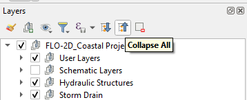
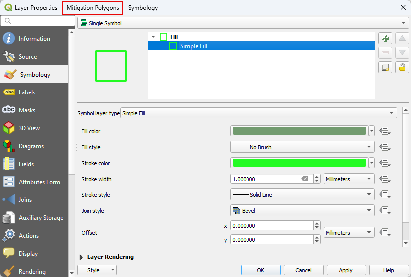
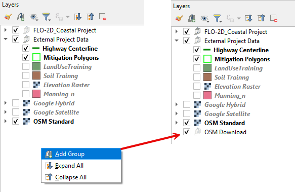
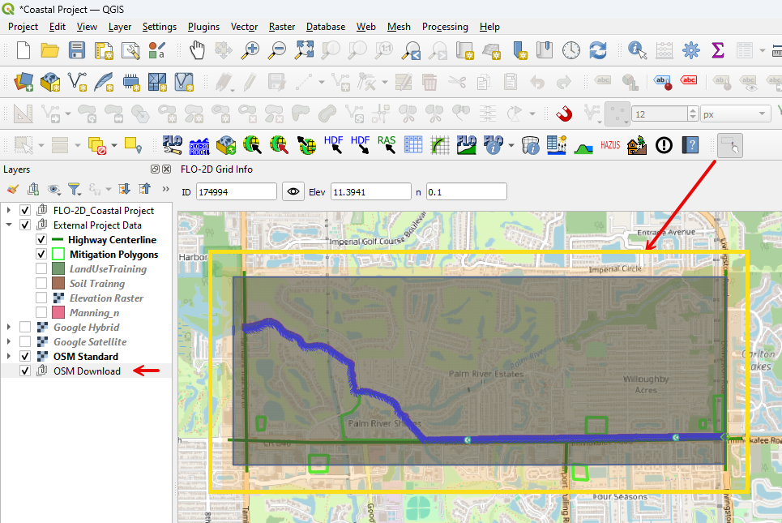
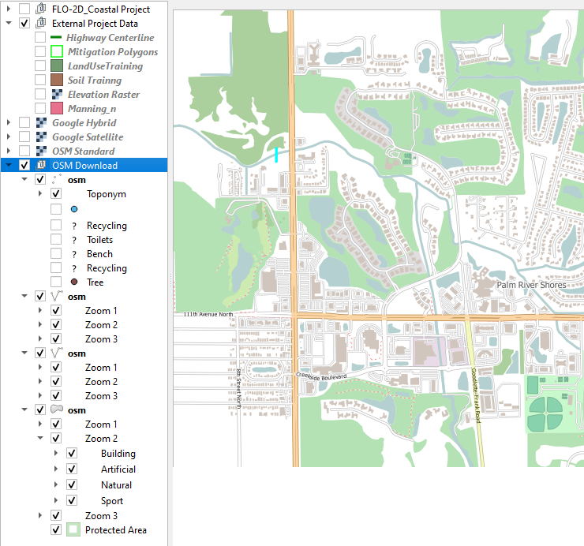
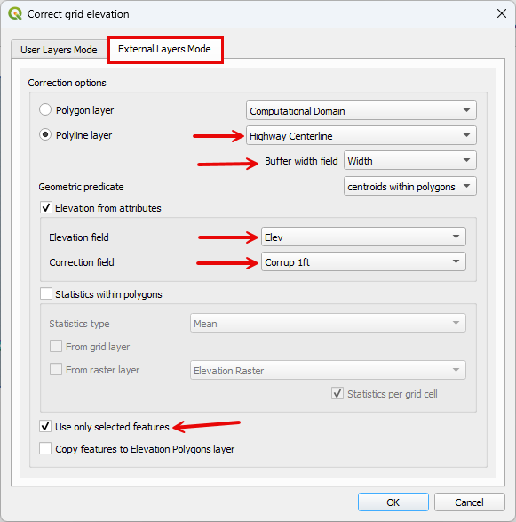

Mitigation Design
===================

**Overview**

Coastal flood mitigation practices include improving drainage, identifying critical infrastructure, protecting
evacuation routes, protecting and restoring natural flood barriers.  This lesson cannot cover the topic
fully but can help show how QGIS and FLO-2D can be used to study mitigation plans.  Mitigation models can help determine
if potential designs are successful.  Mitigation methods can include:

- Protect critical infrastructure

- Raise roadway, seawalls, and Jetties

- Improve culverts, tide gates, and pumps

- Modify base flood elevation for new construction

- Improve basin storage

- Restore natural flood management

- Improve drainage maintenance plans

**Required Data**

================== ============================
**File**           **Content**
================== ============================
\*.shp             US 41 Centerline
\*.shp             Mitigation Polygon
\*.tif             Elevation
================== ============================

Data Location:  \\Coastal Training\\Project Data\\Mitigation Design

Step 1. Load the data
______________________

1. Collapse the Layers.

2. Click the External Data Group.

3. Drag the Mitigation and Highway shapefiles onto the map.

.. image:: ../img/Coastal/mit001.png

4. Change the symbology of the new layers to make them more visible.

.. image:: ../img/Coastal/mit0052.png

Step 2. Load Open Street Map
_______________________________

1. Click Quick Map Services and load the Open Street Map Standard.

.. image:: ../img/Coastal/mit021.png

2. Organize the Map Layers.

3. Uncheck Aerial images and elevation.

.. image:: ../img/Coastal/mit022.png

.. note:: Open Street Map is useful to help find important features.  It has excellent symbology.  This map source is a
          raster so it does not have selectable attributes like a vector layer.  It is still helpful for map browsing.

Step 3. Identify Infrastructure
_________________________________

1. Identify 3 locations of critical infrastructure.

- Safety corridor
- Hospital
- Fire department
- Evacuation point
- Potential temporary settlement

2. Add the 3 locations to the Mitigation Polygon layer.

   1. Select the Mitigation Polygon layer.

   2. Click the Edit Pencil.

   3. Click the Add Polygon button.

   4. Draw a polygon around the locations you find.

   5. Close the polygon and click OK to close the message window.

Step 4. Run OSM Downloader
_______________________________

1. Right click the blank area at the bottom of the layers list.

2. Add a new group called OSM Download.

3. Click the new group and then Click the OSM Downloader icon.

4. Use the mouse to draw a rectangle around the project area.

5. The downloader will download vectorized map data from the OSM database.

6. Save the data as OSM Download.osm file in the Mitigation folder.

.. image:: ../img/Coastal/osm004.png

7. The Open Street Map layers are now vectorized into polygons, points, and polylines.

Step 5. Modify Highway 41
______________________________

1. Collapse the OSM Download group and uncheck it.

2. Click the Highway Centerline layer.

3. Click the Select button.

4. Use the select tool to select Highway 41 polyline.

5. Collapse the FLO-2D Widgets and open the Grid Tools Widget.

6. Select the Correct Grid Elevation button.

.. image:: ../img/Coastal/mit0056.png

7. Fill the window as shown below and click OK.

.. note:: This is a simple way to raise grid element elevation.  It uses a correction tool to add or subtract elevation
          from a group of cells that are within buffer

Step 6. Improve a culvert
____________________________

1. Select culvert ....

2. Change the width to 4 ft and multiple barrels to 3.

3. Click the Schematize Culverts button.

Step 7. Coco1 Pump
____________________________

1. Select Coco1.

2. Add a pump to this system by modifying the rating table with a steady hydrograph.

3. Add 100 cfs to the depths above 5ft.

Step 8. Export and run
________________________

