Storm Drain Setup
=================

**Overview**

This lesson will outline the process to convert a set of storm drain shapefiles into a storm drain
system that will work with a FLO-2D model.

**Required Data**

================== ==========================
**File**           **Content**
================== ==========================
Point shapefile    Inlets Junctions
Polyline shapefile Conduits
Point shapefile    Outfall
\*.txt             Type 4 Rating Tables
================== ==========================

Data Location:  \\Coastal Training\\Project Data\\Storm Drain

.. raw:: html

    <iframe width="560" height="315" src="https://www.youtube.com/embed/ebmer19J1D4" frameborder="0" allowfullscreen></iframe>

Step 1: Select components from shapefile
__________________________________________

1. Collapse the widgets, select the Storm Drain Editor.

2. Click the Select components from shapefile layer button.

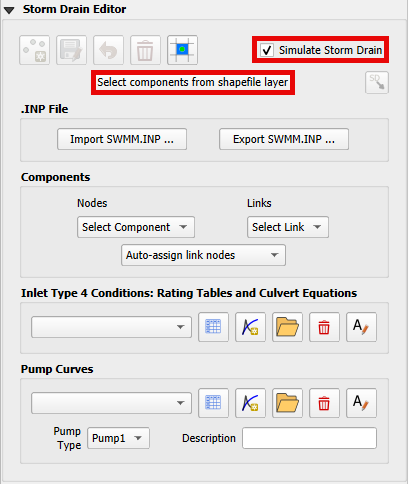

3. Use the Editor to select the fields from 3 shapefiles.  Take care with the purple MaxDepthF.
   That is the final field.

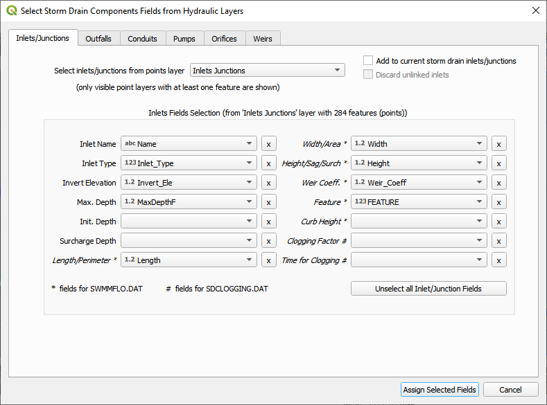

.. image:: ../img/Coastal/sd009.png

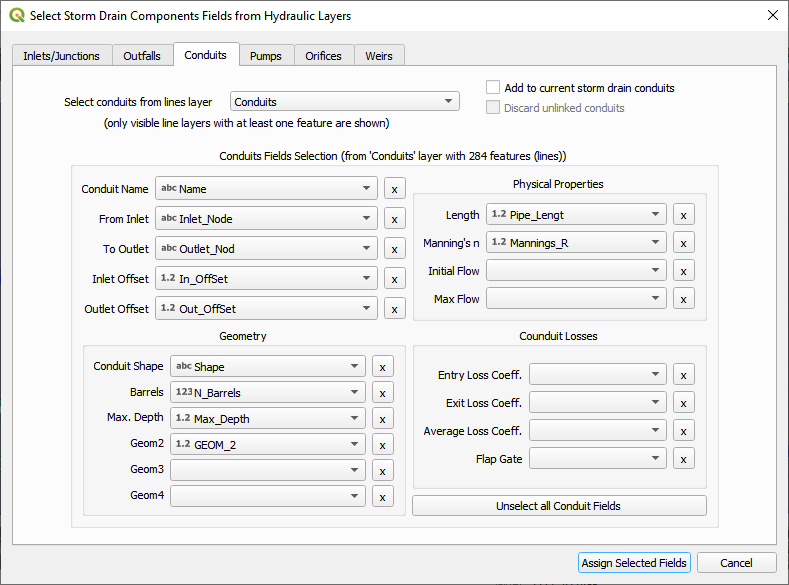

4. Once all features are assigned, click on Assign Selected Inlets/Junctions, Outfalls and Conduits to create the data
   structures of the Storm Drain Components.

5. The following message will be displayed.
   Click OK.

.. image:: ../img/Coastal/sd011.png

Step 2: Calculate the conduit node connections
_______________________________________________

1. Click the Auto-assign conduits nodes button.
   This step will fill the upstream and downstream node connections between conduits.
   In order for this step to be successful, the conduits must be oriented from upstream to downstream.
   See the arrows on the conduits.

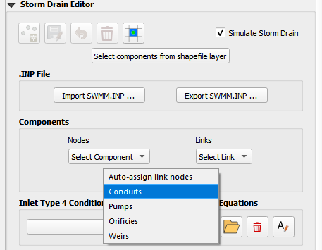

2. Click Yes and OK.

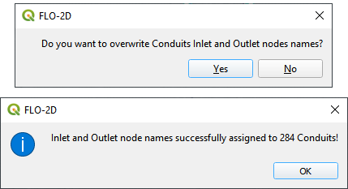

Step 3: Import rating tables
_______________________________

1. Click the Import Rating Table button.

.. image:: ../img/Coastal/sd015.png

2. Navigate to the I4 tables.  Select all of the files and click Open.

Data Location: \\Coastal Training\\Project Data\\Storm drain\\Type 4 Rating Tables

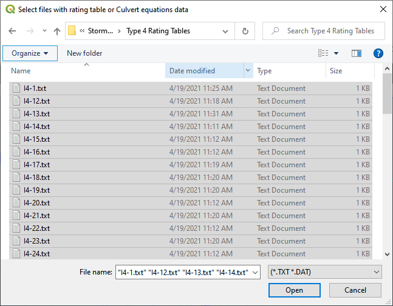

3. If an error message appears, the path was not rectified and the rating table check file was not written.
   Repeat opening the files and the path will be fixed.

.. image:: ../img/Coastal/sd016a.png

4. The table was imported and assigned to the correct inlet nodes.  Click OK to close the message.

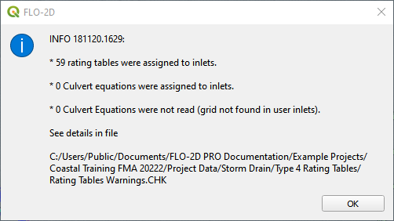

Step 4: Schematize storm drain components
___________________________________________

1. Click on Schematize Storm Drain Components in the Storm Drain Editor widget.

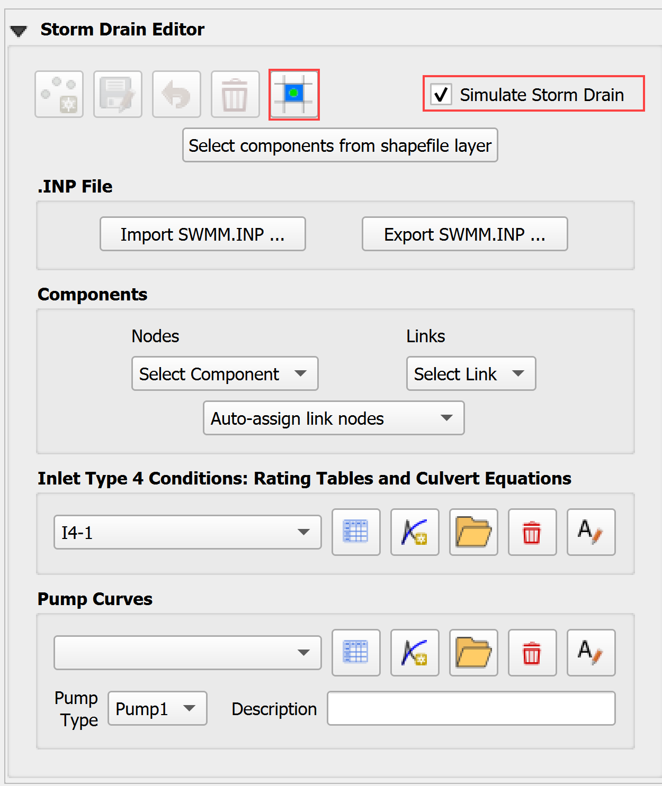

2. Once the storm drain components are schematized, the following dialog will appear.
   Click OK to close.

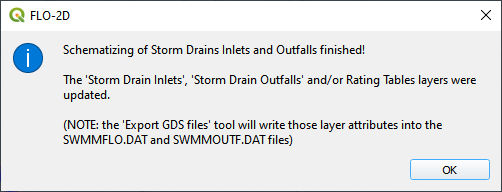

3. The storm drain components are now part of the schematized layers in the project.

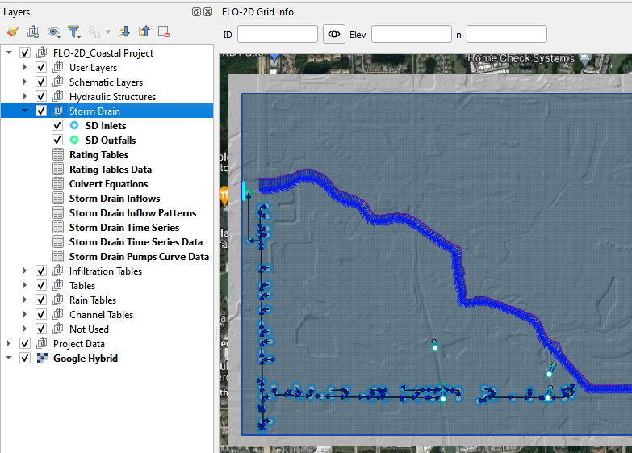

4. Individual Inlets, Junctions, Outfalls and Conduits can be viewed and edited in the various dialog boxes.

.. image:: ../img/Coastal/sd020a.png

5. The dialog boxes allow the user to select any node or link and review or edit it's variables.  The box also
   automatically pans the map to the node or link that is selected.

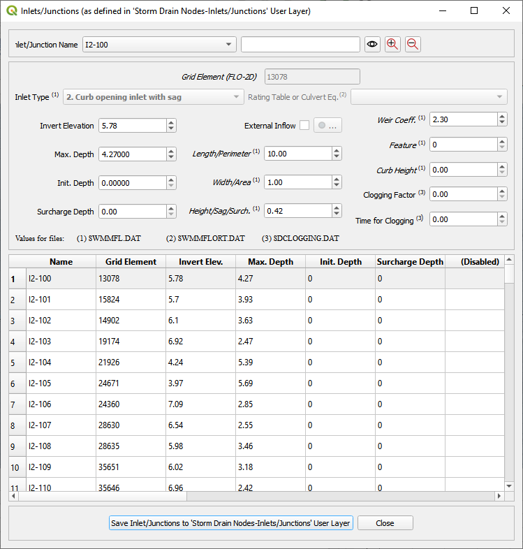

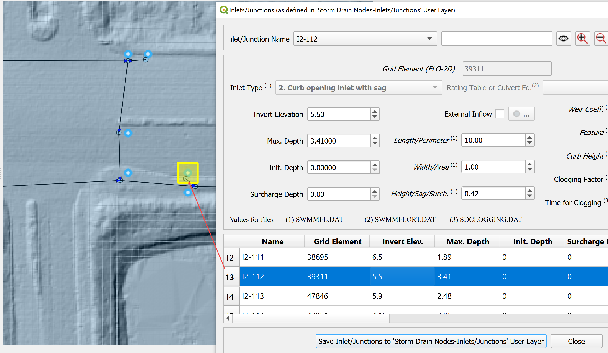

Step 6: Export the project
____________________________

1. Export the FLO-2D data files including the new storm drain files.

.. image:: ../img/Coastal/sd025.png

.. image:: ../img/Coastal/sd024.png

2. The Storm Drain was schematized in Step 4. Click Yes to proceed.

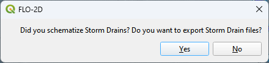

3. Be careful to set the export folder for the swmm.inp to the Storm Drain Export folder.  Its path will likely
   need to be modified when it is exported.

.. image:: ../img/Coastal/sd024b.png

4. The control data for the storm drain is set before the swmm.inp file is saved.

.. important::   There are some important things to define with respect to the time fields.  If tide data or time series data is
   used, the time fields should be synchronized to the times in the corresponding groups of the swmm.inp file.
   The end time should be set to the start time plus the total run time of the FLO-2D simulation.  If it is not,
   the simulation will have an error and will likely fail at the end of the run.

.. image:: ../img/Coastal/sd024c.png

5. The following image shows the number of storm drain features that were exported.  Click OK to close the message.

.. image:: ../img/Coastal/sd024d.png

6. The remaining data files have been exported.  Click OK to close the message.

.. image:: ../img/Coastal/sd026.png

Step 7: Run the simulation
____________________________

1. Click the Run FLO-2D Icon.

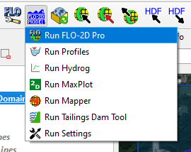

2. Set the FLO-2D Folder.
   C:\\program files (x86)\\flo-2d pro

3. Set the Project Folder.

Data Location: \\Coastal Training\\Project Runs\\Storm Drain Test

4. Click OK.

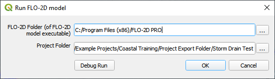

5. This is a good point to save project.

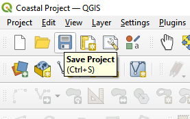

Step 8: Create a backup file
____________________________

1. Close QGIS.

2. Open the project folder.  Select the Coastal Project.gpkg and Coastal Project.qgz files.  Right click them and
   click Sent to/Compressed (zipped) folder.

.. image:: ../img/Coastal/creategrid019.png

3. Name the zipped file.
   It is good to choose a name that identifies project progress.
   For Example: **SDOK.zip**

.. image:: ../img/Coastal/sd029.png

4. Open QGIS and reload the project.

.. image:: ../img/Coastal/creategrid021.png

5. Click yes to load the model.