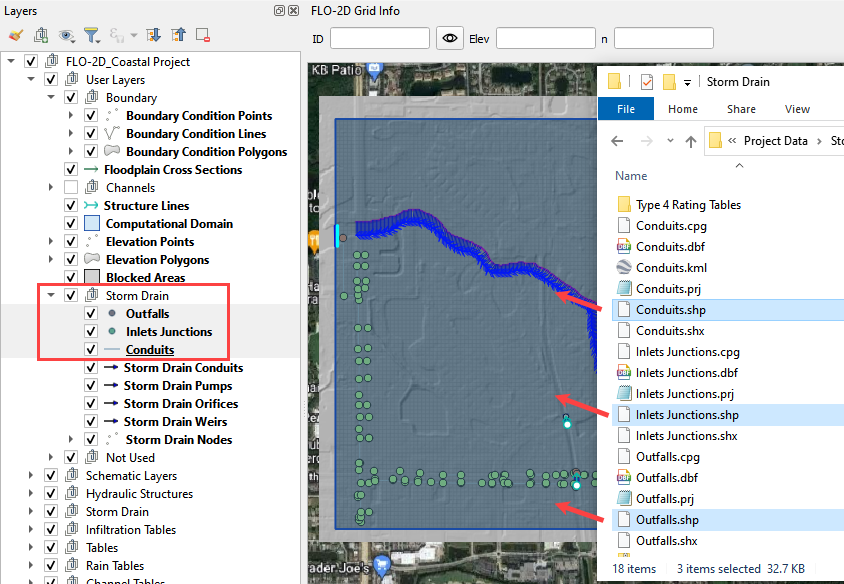
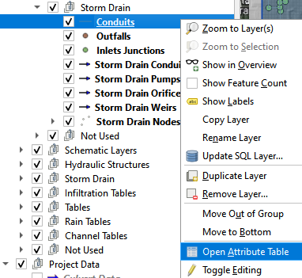
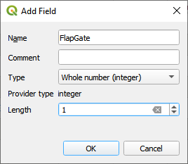

Storm Drain - Shapefile Development
====================================

**Overview**

This lesson will outline how to construct a storm drain network that is ready for FLO-2D Plugin to process.

Required Data
--------------

================== ==========================
**File**           **Content**
================== ==========================
Point shapefile    Inlets Junctions
Polyline shapefile Conduits
Point shapefile    Outfalls
================== ==========================

Data Location:  \\Coastal Training\\Project Data\\Storm Drain

.. youtube:: 9bmYrG-x1Mg

Step 1: Import shapefiles for storm drain features
--------------------------------------------------

1. Select the Boundary Condition Points Layer in the User Layer Group.

2. Drag the 3 Shapefiles onto the map space.

3. Uncheck Schema layers and the Google layer.

4. Check the Attribute Tables for the layers **conduits, inlets junctions, and outfalls**.
   To do this right click each layer and then Click Attributes Table.

5. The following data tables may be found in the shapefile attributes.  Some data is required and some data
   can be skipped.

.. image:: ../img/Advanced-Workshop/conduits.png

.. image:: ../img/Advanced-Workshop/inlets.png

.. image:: ../img/Advanced-Workshop/outfalls.png

Step 2. Add missing columns to shapefiles
-----------------------------------------

1. Open the attributes for any storm drain shapefile.

2. Click the Edit pencil and the Add Field button.

.. image:: ../img/Coastal/sd004.png

3. Using the tables in Step 2, add a field or two to the shapefiles.

4. In this example a new field called Flap Gate is an integer with 1 length.

5. If a real number field is created, the Length and Precision variables can help keep the number precision in check.

6. This is the end of the lesson. Keep adding fields until the class continues.
   It’s OK to leave them blank because they won’t be used in the next module.

.. youtube:: 6qKJzeUFuCg