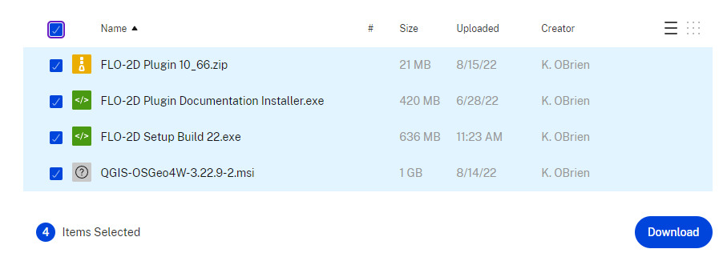
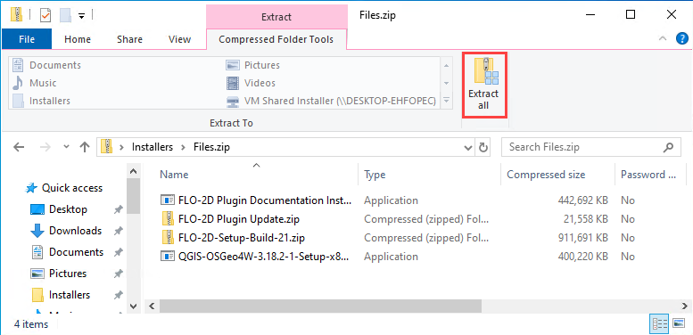
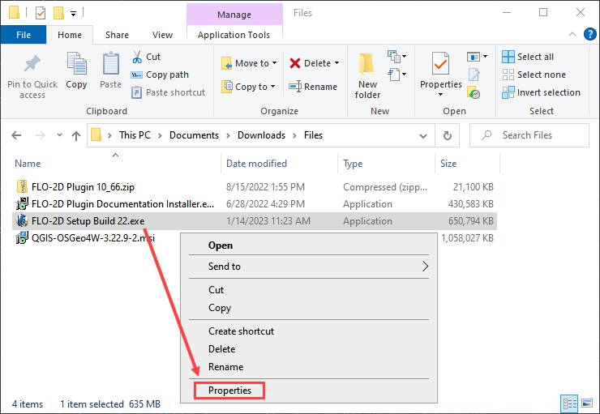
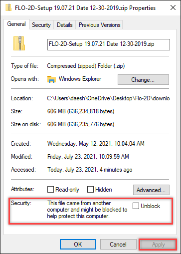
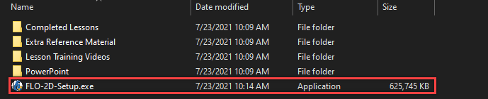
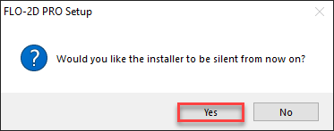
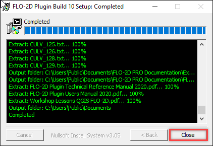
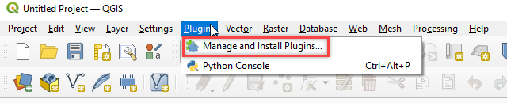
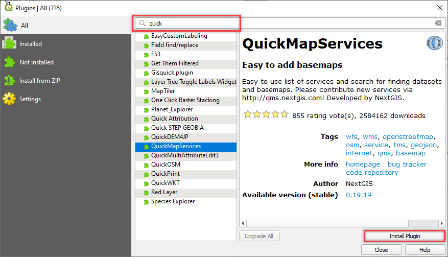
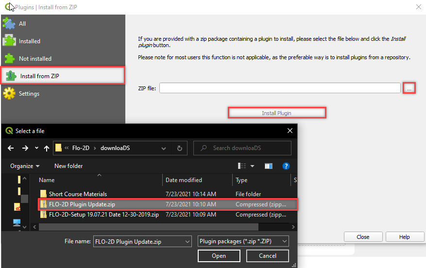

Introduction
=============

Welcome to the FLO-2D self-help setup page. The purpose of the self-help kit is to set up a computer with:

- FLO-2D
- QGIS
- FLO-2D Plugin
- Training Data

The training tutorials will teach project development using
QGIS.  Advanced Modules are used to teach more specific and detailed projects.  Watch this short video to learn how
to set-up the computer.

.. youtube:: WKUcyMpqa6M

Step 1: Get the Data
---------------------

Use this Download Link to access all **installers**, training data, and videos.

https://flo-2d.sharefile.com/d-s4888578b704c46138c9dd5e39f4b8668

1. Select all.

2. Download.

3. The files may be zipped into "file.zip"  Extract them into a safe location.

Step 2: FLO-2D Installer
________________________
Install FLO-2D using the following instructions.

1. Right click zipped file to access properties.

2. Unblock the file if necessary.

3. Extract the file and run the installer.

4. Choose NO for silent, and finish installing with the default settings.

Step 3: Documentation Installer
--------------------------------
Use these instructions to install the FLO-2D Plugin documentation.

1. Run the installer.

2. Default settings are fine, click Close to finish.

Step 4: QGIS Installer
----------------------
Follow these instructions to set up QGIS.

1. Double click the QGIS-OSGeo4W-3.18.2-1.exe file.

2. Finish installing with the default settings.

Step 5: FLO-2D Plugin
______________________
With QGIS installed it is time to add the FLO-2D plugin and a few other handy plugins.

1. Open QGIS.

2. Navigate to the plugin manager.

3. Install Quick Map Services and Profile Tool.

4. Lastly install from Zip FLO-2D Pro.

Step 6: Installation is Complete
---------------------------------
Everything should now be correctly installed on the computer.  go to Lesson 1 to begin the self-help training.

The tutorial data is here:
C:\ Users \ Public \ Documents \ FLO-2D PRO Documentation \ Example Projects

.. image:: ../img/Instructions/image9.png

go to Lesson 1 on on the left sidebar to start. Happy Modeling!

