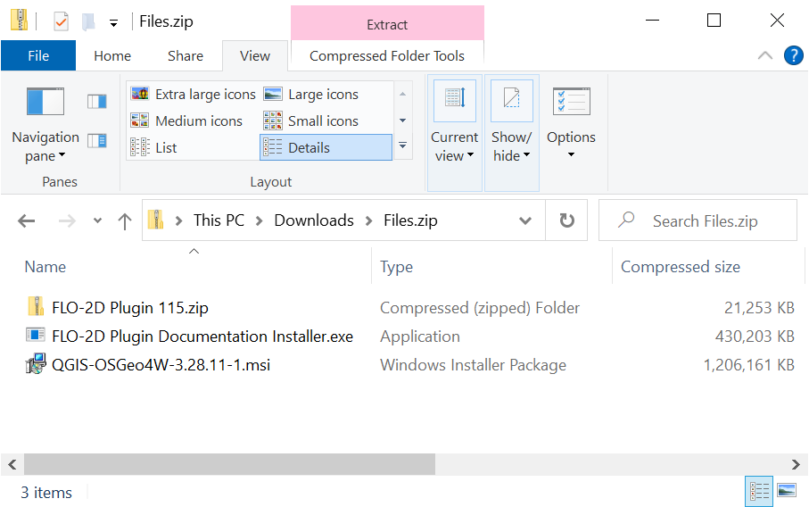

Introduction
=============

Welcome to Flo-2D's self-help setup page. The purpose of the self-help kit is to get help you set up your computer with
FLO-2D, QGIS, and the FLO-2D Plugin.  The training tutorials will guide you through the most project development using
QGIS.  If you're interested in a more in depth tutorial of QGIS and FLO-2D, we offer
an Advanced Modules course.

Use this page to help set up your computer and get the training data.  This short video will help you with the computer
setup.

.. youtube:: WKUcyMpqa6M

Step 1: Get the Data
---------------------
Click `here <https://flo-2d.sharefile.com/d-s4888578b704c46138c9dd5e39f4b8668>`__
to access all the files you'll need to for FLO-2D and the self-help kit.

.. image:: ../img/Instructions/image1.png

1. Select all.

2. Download.

3. The files may be zipped into "file.zip"  Extract them into a safe location.

Step 2: FLO-2D Installer
________________________
Install FLO-2D using the following instructions.

.. image:: ../img/Instructions/image3.png

1. Right click zipped file to access properties.

2. Unblock the file if necessary.

.. image:: ../img/Instructions/image4.png

3. Extract the file and run the installer.

.. image:: ../img/Instructions/image5.png

4. Choose NO for silent, and finish installing with the default settings.

.. image:: ../img/Instructions/image6.png

Step 3: Documentation Installer
--------------------------------
Use these instructions to install the FLO-2D Plugin documentation.

1. Run the installer.

2. Default settings are fine, click Close to finish.

.. image:: ../img/Instructions/image7.png

Step 4: QGIS Installer
----------------------
Follow these instructions to set up QGIS.

1. Double click the QGIS-OSGeo4W-3.18.2-1.exe file.

2. Finish installing with the default settings.

.. image:: ../img/Instructions/image8.png

Step 5: FLO-2D Plugin
______________________
With QGIS installed it is time to add the FLO-2D plugin and a few other handy plugins.

1. Open QGIS.

2. Navigate to the plugin manager.

.. image:: ../img/Instructions/image10.png

3. Install Quick Map Services and Profile Tool.

.. image:: ../img/Instructions/image11.png

4. Lastly install from Zip FLO-2D Pro.

Step 6: Installation is Complete
---------------------------------
Everything should now be correctly installed on the computer.  Goto Lesson 1 to begin the self-help training.

The tutorial data is here:
`C:\ Users \ Public \ Documents \ FLO-2D PRO Documentation \ Example Projects`

.. image:: ../img/Instructions/image9.png

Goto Lesson 1 on on the left sidebar to start. Happy Modeling!

