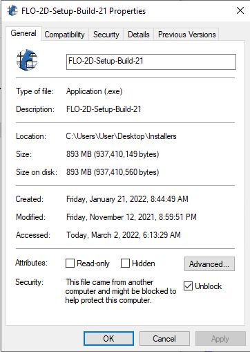
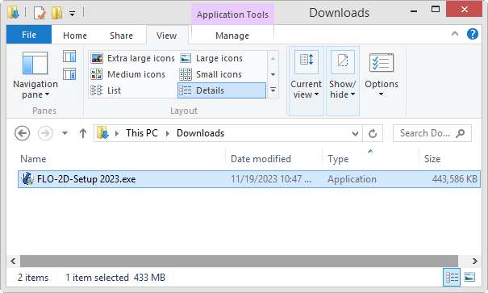
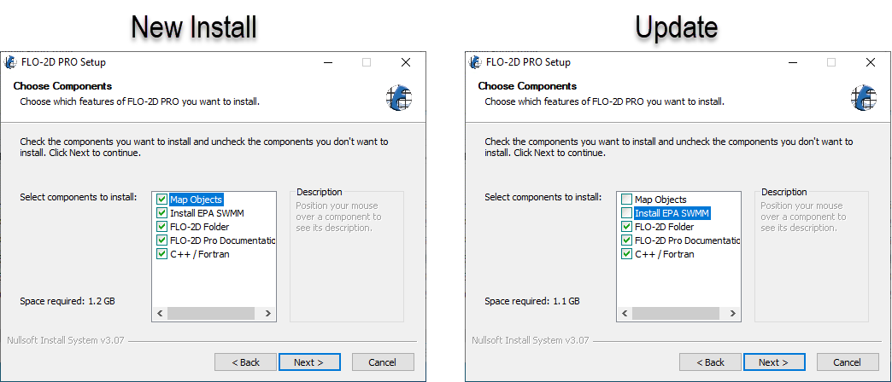
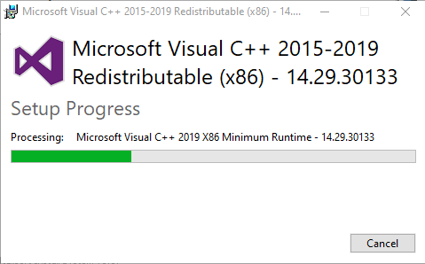
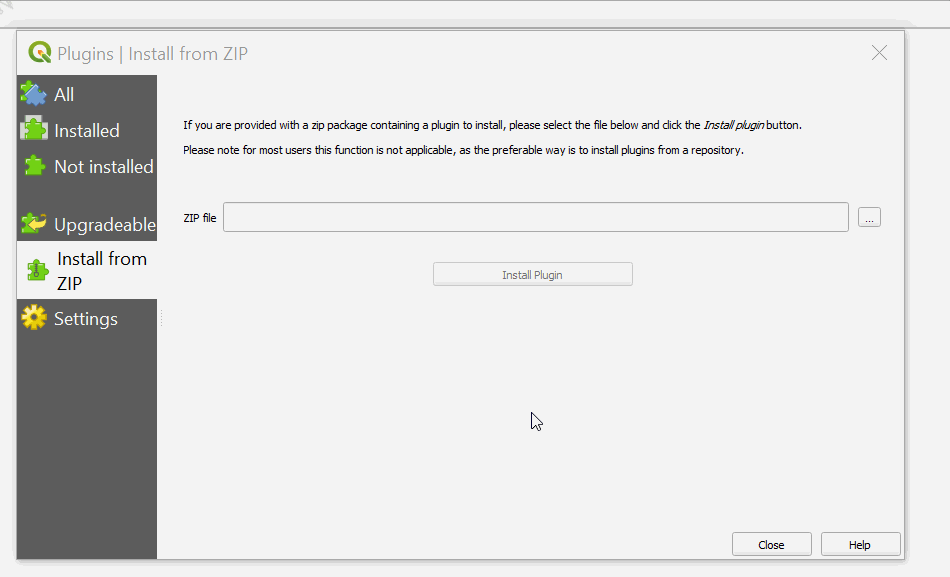
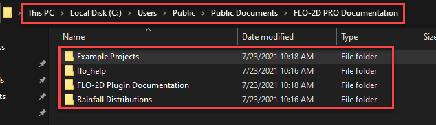

FLO-2D Setup
=============

Welcome to the FLO-2D self-help setup page. The purpose of the self-help kit is to set up a computer with:

- FLO-2D
- QGIS
- FLO-2D Plugin
- Training Data

The training tutorials will teach project development using
QGIS.  Advanced Modules are used to teach more specific and detailed projects.  Watch this short video to learn how
to set-up the computer.

.. youtube:: GF1LZqU6cdc

Step 1: Get the Data
---------------------

Use this Download Link to access all **installers**, training data, and videos.

https://flo-2d.sharefile.com/d-s4888578b704c46138c9dd5e39f4b8668

.. image:: ../img/Instructions/image1.png

1. Select all.

2. Download.

3. The files are zipped into "file.zip"  Extract them into a safe location.

.. image:: ../img/Instructions/image2.png

Step 2: FLO-2D Installer
------------------------
Install FLO-2D using the following instructions.

.. image:: ../img/Instructions/image3.png

1. Right click zipped file to access properties.

2. Unblock the file if necessary.

3. Extract the file and run the installer.

4. Choose NO for silent, and finish installing with the default settings.

.. image:: ../img/Instructions/image6.png

5. If running a new install, check all options.  If running an update, uncheck Map Objects and EPA SWMM.

6. Click next and Install to run the installer.

.. image:: ../img/Instructions/image16.png

7. If an error appears related to the DAO35.EXE, run the installer again but uncheck
   Map Objects.

8. The last embedded installation package may cause a restart.

Step 3: Documentation Installer
--------------------------------
Use these instructions to install the FLO-2D Plugin documentation.

1. Run the installer.

2. Default settings are fine, click Close to finish.

.. image:: ../img/Instructions/image7.png

Step 4: QGIS Installer
----------------------
Follow these instructions to set up QGIS.

1. Double click the QGIS-OSGeo4W-3.18.2-1.exe file.

2. Finish installing with the default settings.

.. image:: ../img/Instructions/image8.png

3. Open QGIS.

.. image:: ../img/Workshop/Worksh002.png

4. Click Settings/Options

.. image:: ../img/Instructions/image13.png

5. Click the CRS tab and set the options as shown below.  Use CRS from first layer added.  Use Project CRS.  Click OK to
   close the window.

.. image:: ../img/Instructions/image14.png

Step 5: FLO-2D Plugin
----------------------
With QGIS installed it is time to add the FLO-2D plugin and a few other handy plugins.

1. Navigate to the plugin manager.

.. image:: ../img/Instructions/image10.png

2. Install Quick Map Services and Profile Tool.

.. image:: ../img/Instructions/image11.png

3. Lastly install from Zip FLO-2D Pro.
   Close the Plugin Manager once everything is finished installing.

4. Add more services to Quick Map Services and eliminate unwanted maps.  Click Quick Map Services icon and click Settings.
   On the settings window, go to More Services and click Get Contributed pack.  On the Visibility window, uncheck the
   unwanted maps.

.. image:: ../img/Instructions/image15.gif

This concludes the installation and setup.  The tutorial data is here:
C:\\Users\\Public\\Documents\\FLO-2D PRO Documentation\\Example Projects\\QGIS Tutorials

Go to Lesson 1 Part 1 on on the left sidebar to start.

Happy Modeling!

