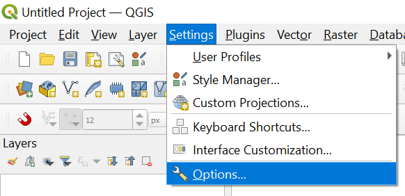
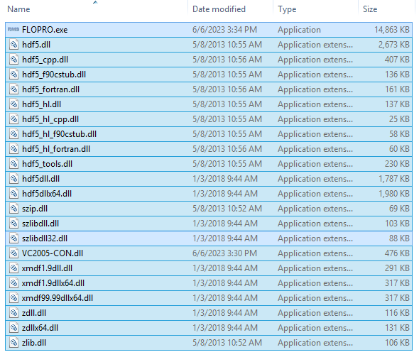
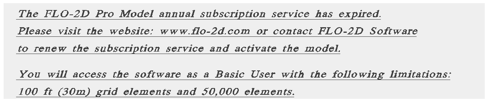
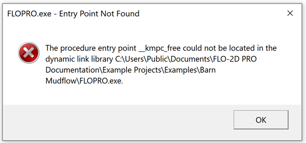
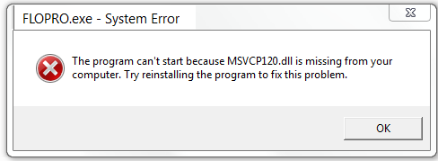
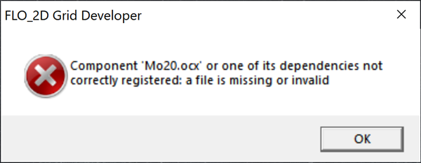

FLO-2D Setup
=============

Welcome to the FLO-2D setup page. Get a computer ready for FLO-2D with:

- FLO-2D Software package
- QGIS stand alone installer
- Plugins FLO-2D, QuickMapServices, ProfileTool, CurveNumberGenerator
- Training Data

The training tutorials will teach project development using FLO-2D and QGIS.
Advanced Modules are used to teach more specific and detailed projects.  Watch this short video to learn how
to set-up the computer.

.. youtube:: F3RPHbCkHqo

Step 1: Get the Data
---------------------

Use this Download Link to access all **installers**, and training data.

|Setup_Download|

.. |Setup_Download| raw:: html

   <a href="https://flo-2d.sharefile.com/d-sb08e3b79a7634f6c843c85f7af3d2564" target="_blank">Click Here to Download</a>

.. image:: ../img/Instructions/image1.png

1. Select all.

2. Download.

3. The files are zipped into "file.zip"  Extract them into a safe location.

.. image:: ../img/Instructions/image2.png

Step 2: FLO-2D Installer
------------------------
Install FLO-2D using the following instructions.  Admin Rights Required.

.. image:: ../img/Instructions/image3.png

1. Right click zipped file to access properties.

2. Unblock the file if necessary.

.. image:: ../img/Instructions/image4.png

New Installation
____________________

.. Note:: If this is a new installation, please continue.  If it is an update, please skip to the Update Installation
       section.

1. Double click the Setup file to run the installer.

.. image:: ../img/Instructions/image5.png

2. Choose No for silent, and finish installing with the default settings.

.. image:: ../img/Instructions/image6.png

3. If running a new install, check all options.  If running an update, cancel the installation and go to the
   Update Installation section.

.. image:: ../img/Instructions/image15a.png

4. Click Next and Install to run the installer.

.. image:: ../img/Instructions/image16.png

5. If an error appears related to the DAO35.EXE, run the installer again but uncheck
   Map Objects.

6. The last embedded installation package may trigger a restart.

.. image:: ../img/Instructions/image17.png

Update Installation
______________________

1. Remove old files.  Delete the FLO-2D PRO Folder C:\\Program Files (x86)\\FLO-2D PRO

2. Rename or delete the FLO-2D PRO Documentation folder. C:\\Users\\Public\\Documents\\FLO-2D PRO Documentation

.. Note:: Some users save their project to the Documentation folder.  Do not accidentally delete projects that may be
          needed in the future.

3. Double click the Setup file to run the installer.

.. image:: ../img/Instructions/image5.png

4. Choose No for silent, and finish installing with the default settings.

.. image:: ../img/Instructions/image6.png

5. If running an update, uncheck Map Objects and EPA SWMM.

6. Click Next and Install to run the installer.

.. image:: ../img/Instructions/image16.png

7. If an error appears related to the DAO35.EXE, run the installer again but uncheck
   Map Objects.

8. The last embedded installation package may trigger a restart.

.. image:: ../img/Instructions/image17.png

Step 3: Documentation Installer
--------------------------------
Use these instructions to install the FLO-2D Plugin documentation.  Admin Rights Not Required.

1. Run the installer.  FLO-2D Plugin Documentation Installer.exe

2. Default settings are fine, click Close to finish.

.. image:: ../img/Instructions/image7.png

Step 4: QGIS Installer
----------------------
Follow these instructions to set up QGIS.

1. Double click the QGIS-OSGeo4W-3.22.9.msi file.

2. Finish installing with the default settings.

.. image:: ../img/Instructions/image8.png

3. Open QGIS.

.. image:: ../img/Workshop/Worksh002.png

4. Click Settings/Options

5. Click the CRS tab and set the options as shown below.  Use CRS from first layer added.  Use Project CRS.  Click OK to
   close the window.

.. image:: ../img/Instructions/image14.png

Step 5: FLO-2D Plugin
----------------------
With QGIS installed it is time to add the FLO-2D plugin and a few other handy plugins.

1. Navigate to the plugin manager.

.. image:: ../img/Instructions/image10.png

2. Install Quick Map Services and Profile Tool, and Curve Number Generator.

.. image:: ../img/Instructions/image11.png

3. Lastly install from Zip FLO-2D Pro.
   Close the Plugin Manager once everything is finished installing.

.. image:: ../img/Instructions/image12.gif

4. Add more services to Quick Map Services and eliminate unwanted maps.  Click Quick Map Services icon and click Settings.
   On the settings window, go to More Services and click Get Contributed pack.  On the Visibility window, uncheck the
   unwanted maps.

.. image:: ../img/Instructions/image15.gif

This concludes the installation and setup.  The tutorial data is here:
C:\\Users\\Public\\Documents\\FLO-2D PRO Documentation\\Example Projects\\QGIS Tutorials

.. image:: ../img/Instructions/image9.png

Go to Lesson 1 Part 1 on on the left sidebar to start.

Step 6. Installation Test
---------------------------

1. Test FLO-2D engine by running a model from a project folder.  Copy the Run for Project files from

   C:\\Program Files (x86)\\FLO-2D PRO\\Run for Project Folder

2. Paste the files into any project folder with \*.DAT files like Barn.

   C:\\Users\\Public\\Documents\\FLO-2D PRO Documentation\\Example Projects\\Example Projects\\Barn Mudflow

.. image:: ../img/Instructions/installtest02.png

3. Double click FLOPRO.EXE to start a test run.

4. If the computer is activated with the professional version, this message will appear.

.. image:: ../img/Instructions/installtest03.png

5. If the computer isn't activated, this message will appear.

6. Any other message might need some troubleshooting.  Find the related issue below.

Troubleshooting
-----------------

If something isn't working, do not uninstall FLO-2D.  That is rarely a correct way to fix the installation.
Find some help below or email FLO-2D via the |Contact-Form| for support.

.. |Contact-Form| raw:: html

   <a href="https://flo-2d.com/contact/" target="_blank">Contact Form</a>

Starting in 2022, the FLO-2D engine uses 4 distribution packages.  These installers are embedded into the FLO-2D Pro
Setup.exe.  If one of the embedded installers fails or is skipped, it may be necessary troubleshoot the issue.
This guide can help fix common issues.

HDF5
_____

1. HDF5 installer will not edit the system path if the system path is too long. During the FLO-2D installation, the
   following fault may appear.  Close the message to continue the installation.

.. image:: ../img/Instructions/image18.png

2. If the path is not added to the system variables, it may be necessary to add some hdf5 dll files to the FLO-2D Pro
   folder.  Copy them from here:

   - C:\\Program Files\\HDF_Group\\HDF5\\1.8.11\\bin

   Paste them here:

   - C:\\Program Files (x86)\\FLO-2D PRO
   - C:\\Program Files (x86)\\FLO-2D PRO\\Run for Project Folder.

Intel Packages
______________

1. IntelOneAPI support packages are used to compile FLOPRO.EXE and are needed to run the model.

2. If the drivers are not installed or updated correctly FLOPRO.EXE cannot run.

3. FLOPRO.exe cannot find libio dlls.  When this occurs, it will be necessary to run the Intel
   Fortran packages.  The missing files might be named:

   - libiomp5md.dll
   - libmmd.dll
   - libmmdd.dll
   - libifcoremdd.dll
   - libifportmd.dll

4. The fault message might look like this:

5. It may also look like this:

.. image:: ../img/Instructions/image26.PNG

6. Older files might be on the computer if the update process wasn't followed.  These dlls should be removed by the
   FLO-2D installer.  Sometimes one or more of these files are are not removed.  If the error
   message from 4. appears, find and remove the following files:

   - C:\\Program Files (x86)\\FLO-2D Pro\\libio5md.dll
   - C:\\Program Files (x86)\\FLO-2D Pro\\Run for Project Folder\\libio5md.dll
   - C:\\Windows\\System 32\\libio5md.dll
   - C:\\Windows\\SysWOW64\\libio5md.dll

7. If the fault still appears, correct it by running **Intel cpp 2022.2.0.3790.msi** and
   **Intel fortran 2022.2.0.3790.msi**.  They will require admin rights.  |intellink|

.. |intellink| raw:: html

   <a href="https://flo-2d.sharefile.com/d-s29e779b1eaac445a974951db6cfd2da0" target="_blank">Download the Intel Installers Here.</a>
   

Visual Studio Packages
_______________________

1. Microsoft Visual Studio 2019 is the platform used build the FLO-2D model.  Visual Studio redistributable packages
   are required. If the Visual Studio Redist embedded installer failed or skipped,
   it may be necessary to run it again.  This installer requires Admin rights.
   |visualclink|

.. |visualclink| raw:: html

   <a href="https://flo-2d.sharefile.com/d-s3e38b0b9e0f94c4bb5d546b955e0495a" target="_blank">Download the installer here.</a>

2. Microsoft Visual Studio 13 is used for the Storm Drain engine.  The fault will be an error message about a missing
   msvcp120.dll or msvcp140.dll or something similar.  As the Visual Studio version changes, the dlls file name changes.

3. For example, this computer has many different redistributable packages.  Any software built with Visual Studio
   should add the required dll to the computer.  If that process fails, it may be necessary to install the packages
   from the VCredist_x64 or x86 installers.

.. image:: ../img/Instructions/image22.png

4. FLOPRO.exe Build 22 uses the 2015 - 2019 version of Visual Studio.

5. FLOPRO.exe Build 14 thru Build 21 uses
   version 2013 of Visual Studio.  The older FLO-2D Builds require the 64-bit and 32-bit packages.

   Older redistributable packages can be downloaded from Microsoft:
   |oldVClink|

.. |oldVClink| raw:: html

   <a href="https://learn.microsoft.com/en-us/cpp/windows/latest-supported-vc-redist?view=msvc-170" target="_blank">Microsoft msvcp redistributable installers.</a>

Call FLOPRO.exe from QGIS
___________________________

1. Run a simulation from QGIS using the Run FLO-2D Button.

2. QGIS message states the the model started but nothing happens.  FLOPRO.exe does not start.

3. This fault seems to be related to QGIS permissions or perhaps an intel compatibility issue.  FLO-2D staff is actively
   seeking a solution but the quick fix is to set up the FLOPRO.exe and its support dlls in the project folder.

4. Copy the files from C:\Program Files (x86)\FLO-2D Pro\Run for Project Folder. Paste them into the Project Folder and
   double click FLOPRO.exe to start the simulation.

GDS and Mapper
_______________

GDS and Mapper are written in Visual Basic code.  Visual basic has been obsolete code for more than a decade.
Because of SysWOW (System Windows on Windows), old programs can be used but are challenging to install.
Some computers won't have any issues and others simply will not run GDS and Mapper because things like
Microsoft Data Access (MDAC) and Data Access Objects (DAO) will not load or be recognized by the computer.

FLO-2D solved this issue by upgrading to QGIS and the FLO-2D Plugin.  If you still want to
use GDS or Mapper and you get missing dll failures or struggle to use GDS processors, this section may help.

1. GDS might not be connected to it's MapObjects dlls.  These are the objects that do things like load images, load
   tables, intersect shapefiles, and create the grid.  The fault will look like this:

2. If this fault shows up, delete the contents of this folder and run the FLO-2D Pro Setup Installer - MapObjects section again.

   C:\\Program Files(x86)\\Common Files\\ESRI

   Don't worry, these old files are not used by ArcGIS Desktop or ArcGIS Pro.

3. GDS might give an error message when the user tries to set up a new project using Define Working Region....
   A path correction will fix this fault.  When a new project doesn't have a project path, it tries to write data
   to the C:\\Program Filex(x86)\\FLO-2D Pro path.  This path is protected by Admin Rights.

.. image:: ../img/Instructions/gdsfault03.png

4. The error message that appears states something about admin rights or permissions.  Correct it by applying a project
   path in GDS\\Tools\\Options\\Directory Paths

.. image:: ../img/Instructions/gdsfault04.png

5. GDS and Mapper may have overflow or out of memory error messages.  This is not a correctable fault.
   They are both 32-bit programs and have limitations related to the memory they can use.  This varies by computer
   and by screen size so if you get this fault on one computer, it may not show up on an older computer.

.. image:: ../img/Instructions/gdsfault05.png

5. GDS and Mapper default settings are for computers in the USA.  It may be necessary to adjust the number separator.
   If an error message appears about the number separator, use the Control Panel\\Clock and Region\\Additional Settings
   to set the decimal separator to a ".".  International users might want to use QGIS so this is not necessary.

.. image:: ../img/Instructions/gdsfault06.png

6. Sometimes the Microsoft Data Access program doesn't install correctly and GDS cannot find the MDAC dlls.
   It may be possible to reinstall the MDAC setup program.
   |GDSPatch|

.. |GDSPatch| raw:: html

   <a href="https://flo-2d.sharefile.com/d-sca2c917fcb9d424091e9faa8272b29b8" target="_blank">Download GDS Patch.</a>

7. GDS Tutorials are no longer part of the FLO-2D Pro Setup.  To get the GDS and Mapper Tutorials, Run this installer:
   |GDStutorials|

.. |GDStutorials| raw:: html

   <a href="https://flo-2d.sharefile.com/d-s6907dafe3ebc4abab8aa6ad4df386a2c" target="_blank">Download GDS Tutorials.</a>
