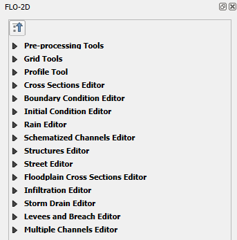

Widgets
=========

Enhance your FLO-2D modeling with the FLO-2D Plugin widgets suite.
Simplify data preparation for grids, channels, initial conditions, boundary conditions, storm drains, and more.

.. toctree::
   :hidden:
   :maxdepth: 1
   :caption: Widgets

   pre-processing-tools/Pre-Processing Tools
   grid-tools/Create a Grid
   grid-tools/Sample Elevation from Raster
   grid-tools/Sample Elevation GDAL Grid Method
   grid-tools/Sample Elevation from Points and LiDAR
   grid-tools/Elevation Correction Tool
   grid-tools/Sample Roughness
   grid-tools/Sampling Roughness from Raster
   grid-tools/Area and Width Reduction
   grid-tools/Spatial TOL
   grid-tools/Spatial Limiting Froude
   grid-tools/Spatial Shallow n
   grid-tools/Gutters
   grid-tools/No Exchange Channel
   grid-tools/Hazus Layers
   profile-tool/Profile Tool
   cross-sections-editor/Cross Sections Editor
   boundary-condition-editor/Boundary Condition Editor
   initial-condition-editor/Initial Condition Editor
   rain-editor/Rain Editor
   schematized-channel-editor/Schematized Channel Editor
   hydraulic-structure-editor/Hydraulic Structure Editor
   street-editor/Street Editor
   floodplain-cross-section-editor/Floodplain Cross Section Editor
   infiltration-editor/Infiltration Editor
   storm-drain-editor/Storm Drain
   levees-breach-editor/Levees Breach Editor
   multiple-channels-editor/Multiple Channel Editor
