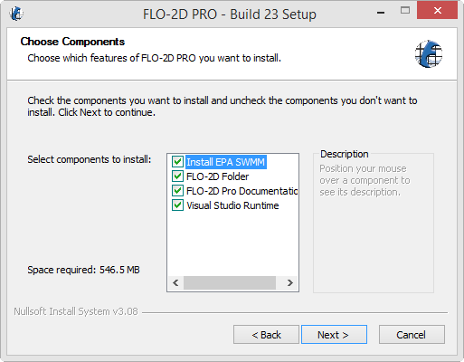

FLO-2D Pro Install Instructions
=================================

FLO-2D is a flood routing model that simulates river, alluvial fan, urban and coastal flooding. The model
can tackle any diverse flooding problem including:

- River overbank flooding
- Watershed rainfall and runoff
- Urban flooding with street flow, flow obstruction and storage loss
- Overland tsunami/hurricane surges
- Storm drain modeling
- Mud and debris flows
- Unconfined alluvial fan flows
- Surface and groundwater interaction
- Dam and levee breach
- Tailings dam failure and volume prediction
- Flood insurance studies

Step 1: Download the FLO-2D Pro Installer
-------------------------------------------

FLO-2D Pro Subscribers should log into Sharefile and download the software and activator from their
FLO-2D Tech Support Account.

|ProSetup_Download|

.. |ProSetup_Download| raw:: html

   <a href="https://flo-2d.sharefile.com/" target="_blank">Sharefile Login</a>

Basic users should fill the Basic Download Form to access the limited free version of the software.

|Basic_Download|

.. |Basic_Download| raw:: html

   <a href="https://flo-2d.com/flo-2d-basic/" target="_blank">Basic Download Form</a>

Step 2: FLO-2D Installer
------------------------

Install FLO-2D using the following instructions.  Admin Rights Required.

.. image:: img/Instructions/image3.png

1. Right click zipped file to access properties.

2. Unblock the file if necessary.

3. Double click the Setup file to run the installer.

.. image:: img/Instructions/image5.png

4. If FLO-2D is already installed, this installer will remove the FLO-2D Pro folder and rename the
   FLO-2D Documentation folder.

5. If running a new install, check all options.  If running an update, cancel the installation and go to the
   Update Installation section.

.. important:: For a proper installation, ensure that **ALL** components are installed

6. Click Next and Install to run the installer.

.. image:: img/Instructions/image16.png

7. The two final installers are embedded Microsoft Visual C++ packages.  They install silently,
   but may trigger a restart.